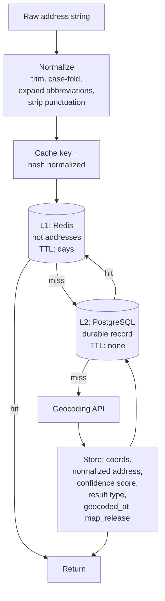

# Caching Geocoding Results

Buildings are stationary. This is the entire architectural insight, and most systems ignore it.

Re-geocoding a customer's address on every order is not a small inefficiency. In many production systems it is the single largest line on the location invoice, and it is fixed with a database column.

## The problem statement

A geocode is a pure function of an address string. The same input produces the same output, indefinitely, on any platform.

Systems call it repeatedly anyway, because:

- The geocoding call sits inside the order flow, where it was convenient to write
- Nobody measured the cache hit rate, because there is no cache
- The address string varies — `123 Main St` and `123 Main Street` look different to a hash map
- Someone worried about staleness and chose safety over economics

The last one deserves attention, because it is the only reasonable objection and it is wrong.

## The decision

**What is the cache key, what is the TTL, and where does it live?**

Get the key wrong and your hit rate collapses. Get the TTL wrong and you pay for stability you already had.

## Recommended architecture

Two tiers exist for different reasons. **L2 is the system of record and it never expires.** L1 is a latency optimization and it may.

<Info>
If you build only one tier, build L2. A durable database record with coordinates, confidence, and a timestamp is worth more than a Redis instance, because it survives a restart and it is queryable.
</Info>

## Normalization is the cache-hit multiplier

This is where the leverage is, and it costs nothing.

Before hashing, normalize:

- **Trim and collapse whitespace**
- **Case-fold** — `Main St` and `MAIN ST`
- **Expand abbreviations** — `St` → `Street`, `Ave` → `Avenue`, `Apt` → `Apartment`
- **Strip or standardize punctuation**
- **Normalize unit designators** — `#4`, `Unit 4`, `Apt 4`
- **Canonicalize postal codes** — `SW1A1AA` and `SW1A 1AA`

<Tip>
Instrument your cache hit rate *before* and *after* normalization. Teams routinely discover that half their "misses" were the same address written three ways. That is a free doubling of hit rate with no API involved.
</Tip>

For international addresses, `libpostal` handles parsing and normalization better than a regex you will regret. It is self-hosted, removes normalization from your API bill entirely, and does not geocode.

**Normalize at write time, not at read time.** Store the normalized form. Query against it.

## What invalidation means here

The instinct is a TTL. The instinct is wrong.

An address's coordinates change when one of three things happens:

1. **The map data changed.** A new subdivision, a re-surveyed parcel, a corrected house number.
2. **The address itself changed.** Renumbering, street renaming, municipal boundary change.
3. **Your confidence threshold changed.** A match you previously accepted, you no longer would.

None of these correlate with elapsed time. A thirty-day TTL invalidates a stable rooftop match for a building that has stood since 1904, and does nothing about the subdivision that opened yesterday.

<Warning>
A time-based TTL on geocoding is cargo-cult caching. It costs money and improves nothing. Invalidate on events, not on clocks.
</Warning>

**Invalidate on:**

- **Map release.** Store the map release version alongside the geocode. When a significant release ships, selectively re-geocode records below a confidence threshold, or records in regions with known changes. Not everything.
- **Low confidence.** Records that fell below threshold should be in an exception queue, not a cache.
- **Explicit correction.** A customer fixes their address; you re-geocode that record.
- **Failed delivery.** An operational signal that the coordinate is wrong, regardless of what the confidence score said.

**Store `geocoded_at` and the map release** so that selective re-geocoding is possible. Without them your only options are "everything" and "nothing."

## What to store

Coordinates alone are insufficient and dangerous.

| Field | Why |
|---|---|
| `latitude`, `longitude` | The answer |
| `normalized_address` | The cache key, and the canonical form |
| `raw_address` | What the user typed. You will need it. |
| `confidence_score` | Without it, a city-centroid fallback is indistinguishable from a rooftop match |
| `result_type` | Address or place. A shopping centre is not a street address. |
| `geocoded_at` | Enables selective re-geocoding |
| `map_release` | Enables explaining why the answer changed |

<Warning>
**Storing a coordinate without its confidence score converts a probabilistic estimate into a fact.** Every downstream consumer will treat it as ground truth. A low-confidence fallback silently corrupts revenue maps, routes vehicles to centroids, and produces failed deliveries. This is the most damaging thing you can do with a geocoding result.
</Warning>

## Redis versus database

They solve different problems and the answer is usually both.

**PostgreSQL (or your primary store)**
- Durable, survives restart
- Queryable — "how many addresses have confidence below 0.8"
- Joinable to the customer or order record
- Sits naturally next to PostGIS geometry
- Slower per lookup, irrelevant at these volumes

**Redis**
- Sub-millisecond
- Useful when the geocode is on a hot path (autocomplete resolution, checkout)
- Ephemeral — treat as a cache, never as a record
- Justified when the same small set of addresses is resolved constantly

**Do not use Redis as the system of record.** An eviction is a re-geocode you paid for once already.

For most systems, a well-indexed table with the address stored against the customer record *is* the cache. The lookup is a join you were doing anyway.

## Privacy and GDPR

A permanent geocode cache is a permanent record of where people live. This is not a footnote.

**Coordinates are personal data.** Under GDPR, a coordinate that identifies a residence is personal data whether or not a name is attached. The same holds under most comparable regimes.

**Right to erasure applies to the cache.** When a customer requests deletion, the geocode cache is not exempt because it is "just a cache." It contains their address and its coordinates. Delete it.

**This creates a design tension.** A shared, global, permanent geocode cache keyed on address is operationally ideal and a compliance problem: deleting one customer's data means finding their address in a cache shared across every customer who lives at the same address.

Two workable resolutions:

**Separate the address-to-coordinate mapping from the person-to-address mapping.** The coordinate for `123 Main Street, Chicago` is a fact about the world, not about a person. The fact that Jane Smith lives there is personal data. Store them separately. Delete the second; keep the first.

This is clean, defensible, and it is what most mature systems do.

**Or key the cache per-tenant and accept the lower hit rate.** In multi-tenant systems this may be required anyway — see below.

<Warning>
In a **multi-tenant** system, a shared geocode cache is a data leak. Tenant A's customer list is inferable from cache hit patterns and timing. The savings were never worth it. Key every cache by tenant. See [Multi-Tenant Location Platform](/architecture/multi-tenant-location-platform).
</Warning>

**Retention.** A geocode cache that never expires is a retention policy that says "forever." Someone in your organization has committed to something shorter. Reconcile them.

**Data residency.** If addresses cross jurisdictions, so do their coordinates.

## Scaling considerations

**The cache grows with distinct addresses, not with orders.** A million orders from eighty thousand customers is eighty thousand records. This is a small table.

**Hit rate approaches 1 as the customer base matures.** New addresses arrive at a trickle and are geocoded in real time. The batch job runs once, at migration, and then rarely.

**Deduplicate before batch geocoding.** A raw order export contains enormous repetition. Geocoding four million rows containing nine hundred thousand distinct addresses bills for four million. See [High-Volume Geocoding](/architecture/high-volume-geocoding).

**Index on the normalized address hash.** Not on the raw string.

**Coordinate rounding for reverse geocoding.** GPS jitter defeats exact-match caching. Round to roughly five decimal places — about one metre — before lookup. A vehicle idling at a depot generates hundreds of pings within a metre of each other. One cache entry.

## Cost implications

**Instrument cache hit rate before you instrument anything else.**

A team with a 12% hit rate does not have a pricing problem. They have a caching problem, and it is cheaper to fix than to migrate. Present the hit rate to whoever is asking about the invoice; it will reframe the conversation.

The compounding wins, in order:

1. **Any cache at all.** Zero to something.
2. **Normalization.** Something to nearly everything.
3. **Deduplication before batch.** Removes the repetition you were paying for.
4. **Batch for the backfill.** Cheaper per record than real-time.
5. **Debounced autocomplete.** Stops billing per keystroke.

Geocoding-heavy workloads see the largest savings when moving platforms — but only after the call pattern is fixed. **Migrating an uncached implementation moves the waste to a cheaper meter.**

See [Reducing Google Maps Costs](/use-cases/reducing-google-maps-costs).

## Alternative architectures

**No cache, with a validation vendor.** If you use a USPS-certified address validation service, it may return coordinates as a byproduct, and your call volume is bounded by new addresses anyway. Legitimate, and it answers a different question — does this address *exist* — that a geocoder does not.

**Precomputed reference dataset.** Load an open address dataset — OpenAddresses, national postal files — into PostGIS and resolve locally. Zero per-call cost, coverage and freshness are yours to maintain. Realistic for a bounded operating area.

**Cache in the client.** Do not. Coordinates for addresses are not the browser's business, and a client cache is neither durable nor deletable.

**Geocode on write, never on read.** The strongest version of this pattern. An address entered into your system is geocoded once, at entry, before it is committed. Nothing downstream ever calls a geocoder. Every read is a column.

## Common mistakes

**No cache.** The dominant one.

**Caching the raw address string.** Half your hits become misses.

**Time-based TTL.** Invalidating stability, ignoring change.

**Storing coordinates without the confidence score.**

**Redis as the system of record.**

**A shared cache across tenants.**

**Not deduplicating before batch geocoding.**

**Geocoding inside the order flow** rather than at address creation.

**No `geocoded_at` or map release version**, making selective re-geocoding impossible.

**Treating the cache as exempt from erasure requests.**

**No exception queue** for low-confidence matches. They enter the cache as truth.

**Re-geocoding on every read "to be safe."** Safety is a confidence score, not a fresh call.

## Production checklist

- [ ] Cache exists, keyed on normalized address, hit rate instrumented
- [ ] Normalization applied at write time, before hashing
- [ ] Confidence score and result type persisted alongside coordinates
- [ ] `geocoded_at` and map release version stored
- [ ] No time-based TTL; invalidation triggered by map release, low confidence, correction, or operational failure
- [ ] Durable store is the system of record; Redis, if present, is treated as ephemeral
- [ ] Cache keyed by tenant in multi-tenant systems, verified by a cross-tenant test
- [ ] Address-to-coordinate mapping separated from person-to-address mapping, or erasure path defined
- [ ] Retention policy reconciled with "permanent cache"
- [ ] Exception queue for sub-threshold matches, with an owner
- [ ] Input deduplicated before any batch job
- [ ] Reverse-geocode lookups round coordinates before cache access

## Related guides

<CardGroup cols={2}>
  <Card title="Geocoding and Search" href="/guides/geocoding">
    Endpoint selection, confidence scores, autocomplete versus autosuggest.
  </Card>
  <Card title="Batch Geocoding" href="/guides/batch-geocoding">
    The job lifecycle for the initial backfill.
  </Card>
  <Card title="Reverse Geocoding" href="/guides/reverse-geocoding">
    Coordinate rounding and the caching that makes telematics viable.
  </Card>
  <Card title="High-Volume Geocoding" href="/architecture/high-volume-geocoding">
    Millions of addresses, queues, and idempotency.
  </Card>
</CardGroup>

## Related use cases

[Address Validation](/use-cases/address-validation) · [Reducing Google Maps Costs](/use-cases/reducing-google-maps-costs) · [Vehicle Tracking](/use-cases/vehicle-tracking) · [Location Intelligence](/use-cases/location-intelligence)

## HERE documentation

- [Geocoding & Search v7](https://www.here.com/docs/category/geocoding-search-api-v7)
- [Batch API v7](https://www.here.com/docs/bundle/batch-api-v7-developer-guide/page/topics/batch-api-quick-start.html)

---

Need help designing or implementing a production HERE solution?

Placematic helps engineering teams select the right HERE APIs, estimate usage, migrate from Google Maps and build production-ready geospatial systems. [Talk to us](https://placematic.com/contact/).