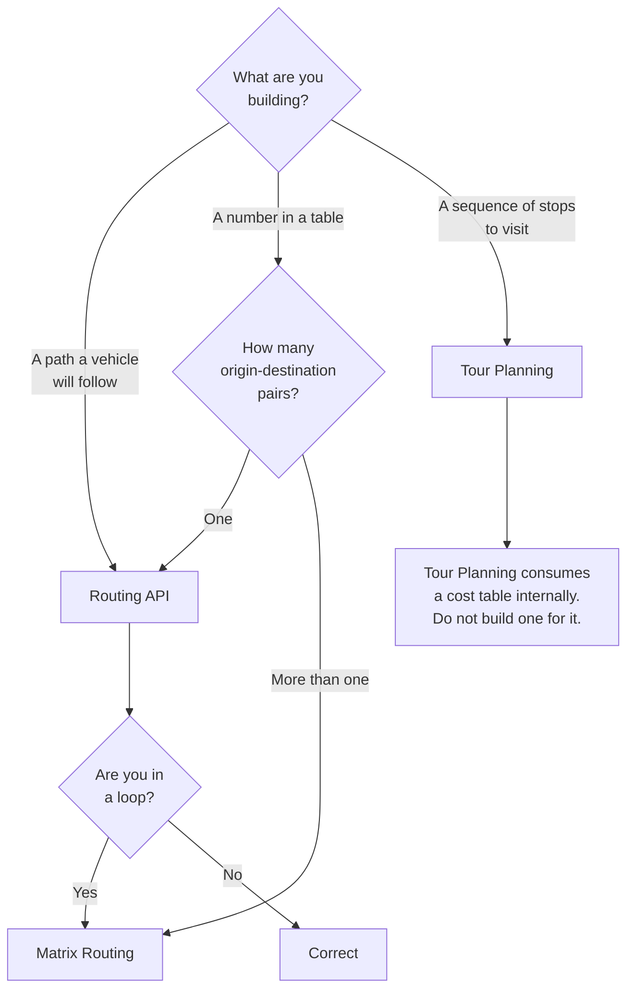

# Routing vs Matrix: Choosing the Right Primitive

The most expensive line of code in fleet software is a `for` loop.

for stop in stops:
 route = routing_api(depot, stop)
travel_times[stop] = route.duration

It is correct. It passes review. It works in staging with five stops. At two hundred depots and three thousand stops it is six hundred thousand API calls, and it should have been one.

## The problem statement

Routing and Matrix Routing return overlapping information, which is why they are confused. Both give you a duration between two points.

They answer different questions:

| | Routing | Matrix Routing |
|---|---|---|
| Question | How do I get from A to B? | What are the travel costs between all of these and all of those? |
| Returns | A path — geometry, instructions, sections | A table — durations, distances, consumptions |
| Calls | 1 per origin-destination pair | 1 per matrix |
| Complexity | O(n·m) for an n×m table | O(1) |

**Routing returns a path. Matrix returns a cost table.** If you are discarding the path, you asked the wrong question.

<Warning>
The tell: you are calling a routing API and reading only `duration` or `length` from the response. The polyline, the sections, the turn-by-turn actions — all computed, all transmitted, all discarded. You paid for a path you did not want.
</Warning>

## Why engineers misuse Routing

This is worth understanding, because "just use matrix" is advice everyone has heard and many teams still get wrong.

**It is discoverable first.** Routing is the obvious API. It is what you reach for when you need a travel time. Matrix requires knowing it exists.

**It works.** The loop returns correct answers. There is no error, no warning, no degradation. It is not a bug in any conventional sense.

**The failure is asymptotic, not local.** At five stops the loop is imperceptible. The problem is a growth rate, and growth rates are invisible in a code review of the diff that introduced them.

**Matrix is asynchronous at scale.** Routing is a simple synchronous request. Matrix, for large problems, means submit-poll-retrieve, which is more code and more state. Engineers optimizing for the shortest path to a working feature choose synchronous.

**The response shape is unfamiliar.** Matrix returns flat, row-major arrays — `travelTimes: [73, 1231, 983, 400]` for a 2×2 — not nested objects. Indexing it correctly requires thought.

<Info>
None of these are unreasonable. They are why the mistake is systemic rather than careless. Naming it explicitly in your architecture review is worth more than any amount of documentation.
</Info>

## The decision

Three primitives. One rule that catches almost every error:

**If you are writing a loop around a routing call, stop.** You are building either a cost table (Matrix) or an itinerary (Tour Planning). Both exist. Both are cheaper.

## Cost implications

The arithmetic is not subtle.

An n×m cost table costs **n·m routing calls** or **1 matrix call**. For a 20-depot, 500-stop assignment problem, that is 10,000 calls versus 1.

Matrix operations are priced differently from routing, so the ratio is not exactly 10,000:1 in currency. It does not need to be. It is not a rate difference. It is a complexity difference, and no pricing negotiation closes it.

<Warning>
Do not attempt to fix this with a volume tier discount. You are not paying too much per call. You are making the wrong number of calls.
</Warning>

**Where the loop hides:**

- Nearest-driver assignment — one routing call per available driver
- Store locator ranking — one per candidate store
- Territory design — one per rep-base × unit centroid
- Delivery zone economics — one per zone per candidate
- Site selection — one per demand cell per candidate site
- Freight rating — one per lane, per quote, uncached

Every one of these is a matrix.

## Performance

Latency, not just cost.

**Serial loop:** n·m round trips. Each carries network latency. A 40-call loop at 120ms per call is 4.8 seconds before any computation.

**Parallel loop:** you have now built a fan-out that will trip rate limits, and you have converted a cost problem into a `429` problem.

**Matrix (synchronous):** one round trip, one latency.

**Matrix (asynchronous):** submit, poll, retrieve. Higher wall-clock time for small problems. Vastly lower for large ones, and it does not block a thread.

<Info>
For very small tables — a 1×3 store ranking — the serial loop may genuinely be faster in wall-clock terms than a matrix round trip. It is still the wrong primitive, because the code that ranks three stores today will rank three hundred next year, and nobody will revisit it.
</Info>

## Scaling considerations

**Sync and async are different products.** Matrix Routing v8 supports both, with different capabilities and different size ceilings depending on mode — flexible, region, or profile. The OpenAPI specification at `https://matrix.router.hereapi.com/v8/openapi` is authoritative. Read it before architecting against a ceiling.

<Warning>
Matrix size limits vary by mode, by sync-versus-async, and by entitlement. Published figures are frequently quoted out of context. Do not design against a number from a comparison table. Confirm it against the specification and your contract.
</Warning>

**Async means state.** Submit, receive a `matrixId` and a `statusUrl`, poll, retrieve. That state must survive a process restart, or a crashed worker resubmits a job you already paid for.

Follow the `statusUrl` HERE returns. Do not construct it.

**Flat arrays are row-major.** A 2×2 matrix returns `travelTimes: [73, 1231, 983, 400]`. Index as `travelTimes[originIndex * numDestinations + destinationIndex]`.

Get this wrong and you get a **silently transposed matrix**. Every travel time is plausible. Every assignment is wrong. Nothing throws.

<Tip>
Write exactly one indexing helper for the flat arrays, unit-test it against a hand-computed 2×3, and never index the array anywhere else. This is the highest-value five lines of code in a matrix integration.
</Tip>

**Cache on the hash of the input set.** Depot locations do not move. If neither origins, destinations, nor departure time changed, the matrix did not change.

**Request only what you consume.** Asking for `consumptions` when nothing downstream reads them inflates the response for no benefit.

## Alternative architectures

**Build your own cost table from cached routing calls.** Viable when the origin-destination pairs are few, stable, and repeated — a freight rating engine with fixed lanes, for instance. You are trading matrix calls for a cache. Legitimate.

**Precompute the matrix nightly.** Where the input set is stable, a matrix is a materialized view. Compute it on a schedule, serve from a table. This is the correct architecture for territory management and site selection, where the analyst iterates and the geometry does not change.

**Use straight-line distance to shortlist, matrix to rank.** For a store locator with 2,000 locations, do not matrix all of them. `ST_DWithin` narrows to ten candidates for free; matrix ranks those ten correctly. **Straight-line distance is a bad ranker and an excellent filter.**

**Bring your own solver, fed by matrix.** If you need custom optimization objectives, the matrix is your interface to reality. This is a legitimate build; approximating the matrix with routing loops is not.

## Common mistakes

**Looping routing to build a cost table.** The subject of this page.

**Parallelizing the loop.** You have converted spend into `429`s.

**Indexing the flat matrix array as if it were nested.** Silently transposed.

**Constructing the `statusUrl`** rather than following the one returned.

**Blocking a request thread on an async matrix job.** Timeouts, retries, duplicate submissions, double billing.

**Losing the `matrixId` on worker restart.** Resubmission is a full recharge.

**Building a truck matrix in car mode.** Matrix accepts truck parameters. A truck cost table built from car travel times produces wrong assignments, confidently.

**Using matrix where you needed a path.** The inverse error. Matrix returns no geometry. If a driver follows it, you needed routing.

**Approximating Tour Planning with a matrix and a nearest-neighbour heuristic.** The solver exists, handles capacity, time windows, and priorities, and is included in the HERE Base Plan.

**Architecting against a size ceiling from a blog post.**

## Production checklist

- [ ] Every routing call audited: is it inside a loop?
- [ ] Cost-table workloads identified and moved to Matrix Routing
- [ ] Single indexing helper for flat result arrays, unit-tested against a known 2×3
- [ ] Async jobs: `matrixId` persisted before the first poll
- [ ] `statusUrl` followed verbatim, never constructed
- [ ] Matrix cached on a hash of the input set
- [ ] Truck parameters passed when the fleet is commercial
- [ ] Only consumed fields requested
- [ ] Size ceilings confirmed against the OpenAPI specification and your entitlement
- [ ] Rate-limit behaviour on submission handled with backoff, not retries in a tight loop

## Related guides

<CardGroup cols={2}>
  <Card title="Matrix Routing" href="/guides/matrix-routing">
    Sync versus async, region definitions, and the flat array.
  </Card>
  <Card title="Routing" href="/guides/routing">
    Transport modes, `return` fields, and the `200` that is not success.
  </Card>
  <Card title="Tour Planning" href="/guides/tour-planning">
    When the question is a sequence, not a table.
  </Card>
  <Card title="Cost Optimization Patterns" href="/architecture/cost-optimization-patterns">
    Where this pattern sits among the others.
  </Card>
</CardGroup>

## Related use cases

[Fleet Routing](/use-cases/fleet-routing) · [Store Locator](/use-cases/store-locator) · [Territory Management](/use-cases/territory-management) · [Reducing Google Maps Costs](/use-cases/reducing-google-maps-costs)

## HERE documentation

- [Matrix Routing API v8](https://www.here.com/docs/category/matrix-routing-api-v8)
- [Matrix Routing OpenAPI specification](https://matrix.router.hereapi.com/v8/openapi)
- [Routing API v8](https://www.here.com/docs/category/routing-api-v8)

---

Need help designing or implementing a production HERE solution?

Placematic helps engineering teams select the right HERE APIs, estimate usage, migrate from Google Maps and build production-ready geospatial systems. [Talk to us](https://placematic.com/contact/).