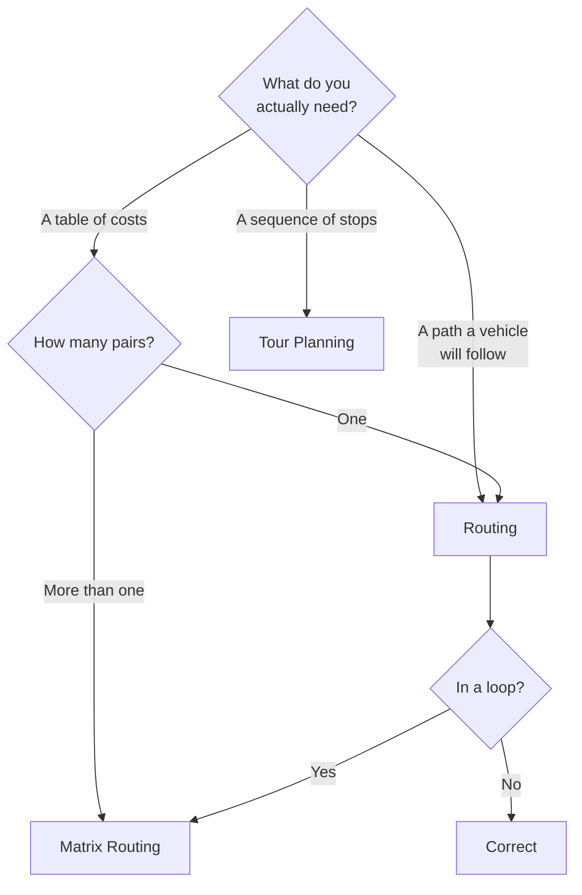
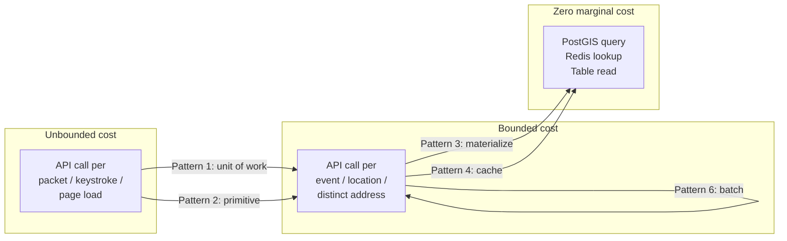

# Cost Optimization Patterns

Location API bills do not grow linearly with a business. They grow with whatever the system calls per unit of something.

Get that unit wrong and no rate negotiation saves you. Get it right and the bill becomes a small, flat, forecastable line that grows with locations rather than with traffic.

This page is a taxonomy of the patterns that move it, ordered by the magnitude they move.

<Info>
Read this alongside [Reducing Google Maps Costs](/use-cases/reducing-google-maps-costs), which is a *process* — instrument, fix, model. This page is the *catalogue* the process draws from.
</Info>

## The problem statement

Almost every expensive location system has the same shape:

- An API call attached to a unit of work that is too small
- A computation performed at request time that should have been performed once
- A latency guarantee purchased for a workload where nobody is waiting

Everything below is a variation on those three.

## The ordering principle

Patterns are ranked by the **exponent** they change, not the constant.

| Rank | Pattern | Moves the bill by | Effort |
|---|---|---|---|
| 1 | Change the unit of work | Orders of magnitude | Low |
| 2 | Choose the right primitive | Orders of magnitude | Low |
| 3 | Precompute and materialize | Unbounded → bounded | Medium |
| 4 | Cache | Large constant | Low |
| 5 | Deduplicate | Large constant | Trivial |
| 6 | Batch | Rate difference | Medium |
| 7 | Trim the request | Small constant | Trivial |

<Warning>
Teams routinely start at rank 7. Setting `return` fields correctly is worth doing and will never save a platform whose architecture calls a geocoder per GPS packet.
</Warning>

---

## Pattern 1: Change the unit of work

**The single highest-leverage change available, and it is not a caching problem.**

Systems call APIs per unit. The default unit is almost always too small.

| Wrong unit | Right unit | Ratio |
|---|---|---|
| GPS packet | Detected stop | ~250:1 for a 12-stop shift |
| Keystroke | Debounced query | ~8:1 on a typical address |
| Page load | User action | Unbounded |
| Order | Distinct address | ~5:1 in mature customer bases |
| Trip point | Trip | ~2,000:1 |

<Warning>
A vehicle emitting a position every ten seconds over a nine-hour shift produces 3,240 packets. Across 200 vehicles: 648,000 per day. **Any API call attached to a packet multiplies by that number.**

The address is needed when a human looks at a screen, or when a stop is detected. Not at 3:47:20am on I-80.
</Warning>

**Diagnostic:** instrument the ratio of API calls to business events.

Reverse-geocode calls per detected stop should be near 1. Routing calls per dispatch should be near the number of legs. Geocodes per order should approach zero.

<Tip>
This ratio is the most valuable number in your observability stack. Total call volume grows with the business; the ratio should not. A ratio that doubles overnight is a regression a deploy introduced, and it is visible hours before it appears on an invoice.
</Tip>

---

## Pattern 2: Choose the right primitive

Three primitives look interchangeable and are not.

**An n×m cost table costs n·m routing calls or 1 matrix call.**

A 20-depot, 500-stop assignment problem is 10,000 calls or 1. That is a complexity difference, not a rate difference. No pricing tier closes it.

**Where the loop hides:** nearest-driver assignment, store locator ranking, territory design, freight rating, site selection, delivery zone economics. All matrices.

**The inverse error:** using a solver where a lookup would do, or matrix where you needed geometry. Matrix returns no path. If a driver follows it, you needed routing.

See [Routing vs Matrix](/architecture/choosing-routing-vs-matrix).

---

## Pattern 3: Precompute and materialize

**This pattern converts an unbounded cost into a bounded one.** That is a stronger statement than "it saves money."

Certain artifacts are expensive to compute, cheap to store, and stable for months:

- Drive-time isolines around fixed locations
- Distance matrices between fixed depots and stable destination sets
- Lane distances for freight rating
- Territory polygons
- Trade areas

Compute them on a schedule. Store them in PostGIS. Query them locally, forever.

**The arithmetic:**

A 400-store network with three delivery bands is **1,200 isoline calls per quarter.** Not per day. Not per customer. The cost is bounded by store count — a business number you already know.

The same system, computing isolines at checkout, costs one call per session. That is unbounded, it scales with your success, and it is why the pattern matters.

<Warning>
If your architecture calls an external service to answer "is this point inside this polygon," you have built a spatial database with an API bill attached. Containment is a geometry test. It requires no road network, no traffic data, no routing engine.
</Warning>

**Diagnostic:** for each API call in a request path, ask *what would have to change for this answer to differ?* If the answer is "a new store opens," it is a materialization candidate.

**Failure modes:** stale artifacts. Version them. Recompute on events — a location opens, a service promise changes, a significant map release ships — not on a timer. See [Delivery Zones](/use-cases/delivery-zones) and [Catchment Area](/guides/catchment-area).

---

## Pattern 4: Cache

Buildings are stationary. This is the whole insight.

**Normalization is the multiplier.** `123 Main St` and `123 Main Street` are the same address, and a cache keyed on the raw string treats them as different. Trim, case-fold, expand abbreviations, canonicalize postal codes — *before* hashing.

Instrument the hit rate before and after. Teams routinely find that half their misses were the same address written three ways. Free doubling.

**Invalidate on events, not clocks.**

<Warning>
A thirty-day TTL on a geocode invalidates a stable rooftop match for a building that has stood since 1904, and does nothing about the subdivision that opened yesterday. Time-based TTL on geocoding is cargo-cult caching: it costs money and improves nothing.
</Warning>

Invalidate on map release, low confidence, explicit correction, or an operational failure signal such as a failed delivery.

**Round before caching coordinates.** GPS jitter defeats exact-match lookup. Round to roughly five decimal places — about one metre. A vehicle idling at a depot generates hundreds of pings within a metre of each other. One entry.

**Different TTLs for different things.** Route geometry between fixed points is stable for hours. The ETA is not. Cache them separately or you serve stale arrival times to drivers.

**The multi-tenant caveat:** a shared geocode cache is a side channel. Key by tenant. See [Multi-Tenant Location Platform](/architecture/multi-tenant-location-platform).

See [Caching Geocoding Results](/architecture/caching-geocoding-results).

---

## Pattern 5: Deduplicate

The cheapest pattern on this page, skipped constantly.

A raw order export containing four million rows may contain nine hundred thousand distinct addresses. Geocoding it bills four million.

**Normalize first, then deduplicate.** Deduplicating before normalization catches only exact string matches, which is most of the repetition and not all of it.

**Filter what you already have.** `WHERE geocoded_at IS NULL`. On the second run this is most of the table.

<Tip>
Run the deduplication stage and count the rows that remain. Present that number before you present a timeline. It is usually a fifth of what you were handed, and it changes the conversation with whoever asked.
</Tip>

**Request deduplication at the edge** is the real-time analogue. Two concurrent requests for the same geocode should produce one upstream call. A simple in-flight request map handles it.

---

## Pattern 6: Batch

Same data, different product, different rate.

**The tell:** if the result is written to a database rather than rendered to a screen, it should have been batched.

Nothing waits for nightly address normalization. Nothing waits for historical trip matching. Nothing waits for a partner data import. Paying real-time rates for latency nobody consumes is the second-largest avoidable cost in this domain.

**Batch is a job lifecycle, not a bulk endpoint.** Create, start, poll, retrieve errors, retrieve results, delete. Persist the job ID *before* polling, or a worker restart resubmits a job you already paid for.

**Three status codes that are not errors:**

| Response | Meaning |
|---|---|
| `429` on job start | Concurrency limit. Queue. |
| `204` on errors endpoint | Zero errors. Celebrate. |
| `404` on results | Job has not succeeded yet. |

Code that treats any non-`200` as failure will log a successful job as broken every night until someone reads the specification.

See [High-Volume Geocoding](/architecture/high-volume-geocoding) and [Batch Geocoding](/guides/batch-geocoding).

---

## Pattern 7: Trim the request

Small, free, and worth doing after the six patterns above.

**Set `return` explicitly.** Requesting `polyline,actions,instructions,turnByTurnActions` when you needed `summary` inflates payloads by orders of magnitude. Nothing consumes turn-by-turn instructions server-side.

**Request only matrix fields you read.** `consumptions` is not free.

**Debounce autocomplete** at 200–300ms. Undebounced, you bill once per character typed, per session, forever.

**Coarsen resolution where nobody sees the difference.** A high-resolution isoline renders identically to a simplified one at the zoom level shown, and tests containment faster.

**CDN in front of tiles.** Static per zoom, x, y, and style. Available on any platform.

---

## Monitoring and forecasting

**Alert on calls per business event, not on total volume.**

Total volume is supposed to grow. The ratio is not. Instrument:

- Cache hit rate, per cache
- Reverse-geocode calls per detected stop
- Routing calls per dispatch
- Geocodes per order
- Matrix calls per assignment cycle
- `429` rate, by endpoint
- `403` count — should be zero; any occurrence is a licensing issue, not a bug

**Forecasting is a function of business inputs, not of last month's bill.**

Once the architecture is right, the cost of most surfaces is bounded by a number you already know:

| Surface | Bounded by |
|---|---|
| Materialized zones | Location count × bands × refresh frequency |
| Store locator | Sessions × cache miss rate × k |
| Geocoding | Distinct new addresses per month |
| Trip matching | Trips per day, not points |
| Territory design | Rep count × unit count, quarterly |

If a line item is large and *variable*, something in the pipeline is calling an API where it should be reading a table.

<Tip>
Present the forecast as a function of business inputs. "Our location cost is $X per thousand new distinct addresses plus $Y per store per quarter" is a sentence a CFO can plan against. "It was $40k last month" is not.
</Tip>

**Model both commercial models.** Call-volume pricing suits SaaS platforms whose calls track customer count. Asset-based pricing suits fleet operators with a countable vehicle population and unpredictable call volume — a dispatcher rerouting 200 trucks forty times a day is punished by call-volume pricing for operational diligence.

Asset-based availability depends on contract tier. Confirm before it becomes load-bearing in a business case. See [HERE Pricing Explained](/getting-started/here-pricing-explained).

---

## Where these patterns compose

**Patterns 1 and 2 move you from unbounded to bounded. Patterns 3 and 4 move you from bounded to free.** Patterns 5, 6, and 7 reduce the constant on whatever remains.

That ordering is why a team that starts by negotiating rates and setting `return` fields ends up with a cheaper unbounded system.

---

## Common mistakes

**Optimizing constants before exponents.** Trimming responses on a system that geocodes every packet.

**Negotiating a rate to fix a complexity problem.** A routing loop is not expensive per call.

**Time-based TTLs on geocoding.**

**Caching the raw address string.**

**Calling an API to answer a containment question.**

**Materializing nothing, then blaming the vendor.**

**Not deduplicating before batch.**

**Real-time rates for overnight work.**

**Alerting on total volume** rather than on calls per business event.

**Shared caches in multi-tenant systems.** A leak dressed as an optimization.

**Migrating before optimizing.** Moving the waste to a cheaper meter. You will save money and still be wrong.

**Forecasting from last month's invoice** rather than from business inputs.

**Treating `403` as retryable.** It never succeeds, and it is a commercial conversation.

---

## Production checklist

- [ ] Calls-per-business-event instrumented for every high-volume surface
- [ ] Reverse-geocode-to-detected-stop ratio measured and near 1
- [ ] Every routing call audited: is it inside a loop?
- [ ] Cost-table workloads moved to Matrix Routing
- [ ] Serviceability, catchments, and lane distances materialized in PostGIS
- [ ] Nothing in a request path calls an API to answer a containment question
- [ ] Geocode cache keyed on normalized address; hit rate instrumented
- [ ] Normalization applied at write time, before hashing
- [ ] Invalidation triggered by events, not by TTL
- [ ] Coordinates rounded before reverse-geocode cache lookup
- [ ] Input deduplicated before every batch job
- [ ] Latency-tolerant workloads moved to batch
- [ ] Batch job IDs persisted before polling; `429`/`204`/`404` handled correctly
- [ ] `return` fields explicit on every routing call
- [ ] Autocomplete debounced at 200–300ms
- [ ] CDN in front of tiles
- [ ] Caches keyed by tenant in multi-tenant systems
- [ ] Alerts on calls-per-event ratios, `429` rate, and any `403`
- [ ] Forecast expressed as a function of business inputs, not last month's bill
- [ ] Both commercial pricing models modelled against your worst month

---

## Related guides

<CardGroup cols={2}>
  <Card title="Routing vs Matrix" href="/architecture/choosing-routing-vs-matrix">
    Pattern 2, in full.
  </Card>
  <Card title="Caching Geocoding Results" href="/architecture/caching-geocoding-results">
    Pattern 4, including normalization and privacy.
  </Card>
  <Card title="High-Volume Geocoding" href="/architecture/high-volume-geocoding">
    Patterns 5 and 6, as a pipeline.
  </Card>
  <Card title="HERE Pricing Explained" href="/getting-started/here-pricing-explained">
    Call volume versus asset-based, and free bundles that do not pool.
  </Card>
</CardGroup>

## Related use cases

[Reducing Google Maps Costs](/use-cases/reducing-google-maps-costs) · [Vehicle Tracking](/use-cases/vehicle-tracking) · [Delivery Zones](/use-cases/delivery-zones) · [Geofencing](/use-cases/geofencing) · [Multi-Tenant Location Platform](/architecture/multi-tenant-location-platform)

## HERE documentation

- [Matrix Routing API v8](https://www.here.com/docs/category/matrix-routing-api-v8)
- [Batch API v7 limits and performance](https://www.here.com/docs/bundle/batch-api-v7-developer-guide/page/topics/limits-and-performance.html)
- [Geocoding & Search v7](https://www.here.com/docs/category/geocoding-search-api-v7)

---

Need help designing or implementing a production HERE solution?

Placematic helps engineering teams select the right HERE APIs, estimate usage, migrate from Google Maps and build production-ready geospatial systems. [Talk to us](https://placematic.com/contact/).