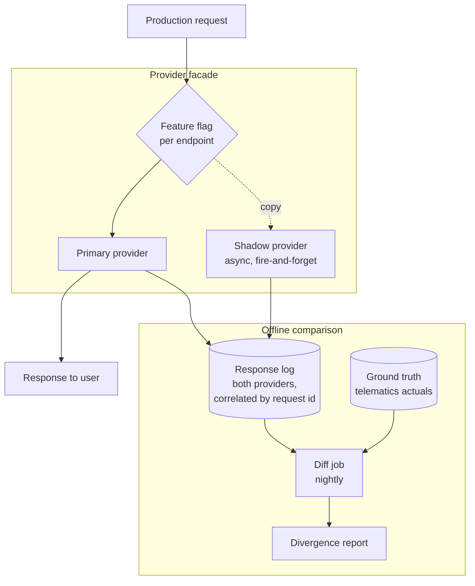
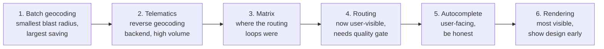

# Google Migration Architecture

This page is about the mechanics of the move, not the decision to make it.

The decision — whether to migrate at all, and what it costs — lives in [Reducing Google Maps Costs](/use-cases/reducing-google-maps-costs). The endpoint mapping and sequencing live in [Migrating from Google Maps](/guides/google-migration).

**What follows is how you do it without a Sunday-night cutover and a Monday-morning incident.**

## The problem statement

You cannot A/B test a routing engine the way you A/B test a button.

The failure modes are subtle and delayed. A truck route that omits a constraint returns `200` and looks correct in a diff. A silently transposed matrix produces plausible travel times and wrong assignments. A geocode that falls back to a city centroid renders as a pin on a map.

**You will not notice the regression by watching error rates.** Everything succeeds.

<Warning>
The most dangerous migration outcome is not an outage. It is a system that works, is cheaper, and is quietly wrong in ways that surface as operational incidents six weeks later, with no clear cause.
</Warning>

## The decision

**How do you compare two providers on production traffic without exposing users to either the comparison or the risk?**

The answer is shadow-writing, and it has three parts: run both, compare offline, cut over per endpoint.

## Recommended architecture

Three properties, all non-negotiable:

**The shadow call is asynchronous and its result is discarded.** It never touches the response path. If it fails, times out, or returns nonsense, the user is unaffected. If shadow latency can affect production latency, you have built a second point of failure to test the first.

**The flag is per endpoint, not per user.** Geocoding can be on HERE while routing is on Google. A rollback is one flag and one surface. Percentage rollouts across a routing engine give you two populations with different route qualities and no way to attribute an incident.

**Comparison happens offline, against ground truth.** Not against each other.

## The provider facade

Introduce it before you introduce HERE.

interface RouteProvider:
route(origin, destination, vehicle_profile, departure_time) -> Route
matrix(origins, destinations, vehicle_profile) -> CostTable
geocode(normalized_address) -> GeocodeResult

This is unglamorous and it is where most of the migration's engineering effort actually goes. The interface must be:

**Provider-agnostic in its types.** `Route` is your type, not Google's response shape and not HERE's. Coordinate order is `lat, lng` internally, converted at each adapter — HERE Routing takes `lat,lng`, GeoJSON is `lng,lat`, and this will bite you exactly once.

**Explicit about the vehicle profile.** Height in centimetres, `grossWeight` in kilograms, `axleCount` including trailers. A facade that omits vehicle constraints because Google could not express them will silently drop them when HERE could.

<Warning>
The facade is where truck constraints get lost. If your Google implementation had no notion of vehicle height, an interface derived from it has no field for one. Design the interface from what HERE can express, not from what Google could.
</Warning>

**Honest about capability gaps.** Some methods will throw `NotSupported` on one provider. That is information, not a design flaw.

## What to compare, and against what

**Not provider against provider.** Two wrong answers can agree.

| Surface | Ground truth |
|---|---|
| Route duration | Actual driven duration from telematics |
| Route distance | Actual driven distance |
| Route geometry | Actual driven path, map-matched |
| Geocode | A held-out set with verified rooftop coordinates |
| Matrix | Sampled cells, validated against single-route calls |
| Truck routes | Trap geometry — pass/fail, not a diff |

**Replay real historical trips.** Take five hundred trips your fleet actually drove. Route them through both providers. Compare each against what the vehicle did.

<Tip>
Compare the *distribution* of the residual, not the mean. A provider whose durations are unbiased on average but have twice the variance produces twice as many late deliveries. The mean will tell you nothing about that.
</Tip>

**For truck routing, the comparison is binary.** Route a 410 cm vehicle through the 11foot8 bridge in Durham NC, Storrow Drive in Boston, and the Southern State Parkway on Long Island. Any path returned is a failure. Run the same three in `car` mode as a control — all three should route, proving the test exercises the constraint rather than failing for an unrelated reason.

This is not a metric. It is a gate.

## Sequencing

Migrate one surface. Stabilize. Then the next. Never two.

<Warning>
Two independent systems change, one production incident occurs, root cause is ambiguous. You will spend more on the investigation than you saved that month.
</Warning>

**Batch geocoding first.** Nothing user-facing. If it breaks, you fix a nightly job. The saving is typically the largest single item, and it validates the facade before anything visible depends on it.

**Rendering last.** Tile styling differs visibly. Your designers will file a ticket. Show them the maps before you commit, not after.

## Rollback

<Warning>
**A migration you cannot reverse is not a migration. It is a bet.** Write the rollback procedure before the cutover, and execute it once in production during a low-traffic window, deliberately. An untested rollback is a hypothesis.
</Warning>

Rollback must be:

**One flag, one endpoint.** No deploy. No coordination.

**Stateless.** If cutting over wrote data in a HERE-specific shape — a `hereId` on a place record, a matched-segment reference — rollback must not require unwinding it. Store provider-agnostic data; keep provider identifiers in a nullable side column.

**Fast enough to use.** If rollback takes twenty minutes, nobody will pull the trigger during an incident. They will debug forward, badly, at 2am.

**Tested.** Flip it, verify traffic moves, flip it back. On a Tuesday.

## Keep both live during cutover

Two invoices for a month is cheaper than one incident.

Run both providers with the shadow path active for at least one full business cycle after cutover — one month for a fleet with monthly reporting, one quarter if your compliance cycle is quarterly. You are not testing the happy path. You are waiting for the edge case that only occurs on the last Friday of a month.

**Revoke the old provider's keys last, and deliberately.** A key still in a config file six months after migration is a key someone will find.

## Cost implications

**The migration itself costs money.** Shadow traffic doubles your call volume for its duration. Budget for it, and say so out loud.

**Model migration engineering cost against projected savings.** A payback period beyond eighteen months means the savings argument is weaker than the headline number suggests. Say that before your CFO does — it costs you one migration and buys credibility for the ones worth doing.

**The meters do not map one to one.** Google bills per session where HERE bills per request, and the reverse. You cannot derive a HERE forecast from a Google invoice. Instrument per-endpoint call counts from logs first. See [Reducing Google Maps Costs](/use-cases/reducing-google-maps-costs).

**Fix the call pattern before you migrate.** Cache, batch, debounce, deduplicate. Re-measure. The remaining bill is your real migration target, and now you have a clean baseline.

## Risk reduction

**Instrument before you evaluate.** Per-endpoint call counts from logs, not estimates.

**Optimize on Google first.** Halve the bill without a vendor change, then decide whether the rest is worth engineering time.

**Prove the facade with the least visible surface.**

**Gate on quality, not just cost.** A cheaper wrong route is worse than an expensive right one.

**Hold the truck-routing trap tests in CI permanently**, not just during migration. A refactor that drops `vehicle[height]` from a params dict is invisible in code review.

**Document what stays on Google, and why**, before someone frames a deliberate hybrid as a failed migration.

## Alternative architectures

**Big-bang cutover.** Occasionally correct — a greenfield surface with no production traffic, or a system small enough that the entire diff fits in one head. Never correct for routing in a fleet system.

**Percentage rollout by user.** Standard for feature flags, wrong for routing engines. You now have two populations receiving different route quality, no shared ground truth, and an incident whose blast radius is defined by a hash function.

**Dual-run without shadow comparison.** Running both and comparing nothing is theatre. If you are not diffing against ground truth, you are paying twice for the illusion of caution.

**Migrate by acquisition.** Some teams move only new customers to HERE and leave existing ones on Google indefinitely. This is a permanent hybrid with two code paths and two sets of bugs. It is a legitimate choice if the old population is shrinking, and a slow disaster if it is not. Decide which.

**Do not migrate.** If spend after optimization is small, if your product's core value is consumer place discovery, or if the payback period is measured in years — say so. The strongest signal a docs page can send is that its author will tell you not to buy.

## Common mistakes

**Migrating before optimizing.** You may be migrating waste.

**Designing the facade from Google's capabilities.** Truck constraints have nowhere to live.

**Comparing providers against each other** instead of against ground truth.

**Comparing means, not distributions.**

**Shadow calls on the response path.** A second point of failure.

**Percentage rollout across a routing engine.**

**Migrating two surfaces simultaneously.**

**Untested rollback.**

**Provider-specific data written into core records**, making rollback stateful.

**Treating truck-routing trap tests as a migration artifact** and deleting them afterwards.

**Cutting over rendering first.** Most visible, least important.

**Revoking the old keys before the first full business cycle completes.**

**Presenting savings without migration cost.**

## Production checklist

- [ ] Per-endpoint call counts instrumented from logs before any decision
- [ ] Call pattern optimized on the incumbent; savings measured and reported
- [ ] Provider facade introduced and shipped against the incumbent, before HERE is added
- [ ] Facade types are yours; coordinate order converted at each adapter
- [ ] Vehicle profile is a first-class field in the interface
- [ ] Shadow path is asynchronous, result discarded, cannot affect production latency
- [ ] Feature flag is per endpoint, not per user
- [ ] Ground truth dataset assembled: historical trips with actual duration and distance
- [ ] Comparison job diffs both providers against ground truth, nightly
- [ ] Residual distribution reported, not just the mean
- [ ] Truck-routing trap assertions in CI, with a `car`-mode control, permanently
- [ ] Rollback procedure written, and executed once in production, deliberately
- [ ] Provider-specific identifiers stored in nullable side columns
- [ ] Both providers live for at least one full business cycle post-cutover
- [ ] Migration engineering cost estimated; payback period computed and stated
- [ ] Hybrid decisions — what stays on Google — documented as decisions
- [ ] Old provider keys revoked last, and audited for stragglers

## Related guides

<CardGroup cols={2}>
  <Card title="Migrating from Google Maps" href="/guides/google-migration">
    Endpoint mapping, sequencing, and the mechanical differences.
  </Card>
  <Card title="HERE vs Google Maps" href="/comparisons/here-vs-google-maps">
    Where each genuinely wins, including where Google does.
  </Card>
  <Card title="Truck Routing" href="/guides/truck-routing">
    The trap geometry that gates the routing cutover.
  </Card>
  <Card title="Routing System Architecture" href="/architecture/routing-system-architecture">
    The system you are migrating into.
  </Card>
</CardGroup>

## Related use cases

[Reducing Google Maps Costs](/use-cases/reducing-google-maps-costs) · [ETA Calculation](/use-cases/eta-calculation) · [Fleet Routing](/use-cases/fleet-routing)

## HERE documentation

- [Routing API v8](https://www.here.com/docs/category/routing-api-v8)
- [Geocoding & Search v7](https://www.here.com/docs/category/geocoding-search-api-v7)
- [Matrix Routing API v8](https://www.here.com/docs/category/matrix-routing-api-v8)

---

Need help designing or implementing a production HERE solution?

Placematic helps engineering teams select the right HERE APIs, estimate usage, migrate from Google Maps and build production-ready geospatial systems. [Talk to us](https://placematic.com/contact/).