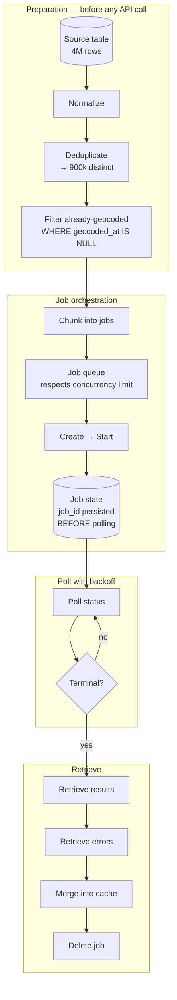
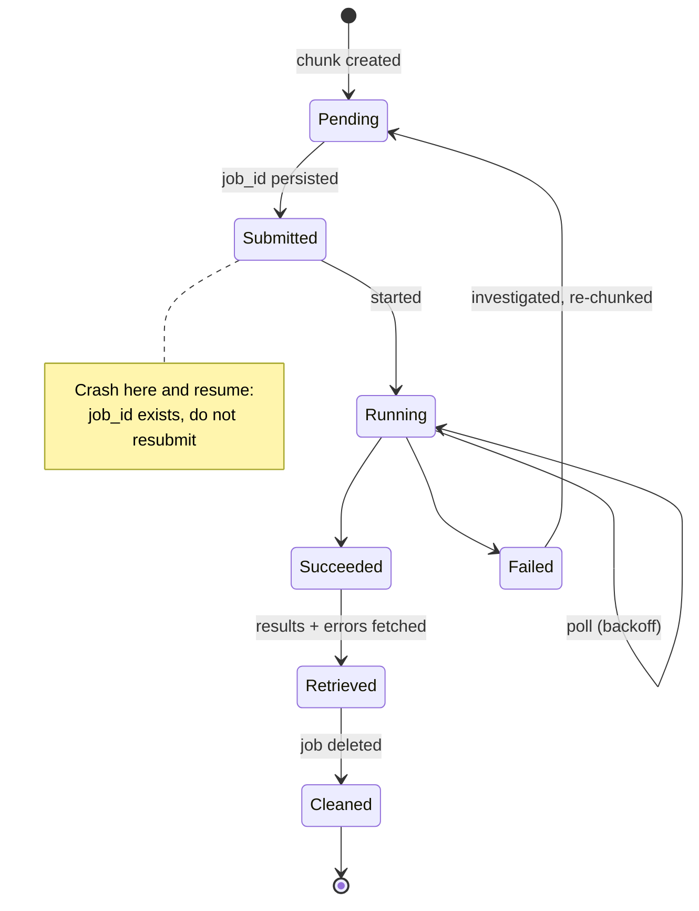

# High-Volume Geocoding Architecture

Somebody has just handed you a table with four million addresses and asked how long it will take.

The answer depends almost entirely on decisions you make before you write any code, and none of them are about the geocoding API.

## The problem statement

High-volume geocoding is not "geocoding, but more." It is a different system:

- **Nothing is waiting.** Latency has no value. Paying real-time rates for it is waste.
- **Partial failure is normal.** Some records will not resolve. All-or-nothing pipelines either discard 3.9 million good results or persist 100,000 bad ones.
- **The job outlives the process.** Workers restart. Deployments happen. Resubmitting a four-million-record job bills four million records again.
- **The input is repetitive.** A raw export contains the same address hundreds of times.
- **The output is a permanent asset.** Do this once, correctly, and never again.

<Warning>
The most expensive high-volume geocoding mistake is not choosing the wrong API. It is running the job twice.
</Warning>

## The decision

**Is this a job or a stream?**

A **job** has a beginning and an end, a known input set, and no consumer waiting. Backfills, migrations, partner data imports, nightly enrichment.

A **stream** has unbounded arrival, and each record's latency matters to somebody. Address entry at checkout.

They demand different architectures. Most systems have both and conflate them.

## Recommended architecture

**Everything left of `CHUNK` is free and reduces the bill.** Everything right of it is orchestration.

## Preparation: where the savings are

**Deduplicate.** Four million rows containing nine hundred thousand distinct addresses bills for four million. This is the largest single reduction available, it costs one `SELECT DISTINCT`, and it is skipped constantly.

**Normalize first, then deduplicate.** `123 Main St` and `123 Main Street` are the same address. Deduplicating before normalization catches only exact string matches. See [Caching Geocoding Results](/architecture/caching-geocoding-results).

**Filter what you already have.** `WHERE geocoded_at IS NULL`. On the second run this is most of the table.

<Tip>
Run the preparation stage and count the rows that remain. Present that number before you present a timeline. It is usually a fifth of what was handed to you, and it changes the conversation.
</Tip>

## Job lifecycle, not bulk endpoint

HERE's Batch API v7 is a job API. Six steps, and skipping any of them produces the failure modes below.

1. **Create** — returns `201` with a job ID
2. **Start**
3. **Poll status** until terminal
4. **Retrieve results** as a downloadable stream
5. **Retrieve errors** separately
6. **Delete**

HERE documents [job status](https://www.here.com/docs/bundle/batch-api-v7-developer-guide/page/topics/job-status.html), [job lifecycle](https://www.here.com/docs/bundle/batch-api-v7-developer-guide/page/topics/job-lifecycle.html), and [limits and performance](https://www.here.com/docs/bundle/batch-api-v7-developer-guide/page/topics/limits-and-performance.html) separately. **Read the limits page before you design the pipeline** — concurrency limits determine your parallelism strategy, not the other way around.

## Status codes that are not errors

These three produce more incident tickets than anything else in the pipeline.

| Response | Meaning | Correct action |
|---|---|---|
| `429` on job start | Concurrent job limit reached | Queue. Back off. Not a fault. |
| `204` on errors endpoint | Zero errors in a completed job | Celebrate. Do not retry. |
| `404` on results | Job has not succeeded yet | Poll status first. Results do not exist until success. |

<Warning>
Code that treats any non-`200` as failure will log a perfectly successful job as broken, every night, until someone reads the specification. `204` means there were no errors.
</Warning>

## Idempotency and retries

The pipeline must survive a worker restart without resubmitting.

**Persist the job ID before you poll.** Not after. If the process dies between `start` and the first poll, you must be able to resume. The job is running on HERE's side whether or not your process remembers it.

**Persist the chunk-to-job mapping.** Which rows are in which job. On resume, you retrieve results for jobs you already submitted and only submit chunks that have no job.

**Retries are not resubmissions.** A failed poll is retried. A failed job is investigated. Resubmitting a job that already ran bills again.

**Make chunking deterministic.** If chunk boundaries are derived from a stable ordering and a fixed size, a restarted process reconstructs the same chunks. If they are derived from a random shuffle, it does not.

## Parallelization

**Concurrency is bounded by contract, not by your worker count.**

Exceeding the concurrent job limit returns `429` on start. Firing retries in a tight loop achieves nothing except log volume. Queue.

**Chunk size is a trade-off.** Larger chunks mean fewer jobs, less orchestration overhead, and a larger blast radius when one fails. Smaller chunks mean more jobs competing for a fixed concurrency budget.

Start with chunks large enough that job overhead is negligible relative to processing, and small enough that a single failure does not force you to reprocess a day's work.

**Use gzip.** Compression is supported and materially reduces upload time and bandwidth on large inputs.

**Do not parallelize by spawning more workers.** The bottleneck is a contract limit. More workers produce more `429`s.

## Handling partial success

Some records will not resolve. This is normal and it is not an error condition for the job.

**Read the errors endpoint.** It tells you which records failed and why.

**Merge successes; queue failures.** A record that failed to geocode goes to an exception queue for review — human correction, source-system fix, or acceptance. It does not silently vanish, and it does not block the other 3.9 million.

**Persist the confidence score.** A record that "succeeded" with a city-centroid fallback is a different outcome from a rooftop match. Threshold it. Sub-threshold records join the exception queue. See [Address Validation](/use-cases/address-validation).

<Warning>
A pipeline that treats geocoding as binary — succeeded or failed — will persist low-confidence fallbacks as truth. That corruption is silent, permanent, and it propagates into every routing decision and every analytical aggregate downstream.
</Warning>

## Monitoring

Nobody is watching a nightly job. Instrument it as if it will fail at 3am, because it will.

**Job-level:**
- Jobs submitted, running, succeeded, failed
- Time in each state, with an alert on jobs running longer than expected
- `429` rate on submission — sustained means your concurrency budget is misconfigured
- Jobs not deleted after retrieval (they accumulate)

**Record-level:**
- Records submitted versus records returned
- Error rate, and error *categories*
- Confidence score distribution, not just the mean
- Records entering the exception queue

**Pipeline-level:**
- Deduplication ratio — a sudden drop means the source changed
- Cache hit rate on subsequent runs
- Cost per thousand *distinct* addresses, not per thousand rows

<Tip>
Alert on the confidence score distribution shifting, not just on errors. A map release, a source-system change, or a normalization regression shows up as a distribution shift long before it shows up as a failure.
</Tip>

**Webhooks exist in beta.** HERE supports completion notifications with substitutable placeholders such as `${JOB_ID}` and `${JOB_STATUS}`. Attractive. If your pipeline's correctness depends on a webhook arriving, build the polling fallback anyway.

## Scaling considerations

**Onboarding is bursty.** In a multi-tenant system, a large tenant arrives with millions of addresses. Batch concurrency limits are per-contract. **Queue onboarding jobs so they do not starve nightly enrichment for every other tenant.** Prioritize.

**The second run is small.** After the initial backfill, `WHERE geocoded_at IS NULL` returns a trickle. Architect the pipeline for the backfill; it will spend its life doing very little.

**Real-time and batch are different code paths.** Do not build a synchronous facade over the job API with a timeout. You will reproduce every problem async exists to prevent.

**Result retrieval is a stream, not a payload.** Four million records do not fit in memory. Stream, parse, and write incrementally.

## Cost implications

Ranked:

1. **Deduplicate.** The largest single reduction. Free.
2. **Filter already-geocoded records.** Free.
3. **Batch rather than real-time.** Cheaper per record.
4. **Do not resubmit jobs.** Persist state.
5. **Normalize before deduplicating.** Multiplies the dedup ratio.
6. **Never geocode that address again.** Write the result into a durable cache. See [Caching Geocoding Results](/architecture/caching-geocoding-results).

The end state: every address has coordinates, a normalized form, a confidence score, and a timestamp. New addresses arrive at a trickle and are geocoded in real time. The batch job ran once, at migration, and then rarely.

## Alternative architectures

**Stream through the real-time endpoint with a rate limiter.** Simpler code, no job lifecycle, no state machine. More expensive per record, and you now own the throttling. Defensible below a few hundred thousand records, where job overhead exceeds the saving.

**Self-hosted geocoder for the backfill.** Nominatim over OSM extracts, or a national address file loaded into PostGIS. Zero marginal cost, coverage and quality are yours. For a bounded operating area with a large one-time backfill, this can be the correct trade — and you can use the paid API only for records the local geocoder cannot resolve confidently. A hybrid.

**Address validation vendor instead of a geocoder.** If the goal is deliverability rather than coordinates, a postal-authority-backed validation service answers a question a geocoder cannot: does this address exist and does mail arrive there. They are not substitutes. See [Address Validation](/use-cases/address-validation).

**Do not geocode.** For analytical workloads that aggregate to ZIP or county, a postal-code centroid join costs nothing and may be sufficient. Ask what resolution the downstream analysis actually needs before geocoding four million rooftops for a chart that buckets by state.

## Common mistakes

**Treating the Batch API as a bulk endpoint.** It is a job lifecycle.

**Not deduplicating.** Paying for repetition.

**Not normalizing before deduplicating.** Catching only exact matches.

**Losing the job ID on restart.** Full rebill.

**Retrying `204` from the errors endpoint.** Zero errors.

**Aggressively retrying `404` on results.** The job has not finished.

**Hammering after `429` on start.** Concurrency limit. Queue.

**Assuming all-or-nothing.** Read the errors endpoint.

**Never deleting jobs.** They accumulate.

**Depending on a beta webhook** without a polling fallback.

**Loading four million results into memory.**

**Persisting low-confidence matches as truth.**

**Not writing results into a durable cache.** You will do this again next quarter, and pay again.

**Onboarding jobs starving nightly enrichment** for concurrency.

## Production checklist

- [ ] Input normalized, then deduplicated, then filtered on `geocoded_at IS NULL`
- [ ] Distinct-address count reported before any job is submitted
- [ ] Chunking deterministic and reproducible after restart
- [ ] Job ID persisted **before** the first poll
- [ ] Chunk-to-job mapping persisted
- [ ] Polling uses exponential backoff
- [ ] `429` on start queued, not retried tightly
- [ ] `204` on errors understood as zero errors
- [ ] `404` on results handled as "not yet"
- [ ] Errors endpoint read; partial success handled
- [ ] Confidence score persisted; sub-threshold records routed to an exception queue with an owner
- [ ] Results streamed, not buffered
- [ ] Jobs deleted after retrieval
- [ ] Gzip enabled on large inputs
- [ ] Polling fallback exists even if webhooks are used
- [ ] Onboarding jobs prioritized separately from recurring enrichment
- [ ] Monitoring: job states, `429` rate, confidence distribution, dedup ratio, cost per distinct address

## Related guides

<CardGroup cols={2}>
  <Card title="Batch Geocoding" href="/guides/batch-geocoding">
    The job lifecycle in detail, and the status codes that are not errors.
  </Card>
  <Card title="Caching Geocoding Results" href="/architecture/caching-geocoding-results">
    Where the output of this pipeline must land.
  </Card>
  <Card title="Geocoding and Search" href="/guides/geocoding">
    Endpoint selection and confidence scores.
  </Card>
  <Card title="Cost Optimization Patterns" href="/architecture/cost-optimization-patterns">
    Deduplication, batching, and precomputation as general patterns.
  </Card>
</CardGroup>

## Related use cases

[Address Validation](/use-cases/address-validation) · [Location Intelligence](/use-cases/location-intelligence) · [Logistics Platform](/use-cases/logistics-platform) · [Reducing Google Maps Costs](/use-cases/reducing-google-maps-costs)

## HERE documentation

- [Batch API v7 quick start](https://www.here.com/docs/bundle/batch-api-v7-developer-guide/page/topics/batch-api-quick-start.html)
- [Job lifecycle](https://www.here.com/docs/bundle/batch-api-v7-developer-guide/page/topics/job-lifecycle.html)
- [Job status](https://www.here.com/docs/bundle/batch-api-v7-developer-guide/page/topics/job-status.html)
- [Limits and performance](https://www.here.com/docs/bundle/batch-api-v7-developer-guide/page/topics/limits-and-performance.html)

---

Need help designing or implementing a production HERE solution?

Placematic helps engineering teams select the right HERE APIs, estimate usage, migrate from Google Maps and build production-ready geospatial systems. [Talk to us](https://placematic.com/contact/).