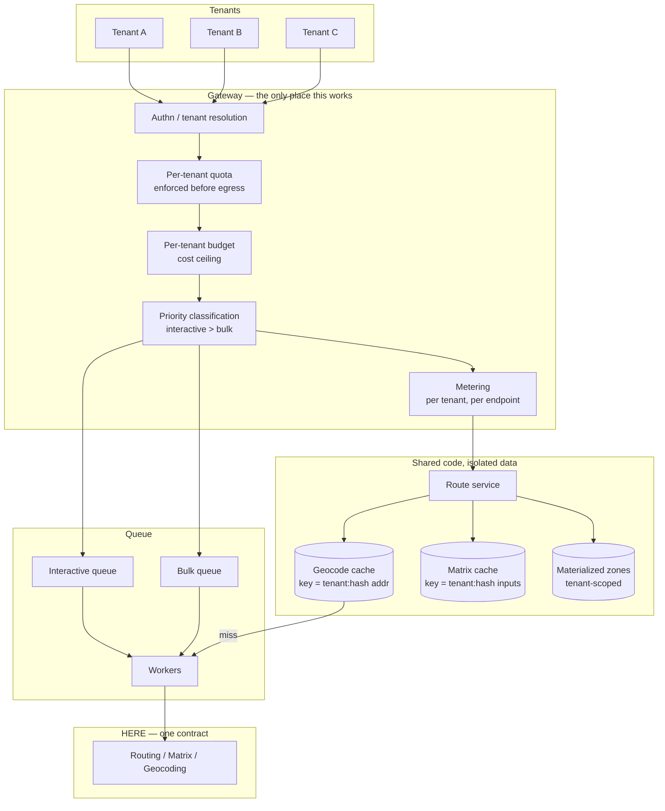

# Multi-Tenant Location Platform

From HERE's perspective there is one contract: yours.

Every consequence of multi-tenancy follows from that sentence. Your tenants share a rate limit they cannot see, a concurrency budget they did not agree to, and an invoice they do not receive.

## The problem statement

Four failure modes, all specific to multi-tenancy, none of which appear in a single-tenant system:

**Noisy neighbour.** One tenant's bulk onboarding exhausts the shared rate limit. Another tenant's dispatcher gets `429` during morning assignment.

**Cache leakage.** A geocode cache keyed on address, shared across tenants, is a channel. Tenant A's customer list is inferable from hit patterns and timing.

**Cost attribution failure.** A tenant reverse-geocodes every GPS packet. You pay. They do not see it. You cannot price the feature because you cannot measure who consumed it.

**Margin inversion.** You bill per shipment. You pay per API call. A customer with an inefficient integration destroys your margin on that account, silently, and the worse their engineering the worse your economics.

<Warning>
None of these are routing problems. All of them will determine whether the platform is viable.
</Warning>

## The decision

**Where does isolation live, and what is shared?**

Specifically: which caches are keyed by tenant, where quota is enforced, and whether cost is attributable per tenant before the request leaves your infrastructure.

## Recommended architecture

**Shared code. Isolated data.** That is the whole principle, and every violation of it is a bug.

## The cache key that leaks

This deserves its own section because the mistake is tempting and the reasoning is subtle.

The optimization: a geocode is a pure function of an address. `123 Main Street, Chicago` resolves to the same coordinate for every tenant. Sharing the cache across tenants maximizes hit rate and minimizes spend.

The problem: **cache hit patterns are a side channel.**

A tenant can determine whether another tenant has geocoded a given address by measuring response latency. Repeated across a candidate list, that reconstructs a customer list. In some industries — healthcare logistics, legal courier, anything with a competitive customer base — that is a serious disclosure.

<Warning>
A shared geocode cache in a multi-tenant system is a data leak. The savings were never worth it. Key every cache by tenant, and verify it with an explicit cross-tenant test in CI.
</Warning>

**The clean resolution**, if hit rate genuinely matters: separate the *address-to-coordinate* mapping from the *tenant-to-address* mapping.

The coordinate for `123 Main Street, Chicago` is a fact about the world. The fact that Tenant A has a customer there is tenant data. Store them separately. Share the first. Isolate the second.

This gives you the hit rate without the channel, because a cache hit on the world-facts table reveals only that *someone* geocoded a public address — which is not a fact about any tenant.

Timing still leaks whether the address was in cache at all. If your threat model includes a motivated adversarial tenant, key by tenant and accept the lower hit rate. Most platforms should.

<Info>
This same argument applies to matrix caches keyed on depot-stop sets, to materialized delivery zones, and to any derived spatial artifact. If the key reveals something about a tenant's business, the cache is a channel.
</Info>

## Quota and the shared rate limit

HERE sees one contract. Your tenants share its rate limit, and they do not know each other exists.

**Enforce a per-tenant budget before the request leaves your infrastructure.** Not by observing `429`s and reacting — by refusing to send the request.

Two ceilings, and they are different:

**Rate ceiling** — requests per second per tenant. Prevents a runaway loop from consuming the shared limit.

**Cost ceiling** — spend per tenant per month. Prevents a bad integration from consuming your margin. This is not a rate limit; a tenant can stay under the rate limit for thirty days and still be your entire invoice.

**Priority is a queue property, not a request property.** A dispatcher's interactive request must never queue behind another tenant's bulk onboarding. Two queues. Interactive drains first.

<Warning>
Batch API concurrency limits are per-contract. A large tenant arriving with millions of addresses will starve nightly enrichment for every other tenant unless onboarding jobs are queued separately and deprioritized. This is a real incident, and it happens on the day you close your biggest customer.
</Warning>

**Reserve headroom.** Do not allocate 100% of your contracted rate limit across tenants. Leave a buffer for the tenant who onboards tomorrow, and for the incident where three tenants are busy at once.

## Cost attribution

You cannot price a feature whose cost you cannot attribute.

**Meter at the gateway**, per tenant, per endpoint, before egress. Not from HERE's invoice — that arrives monthly and is not broken down by your tenants.

**Track calls per business event, per tenant.** Routes per dispatch. Geocodes per order. Reverse-geocodes per detected stop.

<Tip>
The most useful multi-tenant metric is **HERE calls per business event, per tenant**. Total volume grows with the business; the ratio should not. A tenant whose ratio is ten times the median has an integration problem you can fix for them — and it is often a better conversation than an invoice.
</Tip>

**Two responses to an inefficient tenant:**

Fix it at the gateway. Cache aggressively, expose only call shapes you can afford, enforce debouncing server-side if the client will not.

Or meter and pass through. Attribute the cost, price the feature accordingly.

Most platforms do the first and find they never need the second.

## Your billing unit versus your cost unit

If you bill per shipment and pay per API call, those units must be bounded relative to each other.

A tenant who calls routing once per shipment and a tenant who calls it forty times per shipment produce the same revenue and forty times the cost. Your margin on the second account is negative, and nothing in your billing system tells you.

**Either bound the calls per billable event**, structurally, at the gateway — or **bill on something correlated with calls.**

**Evaluate asset-based pricing** if your tenants' vehicle populations are countable and their call volumes are not. A dispatcher rerouting two hundred trucks forty times a day is punished by call-volume pricing for operational diligence. See [HERE Pricing Explained](/start-here/here-pricing-explained).

<Info>
Asset-based pricing availability depends on contract tier. Confirm it before it becomes load-bearing in your unit economics.
</Info>

## Keys, and what tenants must never see

**Your tenants never hold a HERE key.** One credential, held by your platform, never exposed, never proxied through in a way a customer's engineer could extract.

**Translate HERE's error codes.** A `403` means your key lacks an entitlement. Your tenant has no HERE contract and cannot act on that. Surfacing it is confusing at best and information disclosure at worst. Map it to something meaningful in your domain.

**Separate keys per environment.** Development, staging, production. Rotating a compromised development key must never cause a production outage.

**Rotate with two keys live.** Issue the new key, deploy, verify traffic has moved, then revoke. Never revoke first.

## The redistribution question

<Warning>
Exposing HERE APIs to your customers may constitute redistribution, which carries different licensing terms than internal use. **Resolve this before you build.** Discovering it during a customer's security review, or during your own contract renewal, is expensive.
</Warning>

A spectrum, and where you sit determines your terms:

- **Internal consumption** — your platform calls HERE, renders a map, shows an ETA. Your customer sees a feature.
- **Pass-through** — your API returns HERE's response shape to your customer's engineers.
- **Redistribution** — your customer builds against what is effectively a HERE proxy.

The further right, the more likely you need explicit terms. This is exactly the conversation to have with a Gold Partner before you ship, not after. Placematic USA LLC is the contracting party for HERE services, which makes it a short conversation.

## Onboarding

A new tenant arrives with a customer table.

**Deduplicate before batch geocoding.** A raw export contains enormous repetition. Nine hundred thousand distinct addresses in four million rows.

**Queue onboarding separately.** Deprioritized. Bounded concurrency. It must not compete with production traffic or with nightly enrichment for other tenants.

**Materialize their spatial artifacts once.** Delivery zones, terminal catchments, territory polygons. Computed at onboarding, stored in PostGIS, queried locally forever after.

**Set their quota and budget before they send a request.** A tenant with no ceiling is an incident waiting for a bug in their code.

## Scaling considerations

**Cache hit rate falls when you key by tenant.** Accept it. The alternative is a channel.

**Shared code, isolated data means one deployment.** Do not build per-tenant infrastructure to solve a data isolation problem. Key the data.

**Reserve rate-limit headroom** proportional to your tenant growth rate, not your current tenant count.

**The synchronous tier scales for free** if it serves from PostGIS and Redis. Materialized zones and cached geocodes do not care how many tenants you have.

**Solve and matrix jobs partition naturally by tenant.** There is no cross-tenant optimization worth doing.

## Cost implications

1. **Per-tenant budgets** prevent one tenant's inefficiency from becoming your invoice.
2. **Deduplicate onboarding input.** The largest single reduction, and it is free.
3. **Materialize spatial artifacts per tenant, once.** Serviceability checks then cost nothing.
4. **Expose batch shapes, not single-item endpoints**, or your tenants will loop them.
5. **Meter per tenant, per endpoint.** You cannot optimize what you cannot attribute.
6. **Matrix instead of routing loops** — yours and theirs.

## Alternative architectures

**Bring-your-own-key.** Each tenant holds a HERE contract. Clean commercially: their invoice, their rate limit, their redistribution question. Terrible for onboarding — every customer now runs a procurement process before they can use your feature. This kills product-led growth. Correct for enterprise-only products with long sales cycles. Wrong for everyone else.

**Per-tenant infrastructure.** A separate database, separate cache, separate workers per tenant. Solves isolation by construction. Expensive, operationally heavy, and it solves a data-keying problem with hardware. Justified for regulated tenants with data residency requirements, not as a default.

**Hybrid: shared platform, per-tenant key for large accounts.** Your enterprise tenants bring their own HERE contract; your long tail uses yours. Two code paths, two sets of bugs, and a redistribution question that varies per tenant. It works. Know that you are choosing it.

**Self-host the routing engine.** Eliminates the redistribution question entirely and makes rate limits your own problem. You now maintain truck attributes, traffic, and map freshness for every tenant. Viable if location is your core competency. If you are a TMS vendor, this is a second product nobody is funded to own.

**Build only what your customers cannot.** The strongest version of this architecture exposes *your* domain logic — territories, delivery zones, dispatch — computed on materialized spatial data in your own database, with HERE calls bounded and rare. Your customers never touch a routing API because they never need to.

## Common mistakes

**A shared geocode cache across tenants.** A leak, not an optimization.

**No per-tenant quota.** One tenant `429`s everyone.

**No per-tenant cost ceiling.** Rate limits do not bound spend.

**Reacting to `429` instead of preventing it.**

**Onboarding jobs competing with production traffic.**

**No cost attribution.** You cannot price the feature.

**Billing unit uncorrelated with cost unit.**

**Exposing single-item endpoints** and being surprised customers loop them.

**Passing HERE error codes through unchanged.**

**Building before answering the redistribution question.**

**Allocating 100% of your rate limit across current tenants.**

**Assuming tenants will integrate correctly.** Design the surface so misuse is bounded.

**Per-tenant infrastructure to solve a cache-key problem.**

**Vehicle constraints as service defaults** rather than tenant data.

## Production checklist

- [ ] Redistribution and pass-through terms confirmed in writing before build
- [ ] Every cache keyed by tenant; cross-tenant isolation asserted in CI
- [ ] Per-tenant rate ceiling enforced at the gateway, before egress
- [ ] Per-tenant cost ceiling enforced, separate from the rate ceiling
- [ ] Two queues: interactive and bulk; interactive drains first
- [ ] Onboarding jobs queued separately, deprioritized, bounded concurrency
- [ ] Rate-limit headroom reserved for growth and for concurrent bursts
- [ ] Metering per tenant, per endpoint, at the gateway
- [ ] `HERE calls per business event, per tenant` dashboarded, with outlier alerting
- [ ] Billing unit bounded relative to cost unit
- [ ] Tenants never hold or see a HERE key
- [ ] HERE error codes translated into domain-meaningful errors
- [ ] Separate keys per environment; rotation with two keys live
- [ ] Vehicle profiles and transport modes stored as tenant configuration
- [ ] Batch-shaped endpoints exposed instead of single-item endpoints
- [ ] Onboarding input deduplicated before batch geocoding
- [ ] Spatial artifacts materialized per tenant at onboarding
- [ ] Quota and budget set before a new tenant's first request

## Related guides

<CardGroup cols={2}>
  <Card title="Authentication" href="/start-here/authentication">
    Key handling, rotation without downtime, and error semantics.
  </Card>
  <Card title="Caching Geocoding Results" href="/architecture/caching-geocoding-results">
    Normalization, invalidation, and the tenant-keyed cache.
  </Card>
  <Card title="Routing System Architecture" href="/architecture/routing-system-architecture">
    The tiers, the gateway, and the queue.
  </Card>
  <Card title="High-Volume Geocoding" href="/architecture/high-volume-geocoding">
    Onboarding at millions of addresses without starving production.
  </Card>
</CardGroup>

## Related use cases

[Embedding a Routing API](/use-cases/embedding-routing-api) · [Logistics Platform](/use-cases/logistics-platform) · [Fleet Routing](/use-cases/fleet-routing)

## HERE documentation

- [Identity and Access Management](https://www.here.com/docs)
- [Batch API v7 limits and performance](https://www.here.com/docs/bundle/batch-api-v7-developer-guide/page/topics/limits-and-performance.html)
- [Matrix Routing API v8](https://www.here.com/docs/category/matrix-routing-api-v8)

---

Need help designing or implementing a production HERE solution?

Placematic helps engineering teams select the right HERE APIs, estimate usage, migrate from Google Maps and build production-ready geospatial systems. As a HERE Gold Partner, Placematic USA LLC is the contracting party — which makes the redistribution conversation a short one. [Talk to us](https://placematic.com/contact/).