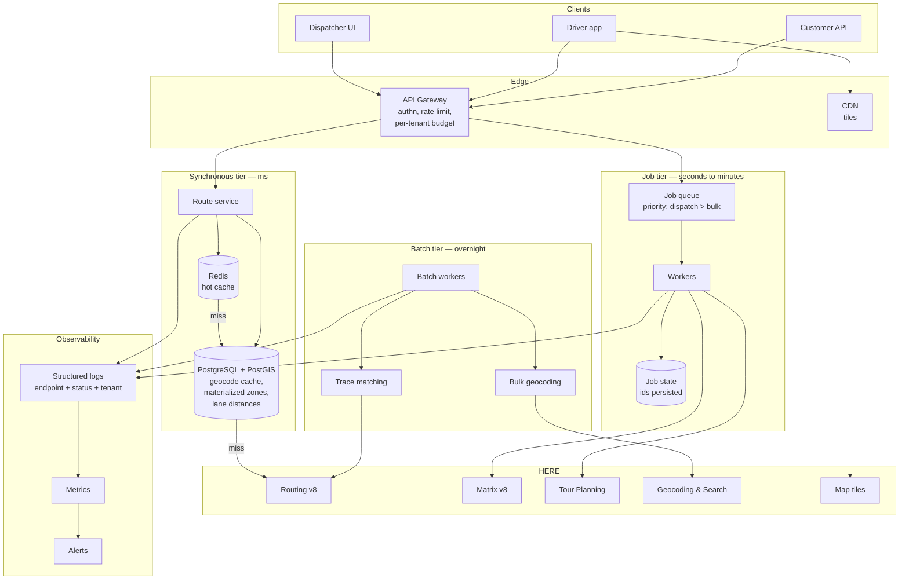
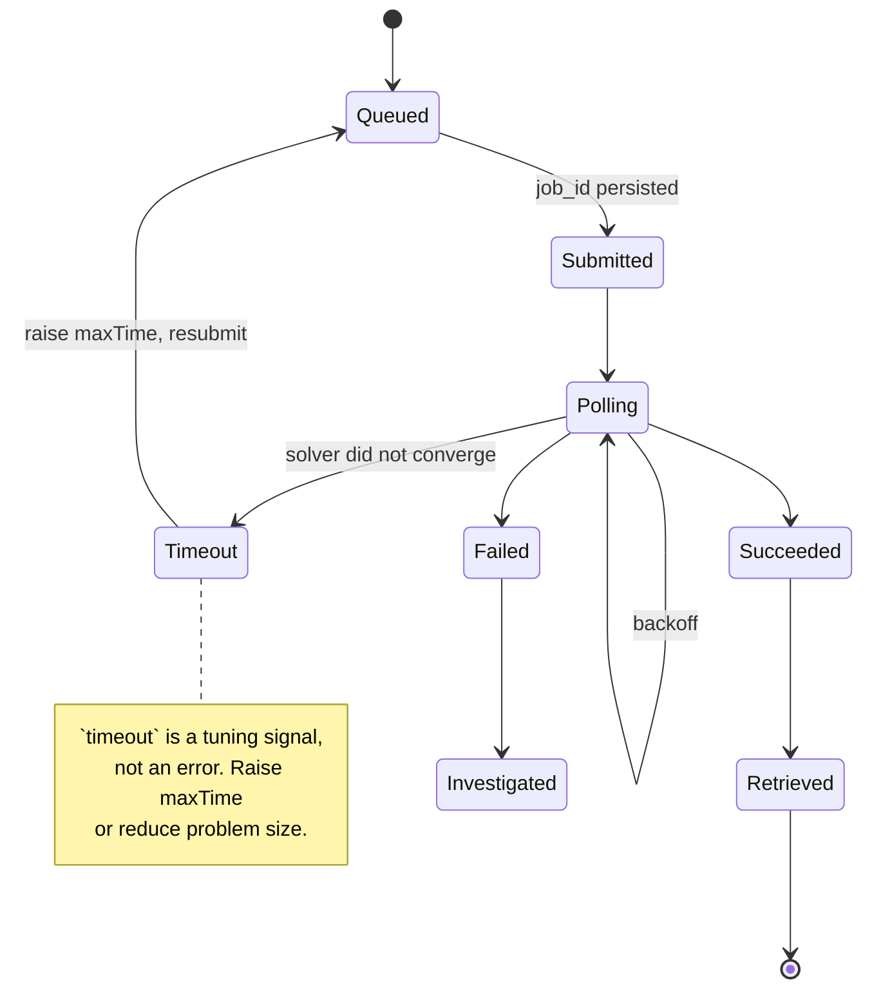

# Routing System Architecture

A routing platform is four systems wearing a trench coat.

They have different latency budgets, different failure modes, different cost profiles, and different consumers. Collapsing them into one service is the most common structural mistake in this domain, and it is invisible until the day a dispatcher's page hangs on a ninety-second solve.

## The problem statement

"We need routing" describes a dependency, not a system.

What you actually need is:

- **Planning** — solve a Vehicle Routing Problem. Seconds to minutes. Nobody is watching.
- **Execution** — compute a leg. Milliseconds. Someone is watching.
- **Reconstruction** — match a trace to road segments. Overnight. Nothing is waiting.
- **Presentation** — render a map. Milliseconds. Static assets.

Each has a different right answer for caching, retrying, queuing, and failing.

<Warning>
A dispatcher clicking "optimize" and blocking on an HTTP request that takes ninety seconds is not a timeout bug. It is a tier collapse. No amount of tuning fixes it.
</Warning>

## The decision

**Where do the boundaries go, and what crosses them?**

Specifically:

1. What is synchronous, and what is a job?
2. What holds the constraint set?
3. What survives a HERE outage?
4. What can be answered without leaving your infrastructure?

## Recommended architecture

Five things about this diagram matter more than the boxes.

## 1. The gateway is not optional

It is where four things happen that cannot happen anywhere else:

- **Authentication.** Your customers never see a HERE key. Ever.
- **Rate limiting, per tenant.** HERE sees one contract. Without a per-tenant budget enforced before egress, your largest customer degrades service for everyone and you find out from a support ticket.
- **Priority classification.** A dispatcher's interactive request must not queue behind a tenant's bulk onboarding.
- **Cost attribution.** You cannot price a feature whose cost you cannot attribute.

<Info>
If you build one thing before the routing service, build the gateway. Retrofitting per-tenant quota onto a system that already has customers is a migration, not a feature.
</Info>

## 2. The synchronous tier should rarely call HERE

This is the architectural insight that separates viable platforms from expensive ones.

Most questions asked at request time have answers already in your database:

| Question | Where it should be answered |
|---|---|
| Do we deliver to this address? | `ST_Contains` against a materialized isoline |
| What is the lane distance for this quote? | A cached lane-distance table |
| Where is this customer? | The geocode cache |
| Which store is nearest? | `ST_DWithin` shortlist, then a small cached matrix |
| What is this vehicle's last position? | Redis |

**The synchronous tier's job is to serve from PostGIS and Redis.** A HERE call from the request path is a cache miss, and it should be rare enough to be worth logging as an event.

<Warning>
If your checkout serviceability check calls an isoline API, you have built a spatial database with an API bill attached. Materialize the polygons. See [Delivery Zones](/use-cases/delivery-zones).
</Warning>

## 3. The queue is where solves live

Matrix Routing at scale and Tour Planning are asynchronous by nature. Wrapping them in a synchronous facade with a thirty-second timeout reproduces every problem async was designed to prevent: timeouts, retries, duplicate submissions, double billing.

**Submit, persist the job ID, return control, poll on a worker.**

The job ID must be persisted *before* the first poll. If the process dies between submission and the first poll, the job is running on HERE's side regardless. Resubmitting a solved problem bills again and returns a different sequence, which confuses everyone downstream.

**Follow the `statusUrl` HERE returns.** Do not construct it.

**Priority is a queue property, not a request property.** Interactive dispatch ahead of bulk onboarding, always.

## 4. Constraints live on records, never at call sites

A truck's height is a property of the truck. A hazmat class is a property of the load. A tenant's default transport mode is tenant configuration.

<Warning>
A developer adding a new endpoint who copies a routing call without the vehicle profile has introduced a defect that is invisible in code review, returns `200`, and produces a route no truck can drive. There is no warning. There is no error.
</Warning>

**Push the constraint set to the device, too.** The most dangerous pattern in mobile fleet software: server-side truck routing with constraints, device-side recalculation without them. The driver deviates. The phone reroutes. The constraints never left your backend.

Vehicle profiles belong in the model layer, resolved once per request, applied uniformly. Validate them at write time — a vehicle record with a null height should fail validation before it reaches a routing call.

## 5. Retry semantics differ by status code

This table is the most useful thing on this page.

| Status | Meaning | Retry? |
|---|---|---|
| `401` | Key missing, malformed, revoked | No — fix the credential |
| `403` | Key valid, entitlement missing | **Never** — this is a commercial conversation |
| `429` | Rate limit exceeded | Yes — exponential backoff with jitter |
| `400` | Malformed request | No — fix the parameters |
| `5xx` | Upstream failure | Yes — backoff, jitter, circuit breaker |
| `200` with empty `routes` | No path exists | **No** — this may be the correct answer |

<Warning>
`200` with `"routes": []` and a `notice` containing `routeCalculationFailed` is a valid response. Checking only `resp.ok` swallows route failures. For hazmat and truck routing, "no legal route" is a real and correct outcome — a system that retries with relaxed constraints has just produced an illegal route.
</Warning>

**Retrying `403` is patient, well-engineered, and permanently futile.** It generates support tickets. Log the endpoint alongside the status code so `403` on tour planning and `429` on routing are distinguishable — one is a conversation with your account manager, the other with your architect.

## Failover: what it can and cannot mean

Be precise about this, because "multi-provider failover" is usually a slide, not a system.

**What genuinely fails over:**

- **Tiles.** A CDN with a secondary origin. Users see a map.
- **Geocoding.** A cached result, a secondary provider, or a stale coordinate with a warning. Degraded, not broken.
- **Serviceability checks.** Materialized polygons in your own database. HERE being down is irrelevant.

**What does not fail over:**

- **Truck routing.** A second provider does not have HERE's commercial vehicle constraints. Falling back to car routing produces a route a truck cannot drive. **This is worse than failing.**
- **Tour Planning.** A second solver produces a different sequence. Mid-day, that is chaos.
- **Route Matching.** Your audit artifact must cite one map release. Two providers, two answers.

<Warning>
Failing over truck routing to an unconstrained provider is the single most dangerous fallback in this domain. Refuse to route. A dispatcher calling operations is a better outcome than a driver following a route through a low bridge.
</Warning>

**Degrade honestly.** Serve the last known good route with a staleness indicator. Queue the request. Tell the user. Do not silently substitute a worse answer.

**Circuit breakers must reset.** A breaker that opens on the first `429` and never closes turns a throttle into an outage.

## Observability

Log the **endpoint, status code, tenant, and latency** for every external call. Not the body.

**Metrics that matter:**

- Cache hit rate, per cache — geocode, lane distance, matrix
- HERE calls per business event (routes per dispatch, geocodes per order)
- `429` rate by endpoint and by tenant
- `403` count — should be zero in steady state; any occurrence is a licensing issue
- Job queue depth and age, by priority class
- Jobs running longer than expected
- Ratio of reverse-geocode calls to detected stops

<Tip>
Alert on **HERE calls per business event**, not on total call volume. Volume grows with the business; the ratio should not. A ratio that doubles overnight is a regression a deploy introduced, and it is visible hours before it is visible on an invoice.
</Tip>

**Never log API keys.** Never put them in query strings — URLs are logged by proxies, load balancers, and CDNs whether you intended it or not.

## Scaling considerations

**The synchronous tier scales with your traffic, for free**, provided it is serving from PostGIS and Redis. Indexed containment queries and cache lookups do not care about request volume.

**The job tier scales with problem size, non-linearly.** Tour Planning solve time grows faster than stop count. Partition by geography before you partition by anything else — two independent depot regions are two problems, not one.

**The batch tier scales with trace volume.** Two hundred vehicles at a ten-second ping rate is 648,000 points per day. Segment trips, drop idle periods, and downsample before submitting anything. Anything per-point multiplies by fleet size times ping rate.

**HERE concurrency limits are per-contract, shared across your tenants.** Queue and prioritize at your layer.

**`configuration.termination.maxTime` is a scaling parameter.** HERE's documentation example sets it to two seconds. On a two-hundred-stop problem that produces a legal solution a dispatcher will reject. Find the knee empirically, per problem size.

## Cost implications

The architecture *is* the cost model.

**Requests answered from PostGIS cost nothing.** Materialize zones, cache lane distances, precompute matrices for stable input sets.

**Matrix instead of routing loops.** A 20×500 assignment problem is 10,000 routing calls or one matrix. That is a complexity difference, not a rate difference. See [Routing vs Matrix](/architecture/choosing-routing-vs-matrix).

**Hash the problem.** If the stop set, fleet, and constraints are unchanged, reuse the solution rather than re-solving.

**Nothing expensive touches a GPS packet.** Detect stops locally. Geocode events. Match trips overnight.

**`return` explicitly on every routing call.** Nothing consumes turn-by-turn `instructions` server-side.

**Cache route geometry and ETAs with different TTLs.** The path between fixed points is stable for hours. The ETA is not.

## Alternative architectures

**Monolith with a routing module.** Perfectly reasonable below a certain scale. The tiers still exist — they are just packages rather than services. Keep the boundaries even if you do not distribute them. The failure mode of a monolith is not the monolith; it is a dispatcher's request blocking on a solve because nothing forced you to think about it.

**Serverless job workers.** Attractive for the batch tier, which is bursty and idle most of the day. Watch two things: cold starts against polling backoff, and function timeouts against solve durations. Persist job state externally regardless.

**Event-driven throughout.** GPS ingest, stop detection, and trip closure are naturally events. A log-based architecture — Kafka or equivalent — suits the batch tier well and the synchronous tier badly. Do not force it into the request path.

**No queue.** If your solves are small and your tenants few, a synchronous matrix call may be genuinely sufficient. Be honest about whether you are below that threshold, and note that the threshold moves as you grow while the code does not.

**Bring your own solver.** If your optimization objective is genuinely custom, feed OR-Tools with a cached matrix. The matrix is the interface. This is a legitimate build; approximating a matrix with routing loops to feed it is not.

## Common mistakes

**Tier collapse.** A synchronous request blocking on a solve.

**No gateway.** No per-tenant budget, no cost attribution, no priority.

**Calling HERE from the request path** for questions PostGIS answers.

**Constraints at call sites** rather than on records.

**Constraints on the server, absent on the device.**

**Retrying `403`.**

**Treating `200` as success without checking `routes.length`.**

**Failing over truck routing to an unconstrained provider.**

**Circuit breakers that never reset.**

**Blocking on an async job.**

**Losing the job ID on restart.**

**Constructing the `statusUrl`.**

**Logging keys, or putting them in query strings.**

**Alerting on total call volume** rather than calls per business event.

**One key across environments.** A leaked development key now requires a production rotation.

## Production checklist

- [ ] Gateway enforces authentication, per-tenant rate limit, and per-tenant budget before egress
- [ ] Priority classes: interactive dispatch ahead of bulk operations
- [ ] Synchronous tier serves serviceability, lane distances, and geocodes from PostGIS/Redis
- [ ] HERE calls from the request path logged as cache-miss events, and rare
- [ ] Solves and large matrices submitted as jobs; job ID persisted before the first poll
- [ ] `statusUrl` followed verbatim
- [ ] Vehicle profiles and constraint sets stored as records, validated at write time
- [ ] Constraint set pushed to the driver device; recalculation path tested
- [ ] Retry policy differentiated by status code; `403` never retried
- [ ] `200` with empty `routes` handled as a legitimate outcome
- [ ] No failover from constrained truck routing to an unconstrained provider
- [ ] Circuit breakers reset
- [ ] CDN in front of tiles; browser keys domain-restricted
- [ ] Structured logs: endpoint, status, tenant, latency — never keys, never bodies
- [ ] Alerts on HERE calls per business event, `403` count, `429` rate, job queue age
- [ ] Separate keys per environment
- [ ] Trap-geometry assertions in CI for truck routing, with a `car`-mode control

## Related guides

<CardGroup cols={2}>
  <Card title="Routing" href="/guides/routing">
    Transport modes, `return` fields, and the `200` that is not success.
  </Card>
  <Card title="Authentication" href="/start-here/authentication">
    Key handling, rotation without downtime, and error semantics.
  </Card>
  <Card title="Matrix Routing" href="/guides/matrix-routing">
    Async lifecycle, `statusUrl`, and the flat result array.
  </Card>
  <Card title="Tour Planning" href="/guides/tour-planning">
    Solve as a job, `maxTime` as a scaling parameter.
  </Card>
</CardGroup>

## Related use cases

[Fleet Routing](/use-cases/fleet-routing) · [Logistics Platform](/use-cases/logistics-platform) · [Embedding a Routing API](/use-cases/embedding-routing-api) · [Vehicle Tracking](/use-cases/vehicle-tracking)

## HERE documentation

- [Routing API v8](https://www.here.com/docs/category/routing-api-v8)
- [Matrix Routing API v8](https://www.here.com/docs/category/matrix-routing-api-v8)
- [Tour Planning API](https://docs.here.com/tour-planning/docs/introduction-tour-planning)

---

Need help designing or implementing a production HERE solution?

Placematic helps engineering teams select the right HERE APIs, estimate usage, migrate from Google Maps and build production-ready geospatial systems. [Talk to us](https://placematic.com/contact/).