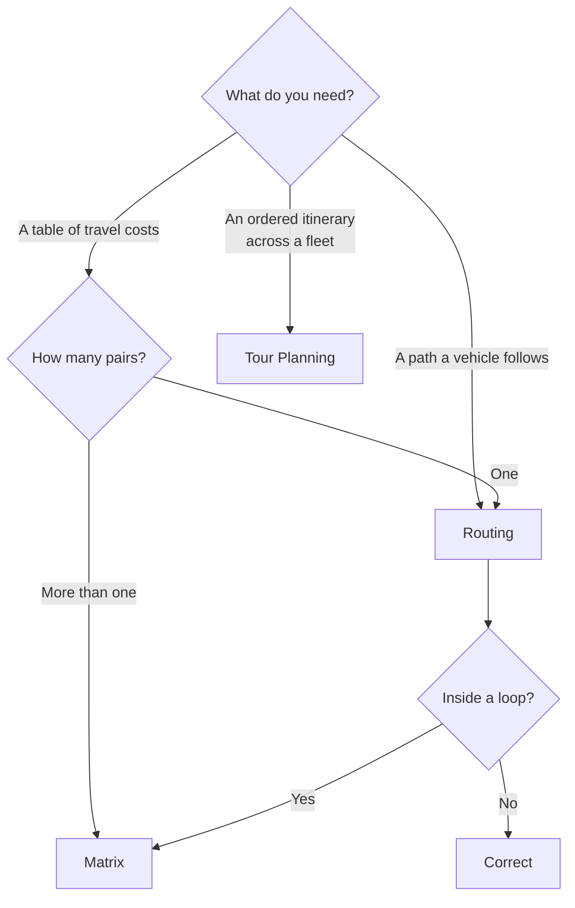

# HERE Routing vs Google Maps Routing

**Choose HERE when a vehicle's physical or legal characteristics must constrain the route.** Height, gross weight, axle weight, hazardous cargo, tunnel category. Google Maps Platform does not express these.

**Choose Google when you are moving passenger vehicles or people**, when consumer traffic quality and ecosystem familiarity matter more than constraint expressiveness, or when your team's time is better spent elsewhere.

Everything below is elaboration on those two sentences.

## Comparison scope

This page compares **routing engines**: path computation, travel-time estimation, matrices, and vehicle constraint handling.

It does not compare geocoding (see [HERE Geocoding vs Google Maps](/comparisons/here-geocoding-vs-google-maps)), map rendering, or platform-level ecosystem fit (see [HERE vs Google Maps](/comparisons/here-vs-google-maps)).

Google's routing capability is delivered through the Routes API, which supersedes the legacy Directions and Distance Matrix APIs. Where this page says "Google," it means Routes API unless stated otherwise.

<Warning>
Google deprecated the Directions API and Distance Matrix API in favour of the Routes API, with a documented sunset timeline. If your evaluation is based on Directions API documentation, you are evaluating a product Google is retiring. Verify current status at [Google Maps Platform documentation](https://developers.google.com/maps/documentation/routes).
</Warning>

## Decision summary

| Requirement | Better fit | Why |
|---|---|---|
| Truck, HGV, or commercial vehicle routing | HERE | Physical and legal constraints are first-class routing inputs |
| Hazardous cargo routing | HERE | `shippedHazardousGoods` and `tunnelCategory` are native parameters |
| Passenger car navigation | Comparable | Both produce excellent car routes; test on your corridors |
| Consumer ride-hailing / delivery of people | Google | Ecosystem, traffic density, and familiarity |
| Large origin-destination matrices | HERE | Asynchronous Region and Profile modes reach far larger sizes — *with conditions, see below* |
| Multi-stop optimization with constraints | HERE | Tour Planning is a VRP solver, included in the HERE Base Plan |
| GPS trace to road segments | HERE | Route Matching. Google has no equivalent product |
| EV routing with charge state | Both, differently | HERE exposes consumption models and charging as routing outputs; verify Google's current EV capability |
| Ecosystem, hiring, Stack Overflow depth | Google | Materially larger developer population |
| Contractual price stability | Depends on contract | Neither is inherently stable; this is a commercial term |

## Where HERE is stronger

### Commercial vehicle constraints

This is the decisive difference and it is not close.

HERE Routing v8 accepts, as first-class inputs, a vehicle description that includes:

- Physical dimensions — `height`, `width`, `length`, `trailerLength` (all in centimetres)
- Weight — `grossWeight`, `currentWeight`, `emptyWeight`, `payloadCapacity` (kilograms)
- Axle configuration — `axleCount`, `weightPerAxle`, and `weightPerAxleGroup` with `single`, `tandem`, `triple`, `quad`, `quint` groups
- `tunnelCategory` — the ADR cargo tunnel restriction code, values `B`, `C`, `D`, `E`
- `shippedHazardousGoods` — a list drawn from `explosive`, `gas`, `flammable`, `combustible`, `organic`, `poison`, `radioactive`, `corrosive`, `poisonousInhalation`, `harmfulToWater`, `other`
- `kpraLength` — kingpin-to-rear-axle, relevant to California and Idaho restrictions
- `category: lightTruck` — a legal exemption that does not waive physical dimension limits
- `trailerCount`, `tiresCount`, `licensePlate` for environmental-zone evaluation

<Info>
Verified against the [HERE Matrix Routing v8 OpenAPI specification](https://matrix.router.hereapi.com/v8/openapi), version 8.47.0, retrieved July 2026. The `truck` object is marked deprecated in favour of `vehicle`; both currently accept the same fields. Check the current specification before implementing.
</Info>

The Google Routes API does not expose an equivalent commercial vehicle profile. Constraint handling is left to application logic — which is to say, you cannot do it, because the road network attributes required are not exposed to you either.

<Warning>
This is a capability gap, not a pricing gap. No amount of Google spend produces a route that respects a 3.4 m bridge clearance for a 4.1 m trailer. If you dispatch commercial vehicles, this decides the platform.
</Warning>

### Route Matching

HERE offers map matching: taking a noisy GPS trace and returning the road segments actually travelled, with their attributes.

This is what IFTA jurisdiction-mile reporting and defensible speed compliance require. Google Maps Platform has no equivalent product. Nearest-address reverse geocoding does not substitute — it returns an address, not a segment, and it will not survive an audit.

See [Route Matching](/guides/route-matching) and [ELD Platform](/use-cases/eld-platform).

### Tour Planning

HERE Tour Planning is a Vehicle Routing Problem solver: capacitated VRP, time windows, multi-depot, heterogeneous fleets, pickup-and-delivery, priorities, and reloads.

<Info>
HERE documents Tour Planning as included in the HERE Base Plan. Confirm your own entitlement; Base Plan inclusion and your contract's inclusion are separate facts. Source: [HERE Tour Planning introduction](https://docs.here.com/tour-planning/docs/introduction-tour-planning).
</Info>

Google Routes offers waypoint optimization within a single route. That is a different problem — it orders stops for one vehicle, not assigns stops across a fleet under constraints.

## Where Google is stronger

### Passenger vehicle traffic and ETA

Google's traffic data derives from an enormous consumer device population. For dense urban passenger-car routing, this is a real advantage and it is honest to say so.

**Whether it is an advantage on your corridors, at your departure times, is an empirical question.** We give a test plan below. Do not accept either vendor's claim, including ours.

### Ecosystem

More engineers have shipped Google Maps integrations. More Stack Overflow answers exist. More libraries assume it. Hiring is easier.

This is a real cost that appears in your engineering budget, not on a rate card.

### Consumer-facing everything

If your product is consumer navigation, ride-hailing, or anything where users recognize the map's appearance and expect Street View, Google is the default and the default is correct.

### Simplicity at low volume

Below roughly ten thousand routing calls per month, both platforms are effectively free and Google's onboarding is faster. Migration engineering cost dominates any saving. Do something else.

## Where the difference is commercial, not technical

### Matrix size limits

Your evaluation almost certainly encountered "5,000 × 5,000" somewhere, including on Placematic's own comparison page. **That figure does not correspond to any documented HERE limit.**

The actual limits, from the [Matrix Routing v8 OpenAPI specification](https://matrix.router.hereapi.com/v8/openapi) (v8.47.0, retrieved July 2026):

| Mode | Sync limit | Async limit | Live traffic & custom options | Region constraint |
|---|---|---|---|---|
| **Flexible** (`regionDefinition: world`) | 15×100 or 100×1 | 15×100 or 100×1 | Yes | Unlimited |
| **Region** (`circle`, `boundingBox`, `polygon`, `autoCircle`) | 500×500 | 10,000×10,000 | Yes | Max 400 km diameter |
| **Profile** (`world` + `profile`) | 500×500, or 1×2000, or 2000×1 | 10,000×10,000 | **No** | Unlimited |

<Warning>
Read that table before you architect. A truck-constrained matrix with live traffic and custom avoidances runs in **Flexible** mode and caps at **15 × 100**. The 10,000 × 10,000 ceiling requires either a bounded region under 400 km diameter, or Profile mode — which disables custom options and live traffic entirely.

**"HERE supports 10,000 × 10,000 matrices" is true and misleading.** It is not true for the configuration a fleet dispatcher needs.
</Warning>

Additional documented constraints: request body maximum 10 MiB uncompressed; a maximum of 100 waypoints matched to any single road segment across origins and destinations combined; when only `origins` is supplied it is reused as `destinations`, capping origins at 50 in that case.

Google's Routes API imposes its own element limits, which vary by endpoint and tier. **Verify current limits directly** at [Google's Routes API documentation](https://developers.google.com/maps/documentation/routes) rather than from any comparison table, including this one.

The architecturally useful statement is directional: HERE's Region and Profile async modes reach matrix sizes at which looping point-to-point routing is not merely expensive but infeasible. Whether that helps you depends on whether your workload tolerates a bounded region or the loss of live traffic.

### Pricing

<Warning>
We will not publish a savings percentage.

Cost outcome depends on your API mix, monthly volume, region, contract terms, billing SKU, whether you batch, and whether you cache. Those variables span more than an order of magnitude. A single percentage claiming to summarize them is not a comparison.
</Warning>

What can be said structurally:

- Both platforms bill per request for routing.
- Both have volume tiers and free bundles. Bundles are per-API and do not pool.
- HERE offers an **asset-based** commercial model in addition to call-volume, priced per tracked vehicle rather than per call. Availability depends on contract tier — confirm before it becomes load-bearing.
- Google has repriced Maps Platform more than once since 2018. Whether HERE pricing through a partner is contractually more stable is a term in your contract, not a property of the platform.

For current Google rates see [Google Maps Platform pricing](https://developers.google.com/maps/billing-and-pricing/pricing). For HERE rates via Placematic, the [pricing calculator](https://placematic.com/here-location-services/here-pricing/) produces a range.

For the honest cost method, see [Reducing Google Maps Costs](/use-cases/reducing-google-maps-costs).

## Request and billing architecture

The single largest cost determinant is not the rate. It is whether you chose the right primitive.

An n×m cost table is n·m routing calls, or one matrix call. That is a complexity difference. It is not closed by any vendor's rate card, and it applies identically on Google.

See [Routing vs Matrix](/architecture/choosing-routing-vs-matrix).

## Migration mapping

| Google | HERE | Notes |
|---|---|---|
| Routes API `computeRoutes` | Routing v8 `/v8/routes` | HERE takes `origin=lat,lng`; coordinate order differs from GeoJSON |
| Routes API `computeRouteMatrix` | Matrix Routing v8 `POST /v8/matrix` | HERE returns **flat row-major arrays**, not nested objects |
| Waypoint optimization | Tour Planning (different product) | Not equivalent; one vehicle versus fleet assignment |
| Traffic-aware duration | `departureTime` parameter | HERE's `departureTime: any` disables traffic awareness entirely |
| — | Route Matching | No Google equivalent |
| — | Truck vehicle profile | No Google equivalent |

**Semantic differences that will bite you:**

**`200` is not success.** HERE returns HTTP `200` with an empty `routes` array and a `notice` containing `routeCalculationFailed` when no path exists. Checking `resp.ok` swallows the failure.

**Matrix results are flat and row-major.** A 2×2 matrix returns `travelTimes: [73, 1231, 983, 400]`. Index as `travelTimes[origin * numDestinations + destination]`. Get it wrong and every travel time is plausible and every assignment is transposed. Nothing throws.

**Matrix errors are per-cell.** The `errorCodes` array carries values including `1` (graph disconnected), `2` (waypoint matching failed), `3` (route found but violates a restriction), and `4` (waypoint outside region). A cell with `errorCodes: 3` returned a route that breaks a constraint. Read it.

**`403` is not `401`.** `401` means the credential is wrong. `403` means the credential is valid and your account lacks entitlement for that product. Retrying `403` is permanently futile.

**Follow the `statusUrl` HERE returns.** HERE's specification explicitly warns that constructing the async status URL from the base host may resolve to a different region and return `404`, because of global load balancing.

See [Google Migration Architecture](/architecture/google-migration-architecture).

## Architecture implications

**Caching.** Both platforms benefit identically from caching route geometry (stable for hours) separately from ETAs (not stable). Neither is a differentiator.

**Batching.** HERE's matrix async mode is a job: submit, persist the `matrixId`, poll the returned `statusUrl`, retrieve. This is state your architecture must hold across a worker restart, or you resubmit and pay twice. Google's matrix is synchronous, which is simpler and imposes lower size ceilings.

**Vendor abstraction.** If you build a provider facade, **design its interface from HERE's capability set, not Google's.** An interface derived from Google has no field for vehicle height. When you later add HERE, the constraint has nowhere to live and gets dropped silently.

<Warning>
This is the most common structural error in Google-to-HERE migrations. The facade is where truck constraints get lost.
</Warning>

**Failover.** Falling back from constrained HERE truck routing to unconstrained Google routing is worse than failing. It produces a route a truck cannot drive, in a system that believes it is degraded gracefully. Refuse to route instead.

## Cost model

What creates billable activity, on both platforms:

- One routing call per computed path
- One matrix call per submitted matrix (HERE), or per element batch (Google — verify current element accounting)
- Requesting turn-by-turn instructions when you consume only a duration
- Recomputing routes for unchanged origin, destination, and departure time
- Re-routing on every GPS ping to refresh an ETA

**Request multiplication risks:**

The loop is the risk. A store locator ranking eight candidates, a dispatcher assigning forty couriers, a territory system scoring eight hundred ZIP centroids — each of these is one matrix call and is routinely implemented as n routing calls.

**Total cost of ownership** includes the engineering time to express constraints your platform does not support. A team implementing truck restriction logic on top of an unconstrained routing API is paying a salary to approximate a product feature, badly.

## How to evaluate with your own data

Do not accept the tables above. Run this.

**Route set.** Take 500 trips your fleet actually drove, with telematics ground truth for actual driven distance and duration. Route each through both platforms.

**Compare against ground truth, not against each other.** Two wrong answers can agree.

**Report the residual distribution, not the mean.** A platform whose durations are unbiased on average but have twice the variance produces twice as many late deliveries.

**Truck constraint validation is a gate, not a metric.** Route a vehicle with `height: 410` through:
- The 11foot8 bridge, Durham NC
- Storrow Drive, Boston MA
- The Southern State Parkway, Long Island NY

Any path returned is a failure. Run the same three in `car` mode as a control — all three must route, proving the test exercises the constraint rather than failing for an unrelated reason.

**Departure times.** Peak and off-peak, on the corridors you actually drive. A 3am matrix applied to a 5pm dispatch is fiction.

**Request mix.** Instrument your current per-endpoint call counts from logs. Not estimates. Then price the same counts on both platforms, after applying caching and batching to both.

<Tip>
Optimize on your current platform first — cache, batch, debounce, deduplicate — and re-measure. A meaningful share of teams find the bill halves without a vendor change. What remains is your real migration case, with a clean baseline.
</Tip>

## Common decision mistakes

**Comparing per-1,000 rates.** Close at entry level. Meaningless.

**Treating matrix size as a single number.** It varies by mode, by sync/async, and by entitlement.

**Assuming truck routing is a parameter.** `transportMode=truck` selects an engine. It does not describe your vehicle. Omit dimensions and HERE routes an unconstrained vehicle with no warning.

**Designing the abstraction layer from Google's capabilities.**

**Migrating before optimizing.** Moving waste to a cheaper meter.

**Migrating everything simultaneously.** Two changes, one incident, ambiguous cause.

**Validating cost but not route quality.** A cheaper wrong route is worse.

**Presenting savings without migration engineering cost.**

**Reading "5,000 × 5,000" anywhere and believing it.** Including on our own marketing site. Read the specification.

## Choose HERE when

- You route trucks, HGVs, or any vehicle whose dimensions or cargo constrain the network
- You transport hazardous materials
- You need defensible reconstruction of driven routes for compliance
- You need fleet-wide multi-stop optimization under capacity and time-window constraints
- You need very large matrices and can accept a bounded region or Profile mode
- Contractual price stability is a board-level concern *and you have negotiated it*

## Choose Google when

- Your vehicles are passenger cars
- Your product is consumer-facing and users recognize the map
- Your volume is low enough that migration engineering exceeds the saving
- Ecosystem familiarity and hiring are material constraints
- You need Street View or comparable imagery

## Related documentation

<CardGroup cols={2}>
  <Card title="Truck Routing" href="/guides/truck-routing">
    Constraints, units, and the trap geometry that proves they apply.
  </Card>
  <Card title="Matrix Routing" href="/guides/matrix-routing">
    Modes, async lifecycle, and the flat result array.
  </Card>
  <Card title="Routing vs Matrix" href="/architecture/choosing-routing-vs-matrix">
    The loop that costs orders of magnitude.
  </Card>
  <Card title="Google Migration Architecture" href="/architecture/google-migration-architecture">
    Dual-running, shadow comparison, rollback.
  </Card>
</CardGroup>

Also: [Migrating from Google Maps](/guides/google-migration) · [Reducing Google Maps Costs](/use-cases/reducing-google-maps-costs) · [Cost Optimization Patterns](/architecture/cost-optimization-patterns) · [HERE vs Google Maps](/comparisons/here-vs-google-maps)

## Sources

**HERE**
- [Routing API v8 developer guide](https://www.here.com/docs/bundle/routing-api-developer-guide-v8/page/get-started.html)
- [Matrix Routing v8 OpenAPI specification](https://matrix.router.hereapi.com/v8/openapi) — authoritative on modes and size limits
- [Transport modes](https://www.here.com/docs/bundle/routing-api-developer-guide-v8/page/topics/transport-modes.html)
- [Tour Planning introduction](https://docs.here.com/tour-planning/docs/introduction-tour-planning)

**Google**
- [Routes API documentation](https://developers.google.com/maps/documentation/routes)
- [Maps Platform pricing](https://developers.google.com/maps/billing-and-pricing/pricing)

**Placematic**
- [Commercial comparison and pricing overview](https://placematic.com/compare/here-routing-vs-google-maps/)

*Specification details verified July 2026 against HERE Matrix Routing v8.47.0. Limits, deprecations and pricing change; verify against primary sources before architecting.*

---

Need to compare these platforms with your own request mix?

Placematic can help you run a technical and cost evaluation using representative routes, addresses and production volumes. Placematic is an official HERE Technologies reseller and implementation partner. [Cost Reduction Audit](https://placematic.com/here-location-services/cost-reduction-audit/).