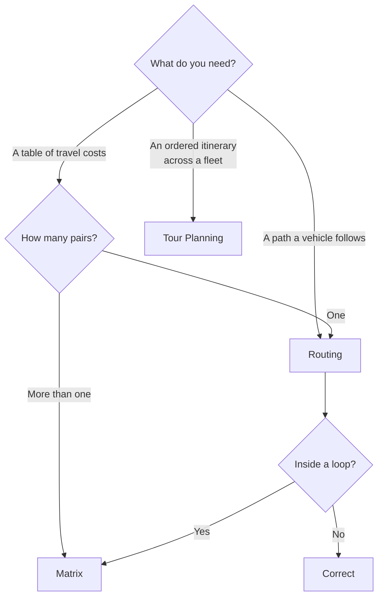

# HERE Routing vs Google Maps Routing

**Choose HERE when a vehicle's physical or legal characteristics must constrain the route beyond dimensions and gross weight.** Per-axle-group weight, the full ADR hazardous cargo set, toll cost for the described vehicle, and coverage outside the contiguous United States.

**Choose Google when you are moving passenger vehicles or people**, or when your commercial vehicle operation is US-domestic, always online, and does not need toll cost before dispatch.

Everything below is elaboration on those two sentences.

<Warning>
  **This page was substantially wrong before August 2026 and has been corrected.**

  Earlier revisions stated that Google Maps Platform had no commercial vehicle routing profile. On 17 August 2026 Google made Large Vehicle Routing generally available, and that statement stopped being true. If you are reading a comparison of these platforms written before that date — including our own — it is wrong on this point.
</Warning>

## Comparison scope

This page compares **routing engines**: path computation, travel-time estimation, matrices, and vehicle constraint handling.

It does not compare geocoding (see [HERE Geocoding vs Google Maps](/comparisons/here-geocoding-vs-google-maps)), map rendering, or platform-level ecosystem fit (see [HERE vs Google Maps](/comparisons/here-vs-google-maps)).

Google's routing capability is delivered through the Routes API, which supersedes the legacy Directions and Distance Matrix APIs. Where this page says "Google," it means Routes API unless stated otherwise.

<Warning>
  Google deprecated the Directions API and Distance Matrix API in favour of the Routes API, with a documented sunset timeline. If your evaluation is based on Directions API documentation, you are evaluating a product Google is retiring. Verify current status at [Google Maps Platform documentation](https://developers.google.com/maps/documentation/routes).
</Warning>

## Google Large Vehicle Routing: what it covers

Google Maps Platform made Large Vehicle Routing generally available on 17 August 2026, delivered through the Routes API, the Route Optimization API, and the Navigation SDK by route token.

**Expressible.** Total height, width, length, gross weight, axle count, and hazardous goods classification. The request requires `travelMode=TRUCK` with a `vehicleInfo` object inside `routeModifiers`, and `routingPreference=TRAFFIC_AWARE_OPTIMAL`.

**Documented as unsupported.** Truck toll prices. Speed limits. Routing for radioactive hazardous materials.

**Coverage.** The 48 contiguous United States only. No Alaska, Hawaii, Canada, or Mexico.

**Access.** Documented as generally available, but provisioned on request rather than enabled by default on every project.

**Compliance posture.** The response carries a flag indicating that route restrictions were partially ignored, and the documentation states that drivers must not rely solely on the returned route to be safe or legal.

<Info>
  Verified August 2026 against Google's [large vehicle routing overview](https://developers.google.com/maps/documentation/routes/lvr). Capabilities change. Check the current reference before architecting, and confirm your project is provisioned before planning a sprint around it.
</Info>

## Decision summary

| Requirement                                                | Better fit          | Why                                                                                       |
| ---------------------------------------------------------- | ------------------- | ----------------------------------------------------------------------------------------- |
| Truck routing, US domestic, dimensions and gross weight    | Comparable          | Google Large Vehicle Routing expresses these since August 2026                            |
| Truck routing outside the contiguous United States         | HERE                | Google LVR covers the 48 contiguous states only                                           |
| Per-axle-group weight expression                           | HERE                | `weightPerAxleGroup` with single, tandem, triple, quad, quint. Verify Google's equivalent |
| Toll cost for a described commercial vehicle               | HERE                | Google documents truck toll prices as unsupported                                         |
| Posted speed limits returned with the route                | HERE                | Google documents speed limits as unsupported for LVR                                      |
| Radioactive hazardous cargo                                | HERE                | Google documents radioactive materials routing as unsupported                             |
| ADR tunnel category                                        | HERE                | `tunnelCategory` B/C/D/E is a native parameter                                             |
| Passenger car navigation                                   | Comparable          | Both produce excellent car routes; test on your corridors                                 |
| Consumer ride-hailing / delivery of people                 | Google              | Ecosystem, traffic density, and familiarity                                               |
| Large origin-destination matrices                          | HERE                | Asynchronous Region and Profile modes reach far larger sizes — *with conditions, see below* |
| Multi-stop optimization with constraints                   | HERE                | Tour Planning is a VRP solver, included in the HERE Base Plan                              |
| GPS trace to road segments                                 | HERE                | Route Matching. Google has no equivalent product                                          |
| Hours of service coupling                                  | Neither             | Both require an external HOS layer                                                        |
| EV routing with charge state                               | Both, differently   | HERE exposes consumption models and charging as routing outputs; LVR does not cover EV     |
| Ecosystem, hiring, Stack Overflow depth                    | Google              | Materially larger developer population                                                    |
| Contractual price stability                                | Depends on contract | Neither is inherently stable; this is a commercial term                                   |

## Where HERE is stronger

### The tail of the commercial vehicle constraint set

The gap is no longer about whether a truck profile exists. It is about how much of your vehicle the profile can describe.

HERE Routing v8 accepts, as first-class inputs, a vehicle description that includes:

* Physical dimensions — `height`, `width`, `length`, `trailerLength` (all in centimetres)
* Weight — `grossWeight`, `currentWeight`, `emptyWeight`, `payloadCapacity` (kilograms)
* Axle configuration — `axleCount`, `weightPerAxle`, and `weightPerAxleGroup` with `single`, `tandem`, `triple`, `quad`, `quint` groups
* `tunnelCategory` — the ADR cargo tunnel restriction code, values `B`, `C`, `D`, `E`
* `shippedHazardousGoods` — a list drawn from `explosive`, `gas`, `flammable`, `combustible`, `organic`, `poison`, `radioactive`, `corrosive`, `poisonousInhalation`, `harmfulToWater`, `other`
* `kpraLength` — kingpin-to-rear-axle, relevant to California and Idaho restrictions
* `category: lightTruck` — a legal exemption that does not waive physical dimension limits
* `trailerCount`, `tiresCount`, `licensePlate` for environmental-zone evaluation

<Info>
  Verified against the [HERE Matrix Routing v8 OpenAPI specification](https://matrix.router.hereapi.com/v8/openapi), version 8.47.0, retrieved July 2026. The `truck` object is marked deprecated in favour of `vehicle`; both currently accept the same fields. Check the current specification before implementing.
</Info>

Google's documented vehicle parameters cover total dimensions, gross weight, axle count, and hazardous goods classes. **Verify directly against Google's large vehicle routing reference whether per-axle-group weight can be expressed at all.** We will not assert its absence from field names alone.

<Warning>
  **The gap is jurisdictional and cargo-specific, not absolute.**

  A 4.1 m trailer under a 3.4 m clearance in Ohio is handled by both platforms. The same trailer entering Ontario is handled by one. A five-axle tractor-trailer whose legality is set by the US federal bridge formula — written per axle *group*, not per axle — is handled by whichever platform can express the group.

  Two questions settle the platform choice before any benchmark: **does your operation leave the contiguous 48, and does your jurisdiction regulate by axle group.** Either answer decides it on its own.
</Warning>

### Toll cost for the described vehicle

HERE returns expected toll cost computed against the vehicle you described — class, axle count, dimensions, weight. Google documents truck toll prices as unsupported for large vehicle routing.

<Info>
  This is not a reporting feature. On a single lane, the toll figure differs materially depending on whether the vehicle profile was supplied — a passenger-class estimate and a commercial one are different numbers for the same road.

  If your dispatcher prices a load before the truck moves, the toll figure is the quote. See [Toll Cost](/guides/toll-cost).
</Info>

### Route Matching

HERE offers map matching: taking a noisy GPS trace and returning the road segments actually travelled, with their attributes.

This is what IFTA jurisdiction-mile reporting and defensible speed compliance require. Google Maps Platform has no equivalent product. Nearest-address reverse geocoding does not substitute — it returns an address, not a segment, and it will not survive an audit.

See [Route Matching](/guides/route-matching) and [ELD Platform](/use-cases/eld-platform).

### Tour Planning

HERE Tour Planning is a Vehicle Routing Problem solver: capacitated VRP, time windows, multi-depot, heterogeneous fleets, pickup-and-delivery, priorities, and reloads.

<Info>
  HERE documents Tour Planning as included in the HERE Base Plan. Confirm your own entitlement; Base Plan inclusion and your contract's inclusion are separate facts. Source: [HERE Tour Planning introduction](https://docs.here.com/tour-planning/docs/introduction-tour-planning).
</Info>

Google's Route Optimization API now accepts large vehicle profiles, which narrows this. Compare the two on your own problem shape rather than on product names: the question is whether the solver assigns jobs across a fleet under capacity, time windows, and skill constraints, and how it reports the jobs it could not assign.

### Coverage outside the contiguous United States

HERE carries commercial road attributes in more than 200 countries. Google Large Vehicle Routing stops at the contiguous 48.

For a carrier running US–Canada or US–Mexico lanes, this is not a feature comparison. It is a coverage boundary that ends the evaluation.

## Where Google is stronger

### Passenger vehicle traffic and ETA

Google's traffic data derives from an enormous consumer device population. For dense urban passenger-car routing, this is a real advantage and it is honest to say so.

Large Vehicle Routing extends this with truck-observed speed data in the US, which is a genuine improvement over applying car speeds to a truck profile.

**Whether it is an advantage on your corridors, at your departure times, is an empirical question.** We give a test plan below. Do not accept either vendor's claim, including ours.

### Ecosystem

More engineers have shipped Google Maps integrations. More Stack Overflow answers exist. More libraries assume it. Hiring is easier.

This is a real cost that appears in your engineering budget, not on a rate card.

### Driver-facing familiarity

If your drivers already navigate with Google Maps, the adoption cost of a Google-rendered in-cab experience is close to zero. Driver adoption is a real project risk and it does not appear in any API comparison.

### Consumer-facing everything

If your product is consumer navigation, ride-hailing, or anything where users recognize the map's appearance and expect Street View, Google is the default and the default is correct.

### Simplicity at low volume

Below roughly ten thousand routing calls per month, both platforms are effectively free and Google's onboarding is faster. Migration engineering cost dominates any saving. Do something else.

## Where the difference is commercial, not technical

### Matrix size limits

Matrix ceilings are frequently quoted as a single number. There isn't one.

The limits, from the [Matrix Routing v8 OpenAPI specification](https://matrix.router.hereapi.com/v8/openapi) (v8.47.0, retrieved July 2026):

| Mode                                                          | Sync limit                    | Async limit     | Live traffic & custom options | Region constraint   |
| ------------------------------------------------------------- | ----------------------------- | --------------- | ----------------------------- | ------------------- |
| **Flexible** (`regionDefinition: world`)                      | 15×100 or 100×1               | 15×100 or 100×1 | Yes                           | Unlimited           |
| **Region** (`circle`, `boundingBox`, `polygon`, `autoCircle`) | 500×500                       | 10,000×10,000   | Yes                           | Max 400 km diameter |
| **Profile** (`world` + `profile`)                             | 500×500, or 1×2000, or 2000×1 | 10,000×10,000   | **No**                        | Unlimited           |

<Warning>
  Read that table before you architect. A truck-constrained matrix with live traffic and custom avoidances runs in **Flexible** mode and caps at **15 × 100**. The 10,000 × 10,000 ceiling requires either a bounded region under 400 km diameter, or Profile mode — which disables custom options and live traffic entirely.

  **"HERE supports 10,000 × 10,000 matrices" is true and misleading.** It is not true for the configuration a fleet dispatcher needs.
</Warning>

Additional documented constraints: request body maximum 10 MiB uncompressed; a maximum of 100 waypoints matched to any single road segment across origins and destinations combined; when only `origins` is supplied it is reused as `destinations`, capping origins at 50 in that case.

Google's `computeRouteMatrix` accepts large vehicle profiles and imposes its own element limits, which vary by endpoint and tier. **Verify current limits directly** at [Google's Routes API documentation](https://developers.google.com/maps/documentation/routes) rather than from any comparison table, including this one.

The architecturally useful statement is directional: HERE's Region and Profile async modes reach matrix sizes at which looping point-to-point routing is not merely expensive but infeasible. Whether that helps you depends on whether your workload tolerates a bounded region or the loss of live traffic.

### Pricing

<Warning>
  We will not publish a savings percentage.

  Cost outcome depends on your API mix, monthly volume, region, contract terms, billing SKU, whether you batch, and whether you cache. Those variables span more than an order of magnitude. A single percentage claiming to summarize them is not a comparison.
</Warning>

What can be said structurally:

* Both platforms bill per request for routing.
* Both have volume tiers and free bundles. Bundles are per-API and do not pool.
* **On HERE, a truck route is a routing request.** It draws from the same free allowance and the same rate as a car route. The vehicle profile does not move it to a different meter.
* **On Google, large vehicle routing requires `routingPreference=TRAFFIC_AWARE_OPTIMAL`,** which bills above the Compute Routes Essentials rate. Confirm the exact SKU your traffic will land on before modelling it.
* HERE offers an **asset-based** commercial model in addition to call-volume, priced per tracked vehicle rather than per call. Availability depends on contract tier — confirm before it becomes load-bearing.
* Google has repriced Maps Platform more than once since 2018. Whether HERE pricing through a partner is contractually more stable is a term in your contract, not a property of the platform.

For current Google rates see [Google Maps Platform pricing](https://developers.google.com/maps/billing-and-pricing/pricing). For HERE rates via Placematic, the [pricing calculator](https://placematic.com/here-location-services/here-pricing/) produces a range.

For the honest cost method, see [Reducing Google Maps Costs](/use-cases/reducing-google-maps-costs).

## Request and billing architecture

The single largest cost determinant is not the rate. It is whether you chose the right primitive.

```mermaid theme={null}
flowchart TD
    Q{What do you need?}
    Q -->|A path a vehicle follows| R[Routing]
    Q -->|A table of travel costs| M{How many pairs?}
    Q -->|An ordered itinerary<br/>across a fleet| T[Tour Planning]
    M -->|One| R
    M -->|More than one| MX[Matrix]
    R --> L{Inside a loop?}
    L -->|Yes| MX
    L -->|No| OK[Correct]
```

An n×m cost table is n·m routing calls, or one matrix call. That is a complexity difference. It is not closed by any vendor's rate card, and it applies identically on Google.

See [Routing vs Matrix](/architecture/choosing-routing-vs-matrix).

## Migration mapping

| Google                                                       | HERE                                             | Notes                                                              |
| ------------------------------------------------------------ | ------------------------------------------------ | ------------------------------------------------------------------ |
| Routes API `computeRoutes`                                   | Routing v8 `/v8/routes`                          | HERE takes `origin=lat,lng`; coordinate order differs from GeoJSON |
| Routes API `computeRouteMatrix`                              | Matrix Routing v8 `POST /v8/matrix`              | HERE returns **flat row-major arrays**, not nested objects         |
| `travelMode=TRUCK` + `routeModifiers.vehicleInfo`            | `transportMode=truck` + `vehicle[...]`           | **Units differ. Verify both.** See warning below                    |
| `routingPreference=TRAFFIC_AWARE_OPTIMAL`                    | `departureTime`                                  | HERE's `departureTime: any` disables traffic awareness entirely     |
| Hazardous goods classification                               | `shippedHazardousGoods` (11 values)              | Different taxonomies. Re-map deliberately and have it reviewed      |
| Route Optimization API                                       | Tour Planning                                    | Compare on your problem shape, not on product names                 |
| —                                                            | `weightPerAxleGroup`                             | Verify Google equivalent before assuming absence                    |
| —                                                            | `tunnelCategory` (ADR B/C/D/E)                   | No documented Google equivalent                                     |
| —                                                            | Toll Cost                                        | Google documents truck toll prices as unsupported                   |
| —                                                            | Route Matching                                   | No Google equivalent                                                |

<Warning>
  **Units are the most likely migration defect in either direction.**

  HERE expresses vehicle height in **centimetres** — `height=410` for a 4.1 m vehicle. Google's large vehicle field names indicate **millimetres** — `totalHeightMm`.

  Get the conversion wrong by a factor of ten and you have declared either a 41-metre vehicle that routes nowhere, or a 41-centimetre vehicle that routes everywhere. The second case returns `200`, produces plausible routes, and passes review.

  Convert units at each adapter, never in the shared interface. Assert the converted value in a test, not the input.
</Warning>

**Semantic differences that will bite you:**

**`200` is not success.** HERE returns HTTP `200` with an empty `routes` array and a `notice` containing `routeCalculationFailed` when no path exists. Checking `resp.ok` swallows the failure.

**Both platforms can return a route that violates a constraint, and both tell you.** HERE returns per-cell `errorCodes` in matrix responses, including `3` — route found but violates a restriction. Google flags routes where restrictions were partially ignored. **Read both.** A route returned with a violation flag is not a route.

**Matrix results are flat and row-major.** A 2×2 matrix returns `travelTimes: [73, 1231, 983, 400]`. Index as `travelTimes[origin * numDestinations + destination]`. Get it wrong and every travel time is plausible and every assignment is transposed. Nothing throws.

**`403` is not `401`.** `401` means the credential is wrong. `403` means the credential is valid and your account lacks entitlement for that product. Retrying `403` is permanently futile. On Google, an unprovisioned large vehicle routing project behaves the same way — it is an entitlement problem, not a code problem.

**Follow the `statusUrl` HERE returns.** HERE's specification explicitly warns that constructing the async status URL from the base host may resolve to a different region and return `404`, because of global load balancing.

See [Google Migration Architecture](/architecture/google-migration-architecture).

## Architecture implications

**Caching.** Both platforms benefit identically from caching route geometry (stable for hours) separately from ETAs (not stable). Neither is a differentiator.

**Batching.** HERE's matrix async mode is a job: submit, persist the `matrixId`, poll the returned `statusUrl`, retrieve. This is state your architecture must hold across a worker restart, or you resubmit and pay twice. Google's matrix is synchronous, which is simpler and imposes lower size ceilings.

**Vendor abstraction.** If you build a provider facade, **design its interface from the richer constraint set.** An interface derived from Google's large vehicle profile has a field for gross weight and axle count, but none for `weightPerAxleGroup` or `tunnelCategory`. When you add HERE, those constraints have nowhere to live and get dropped silently.

<Warning>
  This is the most common structural error in Google-to-HERE migrations, and Large Vehicle Routing has made it **harder to notice**, not easier.

  A facade built from an unconstrained Google interface was obviously incomplete — it had no vehicle at all. A facade built from Google's large vehicle profile looks complete. It has dimensions, weight, axles, hazmat. The two or three fields it cannot carry are exactly the ones that determine legality in the jurisdictions that regulate most tightly.
</Warning>

**Failover.** Falling back from HERE truck routing to Google Large Vehicle Routing is **more dangerous than falling back to unconstrained routing was.**

An unconstrained fallback produced obviously wrong routes — a truck sent under a low bridge fails visibly and immediately. A partially-constrained fallback produces plausible ones. If your vehicle's legality depends on axle-group weight, tunnel category, or a cargo class the fallback cannot express, the route looks correct, passes review, and is illegal.

Refuse to route rather than route with a degraded constraint set. Assert field-level parity in the facade, not merely that a provider responded.

## Cost model

What creates billable activity, on both platforms:

* One routing call per computed path
* One matrix call per submitted matrix (HERE), or per element batch (Google — verify current element accounting)
* Requesting turn-by-turn instructions when you consume only a duration
* Recomputing routes for unchanged origin, destination, and departure time
* Re-routing on every GPS ping to refresh an ETA

**Request multiplication risks:**

The loop is the risk. A store locator ranking eight candidates, a dispatcher assigning forty couriers, a territory system scoring eight hundred ZIP centroids — each of these is one matrix call and is routinely implemented as n routing calls.

**Total cost of ownership** includes the engineering time to express constraints your platform does not support, and the cost of the incidents caused by the ones you approximated. A team implementing axle-group bridge formula logic on top of a gross-weight scalar is paying salaries to badly reproduce a federal regulation.

## How to evaluate with your own data

Do not accept the tables above. Run this.

**Zero: confirm access.** Google documents Large Vehicle Routing as provisioned on request. Confirm your project is enabled before you plan the evaluation, not during it.

**Route set.** Take 500 trips your fleet actually drove, with telematics ground truth for actual driven distance and duration. Route each through both platforms.

**Compare against ground truth, not against each other.** Two wrong answers can agree.

**Report the residual distribution, not the mean.** A platform whose durations are unbiased on average but have twice the variance produces twice as many late deliveries.

**Truck constraint validation is a gate, not a metric.** Route a vehicle with `height: 410` (HERE) / `totalHeightMm: 4100` (Google) through:

* The 11foot8 bridge, Durham NC
* Storrow Drive, Boston MA
* The Southern State Parkway, Long Island NY

Any path returned is a failure on either platform. Run the same three in car mode as a control — all three must route, proving the test exercises the constraint rather than failing for an unrelated reason.

<Tip>
  **Watch the units, and watch the flags.** Send `4100` to HERE and you have declared a 41-metre vehicle. Send `410` to Google and you have declared a 41-centimetre one, which will route through all three traps and lead you to conclude — wrongly — that Google has no constraint handling.

  Also check the response for a restriction-violation flag on both platforms. A returned path with a violation flag is a failure, not a pass.
</Tip>

**Constraint tail.** Beyond the trap geometry, test the constraints your operation actually depends on: axle-group weight if you are regulated by it, tunnel category if you carry ADR cargo, and a cross-border lane if you run one. These are the tests that separate the platforms now. Dimension traps no longer do.

**Departure times.** Peak and off-peak, on the corridors you actually drive. A 3am matrix applied to a 5pm dispatch is fiction.

**Request mix.** Instrument your current per-endpoint call counts from logs. Not estimates. Then price the same counts on both platforms, after applying caching and batching to both — and confirm which Google SKU your traffic lands on, since large vehicle routing does not bill at the Essentials rate.

<Tip>
  Optimize on your current platform first — cache, batch, debounce, deduplicate — and re-measure. A meaningful share of teams find the bill halves without a vendor change. What remains is your real migration case, with a clean baseline.
</Tip>

## Common decision mistakes

**Assuming Google has no truck routing.** It has, since August 2026, in the 48 contiguous United States: dimensions, gross weight, axle count, hazmat classes. Any comparison written before that date — including earlier revisions of this page — is wrong on this point.

**Assuming the constraint sets are therefore equivalent.** Toll cost, speed limits, radioactive cargo, ADR tunnel category and non-US coverage are documented gaps. Per-axle-group weight requires verification.

**Evaluating Google LVR without checking provisioning.** Generally available is not the same as enabled on your project.

**Treating Google as a safe failover for truck routing.** A partially-constrained fallback fails silently. That is worse than a fallback that fails loudly.

**Passing millimetres where centimetres are expected, or the reverse.** A 41-centimetre truck routes anywhere and returns `200`.

**Ignoring the restriction-violation flag.** Both platforms will tell you the route breaks a constraint. Neither will stop you shipping it.

**Comparing per-1,000 rates.** Close at entry level. Meaningless without the SKU, the call mix, and the caching strategy.

**Treating matrix size as a single number.** It varies by mode, by sync/async, and by entitlement.

**Assuming truck routing is a parameter.** `transportMode=truck` selects an engine. It does not describe your vehicle. Omit dimensions and HERE routes an unconstrained vehicle with no warning.

**Designing the abstraction layer from the narrower constraint set.**

**Migrating before optimizing.** Moving waste to a cheaper meter.

**Migrating everything simultaneously.** Two changes, one incident, ambiguous cause.

**Validating cost but not route quality.** A cheaper wrong route is worse.

**Presenting savings without migration engineering cost.**

## Choose HERE when

* You route commercial vehicles outside the contiguous United States
* Your jurisdiction regulates by axle group
* You carry ADR-regulated or radioactive cargo
* You need toll cost for the described vehicle before dispatch
* You need defensible reconstruction of driven routes for compliance
* You need fleet-wide multi-stop optimization under capacity and time-window constraints
* You need very large matrices and can accept a bounded region or Profile mode
* Contractual price stability is a board-level concern *and you have negotiated it*

## Choose Google when

* Your vehicles are passenger cars
* Your commercial vehicle operation is US-domestic, always online, and does not need toll cost at dispatch
* Your product is consumer-facing and users recognize the map
* Driver familiarity with the Google Maps interface is a material adoption constraint
* Your volume is low enough that migration engineering exceeds the saving
* Ecosystem familiarity and hiring are material constraints
* You need Street View or comparable imagery

## Related documentation

<CardGroup cols={2}>
  <Card title="Truck Routing" href="/guides/truck-routing">
    Constraints, units, and the trap geometry that proves they apply.
  </Card>

  <Card title="Toll Cost" href="/guides/toll-cost">
    Why the toll figure depends on the vehicle profile, and what Google returns instead.
  </Card>

  <Card title="Matrix Routing" href="/guides/matrix-routing">
    Modes, async lifecycle, and the flat result array.
  </Card>

  <Card title="Google Migration Architecture" href="/architecture/google-migration-architecture">
    Dual-running, shadow comparison, rollback.
  </Card>
</CardGroup>

Also: [Migrating from Google Maps](/guides/google-migration) · [Reducing Google Maps Costs](/use-cases/reducing-google-maps-costs) · [Cost Optimization Patterns](/architecture/cost-optimization-patterns) · [HERE vs Google Maps](/comparisons/here-vs-google-maps)

## Sources

**HERE**

* [Routing API v8 developer guide](https://www.here.com/docs/bundle/routing-api-developer-guide-v8/page/get-started.html)
* [Matrix Routing v8 OpenAPI specification](https://matrix.router.hereapi.com/v8/openapi) — authoritative on modes and size limits
* [Transport modes](https://www.here.com/docs/bundle/routing-api-developer-guide-v8/page/topics/transport-modes.html)
* [Tour Planning introduction](https://docs.here.com/tour-planning/docs/introduction-tour-planning)

**Google**

* [Routes API documentation](https://developers.google.com/maps/documentation/routes)
* [Large vehicle routing overview](https://developers.google.com/maps/documentation/routes/lvr) — vehicle parameters, coverage, documented limitations
* [Maps Platform pricing](https://developers.google.com/maps/billing-and-pricing/pricing)

**Placematic**

* [Commercial comparison and pricing overview](https://placematic.com/compare/here-routing-vs-google-maps/)

*HERE specification details verified July 2026 against Matrix Routing v8.47.0. Google Large Vehicle Routing capabilities, coverage and documented limitations verified August 2026. Limits, deprecations and pricing change; verify against primary sources before architecting.*

***

Need to compare these platforms with your own request mix?

Placematic can help you run a technical and cost evaluation using representative routes, addresses and production volumes. Placematic is an official HERE Technologies reseller and implementation partner. [Cost Reduction Audit](https://placematic.com/here-location-services/cost-reduction-audit/).