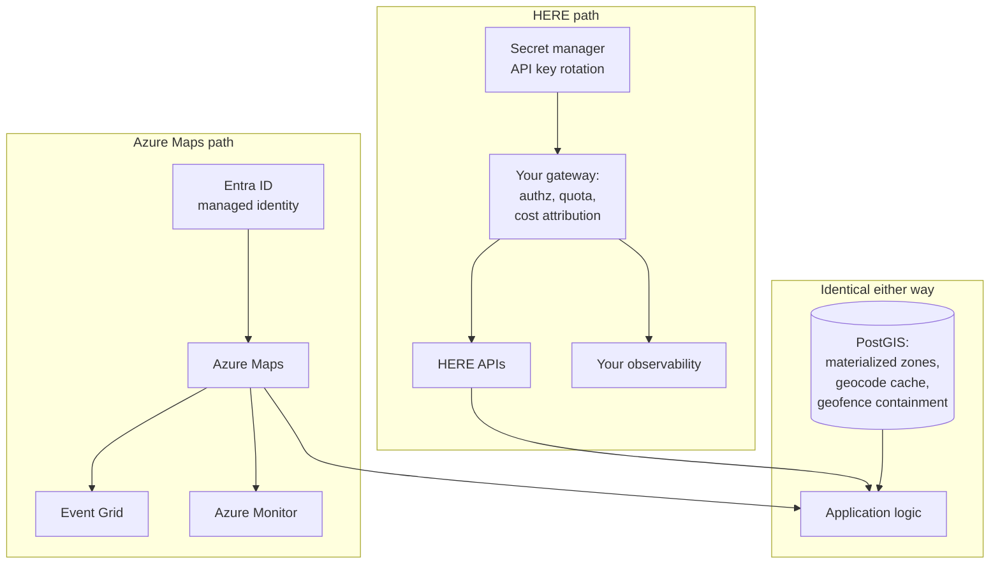

# HERE vs Azure Maps

Before comparing capabilities, one structural fact deserves stating.

**Microsoft and HERE have a long-standing commercial relationship, and Azure Maps has historically incorporated HERE data.** The precise scope of that relationship, and which services it currently covers, is a matter for Microsoft's and HERE's own documentation rather than ours.

<Warning>
Verify the current data provenance of Azure Maps against [Microsoft's documentation](https://learn.microsoft.com/en-us/azure/azure-maps/) before assuming either that it is HERE data or that it is not. This has changed over time and we will not characterize it from memory.
</Warning>

The practical consequence: this comparison is **less about map data quality** than most vendor comparisons, and **more about enterprise architecture, procurement, roadmap dependency, and who you have a relationship with.**

## Short verdict

**Choose Azure Maps when** your organization is deeply committed to Azure, when Entra ID and Azure RBAC governance is a requirement rather than a preference, when procurement through an existing Microsoft Enterprise Agreement removes months from your timeline, and when your location requirements are within its published capability set.

**Choose HERE directly when** you need capabilities Azure Maps does not expose — commercial vehicle constraint depth, fleet-scale VRP optimization, map matching for compliance — or when you need a direct relationship with the party responsible for the underlying data.

## Comparison scope

Azure Maps is a **cloud platform service**. HERE Location Services is a **location platform**. They overlap substantially and are not the same category.

This page covers routing, geocoding, maps, traffic, identity, procurement, and roadmap dependency. It does not attempt to enumerate every Azure Maps endpoint; verify against Microsoft's current documentation.

## Decision summary

| Requirement | Better fit | Why |
|---|---|---|
| Azure-native identity and RBAC | Azure Maps | Entra ID integration, managed identities, Azure Policy |
| Procurement through an existing Microsoft EA | Azure Maps | Often the decisive factor |
| Azure ecosystem integration | Azure Maps | Event Grid, Functions, Synapse, Fabric |
| Commercial vehicle constraint depth | HERE | Verify Azure Maps' current truck parameter set independently |
| Fleet-wide VRP optimization | HERE | Tour Planning solves capacity, time windows, priorities |
| GPS trace → road segments for compliance | HERE | Route Matching |
| Direct relationship with the data provider | HERE | You contract with the source |
| Roadmap and deprecation control | HERE | See below |
| Data residency within your Azure regions | Azure Maps | If that is a hard requirement |
| Support escalation path | Depends | Whose contract, whose SLA |

## Where Azure Maps is stronger

### Identity and governance

This is the genuine advantage and it is not small.

Azure Maps integrates with Microsoft Entra ID. That means managed identities instead of API keys, Azure RBAC for authorization, Azure Policy for compliance enforcement, and audit logging through the same pipeline as everything else in your subscription.

<Info>
For an organization whose security review requires that every service authenticate through Entra ID and every access decision be expressible in Azure RBAC, this is not a preference. It is the requirement, and no amount of routing capability offsets it.

Compare this to holding a static HERE API key in a secret manager, rotating it manually, and building your own per-tenant authorization layer.
</Info>

### Ecosystem integration

Event Grid for geofence events. Azure Functions for serverless processing. Synapse or Fabric for spatial analytics. Azure Monitor for observability, in the same pane as everything else.

If your data platform is Azure, the integration cost of an Azure-native location service is genuinely lower.

### Procurement

An existing Microsoft Enterprise Agreement can eliminate a vendor onboarding process, a security review, a legal review, and a procurement cycle.

<Warning>
**This is often the decisive factor and it is rarely written down.** An architecture that is 15% better on API capability and requires six months of vendor onboarding loses to one that is available on Tuesday under an existing contract.

Say this out loud in the design review. It is a legitimate reason.
</Warning>

### Data residency

Azure Maps runs in Azure regions. If your compliance regime requires processing within a specific geography and you have already solved that for Azure, you have solved it for Azure Maps.

## Where HERE is stronger

### Commercial vehicle routing depth

HERE Routing v8 exposes vehicle height, width, length, gross weight, current weight, weight per axle, weight per **axle group** (single, tandem, triple, quad, quint), axle count, trailer count, ADR tunnel category, eleven hazardous cargo types, and KPRA length for California and Idaho restrictions.

<Info>
Verified against the [HERE Matrix Routing v8 OpenAPI specification](https://matrix.router.hereapi.com/v8/openapi), v8.47.0, July 2026.
</Info>

Azure Maps offers truck routing parameters. **Compare its current parameter set directly** against [Microsoft's routing documentation](https://learn.microsoft.com/en-us/azure/azure-maps/) rather than accepting any comparison table, including this one.

The question to ask is specific: *can it express weight per axle group?* If your jurisdiction regulates by axle group and the API cannot express it, the API cannot route your vehicle legally, regardless of how many other truck parameters it has.

### Fleet-scale optimization

HERE Tour Planning is a Vehicle Routing Problem solver: capacitated VRP, time windows, multi-depot, heterogeneous fleets, priorities, pickup-and-delivery, reloads.

Verify whether Azure Maps exposes an equivalent solver. Waypoint optimization within a single route is a different problem — it orders stops for one vehicle rather than assigning stops across a fleet under constraints.

### Map matching for compliance

Route Matching returns the road segments a vehicle actually travelled, with attributes, which is what IFTA jurisdiction miles and speed compliance require.

### Direct relationship with the data provider

If Azure Maps incorporates HERE data, then a routing defect traced to map data has an escalation path through Microsoft to HERE. Contracting with HERE directly — or through a Gold Partner — shortens that path.

Whether this matters depends on whether a wrong route is an inconvenience or a bridge strike.

## Roadmap dependency

This is the risk that does not appear on a feature matrix.

**A cloud provider's location service is a product in a portfolio.** Its roadmap is set by priorities you do not see, and its lifecycle is governed by that provider's deprecation policy.

Location is HERE's entire business. It is one service among hundreds for a hyperscaler.

<Warning>
Read the current lifecycle and deprecation policy for Azure Maps and for each of its constituent APIs before committing. Cloud services get retired, versioned, and repositioned. A location platform whose vendor's core business is location has different incentives from one whose vendor's core business is compute.

This is not a criticism of Microsoft. It is a structural observation, and it applies equally to any hyperscaler location service.
</Warning>

Verify at [Microsoft's Azure Maps documentation](https://learn.microsoft.com/en-us/azure/azure-maps/) and their product lifecycle pages.

## Architecture implications

The choice changes your identity model, your observability, and your procurement path. It changes your spatial architecture very little.

**Notice the bottom box.** Materialized delivery zones, cached geocodes, and geofence containment are yours regardless of vendor, and they are most of what a location system does. See [Cost Optimization Patterns](/architecture/cost-optimization-patterns).

**With Azure Maps** you inherit Entra ID authentication and Azure Monitor observability. You save building a gateway for authorization.

**With HERE** you build the gateway anyway — for per-tenant quota, cost attribution, and priority queuing. Which you need in a multi-tenant platform regardless. See [Multi-Tenant Location Platform](/architecture/multi-tenant-location-platform).

<Info>
If you are building a multi-tenant SaaS product, you will build the gateway either way. The Entra ID advantage shrinks. If you are building an internal enterprise application, the gateway is pure overhead you avoid with Azure Maps.

That distinction predicts the right answer more reliably than any API comparison.
</Info>

## Cost model

**Azure Maps** bills through your Azure subscription, against your existing commitment, potentially drawing down committed spend you have already agreed to. That is a real financial advantage that has nothing to do with rate cards.

**HERE** bills separately. Through a Gold Partner, one contract and one invoice.

<Warning>
We will not publish a cost comparison. It depends on your Azure commitment, your discount tier, your API mix, and your volume. An organization with unspent Azure commitment faces a different marginal cost than one without.

Model both against your actual instrumented call counts.
</Warning>

Current pricing: [Azure Maps pricing](https://azure.microsoft.com/pricing/details/azure-maps/) · [Placematic HERE pricing](https://placematic.com/here-location-services/here-pricing/).

**Total cost of ownership** for Azure Maps includes lower integration cost if you are already Azure-native. For HERE it includes a gateway you may need to build regardless.

## Migration considerations

**Both directions are moderate.** Response schemas differ. Coordinate ordering must be checked at every adapter. Neither is a rewrite of your spatial core, because your spatial core should be PostGIS.

**Feature gaps are the real migration risk.** If you migrate from HERE to Azure Maps and lose weight-per-axle-group expression, you have not migrated. You have shipped a system that produces illegal routes.

**Build a provider facade, designed around the richer constraint set.**

<Warning>
An interface derived from the weaker platform has no field for the constraint the stronger one expresses. When you add it back, the constraint has nowhere to live and gets silently dropped.
</Warning>

**Dual-run and compare against ground truth.** See [Google Migration Architecture](/architecture/google-migration-architecture) — the methodology is vendor-agnostic.

## How to evaluate with your own data

**Answer the procurement question first.** If an existing Microsoft EA removes six months from your timeline and Azure Maps meets your requirements, the technical comparison may be academic. Establish this before you spend engineering time.

**Then test the capability gate.** Take the constraint your business genuinely requires — for many fleet operators, weight per axle group — and verify each platform expresses it. This is a yes/no question and it takes an hour.

**Truck constraint gate.** Route a 410 cm vehicle through the 11foot8 bridge (Durham NC), Storrow Drive (Boston), and the Southern State Parkway (Long Island). Any path returned is a failure. Run the same three in car mode as a control.

**Routing quality.** 500 real historical trips through both, compared against telematics ground truth. Report residual distributions.

**Identity.** Prototype the auth flow. If Entra ID integration removes a security review, that is a measurable saving.

**Roadmap.** Read the deprecation policy for every API you plan to depend on. For both vendors.

## Common decision mistakes

**Comparing API features while ignoring procurement.** Procurement usually wins, and it should be acknowledged rather than reverse-engineered into a technical justification.

**Assuming Azure Maps data is or is not HERE data.** Verify. The relationship has changed over time.

**Assuming a hyperscaler location service has a hyperscaler's roadmap commitment.** Read the lifecycle policy.

**Designing the abstraction layer from the weaker constraint set.**

**Migrating away from a platform that expresses a constraint you legally require.**

**Ignoring the gateway you will build anyway** in a multi-tenant product, which shrinks the Entra ID advantage.

**Treating identity integration as a nice-to-have** when your security review treats it as a gate.

**Assuming unspent Azure commitment is free money.** It is committed spend. It is also real.

## Choose Azure Maps when

- Entra ID and Azure RBAC governance is a requirement
- Procurement through an existing Microsoft EA materially accelerates delivery
- Your data platform is Azure and integration cost matters
- Data residency within your Azure regions is a hard requirement
- Your location requirements sit comfortably within its published capability set
- You are building an internal enterprise application, not a multi-tenant SaaS product

## Choose HERE when

- You need commercial vehicle constraint depth that Azure Maps does not express
- You need fleet-wide VRP optimization
- Compliance requires defensible map matching
- You want a direct relationship with the party responsible for the map data
- Roadmap stability for a location-specific platform matters to a multi-year build
- You are building the gateway regardless, so the identity advantage is smaller than it appears

## Related documentation

<CardGroup cols={2}>
  <Card title="Multi-Tenant Location Platform" href="/architecture/multi-tenant-location-platform">
    The gateway you build regardless, and why it shrinks the Entra ID advantage.
  </Card>
  <Card title="Truck Routing" href="/guides/truck-routing">
    The constraint set to test both platforms against.
  </Card>
  <Card title="Cost Optimization Patterns" href="/architecture/cost-optimization-patterns">
    Most of what a location system does never touches a location API.
  </Card>
  <Card title="Authentication" href="/start-here/authentication">
    API keys, rotation, and what you build when identity is not federated.
  </Card>
</CardGroup>

Also: [Tour Planning](/guides/tour-planning) · [Route Matching](/guides/route-matching) · [HERE vs Google Maps](/comparisons/here-vs-google-maps)

## Sources

**Microsoft**
- [Azure Maps documentation](https://learn.microsoft.com/en-us/azure/azure-maps/)
- [Azure Maps pricing](https://azure.microsoft.com/pricing/details/azure-maps/)

**HERE**
- [Routing API v8](https://www.here.com/docs/category/routing-api-v8)
- [Matrix Routing v8 OpenAPI specification](https://matrix.router.hereapi.com/v8/openapi)
- [Tour Planning](https://docs.here.com/tour-planning/docs/introduction-tour-planning)

**Placematic**
- [Commercial comparison overview](https://placematic.com/compare/here-vs-azure-maps/)

*Verified July 2026. Azure Maps capabilities, data provenance, pricing and lifecycle policy change. Verify against Microsoft's current documentation before architecting.*

---

Need to compare these platforms with your own request mix?

Placematic can help you run a technical and cost evaluation using representative routes, addresses and production volumes. Placematic is an official HERE Technologies reseller and implementation partner. [Cost Reduction Audit](https://placematic.com/here-location-services/cost-reduction-audit/).