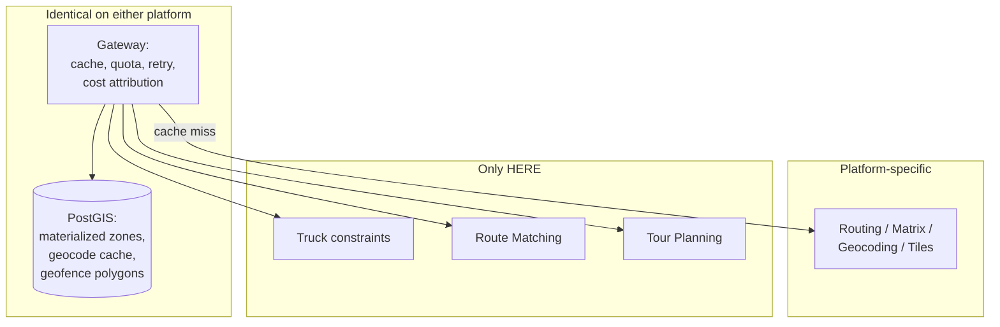

# HERE vs Google Maps

**Google Maps Platform is built for applications about places. HERE Location Services is built for systems about movement** — particularly the movement of commercial vehicles.

That sentence predicts most of the differences below.

## Short verdict

**Choose Google when** your users interact with the map, when place data is your product, or when ecosystem familiarity is a constraint you cannot afford to fight.

**Choose HERE when** your system makes operational decisions a professional acts on — dispatching a truck, assigning a technician, reconstructing a route for an auditor.

**Choose both when** you are doing both. Most B2B products with a consumer surface are, and pretending otherwise produces a worse product to satisfy a slide about vendor consolidation.

## Comparison scope

This is the platform-level page: overall fit, data, ecosystem, licensing, support, migration complexity.

It does not duplicate the detailed comparisons:
- [HERE Routing vs Google Maps](/comparisons/here-routing-vs-google-maps)
- [HERE Geocoding vs Google Maps](/comparisons/here-geocoding-vs-google-maps)

## Decision summary

| Requirement | Better fit | Why |
|---|---|---|
| Consumer place discovery | Google | Business database, hours, reviews, photos |
| Street View or comparable imagery | Google | HERE has no equivalent |
| Commercial vehicle routing | HERE | Physical and legal constraints are native inputs |
| Hazardous cargo routing | HERE | Cargo types and ADR tunnel category are parameters |
| GPS trace → road segments | HERE | Route Matching. No Google equivalent |
| Fleet-wide multi-stop optimization | HERE | Tour Planning is a VRP solver |
| Map styling depth | Both adequate | See [HERE vs Mapbox](/comparisons/here-vs-mapbox) if styling is the requirement |
| Address resolution at volume | Comparable | Test on your addresses |
| Mobile turn-by-turn with offline maps | Both, differently | HERE SDK offers offline; verify current Google capability |
| Ecosystem, hiring, community | Google | Materially larger developer population |
| Contractual price stability | A contract term | Not a platform property |

## Where HERE is stronger

### Commercial vehicle operations

Routing that respects vehicle height, gross weight, per-axle weight, axle groups, hazardous cargo type, and ADR tunnel category. Google Maps Platform does not expose these, and it does not expose the underlying road attributes either, so you cannot implement them yourself.

<Warning>
This is a capability gap, not a pricing gap. No amount of Google spend produces a route that respects a 3.4 m clearance for a 4.1 m trailer. If you dispatch commercial vehicles, this decides the platform.
</Warning>

### Compliance-grade route reconstruction

Route Matching returns the road segments a vehicle actually travelled, with attributes. IFTA jurisdiction miles and speed compliance against posted limits both require this. Reverse geocoding does not substitute; it returns an address, not a segment, and it will not survive an audit.

### Fleet optimization

Tour Planning solves the Vehicle Routing Problem: capacity, time windows, multi-depot, heterogeneous fleets, priorities, pickup-and-delivery. HERE documents it as included in the Base Plan. Google offers waypoint optimization within one route — a different problem.

### Transport-attributed map data

Weight restrictions, height limits, hazmat prohibitions, designated truck routes, and truck-relevant POIs are present in HERE's base data.

### Commercial model options

HERE offers an asset-based model — priced per tracked vehicle rather than per call — alongside call-volume pricing.

<Info>
A dispatcher who reroutes 200 trucks forty times a day is punished by call-volume pricing for operational diligence. Asset-based pricing may invert that. Availability depends on contract tier; confirm before it becomes load-bearing in a business case.
</Info>

## Where Google is stronger

### Place and business data

<Warning>
**For business names, hours, reviews, photos, and category coverage, Google's data is categorically better.**

Placematic sells HERE. We would rather you know this before a migration than after.
</Warning>

If your product's value is helping people find a restaurant, a clinic, or a shop, that surface belongs on Google.

### Consumer autocomplete

Ranking, aliasing, and typo tolerance built from consumer query volume HERE does not have.

### Street View

No HERE equivalent.

### Ecosystem

More engineers have shipped Google integrations. More Stack Overflow answers. More libraries assume it. Hiring is easier.

This is a real cost. It appears in your engineering budget rather than on a rate card, which is precisely why it gets omitted from comparisons.

### Traffic for passenger vehicles

Google's traffic derives from an enormous consumer device population. For dense urban car routing this is a genuine advantage.

**Whether it is an advantage on your corridors is empirical.** Test it.

### Simplicity at low volume

Below roughly ten thousand calls a month, both are effectively free and Google onboards faster.

## Where the difference is commercial or operational

### Pricing

<Warning>
We will not publish a savings percentage.

Cost outcome depends on API mix, monthly volume, region, contract terms, billing SKU, batching, and architecture. These span more than an order of magnitude. A single number claiming to summarize them is a slogan.
</Warning>

**The meters do not translate.** Google bills autocomplete on a session-token model where sessions are used. HERE bills per request. Google prices some products per element, HERE per transaction. **You cannot derive a HERE forecast from a Google invoice.**

Instrument per-endpoint call counts from your logs first. That is the only input that produces a defensible comparison.

Current rates: [Google Maps Platform pricing](https://developers.google.com/maps/billing-and-pricing/pricing) · [Placematic pricing](https://placematic.com/here-location-services/here-pricing/).

### Price stability

Google has repriced Maps Platform more than once since 2018. Whether HERE pricing is contractually more stable is a term in your contract, not a property of the platform. Negotiate it or do not claim it.

### Caching and storage terms

Both vendors restrict retention of geocoded coordinates, and the restrictions differ by platform, plan, and time. **Get your answer in writing.** A geocode cache is the largest single cost lever available, and its permissibility is a contract term.

### Support

HERE licensed through a Gold Partner means one contract, one invoice, and one accountable party for the integration — not merely for the API being up. Whether that matters depends on whether a wrong route is an inconvenience or a bridge strike.

## Technical comparison

### Maps and rendering

Both serve vector and raster tiles. Both work with standard web mapping libraries; if you already render with Leaflet, OpenLayers, or MapLibre GL, integration with HERE tiles is largely a tile URL swap. If you are on the Google Maps JS SDK, the rendering layer is a rewrite.

<Warning>
Tile aesthetics differ visibly. Show your designers both before you commit. This is a product review that happens either before the migration or after it.
</Warning>

HERE offers transport-specific layers — weight and height restrictions — that Google does not.

**Web tile access and mobile SDK access are separate entitlements on HERE.** Discovering this at app store submission is expensive.

### Mobile SDKs

HERE SDK offers on-device turn-by-turn, offline maps, and on-device recalculation. Verify Google's current offline capability against [their documentation](https://developers.google.com/maps/documentation) rather than assumption.

<Warning>
The most dangerous pattern in mobile fleet software: server-side truck routing with constraints, device-side recalculation without them. The driver deviates, the phone reroutes, and the constraint set never reached the app.

Push vehicle profiles to the device. Test the recalculation path.
</Warning>

### Positioning

HERE offers hybrid positioning — Wi-Fi, cellular, GNSS fusion — for environments where GPS fails. Most outdoor road-vehicle fleets do not need it and should not buy it.

## Architecture implications

The platform choice changes less than most teams expect, because most of what a location system does should never touch a location API.

**Materialized delivery zones, cached geocodes, geofence containment, and lane-distance tables are yours regardless.** If you have not built them, your API bill is not evidence that you need a different vendor. See [Cost Optimization Patterns](/architecture/cost-optimization-patterns).

**Vendor abstraction:**

<Warning>
If you build a provider facade, **design its interface from HERE's capability set, not Google's.** An interface derived from Google has no field for vehicle height. When you add HERE later, the constraint has nowhere to live and gets dropped silently.

This is the most common structural error in Google-to-HERE migrations.
</Warning>

**Failover.** Falling back from constrained HERE truck routing to unconstrained Google routing is worse than failing. It produces an undrivable route in a system that believes it degraded gracefully. Refuse to route instead.

## Migration complexity

By surface, roughly ascending:

| Surface | Complexity | Notes |
|---|---|---|
| Batch geocoding | Low | Smallest blast radius, often largest saving. Start here |
| Telematics reverse geocoding | Low | Backend, high volume, no UI |
| Matrix operations | Medium | Flat row-major arrays. Async job lifecycle |
| Routing | Medium–high | Quality validation required, not just cost |
| Autocomplete | Medium | User-facing. Be honest about quality |
| Rendering | High | Most visible. Tile aesthetics differ. Migrate last |
| Mobile SDK | High | Separate entitlement. Binary size. Offline strategy |

Migrate one surface. Stabilize. Then the next.

<Warning>
Never migrate two simultaneously. Two independent changes, one production incident, ambiguous root cause. You will spend more on the investigation than you saved that month.
</Warning>

See [Google Migration Architecture](/architecture/google-migration-architecture) for dual-running and rollback mechanics.

## Cost model

**What creates billable activity, on both:**

- Recomputing routes for unchanged inputs
- Building cost tables with loops instead of matrix calls
- Reverse-geocoding GPS packets rather than detected stops
- Undebounced autocomplete
- Re-geocoding stable customer addresses
- Requesting turn-by-turn instructions when you consume a duration
- Tiles without a CDN

**Every one of those is platform-independent.** Fix them before you evaluate.

<Tip>
Optimize on your current platform first — cache, batch, debounce, deduplicate — and re-measure. A meaningful share of teams find the bill halves without a vendor change.

What remains is your real migration case, and now you have a clean baseline. See [Reducing Google Maps Costs](/use-cases/reducing-google-maps-costs).
</Tip>

**Total cost of ownership** includes the engineering time to approximate capabilities your platform does not have. A team implementing truck restriction logic on top of an unconstrained routing API is paying salaries to badly reproduce a product feature.

## How to evaluate with your own data

**Instrument first.** Per-endpoint call counts from logs. Not estimates.

**Optimize on the incumbent.** Cache, batch, debounce. Re-measure. Present that saving before proposing a migration.

**Routing quality:** 500 real historical trips through both platforms, compared against telematics ground truth — not against each other. Report residual distributions, not means.

**Truck constraint gate.** Route a 4.1 m vehicle through the 11foot8 bridge (Durham NC), Storrow Drive (Boston), and the Southern State Parkway (Long Island). Any path returned is a failure. Run the same three in car mode as a control.

**Geocoding:** 1,000 of your own addresses, including rural, apartment, and previously-failed cases. Measure match rate, rooftop fraction, positional error distribution, and confidence calibration separately.

**Rendering:** show your designers both, at your zoom levels, with your data overlaid.

**Cost:** price your instrumented call counts on both, after applying caching and batching to both.

## Common decision mistakes

**Comparing rate cards.** Close at entry level. Determined by call mix, tier, batching, and caching.

**Deriving a HERE forecast from a Google invoice.** The meters do not translate.

**Migrating before optimizing.** Moving waste to a cheaper meter.

**Migrating everything at once.**

**Designing the abstraction layer from Google's capabilities.**

**Validating cost but not quality.** A cheaper wrong route is worse.

**Assuming HERE POI data satisfies a consumer search feature.** It does not.

**Treating tile styling as cosmetic.** It is, until the product review.

**Presenting savings without migration engineering cost.** Your CFO will ask.

**Failing over truck routing to an unconstrained provider.**

**Forcing vendor consolidation.** A hybrid is a decision, not an admission.

## Choose Google when

- Consumer place discovery is your product
- Street View or comparable imagery is required
- Volume is low enough that migration engineering exceeds savings
- Ecosystem familiarity is a material constraint
- Your users recognize and expect the map

## Choose HERE when

- You route commercial vehicles
- You transport hazardous materials
- Compliance requires defensible route reconstruction
- You need fleet-wide multi-stop optimization under constraints
- You need transport-attributed map data
- Asset-based pricing fits your workload better than per-call

## Choose both when

- You have a consumer surface and an operational backend
- Google for place search and consumer autocomplete; HERE for routing, matrix operations, and batch geocoding

Document the split as a decision, in writing, before someone frames it as a failed migration.

## Related documentation

<CardGroup cols={2}>
  <Card title="HERE Routing vs Google Maps" href="/comparisons/here-routing-vs-google-maps">
    Vehicle constraints, matrix modes, and where Google's engine wins.
  </Card>
  <Card title="HERE Geocoding vs Google Maps" href="/comparisons/here-geocoding-vs-google-maps">
    Confidence scoring, batch architecture, and how to benchmark.
  </Card>
  <Card title="Google Migration Architecture" href="/architecture/google-migration-architecture">
    Dual-running, shadow comparison, rollback.
  </Card>
  <Card title="Cost Optimization Patterns" href="/architecture/cost-optimization-patterns">
    Why architecture moves the bill and rate cards do not.
  </Card>
</CardGroup>

Also: [Migrating from Google Maps](/guides/google-migration) · [Reducing Google Maps Costs](/use-cases/reducing-google-maps-costs) · [Choosing the Right HERE APIs](/start-here/choosing-the-right-here-apis)

## Sources

**HERE**
- [HERE Technologies documentation](https://www.here.com/docs)
- [Routing API v8](https://www.here.com/docs/category/routing-api-v8)
- [Geocoding & Search v7](https://docs.here.com/geocoding-and-search/docs/introduction-to-here-geocoding-search-api-v7)
- [Tour Planning](https://docs.here.com/tour-planning/docs/introduction-tour-planning)

**Google**
- [Maps Platform documentation](https://developers.google.com/maps/documentation)
- [Maps Platform pricing](https://developers.google.com/maps/billing-and-pricing/pricing)

**Placematic**
- [Commercial comparison and pricing overview](https://placematic.com/compare/)

*Verified July 2026. Capabilities and pricing change; verify against primary sources.*

---

Need to compare these platforms with your own request mix?

Placematic can help you run a technical and cost evaluation using representative routes, addresses and production volumes. Placematic is an official HERE Technologies reseller and implementation partner. [Cost Reduction Audit](https://placematic.com/here-location-services/cost-reduction-audit/).