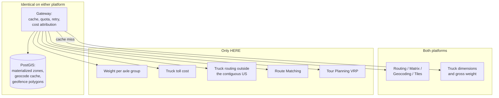

# HERE vs Google Maps

**Google Maps Platform is built for applications about places. HERE Location Services is built for systems about movement** — particularly the movement of commercial vehicles across jurisdictions.

That sentence predicts most of the differences below.

## Short verdict

**Choose Google when** your users interact with the map, when place data is your product, or when ecosystem familiarity is a constraint you cannot afford to fight.

**Choose HERE when** your system makes operational decisions a professional acts on — dispatching a truck across a state line, assigning a technician, reconstructing a route for an auditor.

**Choose both when** you are doing both. Most B2B products with a consumer surface are, and pretending otherwise produces a worse product to satisfy a slide about vendor consolidation.

<Info>
  **Updated August 2026.** Google Maps Platform added Large Vehicle Routing on 17 August 2026 — a commercial vehicle profile for the 48 contiguous United States. Earlier revisions of this page stated Google had no such capability. That statement is no longer true and has been corrected throughout.

  The platform-level verdict above did not change. The reasons behind it did.
</Info>

## Comparison scope

This is the platform-level page: overall fit, data, ecosystem, licensing, support, migration complexity.

It does not duplicate the detailed comparisons:

* [HERE Routing vs Google Maps](/comparisons/here-routing-vs-google-maps) — including the full Large Vehicle Routing constraint comparison
* [HERE Geocoding vs Google Maps](/comparisons/here-geocoding-vs-google-maps)

## Decision summary

| Requirement                                                    | Better fit        | Why                                                                             |
| --------------------------------------------------------------- | ----------------- | ------------------------------------------------------------------------------- |
| Consumer place discovery                                       | Google            | Business database, hours, reviews, photos                                       |
| Street View or comparable imagery                              | Google            | HERE has no equivalent                                                          |
| Commercial vehicle routing, US domestic, dimensions and weight | Comparable        | Google Large Vehicle Routing expresses these since August 2026                  |
| Commercial vehicle routing outside the contiguous US           | HERE              | Google LVR covers the 48 contiguous states only                                 |
| Toll cost for a described commercial vehicle                   | HERE              | Google documents truck toll prices as unsupported                               |
| Hazardous cargo routing                                        | HERE              | Full ADR set including radioactive; tunnel category is a parameter              |
| GPS trace → road segments                                      | HERE              | Route Matching. No Google equivalent                                            |
| Fleet-wide multi-stop optimization                             | HERE              | Tour Planning is a VRP solver; compare on problem shape, not product name       |
| Renderable transport restriction layers                        | HERE              | Restrictions as map attributes, not only as routing behaviour                   |
| Map styling depth                                              | Both adequate     | See [HERE vs Mapbox](/comparisons/here-vs-mapbox) if styling is the requirement |
| Address resolution at volume                                   | Comparable        | Test on your addresses                                                          |
| Mobile turn-by-turn with offline maps                          | HERE              | HERE SDK offers on-device offline. Google Navigation SDK supports large vehicle routes online, by route token |
| Ecosystem, hiring, community                                   | Google            | Materially larger developer population                                          |
| Contractual price stability                                    | A contract term   | Not a platform property                                                          |

## Where HERE is stronger

### Commercial vehicle operations

Routing that respects vehicle height, gross weight, per-axle weight, **axle groups**, hazardous cargo type, and ADR tunnel category.

Google Maps Platform exposed none of this until August 2026, when Large Vehicle Routing added height, width, length, gross weight, axle count and hazardous goods classification for the contiguous United States.

What separates the platforms now is the tail of the constraint set, not its existence: per-axle-group weight, the full ADR cargo set including radioactive materials, toll cost, posted speed limits, and coverage beyond the contiguous 48.

<Warning>
  **The gap is jurisdictional and cargo-specific, not absolute.**

  A 4.1 m trailer under a 3.4 m clearance in Ohio is handled by both platforms. The same trailer entering Ontario is handled by one. A five-axle tractor-trailer whose legality is set by the federal bridge formula — written per axle *group*, not per axle — is handled by whichever platform can express the group.

  Two questions settle the platform choice before any benchmark: **does your operation leave the contiguous 48, and does your jurisdiction regulate by axle group.**
</Warning>

### Toll cost for a described vehicle

HERE returns expected toll cost computed against the vehicle you described — class, axle count, dimensions, weight. Google documents truck toll prices as unsupported for large vehicle routing.

<Info>
  The figure is not a lookup. The same origin and destination returns a materially different toll depending on whether the vehicle profile was supplied — a passenger-class estimate and a commercial one are different numbers for the same road.

  If your dispatcher prices a load before the truck moves, this is not a reporting feature. It is the quote. See [Toll Cost](/guides/toll-cost).
</Info>

### Compliance-grade route reconstruction

Route Matching returns the road segments a vehicle actually travelled, with attributes. IFTA jurisdiction miles and speed compliance against posted limits both require this. Reverse geocoding does not substitute; it returns an address, not a segment, and it will not survive an audit.

Google has no equivalent product, and Large Vehicle Routing does not change this.

### Fleet optimization

Tour Planning solves the Vehicle Routing Problem: capacity, time windows, multi-depot, heterogeneous fleets, priorities, pickup-and-delivery. HERE documents it as included in the Base Plan.

Google's Route Optimization API now accepts large vehicle profiles, which narrows this gap. Compare the two on your own problem shape rather than on product names: does the solver assign jobs across a fleet under capacity, windows and skills, and how does it report the jobs it could not assign.

### Transport-attributed map data

Weight restrictions, height limits, hazmat prohibitions, designated truck routes, and truck-relevant POIs are present in HERE's base data and available as renderable layers.

Google applies equivalent restriction data inside Large Vehicle Routing in the contiguous US, but surfaces it as routing behaviour rather than as queryable map attributes or renderable restriction layers. **If your dispatcher needs to see the restriction on a map, not merely route around it, that difference is operational.**

### Coverage

HERE carries commercial road attributes in more than 200 countries. Google Large Vehicle Routing stops at the contiguous 48.

For a carrier running US–Canada or US–Mexico lanes, this is not a feature comparison. It is a coverage boundary that ends the evaluation.

### Commercial model options

HERE offers an asset-based model — priced per tracked vehicle rather than per call — alongside call-volume pricing.

<Info>
  A dispatcher who reroutes 200 trucks forty times a day is punished by call-volume pricing for operational diligence. Asset-based pricing may invert that. Availability depends on contract tier; confirm before it becomes load-bearing in a business case.
</Info>

## Where Google is stronger

### Place and business data

<Warning>
  **For business names, hours, reviews, photos, and category coverage, Google's data is categorically better.**

  Placematic sells HERE. We would rather you know this before a migration than after.
</Warning>

If your product's value is helping people find a restaurant, a clinic, or a shop, that surface belongs on Google.

### Consumer autocomplete

Ranking, aliasing, and typo tolerance built from consumer query volume HERE does not have.

### Street View

No HERE equivalent.

### Ecosystem

More engineers have shipped Google integrations. More Stack Overflow answers. More libraries assume it. Hiring is easier.

This is a real cost. It appears in your engineering budget rather than on a rate card, which is precisely why it gets omitted from comparisons.

### Traffic for passenger vehicles

Google's traffic derives from an enormous consumer device population. For dense urban car routing this is a genuine advantage. Large Vehicle Routing extends it with truck-observed speed data in the US, which is a real improvement over applying car speeds to a truck.

**Whether it is an advantage on your corridors is empirical.** Test it.

### Driver-facing familiarity

If your drivers already navigate with Google Maps, the adoption cost of a Google-rendered in-cab experience is close to zero. Driver adoption is a real project risk that no API comparison captures.

### Simplicity at low volume

Below roughly ten thousand calls a month, both are effectively free and Google onboards faster.

## Where the difference is commercial or operational

### Pricing

<Warning>
  We will not publish a savings percentage.

  Cost outcome depends on API mix, monthly volume, region, contract terms, billing SKU, batching, and architecture. These span more than an order of magnitude. A single number claiming to summarize them is a slogan.
</Warning>

**The meters do not translate.** Google bills autocomplete on a session-token model where sessions are used. HERE bills per request. Google prices some products per element, HERE per transaction. **You cannot derive a HERE forecast from a Google invoice.**

One structural difference worth naming: **on HERE, a truck route is a routing request** — same rate and same free allowance as a car route. **On Google, large vehicle routing requires the traffic-aware optimal preference,** which bills above the Compute Routes Essentials rate. Confirm which SKU your traffic lands on before modelling it.

Instrument per-endpoint call counts from your logs first. That is the only input that produces a defensible comparison.

Current rates: [Google Maps Platform pricing](https://developers.google.com/maps/billing-and-pricing/pricing) · [Placematic pricing](https://placematic.com/here-location-services/here-pricing/).

### Price stability

Google has repriced Maps Platform more than once since 2018. Whether HERE pricing is contractually more stable is a term in your contract, not a property of the platform. Negotiate it or do not claim it.

### Access and provisioning

HERE entitlements are per-product and confirmed against your contract; a valid key without the entitlement returns `403`.

Google documents Large Vehicle Routing as generally available but provisioned on request rather than enabled by default. **Generally available is not the same as enabled on your project.** Confirm before planning a sprint around it.

### Caching and storage terms

Both vendors restrict retention of geocoded coordinates, and the restrictions differ by platform, plan, and time. **Get your answer in writing.** A geocode cache is the largest single cost lever available, and its permissibility is a contract term.

### Support

HERE licensed through a Gold Partner means one contract, one invoice, and one accountable party for the integration — not merely for the API being up. Whether that matters depends on whether a wrong route is an inconvenience or a bridge strike.

## Technical comparison

### Maps and rendering

Both serve vector and raster tiles. Both work with standard web mapping libraries; if you already render with Leaflet, OpenLayers, or MapLibre GL, integration with HERE tiles is largely a tile URL swap. If you are on the Google Maps JS SDK, the rendering layer is a rewrite.

<Warning>
  Tile aesthetics differ visibly. Show your designers both before you commit. This is a product review that happens either before the migration or after it.
</Warning>

HERE offers transport-specific layers — weight and height restrictions — that Google does not expose as renderable map data, even where Large Vehicle Routing applies the same restrictions when computing a path.

**Web tile access and mobile SDK access are separate entitlements on HERE.** Discovering this at app store submission is expensive.

### Mobile SDKs

HERE SDK offers on-device turn-by-turn, offline maps, and on-device recalculation, including for truck profiles.

Google's Navigation SDK supports large vehicle routes via a route token issued by the Routes API, keeping the dispatcher's plan and the driver's guidance consistent. It operates online. Verify current offline capability against [their documentation](https://developers.google.com/maps/documentation) rather than assumption.

<Warning>
  The most dangerous pattern in mobile fleet software: server-side truck routing with constraints, device-side recalculation without them. The driver deviates, the phone reroutes, and the constraint set never reached the app.

  Push vehicle profiles to the device. Test the recalculation path — including what happens when the device loses connectivity mid-route.
</Warning>

### Positioning

HERE offers hybrid positioning — Wi-Fi, cellular, GNSS fusion — for environments where GPS fails. Most outdoor road-vehicle fleets do not need it and should not buy it.

## Architecture implications

The platform choice changes less than most teams expect, because most of what a location system does should never touch a location API.

```mermaid theme={null}
flowchart TB
    subgraph Yours["Identical on either platform"]
        PG[(PostGIS:<br/>materialized zones,<br/>geocode cache,<br/>geofence polygons)]
        GW[Gateway:<br/>cache, quota, retry,<br/>cost attribution]
    end

    subgraph Vendor["Both platforms"]
        API[Routing / Matrix /<br/>Geocoding / Tiles]
        TRUCK[Truck dimensions<br/>and gross weight]
    end

    subgraph Gap["Only HERE"]
        AXLE[Weight per axle group]
        TOLL[Truck toll cost]
        INTL[Truck routing outside<br/>the contiguous US]
        RM[Route Matching]
        TP[Tour Planning VRP]
    end

    GW --> PG
    GW -->|cache miss| API
    GW --> TRUCK
    GW --> AXLE
    GW --> TOLL
    GW --> INTL
    GW --> RM
    GW --> TP
```

**Materialized delivery zones, cached geocodes, geofence containment, and lane-distance tables are yours regardless.** If you have not built them, your API bill is not evidence that you need a different vendor. See [Cost Optimization Patterns](/architecture/cost-optimization-patterns).

**Vendor abstraction:**

<Warning>
  If you build a provider facade, **design its interface from the richer constraint set.**

  Large Vehicle Routing has made this error harder to notice, not easier. A facade built from an unconstrained Google interface was obviously incomplete — it had no vehicle at all. A facade built from Google's large vehicle profile looks complete: dimensions, weight, axles, hazmat. The two or three fields it cannot carry are exactly the ones that determine legality where regulation is tightest.

  This remains the most common structural error in Google-to-HERE migrations.
</Warning>

**Failover.** Falling back from HERE truck routing to Google Large Vehicle Routing is **more dangerous than falling back to unconstrained routing was.**

An unconstrained fallback produced obviously wrong routes — a truck sent under a low bridge fails visibly. A partially-constrained fallback produces plausible ones. If legality depends on axle-group weight, tunnel category, or a cargo class the fallback cannot express, the route looks correct, passes review, and is illegal.

Refuse to route rather than route with a degraded constraint set. Assert field-level parity in the facade, not merely that a provider responded.

## Migration complexity

By surface, roughly ascending:

| Surface                      | Complexity  | Notes                                                          |
| ---------------------------- | ----------- | -------------------------------------------------------------- |
| Batch geocoding              | Low         | Smallest blast radius, often largest saving. Start here        |
| Telematics reverse geocoding | Low         | Backend, high volume, no UI                                    |
| Matrix operations            | Medium      | Flat row-major arrays. Async job lifecycle                     |
| Routing (passenger)          | Medium–high | Quality validation required, not just cost                     |
| Routing (commercial vehicle) | Medium–high | Unit conversion and constraint-tail mapping. See warning below |
| Autocomplete                 | Medium      | User-facing. Be honest about quality                           |
| Rendering                    | High        | Most visible. Tile aesthetics differ. Migrate last             |
| Mobile SDK                   | High        | Separate entitlement. Binary size. Offline strategy            |

<Warning>
  **Commercial vehicle routing is a new migration surface as of August 2026, and it has a unit trap.**

  HERE expresses vehicle height in centimetres. Google's large vehicle field names indicate millimetres. A factor-of-ten error produces either a vehicle that routes nowhere, or a 41-centimetre vehicle that routes everywhere and returns `200`.

  Convert at each adapter, never in the shared interface. Assert the converted value in a test.
</Warning>

Migrate one surface. Stabilize. Then the next.

<Warning>
  Never migrate two simultaneously. Two independent changes, one production incident, ambiguous root cause. You will spend more on the investigation than you saved that month.
</Warning>

See [Google Migration Architecture](/architecture/google-migration-architecture) for dual-running and rollback mechanics.

## Cost model

**What creates billable activity, on both:**

* Recomputing routes for unchanged inputs
* Building cost tables with loops instead of matrix calls
* Reverse-geocoding GPS packets rather than detected stops
* Undebounced autocomplete
* Re-geocoding stable customer addresses
* Requesting turn-by-turn instructions when you consume a duration
* Tiles without a CDN

**Every one of those is platform-independent.** Fix them before you evaluate.

<Tip>
  Optimize on your current platform first — cache, batch, debounce, deduplicate — and re-measure. A meaningful share of teams find the bill halves without a vendor change.

  What remains is your real migration case, and now you have a clean baseline. See [Reducing Google Maps Costs](/use-cases/reducing-google-maps-costs).
</Tip>

**Total cost of ownership** includes the engineering time to approximate capabilities your platform does not have, and the cost of the incidents caused by the ones you approximated badly. A team implementing axle-group bridge formula logic on top of a gross-weight scalar is paying salaries to reproduce a federal regulation without the data to do it.

## How to evaluate with your own data

**Instrument first.** Per-endpoint call counts from logs. Not estimates.

**Optimize on the incumbent.** Cache, batch, debounce. Re-measure. Present that saving before proposing a migration.

**Confirm access.** If Google Large Vehicle Routing is in scope, confirm your project is provisioned before the evaluation, not during it.

**Routing quality:** 500 real historical trips through both platforms, compared against telematics ground truth — not against each other. Report residual distributions, not means.

**Truck constraint gate.** Route a 4.1 m vehicle through the 11foot8 bridge (Durham NC), Storrow Drive (Boston), and the Southern State Parkway (Long Island). Any path returned is a failure. Run the same three in car mode as a control. Send `410` to HERE and `4100` to Google — a unit error will make either platform look like it has no constraint handling at all.

**Constraint tail.** Dimension traps no longer separate these platforms. Test what does: axle-group weight if you are regulated by it, ADR tunnel category if you carry regulated cargo, a cross-border lane if you run one, and toll cost if you quote freight.

**Geocoding:** 1,000 of your own addresses, including rural, apartment, and previously-failed cases. Measure match rate, rooftop fraction, positional error distribution, and confidence calibration separately.

**Rendering:** show your designers both, at your zoom levels, with your data overlaid.

**Cost:** price your instrumented call counts on both, after applying caching and batching to both — and confirm the Google SKU, since large vehicle routing does not bill at the Essentials rate.

## Common decision mistakes

**Assuming Google has no commercial vehicle routing.** It has, since August 2026, in the 48 contiguous United States. Any comparison written before that date — including earlier revisions of this page — is wrong on this point.

**Assuming the constraint sets are therefore equivalent.** Toll cost, speed limits, radioactive cargo, ADR tunnel category and non-US coverage are documented gaps. Per-axle-group weight requires verification.

**Treating Google as a safe failover for truck routing.** A partially-constrained fallback fails silently, which is worse than one that fails loudly.

**Evaluating Large Vehicle Routing without confirming provisioning.**

**Comparing rate cards.** Close at entry level. Determined by call mix, tier, batching, and caching.

**Deriving a HERE forecast from a Google invoice.** The meters do not translate.

**Migrating before optimizing.** Moving waste to a cheaper meter.

**Migrating everything at once.**

**Designing the abstraction layer from the narrower constraint set.**

**Validating cost but not quality.** A cheaper wrong route is worse.

**Assuming HERE POI data satisfies a consumer search feature.** It does not.

**Treating tile styling as cosmetic.** It is, until the product review.

**Presenting savings without migration engineering cost.** Your CFO will ask.

**Forcing vendor consolidation.** A hybrid is a decision, not an admission.

## Choose Google when

* Consumer place discovery is your product
* Street View or comparable imagery is required
* Your commercial vehicle operation is US-domestic, always online, and does not need toll cost at dispatch
* Driver familiarity with the Google Maps interface is a material adoption constraint
* Volume is low enough that migration engineering exceeds savings
* Ecosystem familiarity is a material constraint
* Your users recognize and expect the map

## Choose HERE when

* You route commercial vehicles outside the contiguous United States
* Your jurisdiction regulates by axle group
* You carry ADR-regulated or radioactive cargo
* You need toll cost for the described vehicle before dispatch
* Your driver application must work offline
* Compliance requires defensible route reconstruction
* You need fleet-wide multi-stop optimization under constraints
* You need transport restrictions as renderable map data, not only as routing behaviour
* Asset-based pricing fits your workload better than per-call

## Choose both when

* You have a consumer surface and an operational backend
* Google for place search and consumer autocomplete; HERE for constrained routing, matrix operations, and batch geocoding
* Your fleet is US-domestic today but your expansion plan is not — build the facade from HERE's constraint set now, whichever engine you call first

Document the split as a decision, in writing, before someone frames it as a failed migration.

## Related documentation

<CardGroup cols={2}>
  <Card title="HERE Routing vs Google Maps" href="/comparisons/here-routing-vs-google-maps">
    Google Large Vehicle Routing versus HERE truck routing, constraint by constraint.
  </Card>

  <Card title="HERE Geocoding vs Google Maps" href="/comparisons/here-geocoding-vs-google-maps">
    Confidence scoring, batch architecture, and how to benchmark.
  </Card>

  <Card title="Toll Cost" href="/guides/toll-cost">
    Why the toll figure depends on the vehicle profile, and what Google returns instead.
  </Card>

  <Card title="Google Migration Architecture" href="/architecture/google-migration-architecture">
    Dual-running, shadow comparison, rollback.
  </Card>
</CardGroup>

Also: [Migrating from Google Maps](/guides/google-migration) · [Reducing Google Maps Costs](/use-cases/reducing-google-maps-costs) · [Choosing the Right HERE APIs](/getting-started/choosing-the-right-here-apis)

## Sources

**HERE**

* [HERE Technologies documentation](https://www.here.com/docs)
* [Routing API v8](https://www.here.com/docs/category/routing-api-v8)
* [Geocoding & Search v7](https://docs.here.com/geocoding-and-search/docs/introduction-to-here-geocoding-search-api-v7)
* [Tour Planning](https://docs.here.com/tour-planning/docs/introduction-tour-planning)

**Google**

* [Maps Platform documentation](https://developers.google.com/maps/documentation)
* [Large vehicle routing overview](https://developers.google.com/maps/documentation/routes/lvr) — vehicle parameters, coverage, documented limitations
* [Maps Platform pricing](https://developers.google.com/maps/billing-and-pricing/pricing)

**Placematic**

* [Commercial comparison and pricing overview](https://placematic.com/compare/)

*HERE capabilities verified July 2026. Google Large Vehicle Routing capabilities, coverage and documented limitations verified August 2026. Capabilities and pricing change; verify against primary sources.*

***

Need to compare these platforms with your own request mix?

Placematic can help you run a technical and cost evaluation using representative routes, addresses and production volumes. Placematic is an official HERE Technologies reseller and implementation partner. [Cost Reduction Audit](https://placematic.com/here-location-services/cost-reduction-audit/).