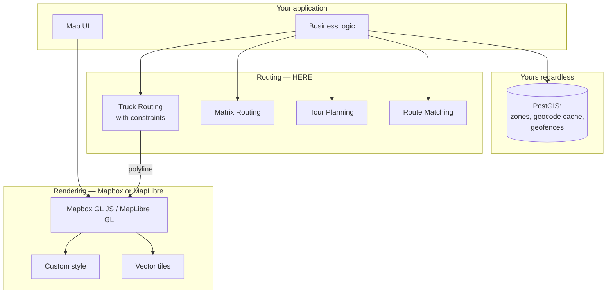

# HERE vs Mapbox

**This is rarely a platform decision. It is a layer decision.**

Mapbox is the stronger rendering and styling platform. HERE is the stronger commercial vehicle routing platform. Teams that treat these as competing choices end up compromising the layer they care less about, for no reason.

**Use Mapbox GL for the map. Use HERE for the routing.** That is a coherent architecture, it is common, and it should be stated as a decision rather than discovered as a compromise.

## Short verdict

**Choose Mapbox when** the map's visual identity is part of your product, when your team's differentiator is the interface, or when your routing needs are passenger-vehicle only.

**Choose HERE when** vehicle constraints must shape the route, when you need fleet optimization or map matching, or when transport-attributed data is the requirement.

**Use both when** you need a beautiful map showing a truck-legal route. Which is most fleet software.

## Comparison scope

Rendering, styling, mobile SDKs, navigation, routing, geocoding, offline operation, and commercial model.

<Info>
Both vendors' capabilities and pricing change. Verify against [Mapbox documentation](https://docs.mapbox.com/) and [HERE documentation](https://www.here.com/docs) before architecting. Nothing on this page substitutes for reading the current specification.
</Info>

## Decision summary

| Requirement | Better fit | Why |
|---|---|---|
| Custom map styling depth | Mapbox | Studio, style specification, design workflow |
| Vector tile ecosystem | Mapbox | MapLibre GL forked from Mapbox GL JS; the ecosystem is theirs |
| Developer experience for rendering | Mapbox | Widely regarded as the reference |
| Commercial vehicle constraints | HERE | Height, weight per axle group, hazmat cargo, tunnel category |
| Hazardous cargo routing | HERE | Native parameters |
| GPS trace → road segments | HERE | Route Matching |
| Fleet-wide multi-stop optimization | HERE | Tour Planning solves the VRP |
| Transport-attributed base data | HERE | Weight and height restrictions in the map |
| Passenger-car routing | Both credible | Test on your corridors |
| Offline mobile maps | Both offer it | Compare current terms and binary size |
| Geocoding | Test it | Neither is obviously superior for all regions |
| Commercial model | Differs structurally | See below |

## Where Mapbox is stronger

### Styling and design workflow

Mapbox Studio and the Mapbox Style Specification are the reference implementation for vector map styling. If your product's map is a designed artifact rather than a functional one — a real estate platform, a travel product, a data visualization — this is a genuine advantage that no routing capability offsets.

### The vector tile ecosystem

MapLibre GL, the open-source library much of the industry now uses, forked from Mapbox GL JS. The tooling, the style spec, the mental model, and the community are Mapbox's, even where the code has diverged.

Engineers who have built maps have probably built them with this stack.

### Developer experience

Documentation, examples, and API ergonomics are consistently well regarded. This is not a small thing; it appears in your engineering budget.

## Where HERE is stronger

### Commercial vehicle routing

HERE Routing v8 accepts vehicle height, width, length, gross weight, current weight, weight per axle, weight per axle *group* (single, tandem, triple, quad, quint), axle count, trailer count, ADR tunnel category, hazardous cargo types, and KPRA length.

<Info>
Verified against the [HERE Matrix Routing v8 OpenAPI specification](https://matrix.router.hereapi.com/v8/openapi), v8.47.0, July 2026.
</Info>

Mapbox's Directions API supports a driving profile with some restriction handling. **Verify its current commercial vehicle constraint set directly** against [Mapbox's documentation](https://docs.mapbox.com/api/navigation/directions/) — we will not characterize a competitor's capability from a comparison table, including ours.

The architecturally relevant question is: *can the API express every constraint that determines whether your vehicle may legally and physically traverse a segment?* Test this with the trap geometry below, not with a feature list.

### Route Matching

Taking a noisy GPS trace and returning the road segments actually travelled, with attributes. This is what IFTA jurisdiction miles and speed compliance require.

### Tour Planning

Capacitated VRP with time windows, multi-depot, heterogeneous fleets, priorities, pickup-and-delivery. HERE documents it as included in the Base Plan.

### Transport-attributed map data

Weight restrictions, height limits, hazmat prohibitions, and designated truck routes present in the base map.

## Where the difference is mostly commercial or operational

### Commercial model

The models differ structurally, not just in price.

Mapbox has historically priced map loads and navigation differently from per-request routing. HERE prices per transaction, with an asset-based option in some tiers.

<Warning>
**Do not compare these on rate cards.** A map-load-based model and a request-based model are not commensurable without knowing your session behaviour. Model your actual usage against both.
</Warning>

Verify current pricing: [Mapbox pricing](https://www.mapbox.com/pricing) · [Placematic HERE pricing](https://placematic.com/here-location-services/here-pricing/).

### Data freshness

Both maintain their own map data with their own update cadences. Mapbox incorporates OpenStreetMap alongside other sources; HERE maintains a proprietary map.

**Neither claim about freshness should be accepted from a vendor.** Test the specific geography you operate in, particularly for recently built roads.

### Support and accountability

Both offer enterprise support. HERE licensed through a Gold Partner means one contract and one accountable party for the integration, not merely for API availability.

## Architecture: the hybrid

Say this out loud in a design review, and stop treating it as a compromise.

**The interface is a polyline.** HERE returns route geometry; MapLibre GL renders it. There is no coupling beyond that, and no reason the same vendor must supply both.

<Tip>
If you already render with MapLibre GL, adding HERE routing costs you a polyline decode and a fetch. It is not a migration. It is an addition.
</Tip>

**Where the hybrid gets complicated:**

**Mobile turn-by-turn.** If you need on-device navigation with offline maps, you are choosing an SDK, and the SDK bundles rendering with routing. This is the one place the hybrid breaks down, and you should decide it deliberately rather than discover it during the mobile sprint.

**Attribution.** Both platforms require it. Both sets apply if you use both.

**Two contracts, two invoices, two support paths.** Real overhead. Weigh it honestly.

## Migration considerations

**Rendering: Mapbox GL JS → MapLibre GL is trivial.** Same lineage, largely compatible.

**Rendering: Mapbox → HERE tiles.** If you use Mapbox GL JS for the library and Mapbox tiles for the data, swapping tiles is a source configuration change. Swapping the library is not needed. Styling will differ visibly.

**Routing: Mapbox Directions → HERE Routing v8.**

| Difference | Detail |
|---|---|
| Coordinate order | Mapbox Directions uses `lng,lat` in the path. HERE uses `origin=lat,lng`. GeoJSON is `lng,lat` |
| Response shape | Different geometry encodings and section structures |
| `200` is not success | HERE returns `200` with empty `routes` and a `notice` when no path exists |
| `403` ≠ `401` | `403` means valid credential, missing entitlement. Never retry |
| Matrix semantics | HERE returns flat row-major arrays. Index carefully |
| Vehicle profile | HERE's constraint set is richer. Design your abstraction around it |

<Warning>
**Design any provider facade from HERE's capability set.** An interface derived from a routing API that cannot express axle-group weight has no field for it. When you add HERE, the constraint has nowhere to live and gets silently dropped.
</Warning>

**Dual-run before you commit.** See [Google Migration Architecture](/architecture/google-migration-architecture) — the methodology applies regardless of which vendor you leave.

## Cost model

**What creates billable activity:**

- Map loads or tile requests (model differs by vendor)
- One routing call per computed path
- Matrix calls, or the routing loops that should have been matrix calls
- Geocoding, real-time and batch
- Rendering without a CDN

**Request multiplication risks** are identical on both platforms: routing loops that should be matrices, reverse-geocoding GPS packets, undebounced autocomplete.

**Hybrid cost note.** Running both means two minimums, two free tiers that do not pool, and two contracts. For a small team this overhead may exceed the benefit. For a fleet platform where the map is customer-facing and the routing is safety-critical, it does not.

**Total cost of ownership** includes engineering time to approximate a capability your platform does not have. Implementing truck restriction logic over an unconstrained routing API is paying salaries to badly reproduce a product feature.

## How to evaluate with your own data

**Rendering.** Build the same map on both, with your data, at your zoom levels. Show your designers. This is a subjective judgment and it is legitimate; make it explicitly rather than through a feature matrix.

**Routing quality.** 500 real historical trips through both. Compare against telematics ground truth — actual driven distance and duration — not against each other. Report residual **distributions**, not means.

**Truck constraint gate.** Route a vehicle with 410 cm height through:

- The 11foot8 bridge, Durham NC
- Storrow Drive, Boston MA
- The Southern State Parkway, Long Island NY

Any path returned is a failure. Run the same three in car mode as a control — all three must route.

This is a gate, not a metric. It answers "can this API express my constraint" more reliably than any documentation review.

**Offline.** Download a region on both mobile SDKs. Measure binary size impact and storage. Test on the oldest device your drivers actually use.

**Cost.** Model your actual session and request behaviour against both pricing structures. Map loads and per-request billing are not commensurable in the abstract.

## Common decision mistakes

**Treating it as all-or-nothing.** The most common and most costly.

**Choosing HERE for routing and then abandoning Mapbox styling** because someone wanted vendor consolidation.

**Choosing Mapbox for the map and then approximating truck constraints in application code.** You cannot; the road attributes are not exposed.

**Comparing map-load pricing to per-request pricing** without modelling session behaviour.

**Accepting either vendor's data freshness claim.** Test your geography.

**Designing the abstraction layer around the weaker constraint set.**

**Discovering the mobile SDK bundles rendering and routing** during the mobile sprint.

**Forgetting attribution.** Both require it.

**Failing over constrained truck routing to an unconstrained provider.** Worse than failing.

## Choose Mapbox when

- The map is a designed artifact and part of your brand
- Your routing needs are passenger-vehicle only
- Your team's differentiator is the interface
- Styling depth is a product requirement, not a preference

## Choose HERE when

- Vehicle constraints determine route legality or physical feasibility
- You transport hazardous materials
- You need map matching for compliance
- You need fleet-wide multi-stop optimization
- Transport-attributed base data is a requirement

## Use both when

- You need a beautiful map showing a truck-legal route

Which describes most fleet software with a customer-facing surface. Write it in the architecture decision record.

## Related documentation

<CardGroup cols={2}>
  <Card title="Maps" href="/guides/maps">
    Tiles, CDN caching, and the web-versus-mobile entitlement boundary.
  </Card>
  <Card title="Truck Routing" href="/guides/truck-routing">
    The constraint set, and the trap geometry that tests it.
  </Card>
  <Card title="HERE SDK" href="/guides/here-sdk">
    Where the hybrid breaks down: offline and on-device navigation.
  </Card>
  <Card title="Fleet Routing" href="/use-cases/fleet-routing">
    The architecture a hybrid usually sits inside.
  </Card>
</CardGroup>

Also: [Route Matching](/guides/route-matching) · [Tour Planning](/guides/tour-planning) · [HERE vs Google Maps](/comparisons/here-vs-google-maps) · [HERE vs OpenStreetMap](/comparisons/here-vs-openstreetmap)

## Sources

**HERE**
- [Routing API v8](https://www.here.com/docs/category/routing-api-v8)
- [Matrix Routing v8 OpenAPI specification](https://matrix.router.hereapi.com/v8/openapi)
- [HERE Map Rendering](https://www.here.com/docs/category/here-map-rendering)

**Mapbox**
- [Mapbox documentation](https://docs.mapbox.com/)
- [Mapbox Directions API](https://docs.mapbox.com/api/navigation/directions/)
- [Mapbox pricing](https://www.mapbox.com/pricing)

**Placematic**
- [Commercial comparison overview](https://placematic.com/compare/here-vs-mapbox/)

*Verified July 2026. Mapbox capabilities characterized only where verifiable from their public documentation. Verify before architecting.*

---

Need to compare these platforms with your own request mix?

Placematic can help you run a technical and cost evaluation using representative routes, addresses and production volumes. Placematic is an official HERE Technologies reseller and implementation partner. [Cost Reduction Audit](https://placematic.com/here-location-services/cost-reduction-audit/).