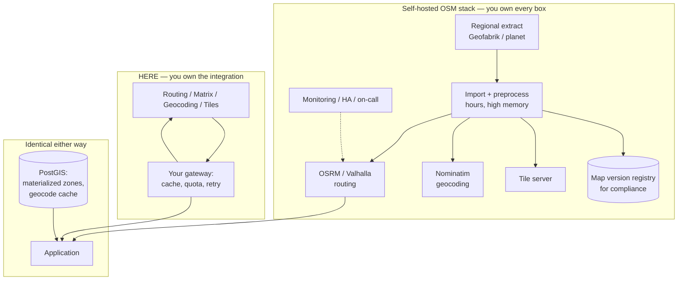

# HERE vs OpenStreetMap

**OpenStreetMap is not a competitor to HERE. It is not a company, a product, or an API.**

It is a geographic database, built by a volunteer community, released under the Open Database License. It has no routing engine, no geocoder, no tile server, no SLA, and nobody to call.

If you are evaluating "HERE vs OpenStreetMap," you are actually evaluating **a managed platform versus a stack you assemble and operate.** That distinction is the entire page.

## Comparison scope

Getting the terminology right is not pedantry. It determines what you are signing up to build.

| Component | What it is | Common implementation |
|---|---|---|
| **OpenStreetMap** | Geographic data + community project | The data itself. ODbL licensed. |
| **Routing engine** | Computes paths over the data | OSRM, Valhalla, GraphHopper |
| **Geocoder** | Address ↔ coordinate | Nominatim, Pelias, Photon |
| **Tile server** | Renders map imagery | Tileserver GL, Tegola, Martin |
| **Map matching** | GPS trace → road segments | Valhalla Meili, OSRM `/match` |
| **Isochrones** | Reachability polygons | Valhalla, custom |
| **Commercial OSM providers** | Managed OSM stacks | Geoapify, Stadia Maps, Mapbox (partially) |

<Warning>
"Self-hosting OpenStreetMap" means selecting one component from most of those rows, integrating them, hosting them, monitoring them, and re-importing continental-scale data on a cadence you choose and maintain.

It is a real and defensible choice. It is not a free version of a mapping API.
</Warning>

This page compares **HERE Location Services** to **a self-hosted OSM-based stack**. Commercial OSM providers are a third option and are addressed at the end.

## Short verdict

**Choose a self-hosted OSM stack when** location is your core competency, you have GIS engineering capacity, your operating region is bounded, your requirements are stable, and per-call cost at your volume genuinely exceeds the fully-loaded cost of the engineers who will operate it.

**Choose HERE when** location is infrastructure rather than product, you need commercial vehicle attributes you cannot curate yourself, you need someone accountable when a route is wrong, or you cannot afford a data-freshness problem to become your problem.

**Choose a hybrid when** you can identify a bounded, high-volume, low-stakes workload — and most teams can.

## Decision summary

| Requirement | Better fit | Why |
|---|---|---|
| Truck attributes: height, weight, axle, hazmat restrictions | HERE | OSM truck restriction tagging is inconsistent and incomplete; curating it is a data programme |
| Real-time traffic | HERE | OSM has no traffic data. You would source and fuse it yourself |
| Map data freshness at scale | HERE | OSM data is current; *your import* is as current as your pipeline |
| Full control over routing profiles | OSM stack | You can express anything. That is the point |
| Per-call marginal cost at very high volume | OSM stack | Approaches zero. Total cost does not |
| Data residency and full sovereignty | OSM stack | Runs where you put it |
| Bounded region, high volume geocoding | OSM stack | Nominatim over a national extract is genuinely good and free |
| Accountability when a route is wrong | HERE | There is a contract and a person |
| Rural / emerging-market road coverage | Test it | OSM coverage varies enormously by region and community activity |
| Urban geometry in well-mapped cities | Comparable | OSM is often excellent. Test it |
| Compliance-grade route reconstruction | HERE, or careful engineering | You must be able to cite the map version that produced a match |

## Where HERE is stronger

### Truck attribution

This is the strongest argument and it is a data argument, not a software argument.

Commercial vehicle routing needs bridge clearances, weight limits per axle group, hazmat prohibitions, tunnel categories, and designated truck routes — attributed consistently across a road network.

OSM contains some of this. Coverage is uneven by country, by region, and by how active the local mapping community is. `maxheight` and `maxweight` tags exist; whether they exist on the bridge your driver is approaching is a different question.

<Warning>
An OSRM instance will happily route a truck under a bridge whose clearance nobody tagged. It will return `200`. There is no vendor to escalate to, and the gap is not in your code.

Curating truck attributes for a national network is a multi-year data programme, not a sprint.
</Warning>

Verify this yourself for your operating region rather than accepting it: pick twenty bridges you know are low, and check whether they carry `maxheight` in the current OSM extract.

### Traffic

OSM has no traffic layer. There is no historical speed profile, no live incident feed, no congestion model.

You would need to source traffic separately — a commercial feed, or your own fleet's telematics — and fuse it into your routing engine's cost model. That is a legitimate project. It is a project.

### Data freshness as someone else's problem

OSM data is edited continuously and is often *more* current than commercial data for recently changed geometry, particularly in actively mapped areas.

**Your import is not.** A self-hosted stack is as fresh as your extract-transform-load pipeline. Continental-scale OSRM graph preprocessing is measured in hours and substantial memory. Weekly is achievable. Daily is work.

For compliance workloads — IFTA jurisdiction miles, speed compliance against posted limits — you must be able to state which map version produced a given result, months later. That is an artifact you now version and retain.

### Accountability

When HERE returns a wrong route, there is a support path and a contract. When your OSRM instance returns a wrong route, the answer is a task in your backlog.

Whether that matters depends on whether a wrong route is an inconvenience or a bridge strike.

## Where the OSM stack is stronger

### Total control

You can express routing profiles no vendor offers. Custom cost functions, bespoke restrictions, domain-specific penalties. Valhalla in particular is designed for this.

If your routing problem is genuinely unusual — mining haul roads, agricultural equipment, restricted campus networks — no commercial API will express it and an OSM stack will.

### Marginal cost approaches zero

At very high call volume, per-request pricing dominates. A self-hosted OSRM instance serving a bounded region has a fixed infrastructure cost and no marginal cost per route.

<Info>
The threshold is real but it is higher than teams expect, because the comparison is not "server cost versus API cost." It is "server cost + engineering salaries + on-call + data pipeline + monitoring + the opportunity cost of what those engineers were not building" versus API cost.

Compute your own crossover. Include the salaries.
</Info>

### Data sovereignty

The stack runs where you put it. No coordinates leave your infrastructure. For some regulated industries and some jurisdictions this is dispositive and no commercial platform can satisfy it.

### Geocoding in a bounded region

Nominatim over a national extract, with a well-tuned normalization pipeline, is a genuinely strong geocoder for a bounded operating area. It costs nothing per call.

This is the single most defensible self-hosted component and the easiest to start with.

<Tip>
A hybrid that works: Nominatim for the geocoding backfill, falling through to a paid geocoder only for records Nominatim cannot resolve confidently. You pay for the hard 15% and get the easy 85% free.

See [High-Volume Geocoding](/architecture/high-volume-geocoding).
</Tip>

## Where the difference is operational, not technical

### Total cost of ownership

The naive comparison — server cost versus invoice — is wrong. The honest inventory:

| Cost | Self-hosted OSM | HERE |
|---|---|---|
| Per-call | ~0 | Per contract |
| Infrastructure | Yours | — |
| Data import pipeline | Yours to build and run | — |
| Graph preprocessing compute | Yours | — |
| Monitoring and alerting | Yours | Partly |
| High availability | Yours to design | Contractual |
| On-call | Yours | — |
| Engineering to maintain | 1 to several FTE, ongoing | Integration only |
| Truck attribute curation | Yours, if needed | Included |
| Traffic data | Sourced separately | Included |
| Map version provenance | Yours to retain | Documented |
| Accountability when wrong | Yours | Contractual |

**The engineering line is the one that surprises people.** It is not a one-time build. Someone must own the import pipeline, the graph rebuild, the version tracking, and the pager, indefinitely.

<Warning>
For a TMS or ELD vendor, a self-hosted routing stack becomes a second product that no customer pays for and no product manager owns. This is the most common way the decision goes wrong: it is correct at the moment it is made and becomes wrong as the team's priorities move.
</Warning>

### Licensing and attribution

**OpenStreetMap data is licensed under the [Open Database License (ODbL)](https://opendatacommons.org/licenses/odbl/).** This is not a footnote.

The ODbL has share-alike provisions. If you produce a **Derivative Database** — a modified version of OSM data — and publicly use it, you must offer that derivative under the ODbL. Producing a **Produced Work** (a map image, a route result) requires attribution but does not trigger share-alike.

Where exactly a given system sits on that boundary is a legal question with genuinely contested edges — particularly for systems that merge OSM with proprietary data, or that expose the underlying geometry to end users.

<Warning>
If you are a commercial platform embedding OSM-derived routing into a product, get counsel. Do not resolve the Derivative Database question with a blog post. The [OSMF Community Guidelines](https://osmfoundation.org/wiki/Licence/Community_Guidelines) exist because the boundary is unclear.

Attribution is required in all cases. "© OpenStreetMap contributors" is not decorative.
</Warning>

HERE data is commercially licensed with terms your legal team can read once and file. This is a real advantage and it is rarely mentioned.

## Architecture implications

Notice the bottom box. **Caching, materialized delivery zones, and the geocode cache are yours regardless of platform.** A large fraction of what most location systems do never touches either.

That has a consequence for this decision: if you have not yet materialized your isolines and cached your geocodes, your API bill is not evidence that you need to self-host. It is evidence that you have not optimized. See [Cost Optimization Patterns](/architecture/cost-optimization-patterns).

**Monitoring differs fundamentally.** With HERE you monitor call ratios, `429` rates, and `403`s. With a self-hosted stack you additionally monitor graph rebuild success, import freshness, memory headroom, and query latency percentiles — and you are the escalation path.

**Failover.** A commercial API has a documented availability commitment. Your OSRM instance has whatever you built. Multi-region self-hosted routing is achievable and is a project.

## Migration considerations

Migrating *to* a self-hosted stack:

- **Coordinate order.** OSRM uses `lng,lat`. HERE Routing uses `lat,lng`. GeoJSON is `lng,lat`. This will bite you.
- **Duration semantics.** OSRM free-flow durations are not traffic-aware. Substituting them for traffic-aware ETAs will make every arrival estimate optimistic, systematically, and your customers will notice before your dashboards do.
- **No matrix async.** OSRM's `/table` is synchronous with its own practical ceiling.
- **Map matching.** Valhalla Meili and OSRM `/match` exist and are capable. Whether their output is defensible in an IFTA audit is a question you must answer, and part of the answer is retaining the map version.
- **Truck profiles.** OSRM's default profiles do not model truck constraints meaningfully. Custom Lua profiles can, subject to the underlying data being tagged.

**Dual-run before you commit.** Route your production trips through both. Compare against telematics ground truth, not against each other. See [Google Migration Architecture](/architecture/google-migration-architecture) — the methodology is identical regardless of which direction you migrate.

## How to evaluate with your own data

Before deciding, answer these empirically for **your** region:

**Data coverage.** Take twenty bridges, tunnels, or weight-restricted segments you know exist in your operating area. Check whether the current OSM extract carries the restriction tags. Report the fraction.

**Routing quality.** Route 500 real historical trips through OSRM (or Valhalla) and through HERE. Compare both against telematics actuals. Report the residual *distribution*, not the mean.

**Truck constraint gate.** Route a 4.1 m vehicle through the 11foot8 bridge (Durham NC), Storrow Drive (Boston), and the Southern State Parkway (Long Island). Any path returned is a failure. Run the same three in car mode as a control.

**Geocoding.** Take 1,000 of your own addresses — deliberately including rural, apartment, and PO-box-adjacent cases. Compare Nominatim against a commercial geocoder for match rate *and* for confidence calibration.

**Operational cost.** Build the import pipeline as a spike. Time it. Multiply by your rebuild cadence. Add the engineer.

**Then compute the crossover.** Include salaries.

<Tip>
Run the coverage test first. It takes an afternoon and it frequently ends the discussion for commercial vehicle operators.
</Tip>

## Common decision mistakes

**Treating OSM as a vendor.** It is data and a community.

**Comparing server cost to invoice.** Omits the engineers, the pipeline, and the pager.

**Assuming OSM truck restrictions are complete.** Test your region.

**Assuming OSM data is stale.** Often it is not. Your *import* might be.

**Deciding on marginal cost at a volume you have not yet reached.**

**Building a self-hosted stack before caching and materializing.** You may be self-hosting waste.

**Ignoring ODbL share-alike.** Get counsel before you ship a derivative database.

**Omitting attribution.** Required.

**Building it because it is interesting.** It is interesting. That is not a business case.

**Assuming free-flow durations substitute for traffic-aware ETAs.**

**Not versioning the map that produced a compliance-relevant result.**

## Choose a self-hosted OSM stack when

- Location is core to your product, not infrastructure beneath it
- You have — and will keep — GIS engineering capacity
- Your operating region is bounded and well mapped
- Your routing requirements are unusual enough that no commercial API expresses them
- Data sovereignty is a hard requirement
- You have computed the crossover including salaries, and it favours self-hosting
- Your workload is high-volume and low-stakes: geocoding backfills, analytical distance computation, internal tooling

## Choose HERE when

- You route commercial vehicles and cannot curate truck attributes yourself
- You need traffic
- Location is infrastructure, and your engineers should be building your product
- Compliance requires attributable, versioned map data with a party accountable for it
- The fully-loaded cost of operating a stack exceeds the API bill
- You want the licensing question to be a contract rather than a legal opinion

## A third option

**Commercial OSM providers** — Geoapify, Stadia Maps, and others — sell managed OSM-based routing, geocoding, and tiles. You get OSM's data and licensing characteristics without operating the stack.

This is frequently the right answer for teams attracted to OSM for cost reasons rather than control reasons. You inherit OSM's truck-attribute gaps and its lack of traffic, but not its operational burden.

Evaluate them explicitly rather than treating the choice as binary.

## Related documentation

<CardGroup cols={2}>
  <Card title="Cost Optimization Patterns" href="/architecture/cost-optimization-patterns">
    Materialize and cache before you conclude you need to self-host.
  </Card>
  <Card title="High-Volume Geocoding" href="/architecture/high-volume-geocoding">
    Where a self-hosted geocoder genuinely fits, as a first tier.
  </Card>
  <Card title="Truck Routing" href="/guides/truck-routing">
    The attributes an OSM stack must supply and usually cannot.
  </Card>
  <Card title="ELD Platform" href="/use-cases/eld-platform">
    Why the map version that produced a match is an audit artifact.
  </Card>
</CardGroup>

Also: [Route Matching](/guides/route-matching) · [Geofencing](/use-cases/geofencing) · [HERE vs Google Maps](/comparisons/here-vs-google-maps)

## Sources

**OpenStreetMap**
- [OpenStreetMap](https://www.openstreetmap.org/)
- [Open Database License (ODbL)](https://opendatacommons.org/licenses/odbl/)
- [OSMF licence community guidelines](https://osmfoundation.org/wiki/Licence/Community_Guidelines)

**Components**
- [OSRM](http://project-osrm.org/)
- [Valhalla](https://valhalla.github.io/valhalla/)
- [Nominatim](https://nominatim.org/)

**HERE**
- [Routing API v8](https://www.here.com/docs/category/routing-api-v8)
- [HERE Technologies documentation](https://www.here.com/docs)

**Placematic**
- [Commercial comparison overview](https://placematic.com/compare/here-vs-openstreetmap/)

*Verified July 2026. Licensing interpretation is not legal advice.*

---

Need to compare these platforms with your own request mix?

Placematic can help you run a technical and cost evaluation using representative routes, addresses and production volumes. Placematic is an official HERE Technologies reseller and implementation partner. [Cost Reduction Audit](https://placematic.com/here-location-services/cost-reduction-audit/).