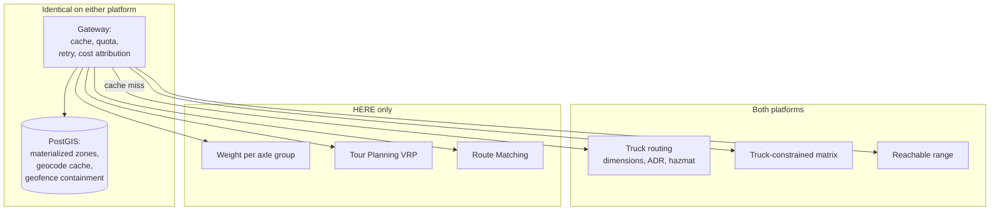

# HERE vs TomTom

This is the closest comparison in this section, and the one most often written badly.

TomTom is not a rendering vendor that added routing. It is a mapping company with a commercial vehicle routing product, an ADR tunnel restriction implementation, hazmat load types, and a matrix API. Most published comparisons — including, until recently, Placematic's own — understate it.

**The differences are narrower than either vendor's marketing suggests, and one of them is decisive.**

## Short verdict

**Choose HERE when** you route in a jurisdiction that regulates by axle group, when you need a fleet-scale Vehicle Routing Problem solver, or when you need map matching for compliance reconstruction.

**Choose TomTom when** you are already committed to their automotive stack, when European navigation and traffic are your primary concern, or when their commercial terms are materially better for your workload — which they may be.

**Where the difference is insignificant:** basic truck constraint expression, ADR tunnel codes, hazmat load types, reachable-range isochrones, and passenger-car routing quality. Both are credible. Test on your corridors.

## Comparison scope

Routing, truck routing, matrices, optimization, traffic, geocoding, SDKs, and enterprise deployment.

<Warning>
TomTom operates two map generations: the legacy TomTom Maps and **TomTom Orbis Maps**, their next-generation offering. Capability differs between them.

TomTom's own Android SDK documentation states, for `Vehicle.Truck`: *"This option is not supported with the Orbis map."* Verify which map your intended API version and SDK target, and whether truck routing is available on it, before you architect.

Source: [TomTom Android SDK — Vehicle.Truck](https://developer.tomtom.com/assets/downloads/tomtom-sdks/android/api-reference/1.24.2/vehicle/model/com.tomtom.sdk.vehicle/-vehicle/-truck/index.html), v1.24.2, retrieved July 2026.
</Warning>

## Decision summary

| Requirement | Better fit | Why |
|---|---|---|
| Per-axle-group weight expression | **HERE** | TomTom exposes a single `vehicleAxleWeight` scalar |
| Fleet-scale VRP: capacity, time windows, multi-depot | **HERE** | Tour Planning. TomTom's Waypoint Optimization orders one vehicle's stops |
| GPS trace → road segments for compliance | **HERE** | Route Matching. Verify any TomTom equivalent independently |
| Basic truck dimensions and weight | Comparable | Both express height, width, length, weight, axle count |
| ADR tunnel restriction codes | Comparable | Both implement `B`, `C`, `D`, `E` |
| Hazmat load types | Comparable | Different taxonomies, similar intent |
| Truck-constrained matrix | Comparable | Both support it; compare mode-specific ceilings, not headline figures |
| Reachable range / isochrone with truck constraints | Comparable | Both offer it |
| EV consumption modelling | TomTom is notably granular | Efficiency pairs, altitude gain/loss, auxiliary power |
| Automotive / in-dash integration | TomTom | Their historical core market |
| European navigation heritage | TomTom | Genuine, and hard to quantify |
| Truck support on the newest map generation | **Verify** | Orbis limitation above |

## The decisive difference: axle groups

This is the single most important paragraph on this page.

**TomTom** exposes `vehicleAxleWeight` — *weight per axle, in kilograms* — as a scalar, alongside `vehicleNumberOfAxles`. Source: [TomTom Calculate Route documentation](https://developer.tomtom.com/routing-api/documentation/tomtom-maps/calculate-route).

**HERE** exposes `weightPerAxle` as a scalar *and* `weightPerAxleGroup`, with distinct values for `single`, `tandem`, `triple`, `quad`, and `quint` groups. Source: [HERE Matrix Routing v8 OpenAPI specification](https://matrix.router.hereapi.com/v8/openapi), v8.47.0.

<Warning>
**This is not a minor parameter difference. It is a legality difference in the United States.**

US federal bridge formula and state weight limits are frequently expressed per axle *group*, not per axle. A five-axle tractor-trailer with a steer axle, a tandem drive, and a tandem trailer group cannot be described by a single per-axle scalar without losing the information the regulation is written against.

If your operating jurisdiction regulates by axle group and your routing API cannot express it, the API cannot determine whether a route is legal for your vehicle. No amount of other truck parameters compensates.
</Warning>

For European operations where restrictions are more often expressed by gross weight and per-axle limits, the gap narrows substantially. **This is a market-specific decision.**

Verify TomTom's current capability directly. It may have changed.

## Where HERE is stronger

### Axle group expression

Above.

### Fleet-scale optimization

HERE Tour Planning solves the Vehicle Routing Problem: capacitated VRP, time windows, multi-depot, heterogeneous fleets, priorities, pickup-and-delivery, reloads. HERE documents it as included in the Base Plan.

TomTom's **Waypoint Optimization** API orders waypoints for a single vehicle, with `waypointConstraints` (origin, destination, visiting orders) and `groupConstraints`. Source: [TomTom Waypoint Optimization](https://developer.tomtom.com/waypoint-optimization/documentation/waypoint-optimization).

<Info>
These are different problems. Waypoint optimization sequences one vehicle's stops. A VRP solver *assigns* stops across a fleet under capacity, shift, and skill constraints, and tells you which jobs it could not serve.

If your problem is "which of my twelve technicians visits which of my sixty jobs, in what order, respecting appointment windows and certifications," waypoint optimization does not solve it.
</Info>

### Route matching

HERE offers map matching: a noisy GPS trace in, the road segments actually travelled out, with attributes. This is what IFTA jurisdiction-mile reporting and speed compliance against posted limits require.

**Verify whether TomTom currently offers an equivalent product.** We will not assert its absence from memory.

### Hazmat cargo type granularity

HERE's `shippedHazardousGoods` accepts an array from: `explosive`, `gas`, `flammable`, `combustible`, `organic`, `poison`, `radioactive`, `corrosive`, `poisonousInhalation`, `harmfulToWater`, `other`.

TomTom's `vehicleLoadType` accepts values including `otherHazmatExplosive`, `otherHazmatGeneral`, and US hazmat classes. Both are workable. Map your material classifications deliberately against whichever you choose, and have the mapping reviewed by someone qualified in the applicable regulation.

## Where TomTom is stronger

### EV consumption modelling granularity

TomTom's routing parameters express a consumption model in unusual detail: `constantSpeedConsumptionInkWhPerHundredkm` as speed/consumption pairs, `accelerationEfficiency` and `decelerationEfficiency`, `uphillEfficiency` and `downhillEfficiency`, `consumptionInkWhPerkmAltitudeGain`, `recuperationInkWhPerkmAltitudeLoss`, `auxiliaryPowerInkW`, `currentChargeInkWh`, `maxChargeInkWh`.

Source: [TomTom common routing parameters](https://developer.tomtom.com/routing-api/documentation/tomtom-maps/common-routing-parameters).

<Tip>
If your EV feasibility modelling is sensitive to gradient and regenerative braking — mountainous corridors, heavy vehicles — this parameter set is worth evaluating on its own terms. It expresses a physical model rather than a lookup.

See [Fleet Electrification](/use-cases/fleet-electrification).
</Tip>

### Automotive and in-dash heritage

TomTom's core market is automotive OEM integration. If your product ships into a vehicle head unit, or if you need navigation SDK maturity in that context, this is a real advantage that no API comparison captures.

### European navigation

TomTom's European navigation heritage is genuine. Whether it produces better routes on your specific corridors at your specific departure times is an empirical question, and we will not answer it from a marketing page.

## Where the difference is commercial or operational

### Traffic

Both vendors claim traffic superiority. Both have credible sources.

<Warning>
**Do not accept a traffic quality claim from any vendor, including us.**

Traffic quality is geographically uneven, temporally variable, and measured differently by whoever is measuring. A platform that is better in Amsterdam may be worse in Atlanta.

Test it: 500 real historical trips, compared against telematics ground truth, on your corridors, at your departure times. Report the residual distribution — median, p90, p99 — not the mean. A platform whose durations are unbiased on average but have twice the variance produces twice as many late deliveries.
</Warning>

### Matrix size limits

<Warning>
Matrix ceilings are often compared as single headline figures. That comparison is meaningless without stating the mode.

HERE's limits, from the [Matrix Routing v8 OpenAPI specification](https://matrix.router.hereapi.com/v8/openapi) (v8.47.0, July 2026):

| Mode | Sync | Async | Live traffic + custom options |
|---|---|---|---|
| Flexible (unlimited region) | 15×100 or 100×1 | 15×100 or 100×1 | Yes |
| Region (≤400 km diameter) | 500×500 | 10,000×10,000 | Yes |
| Profile (unlimited region) | 500×500, 1×2000, 2000×1 | 10,000×10,000 | No |

A truck-constrained matrix with live traffic runs in **Flexible** mode and caps at **15 × 100**.

TomTom's Matrix Routing v2 imposes its own limits, which differ between the synchronous and asynchronous endpoints. **Verify them directly** at [TomTom's Matrix Routing documentation](https://developer.tomtom.com/matrix-routing-v2-api/documentation/synchronous-matrix).

Comparing headline matrix figures across vendors, without stating mode and traffic-awareness, produces a comparison that is technically true and operationally useless.
</Warning>

### Pricing

<Warning>
We will not publish a comparative price or a savings percentage.

Competitor rate cards change without notice. **Verify current TomTom rates** at [TomTom pricing](https://developer.tomtom.com/store/maps-api) directly, and current HERE rates through your account manager.

Cost outcome depends on API mix, monthly volume, region, contract terms, billing SKU, batching, and architecture. Those span more than an order of magnitude.
</Warning>

Structurally: both bill per transaction. HERE offers an asset-based commercial model in some tiers, priced per tracked vehicle rather than per call. Availability depends on contract tier.

<Info>
A dispatcher who reroutes 200 trucks forty times a day is punished by call-volume pricing for operational diligence. If your vehicle population is countable and your call volume is not, ask both vendors about asset-based or fleet-based commercial terms before comparing rate cards.
</Info>

### Support and deployment

Both offer enterprise support. HERE licensed through a Gold Partner means one contract, one invoice, and one accountable party for the integration — not merely for the API being up.

Whether that matters depends on whether a wrong route is an inconvenience or a bridge strike.

## Technical comparison

### Parameter semantics that differ

| Concept | HERE | TomTom |
|---|---|---|
| Height | `height`, centimetres | `vehicleHeight`, **metres** |
| Weight | `grossWeight`, kilograms | `vehicleWeight`, kilograms |
| Per-axle weight | `weightPerAxle` **and** `weightPerAxleGroup` | `vehicleAxleWeight` (scalar) |
| Axle count | `axleCount` (2–255) | `vehicleNumberOfAxles` |
| ADR tunnel | `tunnelCategory`: `B`\|`C`\|`D`\|`E` | `vehicleAdrTunnelRestrictionCode`: `B`\|`C`\|`D`\|`E` |
| Hazmat cargo | `shippedHazardousGoods` (11 values) | `vehicleLoadType` (array) |
| Commercial flag | `category: lightTruck` (exemption) | `vehicleCommercial: boolean` |

<Warning>
**Units differ.** HERE's `height` is centimetres. TomTom's `vehicleHeight` is metres.

Pass `4.1` to HERE and you have declared a four-centimetre vehicle. It will route anywhere. The response will be `200`.

This is the single most likely migration defect between these two platforms, in either direction.
</Warning>

### Response semantics

**HERE returns `200` with an empty `routes` array** and a `notice` containing `routeCalculationFailed` when no path exists. Checking `resp.ok` swallows the failure. For truck and hazmat routing, "no legal route" is a real and correct outcome.

**HERE matrix results are flat, row-major arrays.** `travelTimes: [73, 1231, 983, 400]` for a 2×2. TomTom's synchronous matrix returns objects with explicit `originIndex` and `destinationIndex`.

<Info>
TomTom's shape is harder to get wrong. HERE's flat array produces a **silently transposed matrix** if indexed incorrectly: every travel time is plausible, every assignment is wrong, and nothing throws.

Write one indexing helper, unit-test it against a hand-computed 2×3, and never index the array anywhere else.
</Info>

**HERE returns per-cell `errorCodes`** in matrix responses, including `3` — route found but violates a restriction. Read them.

**`403` is not `401`** on HERE. `403` means a valid credential lacking entitlement for that product. Never retry it.

## Architecture implications

The platform choice changes less than expected, because most of what a location system does should not touch a location API.

**Materialized delivery zones, cached geocodes, and geofence containment are yours regardless.** If you have not built them, your API bill is not evidence you need a different vendor. See [Cost Optimization Patterns](/architecture/cost-optimization-patterns).

**Vendor abstraction.**

<Warning>
**Design your provider facade from the richer constraint set.** An interface with a single `axleWeight` scalar has no field for `weightPerAxleGroup`. When you add HERE, the constraint has nowhere to live and gets silently dropped.

Convert units at each adapter, not in the interface. Store centimetres or store metres — pick one, and make the adapter responsible.
</Warning>

**Failover between them is more plausible than with an unconstrained provider**, because both express most truck constraints. It is still dangerous: if you fail over from HERE with axle-group weight to TomTom without it, you have silently relaxed a legal constraint.

Refuse to route rather than route with a degraded constraint set.

## Migration considerations

**Moderate in both directions.** Neither is a rewrite of your spatial core, because your spatial core should be PostGIS.

| Area | Effort | Notes |
|---|---|---|
| Unit conversion | Low, high risk | Metres ↔ centimetres. Get this wrong once |
| Coordinate order | Low | Verify per endpoint on both |
| Response schema | Medium | HERE flat arrays vs TomTom indexed objects |
| Error semantics | Medium | HERE's `200` with empty `routes`; per-cell `errorCodes` |
| Hazmat taxonomy | Medium | Different value sets. Re-map, have it reviewed |
| Axle group | **Blocking, one direction** | HERE → TomTom loses it. TomTom → HERE gains it |
| Optimization | High, one direction | Waypoint Optimization ≠ Tour Planning |
| Map matching | High, one direction | Verify TomTom equivalent |

<Warning>
**Migrating from HERE to TomTom in a jurisdiction that regulates by axle group is not a migration.** It is shipping a system that cannot determine route legality.

If this describes you, the comparison ends here.
</Warning>

**Dual-run before you commit.** Shadow-write, compare offline against telematics ground truth, cut over one endpoint at a time, and test the rollback before you need it. See [Google Migration Architecture](/architecture/google-migration-architecture) — the methodology is vendor-agnostic.

## Cost model

**What creates billable activity** — identical on both:

- One routing call per computed path
- Matrix calls, or the routing loops that should have been matrix calls
- Reachable-range computations in a request path rather than materialized
- Requesting turn-by-turn instructions when you consume a duration
- Geocoding without a cache

**Request multiplication risks:** the routing loop is the risk on both platforms. An n×m cost table is n·m routing calls or one matrix call. That is a complexity difference and no rate card closes it. See [Routing vs Matrix](/architecture/choosing-routing-vs-matrix).

**Total cost of ownership** includes the engineering time to approximate a constraint your platform cannot express. A team implementing axle-group bridge formula logic on top of a scalar `vehicleAxleWeight` is paying salaries to badly reproduce a regulation.

## How to evaluate with your own data

**First, answer the axle-group question.** Does your operating jurisdiction regulate by axle group? If yes, and TomTom still exposes only a scalar, the evaluation is over. This takes one phone call to your compliance officer.

**Second, verify the Orbis truck limitation.** If you intend to target TomTom Orbis Maps, confirm truck routing availability on it for your specific API version and SDK.

**Then, if both survive:**

**Truck constraint gate.** Route a vehicle with a 4.1 m / 410 cm height through:

- The 11foot8 bridge, Durham NC
- Storrow Drive, Boston MA
- The Southern State Parkway, Long Island NY

Any path returned is a failure. Run the same three with a car profile as a control — all three must route, proving the test exercises the constraint rather than failing for an unrelated reason.

<Tip>
**Watch the units.** Send `410` to HERE and `4.1` to TomTom. Sending `4.1` to HERE declares a four-centimetre truck and every trap location will route, and you will conclude — wrongly — that HERE has no constraint handling.
</Tip>

**Routing and traffic quality.** 500 real historical trips through both, compared against **telematics ground truth**, not against each other. Two wrong answers can agree. Report the residual distribution, not the mean. Include peak and off-peak departures on the corridors you actually drive.

**Matrix.** Build a matrix in the configuration your production system will use — truck constraints, live traffic, your real origin-destination counts. Verify it does not exceed the mode-specific ceiling on either platform. Do this before you architect around a headline number.

**Optimization.** If you need fleet assignment, hand both platforms a real problem: twelve vehicles, sixty jobs, appointment windows, capacity, and two vehicles with a required capability. Compare what comes back, and compare how each reports jobs it could not assign.

**EV, if relevant.** TomTom's consumption model expresses gradient and regenerative braking directly. If your corridors are mountainous, benchmark energy consumption against actuals, not just duration.

**Cost.** Instrument your per-endpoint call counts from logs. Price the same counts on both, after applying caching and batching to both. Otherwise you are comparing your own inefficiency on two rate cards.

## Common decision mistakes

**Assuming TomTom has no truck routing.** It does. Dimensions, weight, axle count, ADR tunnel codes, hazmat load types, and truck-constrained matrices.

**Assuming the truck constraint sets are equivalent.** Axle groups.

**Confusing Waypoint Optimization with a VRP solver.**

**Comparing matrix ceilings without stating mode and traffic-awareness.**

**Passing metres where centimetres are expected.** A four-centimetre truck routes anywhere, and returns `200`.

**Accepting a traffic superiority claim from either vendor.**

**Citing a matrix ceiling or a competitor price without a source.** Both change. Verify against the specification and the vendor's current pricing page.

**Designing the abstraction layer from the weaker constraint set.**

**Failing over from a platform that expresses a legal constraint to one that does not.**

**Targeting Orbis Maps without verifying truck support.**

**Comparing rate cards.** Call mix, tier, batching, and caching determine your bill.

## Choose HERE when

- You operate in a jurisdiction that regulates by axle group
- You need fleet-scale VRP: assignment across vehicles, under capacity, windows, and skills
- Compliance requires defensible map matching and route reconstruction
- You need truck routing on the vendor's current-generation map without qualification
- Asset-based commercial terms fit your workload better than per-call

## Choose TomTom when

- You are committed to their automotive or in-dash stack
- European navigation and traffic are your primary market
- Your EV consumption modelling needs gradient and regeneration granularity
- Their commercial terms are materially better for your specific request mix — verify this, do not assume it either way
- Your truck constraints are fully expressible with a per-axle scalar and gross weight

## Where the difference is insignificant

Basic dimensional constraints. ADR tunnel codes. Reachable-range isochrones. Passenger-car routing quality. Geocoding for most Western markets.

**Do not migrate for these.** The engineering cost exceeds the benefit and you will spend a quarter proving it.

## Related documentation

<CardGroup cols={2}>
  <Card title="Truck Routing" href="/guides/truck-routing">
    HERE's constraint set, units, and the trap geometry that tests it.
  </Card>
  <Card title="Hazmat Routing" href="/use-cases/hazmat-routing">
    Cargo types, tunnel categories, and refusing to route.
  </Card>
  <Card title="Tour Planning" href="/guides/tour-planning">
    What a VRP solver does that waypoint optimization does not.
  </Card>
  <Card title="Matrix Routing" href="/guides/matrix-routing">
    Modes, ceilings, and the flat array that transposes silently.
  </Card>
</CardGroup>

Also: [Route Matching](/guides/route-matching) · [Fleet Electrification](/use-cases/fleet-electrification) · [Fleet Routing](/use-cases/fleet-routing) · [HERE vs Google Maps](/comparisons/here-vs-google-maps)

## Sources

**HERE**
- [Matrix Routing v8 OpenAPI specification](https://matrix.router.hereapi.com/v8/openapi) — authoritative on vehicle parameters and matrix modes
- [Routing API v8 developer guide](https://www.here.com/docs/bundle/routing-api-developer-guide-v8/page/get-started.html)
- [Tour Planning introduction](https://docs.here.com/tour-planning/docs/introduction-tour-planning)

**TomTom**
- [Calculate Route — vehicle parameters](https://developer.tomtom.com/routing-api/documentation/tomtom-maps/calculate-route)
- [Common routing parameters — consumption models](https://developer.tomtom.com/routing-api/documentation/tomtom-maps/common-routing-parameters)
- [Matrix Routing v2 — synchronous](https://developer.tomtom.com/matrix-routing-v2-api/documentation/synchronous-matrix)
- [Waypoint Optimization](https://developer.tomtom.com/waypoint-optimization/documentation/waypoint-optimization)
- [Vehicle restrictions knowledge base](https://developer.tomtom.com/knowledgebase/apis/articles/enhancing-road-safety-tomtom-s-routing-api-vehicle-restrictions/)
- [Android SDK — Vehicle.Truck](https://developer.tomtom.com/assets/downloads/tomtom-sdks/android/api-reference/1.24.2/vehicle/model/com.tomtom.sdk.vehicle/-vehicle/-truck/index.html) — Orbis limitation
- [Routing API — Orbis Maps v2](https://developer.tomtom.com/routing-api/documentation/tomtom-orbis-maps/v2/product-information/introduction)

**Placematic**
- [Commercial comparison overview](https://placematic.com/compare/here-vs-tomtom/)

*Verified July 2026 against HERE Matrix Routing v8.47.0 and TomTom developer documentation. TomTom's Orbis truck limitation cited from Android SDK v1.24.2. Capabilities, limits and pricing change; verify against primary sources before architecting.*

---

Need to compare these platforms with your own request mix?

Placematic can help you run a technical and cost evaluation using representative routes, addresses and production volumes. Placematic is an official HERE Technologies reseller and implementation partner. [Cost Reduction Audit](https://placematic.com/here-location-services/cost-reduction-audit/).