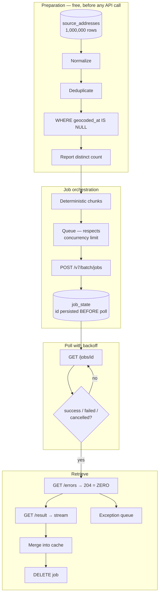

# Batch Address Cleanup — One Million Records

**Problem:** One million customer addresses. Coordinates, normalized form, confidence. Once.

<Warning>
**Before any API call, run the preparation stage.**

One million rows typically contains far fewer distinct addresses. Normalizing then deduplicating routinely reduces the billable set by a large fraction, and it costs one `SELECT DISTINCT`.

Report *that* number before you report a timeline. It changes the conversation.
</Warning>

## The pipeline



## Schema

```sql
-- The durable cache. This IS the system of record.
CREATE TABLE geocode_cache (
  normalized_address text PRIMARY KEY,
  lat                double precision,
  lng                double precision,
  access_lat         double precision,   -- road-network entry point
  access_lng         double precision,
  label              text,
  query_score        real,               -- 0..1
  field_score        jsonb,              -- per-component confidence
  house_number_type  text,               -- 'PA' | 'interpolated'
  here_id            text,
  map_release        text,
  geocoded_at        timestamptz NOT NULL DEFAULT now()
);

-- Idempotency. Survives worker restarts.
CREATE TABLE batch_jobs (
  chunk_id     int PRIMARY KEY,
  job_id       text UNIQUE,          -- persisted BEFORE the first poll
  status       text NOT NULL,        -- pending|submitted|running|succeeded|failed
  submitted_at timestamptz,
  row_ids      bigint[] NOT NULL     -- deterministic membership
);

CREATE TABLE exception_queue (
  raw_address text PRIMARY KEY,
  reason      text,
  query_score real,
  queued_at   timestamptz DEFAULT now()
);
```

## Stage 1 — preparation

```sql
-- Normalize at WRITE time, then deduplicate. Order matters:
-- deduplicating before normalization catches only exact string matches.

WITH normalized AS (
  SELECT
    id,
    trim(regexp_replace(
      lower(
        regexp_replace(raw_address, '\s+', ' ', 'g')
      ),
      '\m(st|ave|blvd|rd|apt)\M',
      CASE                                  -- expand abbreviations
        WHEN true THEN 'street' END,
      'g'
    )) AS norm
  FROM source_addresses
)
INSERT INTO work_queue (normalized_address, source_ids)
SELECT norm, array_agg(id)
FROM normalized
WHERE NOT EXISTS (                          -- skip what we already have
  SELECT 1 FROM geocode_cache c WHERE c.normalized_address = normalized.norm
)
GROUP BY norm;                              -- ← the deduplication

-- Report this BEFORE promising a timeline.
SELECT count(*) AS billable_addresses FROM work_queue;
```

<Tip>
Use `libpostal` for international normalization rather than a regex you will regret. It is self-hosted, removes normalization from your API bill entirely, and does not geocode.
</Tip>

## Stage 2 — chunk and queue

```python
import os, time, requests, psycopg2

BASE = "https://batch.search.hereapi.com/v7/batch/jobs"
API_KEY = os.environ["HERE_API_KEY"]
SERVICE_GEOCODE = "hrn:here:service::olp-here:search-geocode-7"

CHUNK_SIZE = 50_000
MAX_CONCURRENT_JOBS = 3      # read HERE's limits page. It sets your parallelism.


class EntitlementError(Exception): ...


def make_chunks(conn):
    """
    DETERMINISTIC. Stable ordering + fixed size means a restarted process
    reconstructs the same chunks. A random shuffle does not.
    """
    with conn.cursor() as cur:
        cur.execute("""
            INSERT INTO batch_jobs (chunk_id, status, row_ids)
            SELECT
              (row_number() OVER (ORDER BY normalized_address) - 1) / %s AS chunk_id,
              'pending',
              array_agg(id ORDER BY id)
            FROM work_queue
            GROUP BY chunk_id
            ON CONFLICT (chunk_id) DO NOTHING
        """, (CHUNK_SIZE,))
        conn.commit()


def submit_next(conn) -> str | None:
    """
    Respects the concurrency limit. 429 on start means QUEUE — not retry.
    Firing retries in a tight loop achieves nothing except log volume.
    """
    with conn.cursor() as cur:
        cur.execute("SELECT count(*) FROM batch_jobs WHERE status IN ('submitted','running')")
        if cur.fetchone()[0] >= MAX_CONCURRENT_JOBS:
            return None

        cur.execute("SELECT chunk_id, row_ids FROM batch_jobs "
                    "WHERE status='pending' ORDER BY chunk_id LIMIT 1 "
                    "FOR UPDATE SKIP LOCKED")
        row = cur.fetchone()
        if not row:
            return None
        chunk_id, row_ids = row

    payload = build_payload(conn, row_ids)

    r = requests.post(BASE, params={
        "serviceHrn": SERVICE_GEOCODE,
        "inputDelimiter": "|", "outputDelimiter": "|",
        "outputColumns": "|".join([
            "position", "title", "id",
            "addressLabel", "addressPostalCode", "addressCountryCode",
        ]),
        "outputType": "csv",
        "startJob": "true",
        "apiKey": API_KEY,
    }, data=payload.encode("utf-8"),
       headers={"Content-Type": "text/plain", "Accept": "application/json"},
       timeout=180)

    if r.status_code == 403:
        raise EntitlementError("Batch not entitled")
    if r.status_code == 429:
        return None                     # concurrency limit. Queue. Do not hammer.
    r.raise_for_status()

    job_id = r.json()["id"]

    # ── PERSIST BEFORE POLLING. ────────────────────────────────────────────
    # If the worker dies here, the job is RUNNING on HERE's side regardless.
    # Resubmitting a 50k-record chunk bills 50k records again.
    with conn.cursor() as cur:
        cur.execute("UPDATE batch_jobs SET job_id=%s, status='submitted', "
                    "submitted_at=now() WHERE chunk_id=%s", (job_id, chunk_id))
        conn.commit()

    return job_id


def build_payload(conn, row_ids) -> str:
    with conn.cursor() as cur:
        cur.execute("SELECT id, normalized_address, country FROM work_queue "
                    "WHERE id = ANY(%s) ORDER BY id", (row_ids,))
        lines = ["recId|q|country"]
        lines += [f"{r[0]}|{r[1]}|{r[2]}" for r in cur.fetchall()]
    return "\n".join(lines)
```

## Stage 3 — poll, and the three codes that are not errors

```python
def poll_all(conn):
    """Exponential backoff. A 40-minute job does not need checking every 2s."""
    with conn.cursor() as cur:
        cur.execute("SELECT chunk_id, job_id FROM batch_jobs "
                    "WHERE status IN ('submitted','running')")
        active = cur.fetchall()

    for chunk_id, job_id in active:
        r = requests.get(f"{BASE}/{job_id}", params={"apiKey": API_KEY}, timeout=30)
        r.raise_for_status()
        status = r.json()["status"]

        if status == "success":
            _collect(conn, chunk_id, job_id)
        elif status in ("failed", "cancelled"):
            _mark(conn, chunk_id, status)
        else:
            _mark(conn, chunk_id, "running")


def _collect(conn, chunk_id: int, job_id: str):
    # ── /errors: HTTP 204 means ZERO ERRORS. Not a failure. ───────────────
    e = requests.get(f"{BASE}/{job_id}/errors", params={"apiKey": API_KEY}, timeout=60)
    if e.status_code == 204:
        errors = None                   # celebrate
    else:
        e.raise_for_status()
        errors = e.text
        _queue_exceptions(conn, errors) # partial success. Do NOT discard the rest.

    # ── /result: HTTP 404 means NOT READY. Poll status first. ─────────────
    path = f"/tmp/{job_id}.csv"
    res = requests.get(f"{BASE}/{job_id}/result", params={"apiKey": API_KEY},
                       stream=True, timeout=600)
    if res.status_code == 404:
        raise RuntimeError("Results not ready — status was success?")
    res.raise_for_status()

    # Stream. One million records do not fit in memory.
    with open(path, "wb") as f:
        for chunk in res.iter_content(chunk_size=1 << 20):
            f.write(chunk)

    _merge_into_cache(conn, path)
    requests.delete(f"{BASE}/{job_id}", params={"apiKey": API_KEY}, timeout=30)
    _mark(conn, chunk_id, "succeeded")
```

<Warning>
| Response | Meaning | Action |
|---|---|---|
| `429` on start | Concurrency limit | **Queue.** Not a fault |
| `204` on `/errors` | **Zero errors** | Celebrate. Do not retry |
| `404` on `/result` | Job not succeeded yet | Poll status first |

Code that treats any non-`200` as failure will log a perfectly successful job as broken, every night, until someone reads the spec.
</Warning>

## Stage 4 — partial success and the confidence threshold

```python
MIN_QUERY_SCORE = 0.90     # calibrate against YOUR ground truth. Do not port.


def _merge_into_cache(conn, csv_path: str):
    """
    Successes merge. Sub-threshold results go to a human.

    A pipeline that treats geocoding as binary — succeeded or failed —
    will persist low-confidence fallbacks as truth. That corruption is
    silent, permanent, and propagates into every routing decision and
    every analytical aggregate downstream.
    """
    good, review = [], []
    for row in stream_csv(csv_path):
        if row["query_score"] >= MIN_QUERY_SCORE:
            good.append(row)
        else:
            review.append(row)

    with conn.cursor() as cur:
        cur.executemany("""
            INSERT INTO geocode_cache
              (normalized_address, lat, lng, access_lat, access_lng, label,
               query_score, field_score, house_number_type, here_id, geocoded_at)
            VALUES (%(norm)s,%(lat)s,%(lng)s,%(alat)s,%(alng)s,%(label)s,
                    %(query_score)s,%(field_score)s,%(hn_type)s,%(here_id)s,now())
            ON CONFLICT (normalized_address) DO UPDATE
              SET lat=EXCLUDED.lat, lng=EXCLUDED.lng,
                  query_score=EXCLUDED.query_score, geocoded_at=now()
        """, good)

        cur.executemany("""
            INSERT INTO exception_queue (raw_address, reason, query_score)
            VALUES (%(norm)s, 'below_confidence_threshold', %(query_score)s)
            ON CONFLICT (raw_address) DO NOTHING
        """, review)
        conn.commit()
```

<Warning>
**Storing a coordinate without its confidence converts a probabilistic estimate into a fact.** Every downstream consumer treats it as truth.

`query_score: 0.95` with `field_score.houseNumber: 0.4` matched the street confidently and the house number badly. That is a failed delivery. Persist `field_score`.
</Warning>

## Stage 5 — monitoring

Nobody is watching a nightly job. Instrument it as if it will fail at 3am, because it will.

| Metric | Alert when |
|---|---|
| Jobs by state, time in state | Job running longer than expected |
| `429` rate on submission | Sustained → concurrency budget misconfigured |
| Records submitted vs returned | Divergence |
| **`query_score` distribution** | **Shifts** — before it shows as failures |
| Deduplication ratio | Sudden drop → source changed |
| Jobs not deleted | Accumulation |
| Cost per **distinct** address | Not per row |

<Tip>
**Alert on the confidence distribution shifting, not just on errors.**

A map release, a source-system change, or a normalization regression shows up as a distribution shift long before it shows up as a failure.
</Tip>

**Webhooks exist in beta**, with placeholders like `${JOB_ID}` and `${JOB_STATUS}`. If your pipeline's correctness depends on a webhook arriving, build the polling fallback anyway.

## Stage 6 — export, and the steady state

```sql
-- Backfill the source table from the cache.
UPDATE source_addresses s
SET lat = c.lat, lng = c.lng,
    access_lat = c.access_lat, access_lng = c.access_lng,
    geocoded_at = c.geocoded_at
FROM geocode_cache c, work_queue w
WHERE w.normalized_address = c.normalized_address
  AND s.id = ANY(w.source_ids);
```

<Info>
**The end state:** every address has coordinates, a normalized form, a confidence score, and a timestamp.

New addresses arrive at a trickle and are geocoded in real time. **The batch job runs once, at migration, and then rarely.** On the second run, `WHERE geocoded_at IS NULL` returns almost nothing.

Architect the pipeline for the backfill. It will spend its life doing very little.
</Info>

**Do not use a TTL.** A thirty-day expiry invalidates a stable rooftop match for a building that has stood since 1904, and does nothing about the subdivision that opened yesterday. Invalidate on map release, low confidence, explicit correction, or a failed delivery.

<Warning>
**A permanent geocode cache is a permanent record of where people live.** Coordinates that identify a residence are personal data. Right-to-erasure applies to the cache; it is not exempt because it is "just a cache."

Consider separating the *address → coordinate* mapping (a fact about the world) from the *person → address* mapping (personal data). Delete the second; keep the first.

In a **multi-tenant** system, a shared geocode cache is a data leak — hit patterns are a side channel. Key by tenant.
</Warning>

## Common mistakes

**Not deduplicating.** Paying for repetition.

**Not normalizing before deduplicating.** Catches only exact matches.

**Treating Batch API as a bulk endpoint.** It is a job lifecycle.

**Losing the job ID on restart.** Full rebill.

**Retrying `204`.** Zero errors.

**Aggressively retrying `404`.** The job has not finished.

**Hammering after `429`.**

**Assuming all-or-nothing.** Read `/errors`. Handle partial success.

**Never deleting jobs.** They accumulate.

**Loading a million results into memory.** Stream.

**Persisting low-confidence matches as truth.**

**A time-based TTL.**

**Not writing results into a durable cache.** You will do this again next quarter, and pay again.

**Onboarding jobs starving nightly enrichment.** Concurrency is per-contract. Prioritize.

## Related

<CardGroup cols={2}>
  <Card title="High-Volume Geocoding" href="/architecture/high-volume-geocoding">
    Queues, idempotency, and what to monitor.
  </Card>
  <Card title="Caching Geocoding Results" href="/architecture/caching-geocoding-results">
    Normalization, invalidation, and the privacy question.
  </Card>
  <Card title="Batch Geocoding" href="/examples/batch-geocoding">
    The single-job lifecycle in isolation.
  </Card>
  <Card title="Address Validation" href="/use-cases/address-validation">
    Why geocoding and deliverability are different products.
  </Card>
</CardGroup>

## HERE documentation

- [Use geocoding with HERE Batch API v7](https://docs.here.com/geocoding-and-search/docs/geocoding)
- [Batch API v7 quick start](https://www.here.com/docs/bundle/batch-api-v7-developer-guide/page/topics/batch-api-quick-start.html)
- [Limits and performance](https://www.here.com/docs/bundle/batch-api-v7-developer-guide/page/topics/limits-and-performance.html)
- [Job lifecycle](https://www.here.com/docs/bundle/batch-api-v7-developer-guide/page/topics/job-lifecycle.html)

---

Need production HERE API keys or implementation support?

Placematic is an official HERE Technologies reseller and implementation partner. [Talk to us](https://placematic.com/contact/).