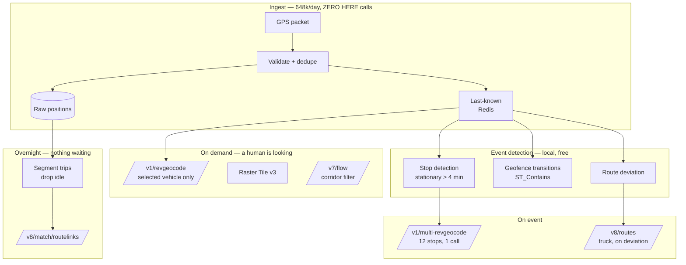

# Fleet Dashboard — End to End

**Problem:** 200 trucks, positions every ten seconds, a dispatcher watching a map.

That is **648,000 packets per day.** The naive dashboard reverse-geocodes each one.

<Warning>
**Nothing expensive touches a GPS packet on arrival.**

Not geocoding. Not matching. Not routing. Not positioning. The packet is validated and stored. Everything else happens on an event, on view, or overnight.
</Warning>

## The architecture



**Daily HERE call budget for 200 trucks:**

| Surface | Calls/day | Why |
|---|---|---|
| Reverse geocode (stops) | ~200 | 12 stops ÷ `multi-revgeocode` batches |
| Reverse geocode (on view) | ~50 | One per vehicle a dispatcher clicks |
| Truck routing | ~200 | Once per dispatch, plus deviations |
| Traffic flow | ~500 | Corridor queries, cached 60 s |
| Route matching | 200 | One per closed trip, overnight |
| Tiles | CDN | |
| **Total** | **~1,150** | Against 648,000 packets |

<Info>
**Instrument the ratio of reverse-geocode calls to detected stops.** It should be near 1.

That single metric tells you more about your bill than any invoice line item.
</Info>

## Prerequisites

- HERE key with Geocoding & Search, Routing, Traffic, Route Matching, Map Rendering
- Redis, PostGIS
- `export HERE_API_KEY="..."`

## Ingest — zero API calls

```python
import redis, psycopg2

r = redis.Redis()

STATIONARY_M = 30       # metres
STOP_DWELL_S = 240      # 4 minutes


def ingest(vehicle_id: str, lat: float, lng: float, ts: int, heading: float):
    """
    Called 648,000 times a day. Does nothing expensive.

    Validated. Stored. Last-known updated. That is all.
    """
    store_raw(vehicle_id, lat, lng, ts, heading)     # append-only

    r.hset(f"veh:{vehicle_id}", mapping={
        "lat": lat, "lng": lng, "ts": ts, "heading": heading,
    })

    # Stop detection is ARITHMETIC. No API.
    if _stationary(vehicle_id, lat, lng, ts):
        emit_stop_event(vehicle_id, lat, lng, ts)     # ← the unit of work

    # Geofence containment is ST_Contains. No API.
    check_geofences(vehicle_id, lat, lng)


def _stationary(vehicle_id, lat, lng, ts) -> bool:
    anchor = r.hgetall(f"anchor:{vehicle_id}")
    if not anchor:
        r.hset(f"anchor:{vehicle_id}", mapping={"lat": lat, "lng": lng, "ts": ts})
        return False

    if _haversine_m(lat, lng, float(anchor[b"lat"]), float(anchor[b"lng"])) > STATIONARY_M:
        r.hset(f"anchor:{vehicle_id}", mapping={"lat": lat, "lng": lng, "ts": ts})
        return False

    return ts - int(anchor[b"ts"]) >= STOP_DWELL_S
```

## Reverse geocode — on the event, in a batch

```python
import requests, os

MULTI = "https://revgeocode.search.hereapi.com/v1/multi-revgeocode"
REV   = "https://revgeocode.search.hereapi.com/v1/revgeocode"
API_KEY = os.environ["HERE_API_KEY"]

COORD_DP = 5   # ~1 m. GPS jitter defeats an exact-match cache.
_cache: dict[str, str] = {}


def label_stops(stops: list[dict]) -> list[dict]:
    """
    Twelve detected stops. ONE request.

    Looping /revgeocode over a list is the same mistake as looping
    routing to build a matrix.
    """
    uncached = [s for s in stops if _key(s) not in _cache]
    if uncached:
        r = requests.post(MULTI, params={"apiKey": API_KEY}, json={
            "items": [{"id": s["id"], "at": f"{s['lat']},{s['lng']}"}
                      for s in uncached]
        }, timeout=30)
        if r.status_code == 403:
            raise RuntimeError("multi-revgeocode not entitled")
        r.raise_for_status()

        for item in r.json().get("items", []):
            _cache[_key_from_id(item["id"], uncached)] = item.get("title")

    return [{**s, "address": _cache.get(_key(s))} for s in stops]


def label_on_view(vehicle_id: str) -> str | None:
    """
    A dispatcher clicked ONE vehicle. Resolve ONE address.
    Do not pre-resolve the other 199.
    """
    v = r.hgetall(f"veh:{vehicle_id}")
    lat, lng = float(v[b"lat"]), float(v[b"lng"])
    k = f"{lat:.{COORD_DP}f},{lng:.{COORD_DP}f}"
    if k in _cache:
        return _cache[k]

    resp = requests.get(REV, params={
        "at": f"{lat},{lng}", "limit": 1, "apiKey": API_KEY,
    }, timeout=10)
    resp.raise_for_status()
    items = resp.json().get("items", [])
    if not items:
        return None

    _cache[k] = items[0]["address"]["label"]
    return _cache[k]


def _key(s): return f"{s['lat']:.{COORD_DP}f},{s['lng']:.{COORD_DP}f}"
```

<Warning>
A returned address is a **nearest match**, not a truth. In rural areas it may be several hundred metres away, on a different property. Store the original coordinate alongside it.

Provide `heading` where telematics supplies it. On a divided highway, a coordinate 15 m from the centreline resolves to either carriageway. Heading disambiguates — free accuracy, fewer "the truck is on the wrong side of the interstate" tickets.
</Warning>

## Truck routing — constraints live on the vehicle record

```python
from dataclasses import dataclass

ROUTER = "https://router.hereapi.com/v8/routes"


@dataclass(frozen=True)
class TruckProfile:
    """
    Model data. NEVER hardcoded at a call site.
    A refactor that drops one of these is invisible in code review
    and returns 200.
    """
    height_cm: int          # centimetres. 410 = 4.1 m
    gross_weight_kg: int    # kilograms
    axle_count: int         # base vehicle + ALL trailers


def dispatch_route(origin: str, dest: str, p: TruckProfile) -> dict:
    if not 100 <= p.height_cm <= 500:
        raise ValueError(f"height_cm={p.height_cm} — metres, not centimetres?")

    r = requests.get(ROUTER, params={
        "transportMode": "truck",
        "origin": origin, "destination": dest,
        "vehicle[height]": p.height_cm,          # `vehicle` supersedes `truck`
        "vehicle[grossWeight]": p.gross_weight_kg,
        "vehicle[axleCount]": p.axle_count,
        "return": "summary,polyline",
        "departureTime": "now",                  # traffic at DEPARTURE, not now
        "apiKey": API_KEY,
    }, timeout=20)

    if r.status_code == 403:
        raise RuntimeError("Truck routing not entitled")
    r.raise_for_status()

    body = r.json()
    if not body.get("routes"):
        # No LEGAL path. Escalate to a dispatcher.
        # Do NOT fall back to car routing.
        raise NoLegalRouteError(body.get("notice"))

    s = body["routes"][0]["sections"][0]
    return {"duration_s": s["summary"]["duration"],
            "polyline": s["polyline"]}
```

<Warning>
**Push the profile to the driver's device.** The most dangerous pattern in mobile fleet software: server-side truck routing with constraints, device-side recalculation without them. The driver deviates, the phone reroutes, and the constraint set never left your backend.
</Warning>

## ETA refresh — without re-routing

```python
from flexpolyline import decode


def refresh_eta(vehicle_id: str, planned_polyline: str, planned_duration_s: int) -> dict:
    """
    Recompute remaining duration from GEOMETRY and current position.
    Arithmetic on data you already hold. Zero API calls.

    Re-routing on every GPS ping to refresh an ETA is the
    reverse-geocode-every-ping mistake wearing a different hat.
    """
    v = r.hgetall(f"veh:{vehicle_id}")
    lat, lng = float(v[b"lat"]), float(v[b"lng"])

    coords = decode(planned_polyline).polyline
    idx, off_route_m = _nearest_vertex(coords, lat, lng)

    if off_route_m > DEVIATION_THRESHOLD_M:
        return {"deviated": True}          # ← NOW call routing. Only now.

    remaining_frac = 1.0 - (idx / max(len(coords) - 1, 1))
    return {
        "deviated": False,
        "eta_s": int(planned_duration_s * remaining_frac),
    }
```

<Info>
**Routing duration is not the delivery promise.** It omits preparation time, service time, and dwell. Model those separately, from your own history. See [ETA Calculation](/use-cases/eta-calculation).
</Info>

## Traffic overlay — corridor, not bounding box

```python
FLOW = "https://data.traffic.hereapi.com/v7/flow"


def route_traffic(planned_polyline: str) -> list[dict]:
    """
    `corridor:` accepts a Flexible Polyline + radius.

    For "what is the traffic on this route," a corridor is dramatically
    cheaper and more relevant than a bbox containing the whole city.
    """
    r = requests.get(FLOW, params={
        "in": f"corridor:{planned_polyline};r=50",
        "locationReferencing": "none",   # MANDATORY. `none` = no geometry back.
        "minJamFactor": 4.0,             # server-side filter
        "apiKey": API_KEY,
    }, timeout=15)
    r.raise_for_status()

    return [{"street": i["location"].get("description"),
             "jam_factor": i["currentFlow"]["jamFactor"]}   # 0 free … 10 closed
            for i in r.json().get("results", [])]
```

<Warning>
`locationReferencing` is mandatory. Omitting it returns `E608051`.

**Traffic is a separate meter.** An overlay left permanently enabled is a cost decision, not a styling one.
</Warning>

## Overnight — trip matching

```python
MATCH = "https://routematching.hereapi.com/v8/match/routelinks"


def match_closed_trip(trip_id: str) -> dict:
    """
    Batch. Nothing is waiting. Latency is worth nothing here.

    Segment and downsample BEFORE submission — in real feeds this removes
    a substantial fraction of points at no information cost.
    """
    points = segment_and_downsample(load_raw_trace(trip_id))

    r = requests.post(MATCH, params={
        "routeMatch": 1,
        "mode": "fastest;truck;traffic:disabled",
        "legal": "access,oneway,thrutraf,turn",
        "apiKey": API_KEY,
    }, data=to_csv(points), headers={"Content-Type": "text/plain"},
       timeout=70)                      # HERE cancels around 50 s of compute
    r.raise_for_status()
    body = r.json()

    # THE audit artifact. Anything less is an assertion.
    return {
        "raw_trace": points,                    # immutable source
        "route_links": body["RouteLinks"],      # segments actually driven
        "map_version": body["MapVersion"],      # ← cite this in any dispute
        "matched_at": int(time.time()),
        "low_confidence": [tp for tp in body["TracePoints"]
                           if tp.get("confidenceValue", 0) < 0.6],
    }
```

<Warning>
[Reverse geocoding](/examples/reverse-geocode) cannot reconstruct a driven route. It returns an address, not a road segment, and it will not survive an IFTA audit.

`MapVersion` is a real response field. A trip matched in March against a March map may match differently in September. Both can be correct. Record which map produced which result.
</Warning>

## Common mistakes

**Reverse-geocoding on packet ingest.** The dominant cost error in fleet software.

**Looping `/revgeocode` over detected stops.** `multi-revgeocode` exists.

**Re-routing on every ping to refresh an ETA.**

**Constraints hardcoded at call sites.** They belong on the vehicle record.

**Constraints on the server, absent on the device.**

**Passing metres where centimetres are expected.** A four-centimetre truck routes anywhere, and returns `200`.

**Falling back to car routing when truck routing finds no path.** Worse than failing.

**Using reverse geocoding to determine which road the vehicle drove.**

**Using reverse geocoding for geofence containment.** `ST_Contains`.

**Polling a city-wide bbox for traffic.** Use `corridor:`.

**Omitting `locationReferencing`.**

**Matching packets instead of trips.**

**Not recording `MapVersion`.**

**Positioning API for outdoor road vehicles.** They have GPS. It is free and better.

## Scaling

**GPS volume is the quiet problem.** Anything per-point multiplies by fleet size × ping rate. 200 trucks at 10 s is 648,000/day. At 1,000 trucks on 5 s, it is 6.5 million.

**Design so that nothing expensive touches a raw ping.**

**Evaluate asset-based pricing.** A countable vehicle population with unpredictable call volume is exactly its shape. A dispatcher who reroutes forty times a day is punished by call-volume pricing for diligence. See [HERE Pricing Explained](/start-here/here-pricing-explained).

## Related

<CardGroup cols={2}>
  <Card title="Vehicle Tracking" href="/use-cases/vehicle-tracking">
    The ingest tier, in full.
  </Card>
  <Card title="Fleet Routing" href="/use-cases/fleet-routing">
    Planning, execution, reconstruction.
  </Card>
  <Card title="ELD Platform" href="/use-cases/eld-platform">
    HOS coupling, IFTA, and the audit artifact.
  </Card>
  <Card title="Route Matching" href="/examples/route-matching">
    `MapVersion`, confidence, and warnings.
  </Card>
</CardGroup>

## HERE documentation

- [Routing API v8](https://www.here.com/docs/bundle/routing-api-developer-guide-v8/page/get-started.html)
- [Geocoding & Search v7](https://docs.here.com/geocoding-and-search/docs/introduction-to-here-geocoding-search-api-v7)
- [Traffic API v7](https://docs.here.com/traffic-api/docs/introduction-to-here-traffic-api-v7)
- [Route Matching v8](https://www.here.com/docs/bundle/route-matching-api-developer-guide/page/README.html)

---

Need production HERE API keys or implementation support?

Placematic is an official HERE Technologies reseller and implementation partner. We have deployed HERE into production ELD systems. [Talk to us](https://placematic.com/contact/).