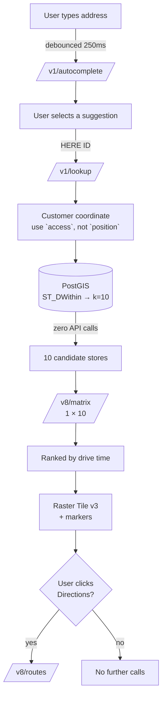

# Store Locator — End to End

**Problem:** A customer types an address. Show them the nearest store by drive time, on a map, with directions.

This example combines four HERE APIs. **Three of them are called at most once per session, and one of them is never called at all until the user clicks "Directions."**

That distribution is the design.

## The flow



| Stage | API calls |
|---|---|
| Typing | 1 per debounced pause, cancelled when superseded |
| Selection | 1 (`/lookup`), then cached forever |
| Shortlist | **0** — PostGIS |
| Ranking | 1 (`/matrix`, 1 × 10) |
| Map | Tiles, behind a CDN |
| Directions | 1, **only on click** |

<Warning>
Most visitors never click "Directions." Computing the route on page render bills for a feature nobody used.
</Warning>

## Prerequisites

- HERE platform API key with Geocoding & Search, Matrix Routing, Routing, and Map Rendering entitlement
- PostGIS with stores in an indexed `geography` column
- `export HERE_API_KEY="..."`

## Schema

```sql
CREATE TABLE stores (
  id          bigserial PRIMARY KEY,
  name        text NOT NULL,
  geom        geography(Point, 4326) NOT NULL,
  opens_at    time,
  closes_at   time,
  has_pharmacy boolean DEFAULT false
);

-- The entire performance story. Without this, sequential scan.
CREATE INDEX stores_geom_idx ON stores USING GIST (geom);

-- Ranking cache. Keyed on a ROUNDED customer coordinate.
CREATE TABLE ranking_cache (
  coord_key   text PRIMARY KEY,        -- "41.884,-87.639" at 3dp
  ranked      jsonb NOT NULL,
  computed_at timestamptz NOT NULL DEFAULT now()
);
```

## Backend

<CodeGroup>
```python Python — the whole pipeline
import os, json, requests, psycopg2

AUTOCOMPLETE = "https://autocomplete.search.hereapi.com/v1/autocomplete"
LOOKUP       = "https://lookup.search.hereapi.com/v1/lookup"
MATRIX       = "https://matrix.router.hereapi.com/v8/matrix"
ROUTER       = "https://router.hereapi.com/v8/routes"
API_KEY      = os.environ["HERE_API_KEY"]

K = 10                 # shortlist size — bounds the matrix, and the bill
COORD_DP = 3           # ~110 m. Ranking is stable within a block.


class EntitlementError(Exception): ...


# ── 1. Autocomplete ───────────────────────────────────────────────────────
def suggest(query: str, at: str, country: str = "USA") -> list[dict]:
    """
    Debouncing lives in the CLIENT. This endpoint bills per request.
    Calling it per keystroke from a backend moves the problem, not solves it.
    """
    if len(query) < 3:
        return []

    r = requests.get(AUTOCOMPLETE, params={
        "q": query, "at": at, "in": f"countryCode:{country}",
        "limit": 5, "apiKey": API_KEY,
    }, timeout=5)
    if r.status_code == 403:
        raise EntitlementError("Autocomplete not entitled")
    r.raise_for_status()

    return [
        {"label": it["address"]["label"],
         "here_id": it["id"],          # ← the key. Never re-geocode the label.
         "highlights": it.get("highlights")}
        for it in r.json().get("items", [])
    ]


# ── 2. Resolve the selection ──────────────────────────────────────────────
def resolve(here_id: str) -> dict:
    """
    The user handed you a HERE ID. Use it.
    Re-geocoding the label string is a wasted call and a worse match.
    """
    r = requests.get(LOOKUP, params={"id": here_id, "apiKey": API_KEY}, timeout=5)
    r.raise_for_status()
    it = r.json()
    # `access` is the road-network entry point. Route to this, not `position`.
    return (it.get("access") or [it["position"]])[0]


# ── 3. Shortlist. Zero API calls. ─────────────────────────────────────────
def shortlist(conn, lat: float, lng: float, open_now: bool = True) -> list[dict]:
    """
    <-> is the KNN operator. Sub-millisecond against the GIST index.
    Business filters (open_now, has_pharmacy) run here, for free,
    BEFORE anything is sent to HERE.
    """
    with conn.cursor() as cur:
        cur.execute("""
            SELECT id, name, ST_Y(geom::geometry), ST_X(geom::geometry)
            FROM stores
            WHERE (%s = false OR (now()::time BETWEEN opens_at AND closes_at))
            ORDER BY geom <-> ST_SetSRID(ST_MakePoint(%s,%s),4326)::geography
            LIMIT %s
        """, (open_now, lng, lat, K))   # MakePoint takes (lng, lat)
        return [{"id": r[0], "name": r[1], "lat": r[2], "lng": r[3]}
                for r in cur.fetchall()]


# ── 4. Rank by drive time. ONE matrix call. ───────────────────────────────
def rank(origin: dict, stores: list[dict]) -> list[dict]:
    """
    1 origin × 10 destinations = ONE request.
    Ten routing calls would be ten. That ratio is the cost structure.
    """
    body = {
        "origins": [{"lat": origin["lat"], "lng": origin["lng"]}],
        "destinations": [{"lat": s["lat"], "lng": s["lng"]} for s in stores],
        "regionDefinition": {"type": "circle",
                             "center": {"lat": origin["lat"], "lng": origin["lng"]},
                             "radius": 100_000},
        "matrixAttributes": ["travelTimes", "distances"],
    }
    r = requests.post(MATRIX, params={"apiKey": API_KEY, "async": "false"},
                      json=body, timeout=20)
    if r.status_code == 403:
        raise EntitlementError("Matrix Routing not entitled")
    r.raise_for_status()

    m = r.json()["matrix"]
    n = m["numDestinations"]
    errs = m.get("errorCodes") or [0] * n

    out = []
    for j, s in enumerate(stores):
        idx = 0 * n + j                # flat, row-major. origin index is 0.
        if errs[idx]:                  # 1=disconnected 2=nomatch 3=restriction
            continue
        out.append({**s,
                    "travel_time_s": m["travelTimes"][idx],
                    "distance_m": m["distances"][idx]})
    return sorted(out, key=lambda s: s["travel_time_s"])


# ── 5. Directions. ON CLICK ONLY. ─────────────────────────────────────────
def directions(origin: dict, store: dict) -> dict:
    r = requests.get(ROUTER, params={
        "transportMode": "car",
        "origin": f"{origin['lat']},{origin['lng']}",
        "destination": f"{store['lat']},{store['lng']}",
        "return": "summary,polyline",   # explicit. never the default.
        "apiKey": API_KEY,
    }, timeout=15)
    r.raise_for_status()

    body = r.json()
    if not body.get("routes"):          # HTTP 200 ≠ route found
        raise ValueError(f"No route: {body.get('notice')}")

    s = body["routes"][0]["sections"][0]
    return {"duration_s": s["summary"]["duration"],
            "length_m": s["summary"]["length"],
            "polyline": s["polyline"]}


# ── Orchestration with the ranking cache ──────────────────────────────────
def nearest_stores(conn, here_id: str) -> list[dict]:
    coord = resolve(here_id)
    key = f"{coord['lat']:.{COORD_DP}f},{coord['lng']:.{COORD_DP}f}"

    with conn.cursor() as cur:
        cur.execute("""SELECT ranked FROM ranking_cache
                       WHERE coord_key = %s AND computed_at > now() - interval '7 days'""",
                    (key,))
        hit = cur.fetchone()
        if hit:
            return hit[0]              # zero HERE calls

    ranked = rank(coord, shortlist(conn, coord["lat"], coord["lng"]))

    with conn.cursor() as cur:
        cur.execute("""INSERT INTO ranking_cache (coord_key, ranked)
                       VALUES (%s,%s)
                       ON CONFLICT (coord_key) DO UPDATE
                       SET ranked = EXCLUDED.ranked, computed_at = now()""",
                    (key, json.dumps(ranked)))
        conn.commit()

    return ranked
```

```javascript Frontend — debounce + cancellation
const AC = "https://autocomplete.search.hereapi.com/v1/autocomplete";
const DEBOUNCE_MS = 250;
const MIN_CHARS = 3;

let timer = null;
let inFlight = null;

/**
 * Two mechanisms prevent the bill:
 *   1. debounce — one request per typing pause
 *   2. AbortController — cancel superseded requests
 * Without both, a 20-character address is 20 transactions.
 */
function onInput(query, at) {
  clearTimeout(timer);
  if (query.length < MIN_CHARS) return render([]);

  timer = setTimeout(async () => {
    inFlight?.abort();                 // the user typed more. stale.
    const ctrl = new AbortController();
    inFlight = ctrl;

    const params = new URLSearchParams({ q: query, at, limit: "5" });
    try {
      // Proxy through YOUR backend. A key in frontend JS is public.
      const r = await fetch(`/api/suggest?${params}`, { signal: ctrl.signal });
      render(await r.json());
    } catch (e) {
      if (e.name !== "AbortError") throw e;  // AbortError is normal
    }
  }, DEBOUNCE_MS);
}
```
</CodeGroup>

## Rendering

```javascript Leaflet — tiles, markers, route
import L from "leaflet";
import { decode } from "@here/flexpolyline";

const map = L.map("map").setView([41.8845, -87.6386], 12);

// Raster Tile v3. NOT the deprecated base.maps.ls.hereapi.com v2 host.
L.tileLayer(
  `/tiles/{z}/{x}/{y}/png8?style=explore.day&size=512`,  // your CDN proxy
  { tileSize: 512, zoomOffset: -1, attribution: "© HERE 2026" }
).addTo(map);

function showStores(ranked) {
  ranked.forEach((s, i) => {
    L.marker([s.lat, s.lng])
      .bindPopup(`${s.name} — ${Math.round(s.travel_time_s / 60)} min`)
      .addTo(map);
  });
}

async function showDirections(storeId) {
  const { polyline } = await fetch(`/api/directions/${storeId}`).then(r => r.json());
  // Flexible Polyline. NOT Google's encoded polyline algorithm.
  const coords = decode(polyline).polyline;   // [[lat, lng], ...]
  L.polyline(coords, { weight: 5 }).addTo(map);
}
```

## Where the cost is

| Surface | Bounded by |
|---|---|
| Autocomplete | Typing pauses × sessions. Debounce is the lever |
| Lookup | Distinct addresses ever entered. Approaches zero |
| Matrix | Cache misses × 1. Bounded by `K`, not store count |
| Tiles | CDN hit rate |
| Directions | Clicks, not page views |

<Info>
**A 5,000-store network and a 50-store network cost the same per lookup.** The shortlist bounds the matrix; the matrix does not scale with your network.

That is why stage 3 exists.
</Info>

## Common mistakes

**Ranking by straight-line distance.** A store 800 m away across a river is not close. This is the defect that gets locators rebuilt.

**Matrix over the whole network.** Shortlist first.

**Ten routing calls instead of one matrix call.**

**Querying `/discover` or `/browse` for your own stores.** Your stores are in your database. A public place index will silently miss the one that opened last week.

**Undebounced autocomplete.**

**No `AbortController`.** Paying to receive stale responses.

**Re-geocoding the selected label** instead of `/lookup` by `id`.

**Routing to `position` instead of `access`.**

**Directions on page render.**

**No `GIST` index.**

**Silently expanding the radius** until something is found. A locator that cheerfully sends people 200 miles.

**Unrestricted API key in frontend JavaScript.**

**No CDN on tiles.**

## Related

<CardGroup cols={2}>
  <Card title="Store Locator" href="/use-cases/store-locator">
    The architecture, and the build-versus-buy decision.
  </Card>
  <Card title="Distance Matrix" href="/examples/distance-matrix">
    Modes, ceilings, and the flat row-major array.
  </Card>
  <Card title="Render a HERE Map" href="/examples/render-map">
    Raster Tile v3, CDN, domain restriction.
  </Card>
  <Card title="Autocomplete an Address" href="/examples/autocomplete-address">
    Debouncing, cancellation, and `/autocomplete` vs `/autosuggest`.
  </Card>
</CardGroup>

## HERE documentation

- [Geocoding & Search v7](https://docs.here.com/geocoding-and-search/docs/introduction-to-here-geocoding-search-api-v7)
- [Matrix Routing v8 OpenAPI](https://matrix.router.hereapi.com/v8/openapi)
- [Routing API v8](https://www.here.com/docs/bundle/routing-api-developer-guide-v8/page/get-started.html)
- [Raster Tile API v3](https://www.here.com/docs/category/raster-tile-api-v3)
- [Flexible Polyline decoders](https://github.com/heremaps/flexible-polyline)

---

Need production HERE API keys or implementation support?

Placematic is an official HERE Technologies reseller and implementation partner. [Talk to us](https://placematic.com/contact/).