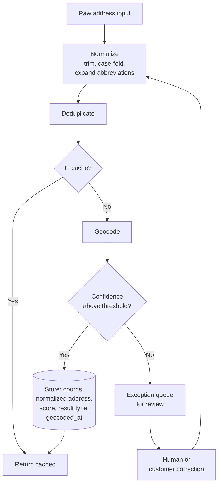

# Address Validation and Data Quality

A geocoder always returns something.

That is the problem. Feed it garbage and it returns a coordinate — plausible, well-formed, and wrong. Persist it without the confidence score and you have converted a guess into a fact that every downstream system now trusts.

## The problem

Failed deliveries. Returned parcels. Routes to the wrong side of town. Revenue maps with a mysterious cluster in a lake.

All of it traces back to the same place: an address that was never validated, geocoded to a fallback, and stored as truth.

The costs compound quietly:

- **Operational** — a failed delivery costs more than the margin on the order
- **Analytical** — a low-confidence geocode corrupts every aggregation it enters
- **Routing** — a route computed to a centroid is a route to nowhere
- **Trust** — nobody re-audits a coordinate that looks like a coordinate

<Warning>
The most dangerous geocoding result is not an error. It is a city-centroid fallback for a house number that does not exist, stored without its confidence score, indistinguishable from a rooftop match.
</Warning>

## Who this is for

Data engineers. E-commerce and logistics platform teams. Anyone whose system stores customer addresses and later acts on them.

## Recommended architecture

Three things are non-negotiable in that diagram: normalization before geocoding, the confidence threshold, and the exception queue.

## Relevant HERE APIs, and why

**[Geocoding](/guides/geocoding)** — `/geocode` for known addresses. **Why:** it returns not just coordinates but result scoring and result types. Both are the point.

**[Batch Geocoding](/guides/batch-geocoding)** — for the backfill. **Why:** four million existing addresses, nothing waiting. It is a job API — create, start, poll, retrieve, delete — not a bulk endpoint.

**Autocomplete** — prevention at the source. **Why:** an address entered from a validated suggestion list does not need correcting later. `/autocomplete` completes *addresses*; `/autosuggest` handles misspellings and suggests *places*. For an address field you want the former.

**Result type filtering.** A query near a shopping centre may resolve to the place, not the street address. If you need a street address, say so.

**House-number fallback policy.** HERE supports falling back when an exact house number is unavailable. Whether that is acceptable depends entirely on whether you are shipping a parcel or scoring a site. Decide explicitly.

## Implementation flow

1. **Normalize at write time.** Trim, case-fold, expand `St` → `Street`. This raises your cache hit rate for free and reduces records that fail to match.
2. **Deduplicate before anything else.** A raw order export contains the same address hundreds of times. Geocoding four million rows containing 900,000 distinct addresses bills for four million.
3. **Check the cache.** Keyed on the *normalized* address, so `123 Main St` and `123 Main Street` hit the same entry.
4. **Geocode the miss.**
5. **Read the confidence score and result type.** Do not skip this step. It is the entire page.
6. **Threshold.** Above it, store. Below it, queue for review.
7. **Store the full record**: coordinates, normalized address, score, result type, and `geocoded_at`.
8. **Prevent at the source** with autocomplete on entry.

<Tip>
The correct end state: every address has coordinates, a normalized form, a confidence score, and a timestamp. New addresses arrive at a trickle and are geocoded in real time. The batch job runs once, at migration, and then rarely.
</Tip>

## Cost considerations

**Deduplicate the input.** The single largest waste in address processing. Order exports repeat enormously.

**Cache permanently.** Addresses do not move. There is no TTL that makes sense shorter than a map release cycle.

**Batch the backfill.** Cheaper per record than real-time, and nothing is waiting.

**Debounce autocomplete.** It fires on keystrokes. Undebounced, you bill once per character typed. 200–300ms.

**Do not re-geocode on every order.** A repeat customer costs nothing if you cached them.

**Instrument cache hit rate before anything else.** A team with a 12% hit rate does not have a pricing problem. They have a caching problem, and it is cheaper to fix than to migrate.

See [Reducing Google Maps Costs](/use-cases/reducing-google-maps-costs).

## Common mistakes

**Discarding the confidence score.** A low-confidence match persisted as truth. This is the mistake.

**No normalization before geocoding.** Lower hit rate, more failures, worse matches.

**No deduplication before batch.** Paying for repetition.

**Accepting a place result in an address field.** Filter by result type. Otherwise you store a shopping centre where a street address belonged.

**No exception queue.** Bad addresses silently become bad coordinates.

**Undebounced autocomplete.**

**Confusing `/autocomplete` with `/autosuggest`.** Addresses versus places.

**Treating Batch API as a synchronous bulk endpoint.** It is a job lifecycle.

**Retrying `404` on batch results.** The job has not succeeded. `204` on the errors endpoint means zero errors — not a failure.

**Accepting house-number fallback silently** when you are shipping a physical parcel to that address.

**Blaming the geocoder for bad input.** Garbage in.

## Production checklist

- [ ] Normalization applied at write time, before any geocoding call
- [ ] Input deduplicated before batch submission
- [ ] Cache keyed on normalized address, hit rate instrumented
- [ ] Confidence score persisted alongside coordinates
- [ ] Confidence threshold defined and enforced
- [ ] Result type filtering applied — address versus place
- [ ] House-number fallback policy decided and documented
- [ ] Exception queue exists and someone owns it
- [ ] Autocomplete debounced at 200–300ms on entry forms
- [ ] `geocoded_at` timestamp stored for every record
- [ ] Batch job lifecycle handled: `429` queued, `204` understood, `404` not retried
- [ ] Jobs deleted after retrieval

## Alternatives and trade-offs

**Google Maps Platform** geocoding is competitive and its place data is better. For address validation specifically the platforms are close enough that this should not drive a migration. If your product also does consumer place discovery, Google's data quality there is categorical, not marginal.

**A dedicated address validation vendor** — Smarty, Loqate, Melissa — validates against postal authority data rather than a map database. For US addresses, USPS-certified validation catches things a geocoder does not: does the house number exist on that street, is the apartment number valid, is the address deliverable. If failed deliveries are a material cost, this is a better tool than a geocoder and you may need both.

<Warning>
Geocoding and address validation are not the same thing. A geocoder tells you where an address *is*. A validation service tells you whether it *exists* and whether mail arrives there. Do not use one for the other's job.
</Warning>

**Postal reference data directly.** USPS, Royal Mail, and equivalents publish authoritative address files. If your volume is high and your market is single-country, this is cheaper and more authoritative than any API. It is also a data pipeline you now maintain.

**libpostal** for normalization, self-hosted. Good at parsing and normalizing international address strings. Does not geocode. Pairs well with any of the above and removes normalization from your API bill entirely.

**No validation at all** is defensible when the address is confirmed by the customer's own action — they receive the parcel, they answer the door. If your failure rate is low and the correction loop is cheap, do not build this.

## Related guides

<CardGroup cols={2}>
  <Card title="Geocoding and Search" href="/guides/geocoding">
    Endpoint selection, confidence scores, and the caching that halves the bill.
  </Card>
  <Card title="Batch Geocoding" href="/guides/batch-geocoding">
    The job lifecycle, and the status codes that are not errors.
  </Card>
  <Card title="Reducing Google Maps Costs" href="/use-cases/reducing-google-maps-costs">
    Cache hit rate is a cost lever before it is a quality lever.
  </Card>
  <Card title="Location Intelligence" href="/use-cases/location-intelligence">
    Where a discarded confidence score silently corrupts every aggregation.
  </Card>
</CardGroup>

Also: [Reverse Geocoding](/guides/reverse-geocoding) · [Logistics Platform](/use-cases/logistics-platform)

## HERE documentation

- [Geocoding & Search v7](https://www.here.com/docs/category/geocoding-search-api-v7)
- [Batch API v7 quick start](https://www.here.com/docs/bundle/batch-api-v7-developer-guide/page/topics/batch-api-quick-start.html)
- [Batch API limits and performance](https://www.here.com/docs/bundle/batch-api-v7-developer-guide/page/topics/limits-and-performance.html)

---

Need help designing or implementing a production HERE solution?

Placematic helps engineering teams select the right HERE APIs, estimate usage, migrate from Google Maps and build production-ready geospatial systems. [Talk to us](https://placematic.com/contact/).