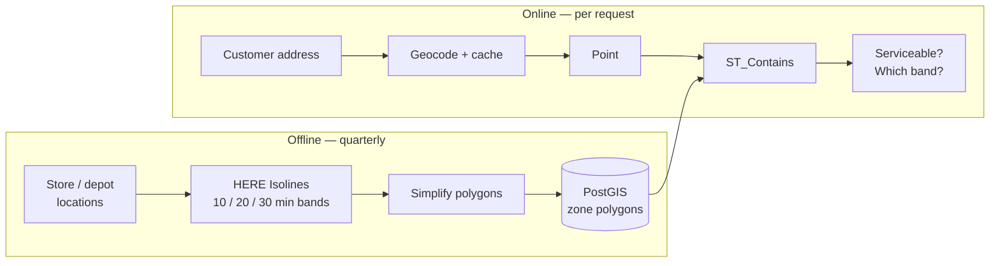

# Calculating Delivery Zones and Service Areas

## The business problem

"Do we deliver to this address?"

Asked thousands of times a day, at checkout, where latency is revenue. The answer must be instant, consistent, and correct.

Most implementations answer it with a radius. The radius is wrong, and it is wrong in a way that survives review because nobody checks whether the circle crosses a lake.

<Warning>
A 10-mile radius around a Chicago store includes several miles of Lake Michigan. A 20-minute drive-time polygon does not. This is not a rounding error. It is a category error that produces confident, defensible, incorrect expansion decisions.
</Warning>

## Typical users

Restaurant and grocery delivery platforms. Retail chains with local fulfilment. Field service companies. Franchise networks defining territory boundaries. Anyone who says "we serve this area."

## Recommended architecture

The entire design is the boundary between those two boxes. Everything expensive happens quarterly. Everything at checkout is a local spatial query.

## Which HERE APIs, and why

**[Catchment Area / Isolines](/guides/catchment-area)** — the polygon. **Why:** it is a reachability set computed against the real road network. Rivers, limited-access highways, and one-way systems shape it. A circle knows none of that.

**[Geocoding](/guides/geocoding)** — address to point. **Why:** containment needs a coordinate. Cache the result permanently; the address is not moving.

**[Matrix Routing](/guides/matrix-routing)** — *store assignment*, not zone definition. **Why:** two stores' 20-minute polygons overlap. "Which store serves this customer" is ambiguous by construction if you answer it with polygon membership. Answer it with actual travel time.

<Info>
This distinction is the one most teams miss. **Isolines define coverage. Matrix defines assignment.** Using isolines for assignment produces arbitrary results in overlap regions, which is exactly where your densest customers are.
</Info>

**Not [Routing](/guides/routing).** A per-customer routing call at checkout is a working implementation with a fatal cost structure.

## Implementation flow

1. **For each location**, compute isolines at your service bands — 10, 20, 30 minutes — using the transport mode you actually operate. Truck zones and car zones differ.
2. **Set departure time to a representative peak hour.** A midnight polygon applied to dinner rush is a fiction.
3. **Simplify** the polygons. They were approximations with a resolution parameter to begin with.
4. **Store in PostGIS** with a spatial index, keyed by location and band.
5. **At checkout**, geocode the address (cache hit, usually), and run `ST_Contains` against the bands.
6. **Return the band**, not just a boolean. Delivery pricing by band becomes a lookup.
7. **Assign the store** by travel time from a cached matrix, not by polygon membership.

## Data flow

Polygons are **derived, versioned, materialized data**. They live in your database. They are refreshed on a schedule, not on demand.

Customer coordinates are **cached, permanent**. Geocode once at first order.

The checkout path touches **no external API**. That is the design goal, and it is achievable.

## Production considerations

**Peak and off-peak are different polygons.** If you deliver across both, store two sets and select by time of day. Otherwise you are promising 30-minute delivery on a polygon computed at 3am.

**From-origin and to-destination reachability differ.** "Which customers can we reach in 30 minutes" is not "which customers can reach us in 30 minutes." One-way streets and highway ramps make these different polygons. Ask the question you mean.

**Edge addresses are genuinely uncertain.** The polygon is an approximation with a resolution setting. An address 20 metres outside the boundary is not definitively unservable. Decide your policy — buffer, manual review, or accept — deliberately.

**Version your zones.** When a customer disputes "you delivered here last month," you need to know which polygon was live.

**Recompute on events, not on a timer.** New location, closed location, changed service promise, major road network change. Quarterly is generous otherwise.

<Tip>
If your system calls an isoline API during a serviceability check, you have built a spatial database with an API bill attached. Materialize the polygons and the checkout path becomes free.
</Tip>

## Scaling

**A 400-store network with three bands is 1,200 isoline calls per quarter.** Not per day. Not per customer. The cost is bounded by locations, not by traffic.

**PostGIS containment against an indexed polygon set is sub-millisecond.** It scales with your traffic for free.

**The geocode cache is the only growing cost**, and it grows with distinct addresses, not with orders. A repeat customer costs nothing.

**Overlapping polygons in dense markets** grow the containment result set. Return all matching bands, then resolve assignment by travel time.

## Cost optimization

1. **Materialize.** Every isoline call at request time is waste.
2. **Cache geocoding permanently**, keyed on normalized address.
3. **Deduplicate addresses** before batch geocoding your existing customer table.
4. **Simplify polygons** before storage. Smaller geometry, faster queries, no accuracy loss you were entitled to anyway.
5. **Coarse resolution for coverage maps.** The map renders identically at the zoom shown.
6. **Cache the store-assignment matrix.** Store locations do not move.

Cost becomes a function of your location count, which is a business number you already know.

## Common mistakes

**Radius buffers.** Lakes, rivers, limited-access highways.

**Calling the isoline API at checkout.**

**Ignoring departure time.**

**Car isolines for a truck-based service.**

**Assigning customers to stores by polygon membership.** Overlaps make this arbitrary.

**Requesting distance range when you meant time range.** Both valid. One answers your question.

**Confusing from-origin with to-destination reachability.**

**Treating polygon vertices as authoritative for edge addresses.**

**Not versioning zones.** Then disputing history.

**Re-geocoding known customer addresses on every order.**

## Alternatives — honestly

**Google Maps Platform** offers distance and duration APIs from which you could construct a coverage approximation, but it does not expose isoline polygons in an equivalent form. For this use case HERE is the more direct fit.

**Building it yourself on OSRM** with an isochrone library is entirely feasible and genuinely free, if you already run OSM infrastructure. You inherit map freshness and truck attribution as engineering. For a delivery platform where zones change quarterly, the cost of the API is likely below the cost of the maintenance.

**A radius really is fine** if your delivery area is a dense uniform grid, distances are short, and the stakes are low. A 5-minute walking radius in central Manhattan is close to a circle. Be honest about which case you are in — the isoline call costs money and complexity.

**For pure containment against hand-drawn zones** — where a human drew the boundary and the road network is irrelevant — you need no routing API at all. PostGIS and a polygon editor. Do not buy an API to solve a problem you have already solved.

## Related guides

<CardGroup cols={2}>
  <Card title="Catchment Area" href="/guides/catchment-area">
    Isolines, range types, resolution, and why the polygon is an approximation.
  </Card>
  <Card title="Matrix Routing" href="/guides/matrix-routing">
    The right tool for assigning customers to locations.
  </Card>
  <Card title="Geocoding and Search" href="/guides/geocoding">
    Caching, normalization, and the confidence score you should be storing.
  </Card>
  <Card title="Batch Geocoding" href="/guides/batch-geocoding">
    Backfilling coordinates for an existing customer table.
  </Card>
</CardGroup>

Also: [Restaurant Delivery](/use-cases/restaurant-delivery) · [Store Locator](/use-cases/store-locator) · [Site Selection](/use-cases/site-selection)

## HERE documentation

- [Routing API v8](https://www.here.com/docs/category/routing-api-v8) — isoline routing
- [Geocoding & Search v7](https://www.here.com/docs/category/geocoding-search-api-v7)

## Placematic

- [Catchment Area](https://placematic.com/here-location-services/catchment-area/)
- [UpInsight — spatial analytics](https://placematic.com/spatial-data-analytics/)

---

See the packaged solution for your industry: [Logistics & Delivery](https://placematic.com/solutions/logistics/)

Need help designing or implementing a production HERE solution?

Placematic helps engineering teams select the right HERE APIs, estimate costs, migrate from Google Maps and build production-ready geospatial systems. [Talk to us](https://placematic.com/contact/).