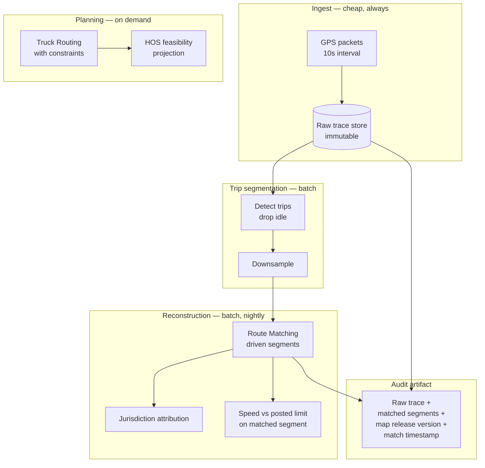

# Building an ELD Platform

An ELD platform's location layer has one property that distinguishes it from every other fleet system: **a regulator may ask you to prove it.**

Not "show me the route." Prove which road segments the vehicle travelled, on what date, against which map, and why you believe it.

That requirement shapes the architecture more than routing does.

## The problem

Three obligations, each with a different location dependency:

**Hours of Service.** Drive time is computed from the vehicle's motion. But *projected* HOS feasibility — can this driver legally complete this route — depends on the route. Change the route, change the projection.

**IFTA.** Miles driven per jurisdiction, reported quarterly, subject to audit. This requires the *travelled* road segments, attributed to states or provinces. A nearest-address lookup cannot produce this.

**Route planning.** Trucks. Physical constraints. A route your platform produces that a driver cannot legally or physically drive is a defect with consequences beyond the software.

<Warning>
[Reverse geocoding](/guides/reverse-geocoding) resolves a coordinate to a nearby address. It cannot tell you which road the vehicle drove, and it will not survive an audit. This distinction is the most consequential architectural fact on this page.
</Warning>

## Who this is for

ELD vendors. Fleet compliance platforms. Telematics providers adding compliance modules. Carriers building in-house.

## Recommended architecture

Nothing expensive touches a GPS packet on arrival. Everything defensible happens in batch.

## Relevant HERE APIs, and why

**[Route Matching](/guides/route-matching)** — the compliance core. **Why:** it returns the road segments the vehicle actually travelled, with attributes attached. Jurisdiction attribution and speed compliance both require the *matched* segment, not the nearest road. This is the API that makes an ELD platform auditable.

**[Truck Routing](/guides/truck-routing)** — planning. **Why:** `transportMode=truck` selects the engine. Height in centimetres, `grossWeight` in kilograms, `axleCount` including trailers describe the vehicle. Omit them and HERE returns a route no truck can drive, with no warning.

**[Reverse Geocoding](/guides/reverse-geocoding)** — stop labels for humans. **Why:** dispatchers read addresses. Use `POST /multi-revgeocode` on detected stops, never on packet ingest.

**[Matrix Routing](/guides/matrix-routing)** — if you also do dispatch. See [Fleet Routing](/use-cases/fleet-routing).

## The audit artifact

This is the section that justifies the architecture.

For any trip a regulator might question, you must be able to produce:

1. **The raw trace** — the observations, unmodified
2. **The matched segments** — your reconstruction
3. **The map release version** used to produce the match
4. **The timestamp** of matching

<Warning>
A trip matched in March against a March map may match differently in September against a September map. Both matches can be correct. Without recording which map produced which result, you cannot explain the discrepancy — and you will be asked to.
</Warning>

Matched output is a **derivation**. Keep the source. When a driver, a carrier, or an auditor disputes the reconstruction, the raw trace is your only defence.

## Implementation flow

1. **Ingest GPS. Do nothing expensive.** Store it. No geocoding, no matching, no positioning.
2. **Segment trips on close.** Detect start, stop, and idle. Drop the parked portions — a vehicle idling for four hours emits thousands of points describing a parking space.
3. **Downsample.** Beyond a certain density, additional points add cost and no information.
4. **Match, in batch, overnight.** Nothing is waiting.
5. **Attribute segments to jurisdictions.** This feeds IFTA.
6. **Compare observed speed against the matched segment's posted limit.** Not the nearest road's.
7. **Persist the full audit artifact.**
8. **Plan routes with truck constraints**, and couple HOS projections to the route explicitly.

## HOS and routing are coupled

Most ELD platforms model these as independent modules. They are not.

If the planned route changes, the projected drive time changes, and the driver's remaining hours change. A dispatcher who reroutes at 2pm has altered the HOS projection whether or not the system says so.

Model the dependency explicitly. A route object should carry its HOS implications, or the two systems will disagree and the driver will trust neither.

<Tip>
Test that a re-route triggers an HOS recomputation. It is a one-line test and it catches a class of bug that surfaces during an audit rather than during QA.
</Tip>

## Cost considerations

**Never reverse-geocode a GPS packet.** A 200-vehicle fleet at a ten-second ping rate produces 648,000 points a day. Any per-point API call multiplies by that number. Geocode detected stops. Instrument the ratio: reverse-geocode calls to detected stops should be near 1.

**Segment before matching.** In real telematics feeds, dropping idle periods removes a substantial fraction of submitted points. Do this in your pipeline, not in HERE's.

**Downsample dense traces.** Sub-second sampling submitted raw is waste.

**Match trips, not packets.** Matching a partial trace and re-matching as points arrive burns transactions and produces inconsistent history.

**Store the matched result.** Re-matching for a report six months later bills again *and* may produce a different answer against an updated map.

**Batch everything retrospective.** Latency is worth nothing to you here and it costs money.

**Evaluate asset-based pricing.** An ELD platform has a countable tracked-vehicle population and unpredictable call volume. Call-volume pricing punishes a dispatcher for operational diligence. See [HERE Pricing Explained](/start-here/here-pricing-explained).

<Info>
Asset-based pricing availability depends on contract tier. Confirm before it becomes load-bearing in your unit economics.
</Info>

## Common mistakes

**Using reverse geocoding to reconstruct driven routes.** It returns addresses. Audits ask about road segments.

**Reverse-geocoding on packet ingest.** The dominant cost error in telematics.

**Matching packets instead of trips.**

**Submitting the parked portion of a trace.**

**Not persisting the raw trace.** The matched output is a derivation.

**Not recording the map release version** on compliance records.

**Comparing GPS speed against the nearest road's limit.** False violations on frontage roads parallel to highways. Drivers notice. So do lawyers.

**Treating HOS and routing as independent.**

**Setting `transportMode=truck` and stopping there.** The engine is selected. The vehicle is not described.

**Passing metres where centimetres are expected.** A four-centimetre truck routes anywhere.

**Ignoring sampling rate and blaming the matcher.** Sampling rate is the dominant quality input, and it is a device configuration decision made before any API is called.

## Production checklist

- [ ] GPS ingest does nothing expensive per packet
- [ ] Raw traces stored immutably, retained per your compliance obligation
- [ ] Trip segmentation drops idle periods before matching
- [ ] Traces downsampled before submission
- [ ] Matching runs as a batch job on trip close
- [ ] Audit artifact persisted: raw trace, matched segments, map release version, match timestamp
- [ ] Speed compliance computed against the matched segment, not the nearest road
- [ ] Reverse geocoding triggered by stop detection; call-to-stop ratio near 1
- [ ] Truck constraints stored on the vehicle record, applied to every routing call
- [ ] Trap-geometry assertions in CI: 11foot8 bridge (Durham NC), Storrow Drive (Boston), Southern State Parkway (Long Island) — with a `car`-mode control
- [ ] Re-route triggers HOS recomputation
- [ ] Low-confidence matches surfaced, not silently persisted

## Alternatives and trade-offs

**Google Maps Platform** has no equivalent to Route Matching. Without matched road segments there is no defensible jurisdiction-mile calculation and no reliable speed compliance. It also cannot express commercial vehicle constraints. For an ELD platform's core, it is not a candidate. It remains fine for any consumer-facing address autocomplete you expose.

**Self-hosted map matching** — OSRM's matching service, Valhalla's Meili — is genuinely capable. You inherit map freshness, truck attribute curation, and jurisdiction boundary maintenance as ongoing engineering. Realistic if you have a GIS team. For most ELD vendors this becomes a second product nobody is funded to own, and the map version you must cite in an audit is one you now maintain.

**A dedicated IFTA vendor** solves the reporting workflow, jurisdiction boundaries, and filing. If IFTA is a checkbox rather than a differentiator, buy it. You still need matched segments to feed it.

**Nearest-road snapping** instead of proper map matching is used, and it is wrong. It fails at interchanges, on divided highways, and on frontage roads — precisely the geometry that generates disputed miles.

**Positioning APIs** do not help here. Hybrid radio positioning produces estimates with uncertainty radii; feeding them to a map matcher produces confident nonsense. See [Positioning](/guides/positioning).

## Related guides

<CardGroup cols={2}>
  <Card title="Route Matching" href="/guides/route-matching">
    Map matching, IFTA, and why the matched segment is the only defensible answer.
  </Card>
  <Card title="Truck Routing" href="/guides/truck-routing">
    Constraints, units, and the trap geometry that proves they apply.
  </Card>
  <Card title="Vehicle Tracking" href="/use-cases/vehicle-tracking">
    Ingesting GPS at scale without touching an API per packet.
  </Card>
  <Card title="Fleet Routing" href="/use-cases/fleet-routing">
    The dispatch layer alongside the compliance layer.
  </Card>
</CardGroup>

Also: [Reverse Geocoding](/guides/reverse-geocoding) · [Hazmat Routing](/use-cases/hazmat-routing) · [HERE Pricing Explained](/start-here/here-pricing-explained)

## HERE documentation

- [HERE Routing API v8](https://www.here.com/docs/category/routing-api-v8)
- [Routing API v8 reference](https://www.here.com/docs/bundle/routing-api-v8-api-reference/page/index.html)

## Placematic

- [Truck Routing](https://placematic.com/here-location-services/truck-routing/)
- [Route Matching](https://placematic.com/here-location-services/here-route-matching/)

---

Need help designing or implementing a production HERE solution?

Placematic helps engineering teams select the right HERE APIs, estimate usage, migrate from Google Maps and build production-ready geospatial systems. We have deployed HERE into production ELD systems. [Talk to us](https://placematic.com/contact/).