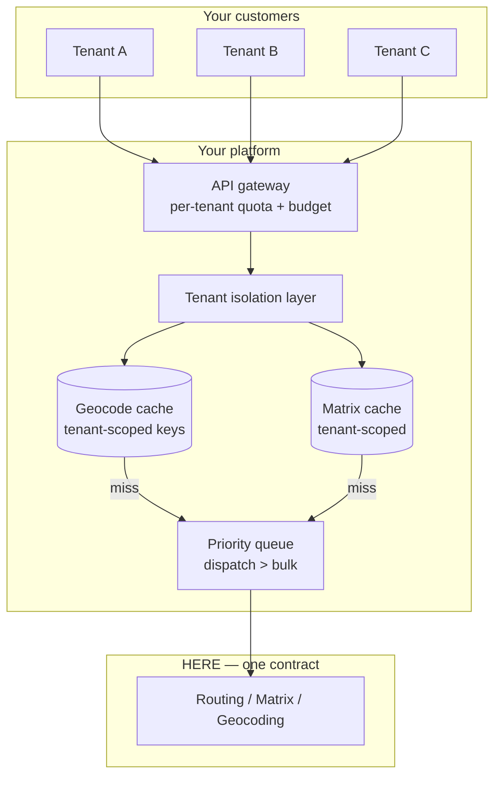

# Embedding a Routing API in Your SaaS Product

You are not a fleet company. You sell software to fleet companies.

That changes almost every architectural decision below, and it introduces one commercial question that must be answered before a line of code is written: **are you permitted to expose this API to your customers?**

## The problem

Your product needs routing, geocoding, or maps. Your customers use it. From HERE's perspective there is one contract — yours.

Which means:

- One tenant's bulk operation can rate-limit another tenant's dispatch
- One tenant's inefficient integration appears on your invoice
- One shared geocode cache is a data leak waiting for a curious engineer
- Your unit economics invert if you bill per shipment and pay per API call

None of this is a routing problem. All of it is the reason embedding is different from building.

## Who this is for

B2B SaaS product and engineering leaders adding location features. TMS, ELD, field service, delivery, and logistics platform vendors. Anyone whose customers will consume location functionality through your product rather than calling HERE directly.

## Recommended architecture

**The gateway is not optional.** Without a per-tenant budget enforced before the request leaves your infrastructure, your largest customer degrades service for everyone and you find out from a support ticket.

## Relevant HERE APIs, and why

**[Routing](/guides/routing)** — the leg your customer's vehicle drives. `transportMode` and vehicle constraints are **tenant data**, not defaults in your request builder.

**[Matrix Routing](/guides/matrix-routing)** — where your customers unknowingly loop. If your product exposes "distance between these locations," someone will call it in a loop. Expose a batch endpoint that maps to a matrix call, or you will pay for their loop.

**[Geocoding](/guides/geocoding)** — cached per tenant. Never globally.

**[Truck Routing](/guides/truck-routing)** — if any customer routes commercial vehicles, vehicle profiles must be tenant-scoped model data. A hardcoded height in your routing service is a bridge strike in someone else's fleet.

**[Authentication](/start-here/authentication)** — your customers never see a HERE key. Your platform holds one credential. Their access control is yours to build.

## Implementation flow

1. **Answer the reselling question first.** See below. It is a contract term, not an implementation detail.
2. **Build the gateway before the feature.** Per-tenant quota, budget, and priority queue.
3. **Scope every cache by tenant.** Geocode, matrix, isoline, route.
4. **Model tenant configuration.** Vehicle profiles, transport modes, service rules. All tenant data.
5. **Expose batch shapes, not loops.** If your API returns one route, your customer will call it a thousand times.
6. **Instrument per-tenant call volume** from day one. You cannot price a feature whose cost you cannot attribute.
7. **Decide your billing model** before you launch, not after a customer discovers unlimited routing.

## The reselling question

<Warning>
Exposing HERE APIs to your customers may constitute redistribution, which carries different licensing terms than internal use. **Resolve this before you build.** Discovering it during a customer's security review, or during your own contract renewal, is expensive.
</Warning>

There is a spectrum:

- **Internal consumption** — your platform calls HERE, renders a map, shows an ETA. Your customer sees a feature.
- **Pass-through** — your API returns HERE's response shape to your customer's engineers.
- **Redistribution** — your customer builds against what is effectively a HERE proxy.

The further right you sit, the more likely you need explicit terms. Placematic USA LLC is the contracting party for HERE services; this is exactly the conversation a Gold Partner exists to have with you before you ship, not after.

## Cost considerations

**Your invoice is the sum of your customers' inefficiency.** A tenant that reverse-geocodes every GPS ping generates a bill you pay and they do not see. Two responses:

- Fix it at the gateway: enforce sane call patterns, cache aggressively, expose only the shapes you can afford.
- Meter and pass through: attribute cost per tenant, and price the feature accordingly.

Most platforms do the first and discover they never needed the second.

**Your billing unit and your cost unit must not diverge.** Billing per shipment while paying per API call means a customer with an inefficient integration destroys your margin on that account. Either bound the calls per shipment, or bill on something correlated with them.

**Evaluate asset-based pricing** if your customers' vehicle populations are countable and their call volumes are not. See [HERE Pricing Explained](/start-here/here-pricing-explained).

**Rate limits are shared.** HERE sees one contract. Queue and prioritize at your layer: dispatch traffic ahead of bulk onboarding, always.

**Batch onboarding is bursty.** A large tenant arrives with a million addresses. Batch API concurrency limits are per-contract. Queue onboarding jobs so they do not starve nightly enrichment for every other tenant.

## Common mistakes

<Warning>
**A shared geocode cache across tenants.** The tempting optimization — addresses are addresses — is where multi-tenant spatial systems leak. Tenant A's customer list is inferable from cache hit patterns. The savings were never worth it.
</Warning>

**No per-tenant call budget.** One tenant `429`s everyone.

**Vehicle constraints hardcoded in the routing service.** They belong to the tenant, and to the load.

**Exposing a single-route endpoint** and being surprised when customers loop it.

**Building the feature before answering the reselling question.**

**No per-tenant cost attribution.** You cannot price what you cannot measure.

**Passing HERE error codes through unchanged.** Your customer does not have a HERE contract and cannot act on a `403` entitlement error. Translate it.

**Assuming your customers will use the API correctly.** They will not. Design the surface so that misuse is bounded.

**Treating rate limits as a technical problem.** A persistent `429` means your contracted quota does not match your aggregate workload. That is a commercial conversation.

## Production checklist

- [ ] Reselling and redistribution terms confirmed in writing
- [ ] Per-tenant quota and budget enforced at the gateway, before egress
- [ ] Every cache keyed by tenant; verified with a cross-tenant test
- [ ] Priority queue: interactive dispatch ahead of bulk operations
- [ ] Vehicle profiles and transport modes stored as tenant configuration
- [ ] Batch-shaped endpoints exposed instead of single-item endpoints
- [ ] Per-tenant call volume and cost attributed and dashboarded
- [ ] HERE error codes translated into terms your customer can act on
- [ ] Onboarding jobs isolated from nightly enrichment concurrency
- [ ] Billing unit correlated with cost unit

## Alternatives and trade-offs

**Have your customers bring their own key.** Clean commercially — their contract, their invoice, their rate limit. Terrible for onboarding: every customer now runs a procurement process before they can use your feature. This kills product-led growth. It is the right answer for enterprise-only products with long sales cycles, and the wrong answer for everyone else.

**Self-host OSRM** and eliminate the licensing question entirely. You now maintain truck attributes, traffic, and map freshness for every customer. Viable if location is your core competency. If you are a TMS vendor, it is a second product nobody is funded to own.

**Google Maps Platform** has well-trodden terms for embedding and a large ecosystem. It cannot express commercial vehicle constraints. If any of your customers route trucks, this decides it.

**Mapbox** offers strong developer experience and clear embedding terms. Same constraint gap.

**Build only what your customers cannot.** The strongest version of this architecture exposes *your* domain logic — territories, delivery zones, dispatch — computed on materialized spatial data in your own database, with HERE calls bounded and rare. See [Delivery Zones](/use-cases/delivery-zones) for the materialization pattern.

## Related guides

<CardGroup cols={2}>
  <Card title="Authentication" href="/start-here/authentication">
    Key handling, rotation, and why `403` is not `401`.
  </Card>
  <Card title="Matrix Routing" href="/guides/matrix-routing">
    The batch shape to expose so customers do not loop.
  </Card>
  <Card title="HERE Pricing Explained" href="/start-here/here-pricing-explained">
    Call volume versus asset-based, and why your billing unit matters.
  </Card>
  <Card title="Logistics Platform" href="/use-cases/logistics-platform">
    The multi-tenant TMS architecture in full.
  </Card>
</CardGroup>

Also: [Reducing Google Maps Costs](/use-cases/reducing-google-maps-costs) · [Getting a HERE API Key](/start-here/getting-a-here-api-key) · [Truck Routing](/guides/truck-routing)

---

Need help designing or implementing a production HERE solution?

Placematic helps engineering teams select the right HERE APIs, estimate usage, migrate from Google Maps and build production-ready geospatial systems. As a HERE Gold Partner, Placematic USA LLC is the contracting party — which makes the redistribution conversation a short one. [Talk to us](https://placematic.com/contact/).