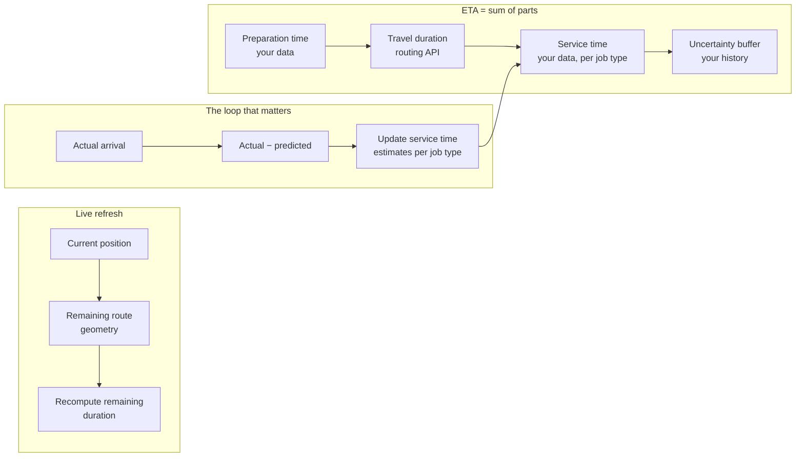

# Calculating Accurate ETAs

A routing API returns a travel duration. A customer receives a promise.

The gap between those two things is where every ETA system fails, and no amount of vendor switching closes it.

## The problem

Your ETA is consistently optimistic. Customers notice. Support absorbs it.

The instinct is to blame the routing engine. Usually the routing engine is fine. What is missing is everything the routing engine cannot know:

- **Service time** at the stop — unloading, signature, elevator, the customer who takes four minutes to answer the door
- **Preparation time** before departure — food cooking, order picking, vehicle loading
- **Dwell time** between arrival and the next departure
- **Traffic at the departure time**, not at the time you computed the route
- **Driver behaviour** — breaks, deviations, the second coffee

A routing duration is the time a vehicle spends moving. That is rarely the number the customer cares about.

<Warning>
Presenting a routing duration as an ETA is the most common source of ETA inaccuracy, and it is a modelling error, not an API error. It survives migration.
</Warning>

## Who this is for

Product engineers on delivery, logistics, field service, and dispatch systems. Anyone whose UI shows an arrival time.

## Recommended architecture

The feedback loop is the part teams skip and the part that produces accuracy.

## Relevant HERE APIs, and why

**[Routing](/guides/routing)** — travel duration with traffic. **Why:** the moving portion. Set `departureTime` explicitly; traffic conditions at 3am and 5pm produce different durations for the same path.

**[Matrix Routing](/guides/matrix-routing)** — ETAs for many origin-destination pairs. **Why:** if you are computing ETAs for a list — every courier to every order, every technician to every job — that is a matrix, not a loop of routing calls.

**[Truck Routing](/guides/truck-routing)** — if the vehicle is commercial. A car route's duration is not a truck's duration, because it is not the truck's route.

**Nothing else.** Preparation time, service time, and dwell time are your data. No mapping API has them.

## Implementation flow

1. **Decompose the ETA** into preparation + travel + service + buffer. Store each separately. Present the sum.
2. **Set `departureTime` explicitly** on every routing call. Never let it default when the departure is in the future.
3. **Instrument actual versus predicted** for each component, per job type, per time of day.
4. **Estimate service time from history**, not from a product manager's guess. A 20-minute estimate on a 90-minute job destroys the entire downstream sequence.
5. **Refresh from remaining geometry**, not by re-routing. Given current position and the route polyline, recompute the remaining duration locally.
6. **Recompute the route only on deviation** — the driver left the planned path.
7. **Communicate uncertainty.** A range beats a false point estimate.

<Tip>
Instrument the residual — actual minus predicted — broken down by component. Most teams discover that travel duration is accurate to within a few percent and service time is off by 40%. That tells you where to spend the next quarter.
</Tip>

## Cost considerations

**Do not re-route on every GPS ping.**

This is the dominant ETA cost trap. A courier fleet emitting positions every ten seconds, with a routing call per ping to "refresh the ETA," generates a bill proportional to fleet size × ping rate. It is the same architectural error as [reverse-geocoding every ping](/guides/reverse-geocoding).

Recompute the remaining duration from the route geometry and current position. That is arithmetic on data you already hold. Call the routing API when the driver deviates.

**Batch ETA computation is a matrix.** "ETA from each of 40 couriers to this order" is one matrix call, not 40 routing calls.

**Cache route geometry, not durations.** The path between two fixed points is stable for hours. The duration is not. Different TTLs, or you serve stale arrival times.

**Set `return` explicitly.** Nothing consumes turn-by-turn `instructions` when you only need `summary`.

See [HERE Pricing Explained](/start-here/here-pricing-explained).

## Common mistakes

**Presenting routing duration as the ETA.** Preparation and service time are missing.

**Letting `departureTime` default.** A route computed at 2pm for a 6pm departure inherits 2pm traffic.

**Re-routing on every position update.** Expensive and unnecessary.

**Guessing service time.** Instrument it. It is the largest error term.

**Using car routing for commercial vehicles.** Different path, different duration.

**Looping routing calls for a list of ETAs.** Matrix.

**A single point estimate with no uncertainty.** "Arriving at 3:14pm" is a promise you cannot keep. "Between 3:05 and 3:25" is one you can.

**No feedback loop.** Your ETA accuracy will never improve, on any platform.

**Optimistic buffers.** Systems drift optimistic because nobody is punished for a late buffer and everybody is punished for a late arrival.

**Ignoring dwell time between stops.** Multi-stop ETAs compound the error at every hop.

## Production checklist

- [ ] ETA decomposed into preparation, travel, service, and buffer — stored separately
- [ ] `departureTime` set explicitly on every future-dated routing call
- [ ] Transport mode and vehicle constraints match the actual vehicle
- [ ] Actual-versus-predicted instrumented per component, per job type
- [ ] Service time estimates derived from history and refreshed
- [ ] ETA refresh computed from remaining geometry, not by re-routing
- [ ] Route recomputation triggered by deviation, not by timer
- [ ] Multi-item ETA computation uses matrix, not routing loops
- [ ] Uncertainty communicated to the end user as a range
- [ ] Multi-stop error compounding modelled explicitly

## Alternatives and trade-offs

**Google Maps Platform** offers comparable traffic-aware duration estimates. For passenger vehicles the accuracy difference is small enough that it should not drive a platform decision. For commercial vehicles the route itself differs, so the duration does too.

**Historical duration from your own telematics** frequently beats any routing API for repeated lanes. If a courier drives the same depot-to-zone route daily, your own data is a better predictor than a generic model. Use the API for unfamiliar routes; use your history for familiar ones.

**A learned model on top of routing duration** — gradient-boosted residuals against features like time of day, weather, and job type — is a well-trodden path. It needs volume, and it needs the instrumentation above regardless. Build the instrumentation first; the model may prove unnecessary.

**No routing API at all** is viable for fixed-schedule operations. A route that runs at the same time every day, on the same path, has an ETA you can read from history.

**Straight-line distance × average speed** is worse than it sounds and used more often than anyone admits. It fails at exactly the moment the customer is paying attention: dense urban delivery.

## Related guides

<CardGroup cols={2}>
  <Card title="Routing" href="/guides/routing">
    `departureTime`, traffic, and the `200` that is not success.
  </Card>
  <Card title="Matrix Routing" href="/guides/matrix-routing">
    Many ETAs, one call.
  </Card>
  <Card title="Vehicle Tracking" href="/use-cases/vehicle-tracking">
    Ingesting GPS without re-routing on every packet.
  </Card>
  <Card title="Restaurant Delivery" href="/use-cases/restaurant-delivery">
    Where preparation time makes the routing duration nearly irrelevant.
  </Card>
</CardGroup>

Also: [Field Service](/use-cases/field-service) · [Last-Mile Delivery](/use-cases/last-mile-delivery) · [Truck Routing](/guides/truck-routing)

## HERE documentation

- [Routing API v8](https://www.here.com/docs/category/routing-api-v8)
- [Matrix Routing API v8](https://www.here.com/docs/category/matrix-routing-api-v8)

---

Need help designing or implementing a production HERE solution?

Placematic helps engineering teams select the right HERE APIs, estimate usage, migrate from Google Maps and build production-ready geospatial systems. [Talk to us](https://placematic.com/contact/).