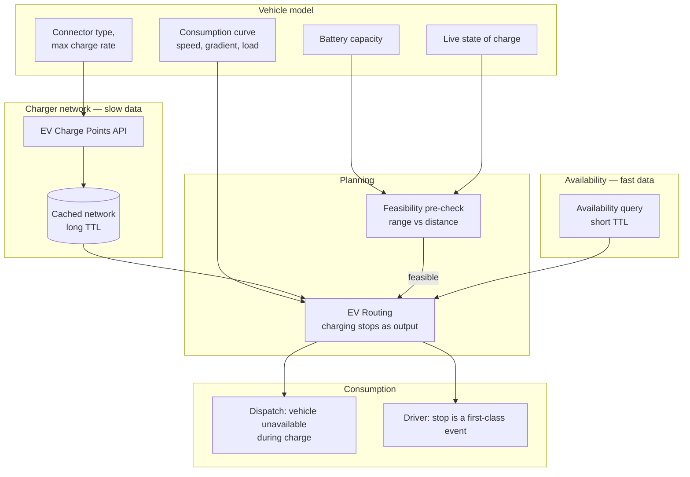

# Building EV Charging Applications

## The business problem

An electric vehicle's ability to reach charger three depends on whether it stopped at charger one.

That single sentence is why you cannot build EV routing by filtering a car route against a charger table. Energy state changes along the path, and the decision to stop is itself a routing decision.

## Typical users

EV fleet operators. Charging network operators. Fleet electrification consultancies. EV navigation and range-anxiety apps. Logistics companies evaluating Class 8 electrification.

## Recommended architecture

## Which HERE APIs, and why

**[EV Routing](/guides/ev-routing)** — routes that reach their destination. **Why:** it accepts a consumption model and current charge state, and returns charging stops as routing *outputs*. This is a routing capability, not a post-processing step.

**HERE EV Charge Points API** — the infrastructure. **Why:** station locations, connector types, power feeds, availability, tariffs. It is a **separate product** at [v2 and v3](https://www.here.com/docs/category/ev-charge-points-api-v3), with a documented migration path.

<Warning>
EV routing and EV Charge Points are different APIs with different entitlements and separate bills. A key that routes EVs may return `403` from the charge points endpoint. Confirm both before you architect. See [Getting a HERE API Key](/start-here/getting-a-here-api-key).
</Warning>

**[Matrix Routing](/guides/matrix-routing)** — matrix responses can include consumption alongside time and distance. **Why:** for fleet assignment, "which vehicle can reach this job on current charge" is a matrix question with an energy dimension.

**[Catchment Area](/guides/catchment-area)** — consumption-range isolines. **Why:** "everywhere this vehicle can reach on its current charge" is a reachability polygon with `consumption` as the range type, not time or distance.

**[Tour Planning](/guides/tour-planning)** — multi-stop EV dispatch, where charging time competes with service time in the schedule.

## Implementation flow

1. **Model the vehicle properly.** Battery capacity, consumption curve as a function of speed and gradient, connector type, maximum charge rate. This is a database record.
2. **Pre-check feasibility cheaply.** Range versus straight-line distance rejects most infeasible assignments before you compute anything.
3. **Cache the charger network** with a long TTL. Stations move slowly.
4. **Query availability separately**, with a short TTL, only when it matters.
5. **Route with live state of charge** where telematics provides it.
6. **Surface charging stops explicitly** to dispatch and to the driver.
7. **Model the vehicle as unavailable** for the charge duration.

## Data flow

**Two data speeds, and conflating them is the defining error of this domain.**

The charger **network** — where stations are, what connectors they have — changes over months. Cache it aggressively.

**Availability** — is this charger free right now — changes by the minute, and has a latency that route computation does not.

<Warning>
A route computed against static charger data will confidently send a truck to an occupied or out-of-service charger, at the exact moment the vehicle has no range to reach an alternative. This is worse than not routing at all.
</Warning>

## Production considerations

**Charge state is an input, not an assumption.** A vehicle at 22% produces a materially different route than the same vehicle at 90%. If telematics does not provide live SoC, say so in the UI. Do not silently substitute full battery.

**Consumption is a curve, not a constant.** Linear models are optimistic on highways and catastrophically optimistic on grades. Auxiliary load — climate control, refrigeration — is not negligible on a delivery van in July.

**Truck charging is not car charging.** HERE documents EV truck charging locations as a distinct concern. Connector types, power levels, and physical site access differ. A Class 8 vehicle routed against passenger charging infrastructure is routed to sites it cannot physically enter.

This is not a solved problem in the market. Charging corridors for commercial vehicles are sparse. Be honest with customers about what the data supports.

**Charging stops are first-class schedule events.** A driver needs to know a 45-minute stop is coming. A dispatcher needs to know the vehicle is unavailable. A route object that hides the stop inside a polyline will not survive contact with operations.

**Degrade honestly.** If availability is stale, say the route assumes the charger is free.

## Scaling

**Cache the network, not the availability.** This one decision determines your API bill.

**Feasibility pre-checks are free and eliminate most work.** A vehicle with 80 km range does not need an EV route computed for a 300 km job.

**Availability queries scale with routing volume**, not with network size. Query only the chargers on the candidate route.

**Do not query availability on map pan.** Every drag becomes a request.

**Corridor analysis is a batch job.** "Which of our 400 routes are electrifiable" is computed overnight, not per request.

## Cost optimization

1. **Long TTL on the charger network.** Weeks, not minutes.
2. **Short TTL on availability, queried narrowly.** Only chargers on candidate routes.
3. **Feasibility pre-check before full EV routing.** Range comparison is free.
4. **Cache EV routes for repeated corridors.** A daily depot-to-depot run does not change.
5. **Do not query charge points on map interaction.**
6. **Batch corridor and electrification analysis.**

Both EV routing and EV Charge Points bill separately. Confirm entitlement for both. See [HERE Pricing Explained](/start-here/here-pricing-explained).

## Common mistakes

**Filtering a car route against a charger table.** The vehicle's ability to reach charger three depends on charger one.

**Assuming full charge.** Nearly every real dispatch begins partial.

**Linear consumption models.** Highways and hills.

**Ignoring auxiliary load.** Refrigerated vans in summer.

**Routing commercial EVs against passenger charging data.** Wrong connectors, inaccessible sites.

**Treating availability as static.**

**Confusing EV routing with the EV Charge Points API.** Separate products, separate entitlements.

**Deploying against Charge Points v2** without reading the v3 migration path.

**Hiding the charging stop inside the route geometry.**

**Querying charge points on every map pan.**

## Alternatives — honestly

**Google Maps Platform** has limited EV routing capability with charge-state awareness. For consumer EV navigation this gap has narrowed. For commercial fleet electrification with truck-specific charging, it is not competitive.

**Charging network operator APIs** — ChargePoint, Electrify America, Tesla — give you authoritative, real-time availability for *their* network, which is better than any aggregator for that network. The trade-off is coverage: you now integrate five APIs and reconcile five schemas. For a fleet standardized on one network, go direct.

**Open Charge Map** is free and community-maintained. Coverage and freshness are variable. Fine for a prototype or a coverage map. Not fine for dispatching a vehicle with 40 km of range.

**Build your own routing on OSRM plus a charger dataset** and you inherit the energy-aware routing problem, which is genuinely hard. This is a research project, not an integration.

**For pure feasibility scoring** — "can our routes be electrified" — you may need no EV routing API at all. Historical route distances from telematics, compared against vehicle range, answers most of the question. Buy the API when you need to *dispatch*, not when you need to *analyze*.

## Related guides

<CardGroup cols={2}>
  <Card title="EV Routing" href="/guides/ev-routing">
    Consumption models, charge state, and the two-product distinction.
  </Card>
  <Card title="Matrix Routing" href="/guides/matrix-routing">
    Consumption alongside time and distance, for fleet assignment.
  </Card>
  <Card title="Catchment Area" href="/guides/catchment-area">
    Consumption-range isolines: everywhere reachable on current charge.
  </Card>
  <Card title="Tour Planning" href="/guides/tour-planning">
    When charging time competes with service time in a schedule.
  </Card>
</CardGroup>

Also: [Fleet Routing](/use-cases/fleet-routing) · [Truck Routing](/guides/truck-routing) · [Getting a HERE API Key](/start-here/getting-a-here-api-key)

## HERE documentation

- [HERE EV Charge Points API v3](https://www.here.com/docs/category/ev-charge-points-api-v3)
- [Routing API v8 reference](https://www.here.com/docs/bundle/routing-api-v8-api-reference/page/index.html) — EV routing parameters
- [Matrix Routing API v8](https://www.here.com/docs/category/matrix-routing-api-v8)

## Placematic

- [EV Routing](https://placematic.com/here-location-services/ev-routing/)
- [HERE Location Services](https://placematic.com/here-location-services/)

---

Need help designing or implementing a production HERE solution?

Placematic helps engineering teams select the right HERE APIs, estimate costs, migrate from Google Maps and build production-ready geospatial systems. [Talk to us](https://placematic.com/contact/).