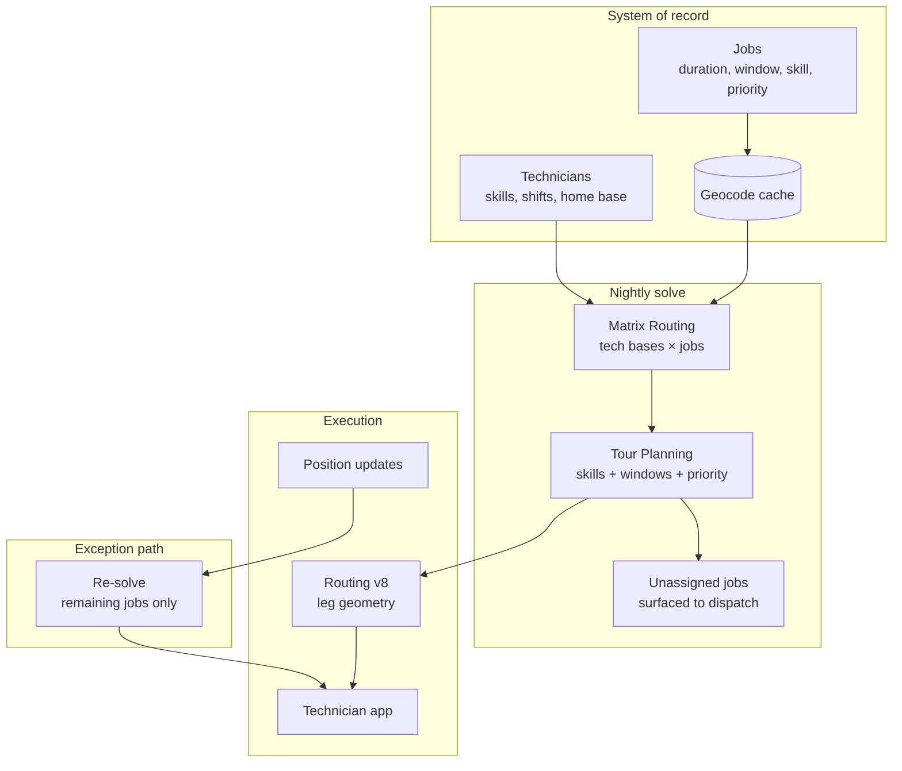

# Field Service Optimization

## The business problem

Twelve technicians. Sixty jobs. Some jobs need a certified electrician. Some customers are only home between 2pm and 4pm. One technician finishes at 3pm for a school run. Two jobs are emergencies that must be served today.

Assign the jobs, sequence them, and produce schedules the technicians will actually follow.

The last clause is the hard one.

## Typical users

HVAC, plumbing, and electrical services. Telecom and utility field operations. Medical device servicing. Equipment maintenance. Home installation and repair platforms.

## Recommended architecture

## Which HERE APIs, and why

**[Tour Planning](/guides/tour-planning)** — the core. **Why:** field service *is* the Vehicle Routing Problem with time windows and skills. HERE's solver supports capacitated VRP, time windows, multi-depot, heterogeneous fleets, priorities, and pickup-and-delivery as first-class variants. Skills map to vehicle-type capabilities; certifications become vehicle specialties.

It is included in the HERE Base Plan. Approximating it with a heuristic is a choice, not a necessity.

**[Matrix Routing](/guides/matrix-routing)** — the cost table underneath. **Why:** Tour Planning consumes travel costs. If you build your own solver, this is your interface to reality.

**[Routing](/guides/routing)** — the leg the technician drives. `transportMode=car` for vans under 3.5t; [truck](/guides/truck-routing) constraints if you dispatch service trucks with height or weight restrictions.

**[Geocoding](/guides/geocoding)** — customer addresses to points. Cached permanently. A repeat customer costs nothing.

**[Catchment Area](/guides/catchment-area)** — technician coverage territories, if you assign geographically rather than dynamically. See [Territory Management](/use-cases/territory-management).

## Implementation flow

1. **Model technicians as vehicle types** with capabilities (skills), shifts (start/end time and location), and limits (`maxDistance`, `shiftTime`).
2. **Model jobs as tasks** with `duration` (service time), `times` (appointment windows), `demand`, and priority.
3. **Geocode job addresses** on creation. Cache. Never again.
4. **Solve nightly**, async, against the next day's job set.
5. **Handle unassigned jobs explicitly.** The solver will drop what capacity and windows cannot accommodate. Surface those to a human before the day starts, not at 3pm.
6. **Compute leg geometry** for each assigned leg.
7. **Push the schedule** to the technician app.
8. **Re-solve only on exception**, and only over remaining jobs.

<Warning>
`fleet.types[].profile` is a **string reference** into `fleet.profiles[].name`. It is not a transport mode. This trips up nearly every first Tour Planning integration.
</Warning>

## Data flow

Skills, shifts, and appointment windows are **constraints in the problem**, not filters applied afterward. Post-filtering a solver's output means the solver optimized against a fiction.

Job service time is **as important as travel time** and is more often wrong. A 20-minute estimate on a 90-minute job destroys the entire day's sequence downstream.

## Production considerations

**Solve on a cadence. Not on every event.**

This is the section that matters most, and it is a human problem wearing engineering clothes.

A system that re-optimizes when each new job arrives produces a schedule that changes hourly. Technicians stop trusting it. They start planning their own day. Your optimization now runs against a fleet that ignores it, and you have paid for the privilege.

<Tip>
Nightly solve. Locked schedule. Exception-driven replanning only — emergency job, technician sick, job overran badly. Communicate every change explicitly. A stable, 90%-optimal schedule outperforms a perfect one nobody follows.
</Tip>

**Mid-day replanning is a new problem.** Technician current location becomes the shift start. Completed jobs are removed. Fresh submission.

**Service time estimates are your accuracy ceiling.** Instrument actual versus estimated duration per job type. Feed it back. This will improve your schedules more than any solver parameter.

**`configuration.termination.maxTime` is not a detail.** HERE's example sets it to 2 seconds. On a 60-job, 12-technician problem that produces a legal schedule a dispatcher will reject. Raise it. Measure the marginal improvement. Find the knee.

**Costs encode policy.** `fixed` cost per technician tells the solver whether adding a technician to the day is cheap or expensive. Set it deliberately. Most teams leave it at the example value and wonder why the solution uses everyone.

## Scaling

**Solve time grows non-linearly with job count.** Partition by geography before you partition by anything else. Two independent metros are two problems.

**Nightly solve has a real deadline.** If dispatch reviews schedules at 6am, and the solve takes 40 minutes at 200 jobs, model what happens at 600.

**The matrix caches well.** Technician home bases are fixed. Customer locations repeat. Hash the input set.

**Emergency insertion is a different algorithm.** Full re-solve for one urgent job is expensive and disruptive. Consider a cheap insertion heuristic for same-day emergencies and a full solve overnight.

## Cost optimization

1. **Cache geocoding permanently.** Repeat customers are free.
2. **Hash the tour problem.** Skip re-solves that would return the same schedule.
3. **Matrix, never routing loops**, for the cost table.
4. **Do not re-solve on every job creation.** Cost and trust, both.
5. **Batch-geocode the historical customer table once**, deduplicated.
6. **Set `return` explicitly** on leg routing. Nothing consumes `instructions` server-side.

Tour Planning is in the Base Plan. The cost of field service optimization is dominated by geocoding volume and solve frequency, not by the solver.

See [HERE Pricing Explained](/start-here/here-pricing-explained).

## Common mistakes

**Re-optimizing on every event.** The schedule becomes noise. Technicians route around you.

**Building a nearest-neighbour heuristic** to avoid a licensing conversation that does not exist.

**Treating skills as a post-filter** rather than a solver constraint.

**Leaving `maxTime: 2` from the documentation example.**

**Ignoring unassigned jobs** until a customer calls at 4pm.

**Setting `profile` to a transport mode** instead of a profile name.

**Underestimating service time.** The dominant source of schedule failure.

**Blocking an HTTP request on a synchronous solve.**

**Leaving `costs` at example values.** `fixed` is how you say "do not use a twelfth technician for one job."

**Full re-solve for a single emergency insertion.**

## Alternatives — honestly

**Google Maps Platform** has no equivalent to Tour Planning. For the optimization core it is not a candidate. Its Distance Matrix could feed a solver you build yourself.

**A dedicated field service optimization vendor** — Skedulo, Descartes, and similar — is the right answer if scheduling *is* your product's core value and you need multi-day, preference-weighted, or SLA-penalty-aware objectives that Tour Planning's cost model does not express. Feed such a solver with [Matrix Routing](/guides/matrix-routing); the matrix is the interface.

**Your own solver** (OR-Tools, Jsprit) is legitimate when the objective function is genuinely custom. It is not legitimate as a cost-avoidance measure — Tour Planning is included in the Base Plan, and a self-maintained VRP solver becomes a product nobody is funded to own.

**Manual dispatch** genuinely wins below roughly 15 jobs a day. A dispatcher who knows the territory beats a solver you have not tuned. Introduce optimization when the dispatcher becomes the bottleneck, not when the board asks about AI.

## Related guides

<CardGroup cols={2}>
  <Card title="Tour Planning" href="/guides/tour-planning">
    Skills, time windows, priorities, and the async solve lifecycle.
  </Card>
  <Card title="Matrix Routing" href="/guides/matrix-routing">
    The cost table, and the interface to any solver you bring yourself.
  </Card>
  <Card title="Territory Management" href="/use-cases/territory-management">
    When geographic assignment beats dynamic assignment.
  </Card>
  <Card title="Geocoding and Search" href="/guides/geocoding">
    Caching customer addresses, which is most of your bill.
  </Card>
</CardGroup>

Also: [Fleet Routing](/use-cases/fleet-routing) · [Routing](/guides/routing) · [Catchment Area](/guides/catchment-area)

## HERE documentation

- [Tour Planning API](https://docs.here.com/tour-planning/docs/introduction-tour-planning)
- [Tour Planning quick start](https://docs.here.com/tour-planning/docs/quick-start)
- [Matrix Routing API v8](https://www.here.com/docs/category/matrix-routing-api-v8)

## Placematic

- [UpGrid — territory management](https://placematic.com/territory-management/)
- [HERE Location Services](https://placematic.com/here-location-services/)

---

Need help designing or implementing a production HERE solution?

Placematic helps engineering teams select the right HERE APIs, estimate costs, migrate from Google Maps and build production-ready geospatial systems. [Talk to us](https://placematic.com/contact/).