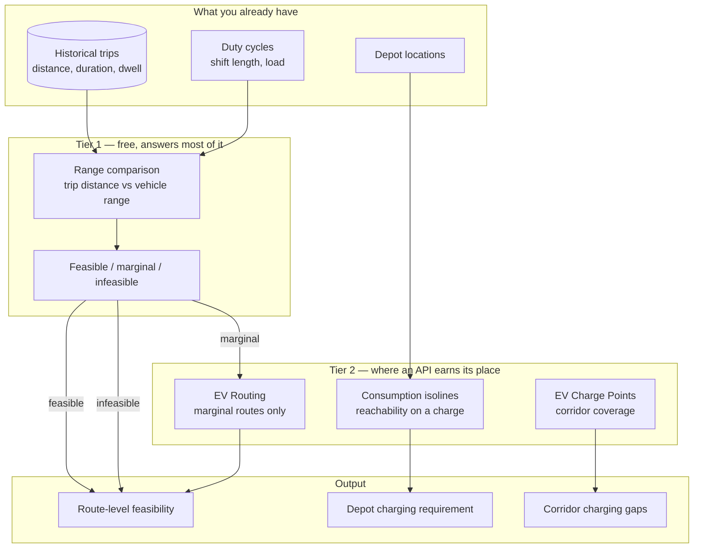

# Fleet Electrification Feasibility

This page is about a question asked before any vehicle is purchased: **can our existing routes be run by electric vehicles?**

It is an analytical question, not a dispatch question. The distinction matters, because the analytical version is far cheaper to answer than most teams assume.

## The problem

A fleet operator has 400 routes, run daily, by diesel vehicles. Someone — a customer, a regulator, a board — asks about electrification.

The questions that follow:

- Which routes fit within an EV's range today?
- Which fit if we charge mid-route, and where would that be?
- What does charging time do to the schedule?
- Which depots need charging infrastructure, and how much?
- What breaks first: range, charging time, or charger availability?

None of these require dispatching a vehicle. They require analysing history against vehicle specifications.

<Warning>
Do not buy an EV routing API to answer a feasibility question. Historical route distances from your telematics, compared against vehicle range and duty cycle, answers most of it. Buy the API when you need to *dispatch*, not when you need to *analyze*.
</Warning>

## Who this is for

Fleet operators evaluating electrification. Sustainability and operations teams. Consultancies producing feasibility studies. Logistics companies assessing Class 8 electrification. Anyone who has been asked for a number by a board.

## Recommended architecture

**Tier 1 costs nothing and classifies most routes.** Only the marginal band justifies API calls.

## Tier 1: the analysis you already have data for

Take your historical trips. For each, compute total daily distance per vehicle per shift.

Compare against a candidate EV's usable range, derated for:

- **Temperature.** Cold weather reduces usable range materially.
- **Load.** A fully laden vehicle consumes more.
- **Auxiliary load.** Refrigeration on a delivery van in July is not negligible.
- **Terrain.** Sustained grade dominates consumption.
- **Depth-of-discharge policy.** Nobody runs a battery to zero.

Classify:

- **Feasible** — comfortably within derated range. Electrify.
- **Marginal** — within range under favourable conditions only. Requires analysis.
- **Infeasible** — exceeds range with no realistic charging stop. Not today.

<Tip>
In most fleets this classification alone answers 70–80% of the question at zero API cost. Present that first. It buys credibility for the harder analysis on the marginal band, and it may be all anyone needed.
</Tip>

The derating factors are where the honesty lives. A linear consumption assumption is optimistic on highways and catastrophically optimistic on grades.

## Tier 2: relevant HERE APIs, and why

**[Catchment Area](/guides/catchment-area) with consumption range type** — reachability on a charge. **Why:** "everywhere this vehicle can reach on a full battery, from this depot" is a reachability polygon with `consumption` as the range type, not time or distance. It answers the depot-siting question directly: which of our stops fall inside, which fall outside.

**HERE EV Charge Points API** — corridor coverage. **Why:** station locations, connector types, power feeds. It is a **separate product** from EV routing, at [v2 and v3](https://www.here.com/docs/category/ev-charge-points-api-v3), with a documented migration path and a separate entitlement.

**[EV Routing](/guides/ev-routing)** — the marginal band only. **Why:** where a route requires a mid-route charge, the vehicle's ability to reach charger three depends on whether it stopped at charger one. That is a routing problem and cannot be approximated by filtering a route against a charger table.

**[Matrix Routing](/guides/matrix-routing)** — matrix responses can include consumption alongside time and distance. Useful for scoring many candidate routes at once.

<Warning>
EV routing and EV Charge Points are different APIs with different entitlements and separate bills. A key that routes EVs may return `403` from the charge points endpoint. Confirm both before you architect. See [Getting a HERE API Key](/getting-started/getting-a-here-api-key).
</Warning>

## The commercial vehicle problem

<Warning>
**Truck charging is not car charging, and this is not a solved problem in the market.**
</Warning>

HERE documents EV truck charging locations as a distinct concern within the EV Charge Points product. Connector types, power levels, and physical site access differ from passenger charging. A Class 8 vehicle routed against passenger charging infrastructure is routed to sites it cannot physically enter — no pull-through, no clearance, no capacity.

Charging corridors for commercial vehicles are sparse. Any feasibility study for heavy trucks that treats the passenger charging network as available infrastructure is producing a number that will not survive contact with a driver.

Be honest with whoever commissioned the study about what the data supports.

## Implementation flow

1. **Extract historical trips.** Distance, duration, dwell time, shift boundaries, per vehicle.
2. **Derate range** by temperature, load, auxiliary draw, terrain, and depth-of-discharge policy. Document every assumption.
3. **Classify** feasible / marginal / infeasible.
4. **For depot siting**, compute consumption isolines from each depot. Which stops fall inside?
5. **For the marginal band only**, run EV routing with a proper consumption curve and realistic starting charge.
6. **Overlay charger network** to identify corridor gaps.
7. **Model charging time as schedule time.** A 45-minute charge is 45 minutes the vehicle is not delivering.
8. **Present ranges, not point estimates.** The uncertainty is real; hiding it is not.

## Cost considerations

**Tier 1 is free.** Do it before anything else.

**Restrict Tier 2 to the marginal band.** Running EV routing across 400 routes when 280 are trivially feasible is waste.

**Cache the charger network aggressively.** Station locations change over months. Availability changes by the minute — but availability does not matter for a feasibility study, which is analysing a hypothetical future. Do not query it.

**Batch corridor analysis.** Nothing is waiting.

**Consumption isolines are bounded by depot count.** A 12-depot network is 12 calls, refreshed when vehicle specifications change.

**Do not query charge points on map interaction.** Every pan becomes a request.

See [HERE Pricing Explained](/getting-started/here-pricing-explained).

## Common mistakes

**Buying an EV routing API to answer a feasibility question.** Range comparison against history costs nothing.

**Linear consumption models.** Highways and grades break them.

**Ignoring auxiliary load.** Refrigerated vans, in summer, with the doors opening forty times.

**Ignoring temperature derating.** Winter range is not summer range.

**Assuming full charge at shift start.** Depot charging capacity constrains this.

**Filtering a route against a charger table.** The vehicle's ability to reach charger three depends on charger one.

**Routing commercial EVs against passenger charging data.** Inaccessible sites.

**Treating charging time as free.** It is schedule time and it is vehicle downtime.

**Presenting a point estimate.** "62% of routes are electrifiable" implies precision the analysis does not carry.

**Confusing EV routing with the EV Charge Points API.** Separate products, separate entitlements.

**Analysing routes rather than duty cycles.** A vehicle runs several routes a day. Range constrains the day, not the route.

## Production checklist

- [ ] Historical trip data extracted at the duty-cycle level, not the route level
- [ ] Range derating documented: temperature, load, auxiliary, terrain, depth of discharge
- [ ] Tier 1 classification completed and presented before any API spend
- [ ] Consumption curve used, not a linear approximation
- [ ] Starting charge modelled from depot charging capacity, not assumed full
- [ ] EV routing applied to the marginal band only
- [ ] Commercial-vehicle charging infrastructure distinguished from passenger
- [ ] Charging time modelled as vehicle downtime in the schedule
- [ ] Both EV Routing and EV Charge Points entitlements confirmed
- [ ] Results presented as ranges with stated assumptions

## Alternatives and trade-offs

**No routing API at all.** For most feasibility studies this is the correct answer. Telematics history plus vehicle specifications plus a spreadsheet. Spend the money on better derating assumptions rather than better routing.

**Google Maps Platform** has limited EV routing with charge-state awareness. For consumer navigation the gap has narrowed. For commercial fleet electrification with truck-specific charging, it is not competitive.

**Charging network operator APIs** — ChargePoint, Electrify America — give authoritative data for *their* network. Better than any aggregator for that network. Worse for coverage. For a fleet standardizing on one network, go direct.

**Open Charge Map** is free and community-maintained. Coverage and freshness vary. Adequate for a coverage map or a prototype. Not adequate for dispatching a vehicle with 40 km of remaining range — but feasibility studies are not dispatch.

**A consultancy or OEM feasibility service.** Vehicle manufacturers publish consumption curves and will run this analysis. If you are buying their vehicles, the analysis is often free and better parameterized than anything you will assemble.

**Wait.** Charging infrastructure for commercial vehicles is expanding. A route that is infeasible today may be feasible in eighteen months without any change to your fleet. The output of this analysis should include *which corridors, if built, unlock the most routes* — that is a more actionable finding than a percentage.

## Related guides

<CardGroup cols={2}>
  <Card title="EV Routing" href="/guides/ev-routing">
    Consumption models, charge state, and the two-product distinction.
  </Card>
  <Card title="EV Charging Applications" href="/use-cases/ev-charging">
    The dispatch-time architecture, once feasibility is established.
  </Card>
  <Card title="Catchment Area" href="/guides/catchment-area">
    Consumption-range isolines for depot siting.
  </Card>
  <Card title="Fleet Routing" href="/use-cases/fleet-routing">
    Where electrified routes eventually have to be dispatched.
  </Card>
</CardGroup>

Also: [Matrix Routing](/guides/matrix-routing) · [Getting a HERE API Key](/getting-started/getting-a-here-api-key)

## HERE documentation

- [HERE EV Charge Points API v3](https://www.here.com/docs/category/ev-charge-points-api-v3)
- [Routing API v8 reference](https://www.here.com/docs/bundle/routing-api-v8-api-reference/page/index.html) — EV routing parameters
- [Matrix Routing API v8](https://www.here.com/docs/category/matrix-routing-api-v8)

## Placematic

- [EV Routing](https://placematic.com/here-location-services/ev-routing/)

---

Need help designing or implementing a production HERE solution?

Placematic helps engineering teams select the right HERE APIs, estimate usage, migrate from Google Maps and build production-ready geospatial systems. [Talk to us](https://placematic.com/contact/).