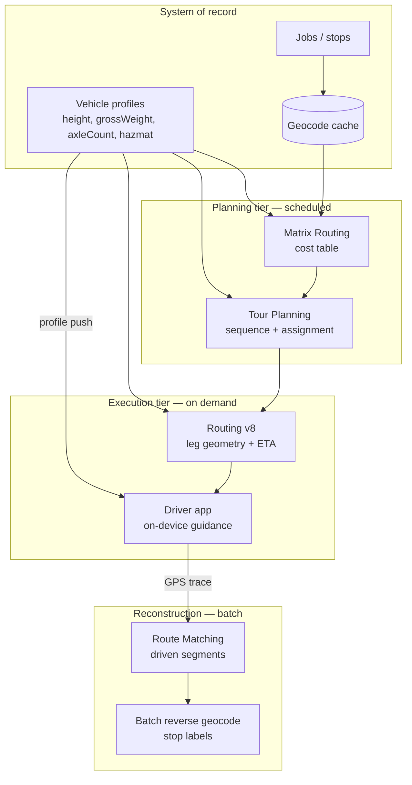

# Building a Fleet Routing Platform

## The business problem

You dispatch commercial vehicles. Every route you produce must be physically drivable by the vehicle assigned to it, legally permissible for its cargo, and completable within a driver's hours.

Get this wrong and the failure is not a bad UX review. It is a bridge strike, a citation, or a driver reversing a 53-foot trailer down a residential street at 6am.

## Typical users

Fleet tech and ELD vendors. Trucking and LTL carriers. Last-mile delivery platforms. Field operations software. Anyone whose product tells a professional driver where to go.

## Recommended architecture

Four tiers, four different latency and cost profiles. Collapsing them is the mistake this whole page exists to prevent.

## Which HERE APIs, and why

**[Matrix Routing](/guides/matrix-routing)** — the cost table. Travel times between depots and stops. **Why:** because the alternative is a loop over the Routing API, and a 20×500 problem is 10,000 routing calls or one matrix request. This is the largest single cost lever in fleet software.

**[Tour Planning](/guides/tour-planning)** — the assignment and sequence. Which vehicle, which stops, what order. **Why:** the Vehicle Routing Problem is NP-hard. You are not solving it with nearest-neighbour, and HERE's solver handles capacity, time windows, mixed fleets, and priorities as first-class constraints. It is included in the Base Plan.

**[Truck Routing](/guides/truck-routing)** — the leg geometry. `transportMode=truck` with explicit physical constraints. **Why:** because `transportMode=truck` alone selects the engine and describes nothing about your vehicle. Height in centimetres, `grossWeight` in kilograms, `axleCount` including trailers.

**[Route Matching](/guides/route-matching)** — reconstruction. Which road segments the vehicle actually drove. **Why:** IFTA, hours-of-service, and speed compliance require the *travelled* segment, not the nearest address. [Reverse geocoding](/guides/reverse-geocoding) cannot answer this and will not survive an audit.

**[Reverse Geocoding](/guides/reverse-geocoding)** — human-readable stop labels. **Why:** dispatchers read addresses, not coordinates. Use `POST /multi-revgeocode` on stop detection, not on every ping.

**[HERE SDK](/guides/here-sdk)** — only if drivers need offline maps or on-device turn-by-turn. Otherwise tiles plus REST.

## Implementation flow

1. **Model the vehicle.** Height, gross weight, axle count, trailer count, hazmat class, category. This is a database table, not a request parameter.
2. **Geocode and cache stops.** Once. Addresses do not move. See [Batch Geocoding](/guides/batch-geocoding).
3. **Build the matrix** for the dispatch window's depots and stops.
4. **Solve** with Tour Planning. Async. Persist the `statusId`.
5. **Handle unassigned jobs.** The solver will tell you which stops it could not serve. Surface them.
6. **Compute leg geometry** with truck routing for each assigned leg.
7. **Push the vehicle profile to the device**, alongside the route.
8. **Ingest GPS.** Do not geocode it. Do not match it. Store it.
9. **On trip close**, segment, downsample, and match. Batch. Overnight.

<Warning>
Step 7 is where fleet platforms fail catastrophically. The server computes a constrained truck route. The driver deviates. The phone recalculates — using whatever constraints reached the app. If the profile never left your backend, the device just routed a 4.1m trailer under a 3.4m bridge, in real time, with turn-by-turn audio.
</Warning>

## Data flow

**Vehicle profile** flows from your database into every routing call *and* onto the device. One source. No hardcoded dimensions at call sites.

**Stops** flow through the geocode cache before they reach any routing API. A stop that was geocoded last week does not get geocoded again.

**GPS** flows in at a fixed rate and does nothing expensive on arrival. It is stored. Trip segmentation, matching, and labelling happen later, in bulk.

## Production considerations

**Separate planning from execution.** Planning is a scheduled job measured in seconds or minutes. Execution is a request measured in milliseconds. A dispatcher clicking "optimize" should not block on a 90-second solve.

**Solve on a schedule, not on every event.** Re-solving when each new order arrives produces route churn. Drivers stop trusting an app whose plan changes hourly.

**Mid-day replanning is a new problem.** Current vehicle location becomes the shift start; completed jobs are removed. Fresh submission, not an incremental update.

**Compliance couples to routing.** For ELD platforms, the route determines hours-of-service feasibility. If the route changes, HOS projections change. Model that dependency explicitly rather than discovering it in an audit.

**Record the map release version** on anything a regulator might read. A trip matched in March against a March map may match differently in September.

**Test on trap geometry, in CI.** Route a 410cm vehicle through the 11foot8 bridge in Durham NC, Storrow Drive in Boston, and the Southern State Parkway on Long Island. Any path returned is a failure. Run the same three in `car` mode as a control.

<Tip>
Wire those three assertions into your test suite, not your QA checklist. A refactor that drops `truck[height]` from a params dict is invisible in code review and obvious in a failing test.
</Tip>

## Scaling

**The matrix is the bottleneck, and it is a cache.** Depot locations do not move. Hash the input set. A depot-to-stop matrix recomputed nightly for an unchanged depot network is pure spend.

**Solve time grows with problem size, not linearly.** `configuration.termination.maxTime` is the knob. The documentation example sets it to 2 seconds. On a 200-stop problem that produces a legal solution a dispatcher will reject. Find your knee empirically.

**Partition by depot before you partition by anything else.** Fleet-wide optimization across geographically independent depots buys nothing and costs solve time.

**GPS volume is the quiet scaling problem.** 200 vehicles at a 10-second ping rate is 648,000 points per day. Any per-point API call — geocoding, matching, positioning — multiplies by that number. Design so that nothing expensive touches a raw ping.

## Cost optimization

Ranked by impact, from real fleet deployments:

1. **Stop reverse-geocoding every GPS ping.** Geocode detected stops. Ratio of geocode calls to detected stops should be near 1.
2. **Replace routing loops with Matrix Routing.** Count the routing calls that exist only to populate a distance table.
3. **Cache geocoding permanently.** Depots, customer sites, and stops resolve once.
4. **Batch trip matching overnight.** Nothing is waiting.
5. **Segment trips before matching.** Drop idle periods. In real telematics feeds this removes 40–60% of submitted points.
6. **Set `return` explicitly** on routing calls. Nothing consumes `instructions` server-side.
7. **Hash the tour problem.** Skip re-solves that would produce the same answer.

Fleet operators with a countable vehicle fleet and unpredictable call volume should evaluate **asset-based pricing** against call-volume pricing. A dispatcher who reroutes 200 trucks forty times a day is punished by call-volume pricing for operational diligence. See [HERE Pricing Explained](/start-here/here-pricing-explained).

<Info>
Asset-based pricing availability depends on contract tier. Confirm it before it becomes load-bearing in a business case presented to your CFO.
</Info>

## Common mistakes

**Approximating Tour Planning with N routing calls.** Slower, more expensive, worse routes.

**Looping Routing to build a matrix.** The same mistake, one layer down.

**Vehicle constraints hardcoded at call sites.** They belong on the vehicle record.

**Constraints on the server, absent on the device.** The recalculation path is the dangerous one.

**Reverse-geocoding GPS packets.** Geocode events.

**Using reverse geocoding to reconstruct driven routes.** That is Route Matching, and only Route Matching survives an audit.

**Leaving `maxTime: 2` from HERE's example.** Legal solution, unusable sequence.

**Ignoring unassigned jobs.** The solver told you it could not serve them.

**Blocking an HTTP request on a synchronous solve.**

**Passing metres where centimetres are expected.** A four-centimetre truck routes anywhere.

## Alternatives — honestly

**Google Maps Platform** offers no equivalent depth of commercial vehicle constraints. For fleet routing this is not a close comparison, and it is the strongest single argument for HERE. Keep Google if your product also does consumer place discovery.

**Mapbox** is strong on styling and developer experience, weak on truck attributes. If your fleet is passenger vehicles and your differentiator is the map's appearance, Mapbox deserves evaluation.

**TomTom** supports truck constraints with a narrower set and lower waypoint limits. Competitive in European automotive. Verify current pricing independently.

**OSRM** is free and yours to operate. That means truck attributes, traffic, and map freshness are also yours to operate. For a well-funded team with GIS expertise this can work. For most fleet vendors it becomes a second product nobody is paid to maintain.

**Build your own solver** fed by Matrix Routing if you need custom objectives beyond distance, time, and fixed vehicle cost. Legitimate. Do not build one to avoid a licensing conversation that does not exist — Tour Planning is in the Base Plan.

## Related guides

<CardGroup cols={2}>
  <Card title="Truck Routing" href="/guides/truck-routing">
    Constraints, units, and the trap geometry that proves they apply.
  </Card>
  <Card title="Tour Planning" href="/guides/tour-planning">
    The solver, the async lifecycle, and unassigned jobs.
  </Card>
  <Card title="Matrix Routing" href="/guides/matrix-routing">
    The cost table underneath everything above.
  </Card>
  <Card title="Route Matching" href="/guides/route-matching">
    Reconstruction for IFTA, HOS, and speed compliance.
  </Card>
</CardGroup>

Also: [Reverse Geocoding](/guides/reverse-geocoding) · [HERE SDK](/guides/here-sdk) · [HERE Pricing Explained](/start-here/here-pricing-explained)

## HERE documentation

- [Routing API v8](https://www.here.com/docs/category/routing-api-v8)
- [Matrix Routing API v8](https://www.here.com/docs/category/matrix-routing-api-v8)
- [Tour Planning API](https://docs.here.com/tour-planning/docs/introduction-tour-planning)

## Placematic

- [HERE Location Services](https://placematic.com/here-location-services/)
- [Truck Routing](https://placematic.com/here-location-services/truck-routing/)
- [HERE API pricing](https://placematic.com/here-location-services/here-pricing/)

---

Need help designing or implementing a production HERE solution?

Placematic helps engineering teams select the right HERE APIs, estimate costs, migrate from Google Maps and build production-ready geospatial systems. We have deployed HERE into production ELD platforms. [Talk to us](https://placematic.com/contact/).