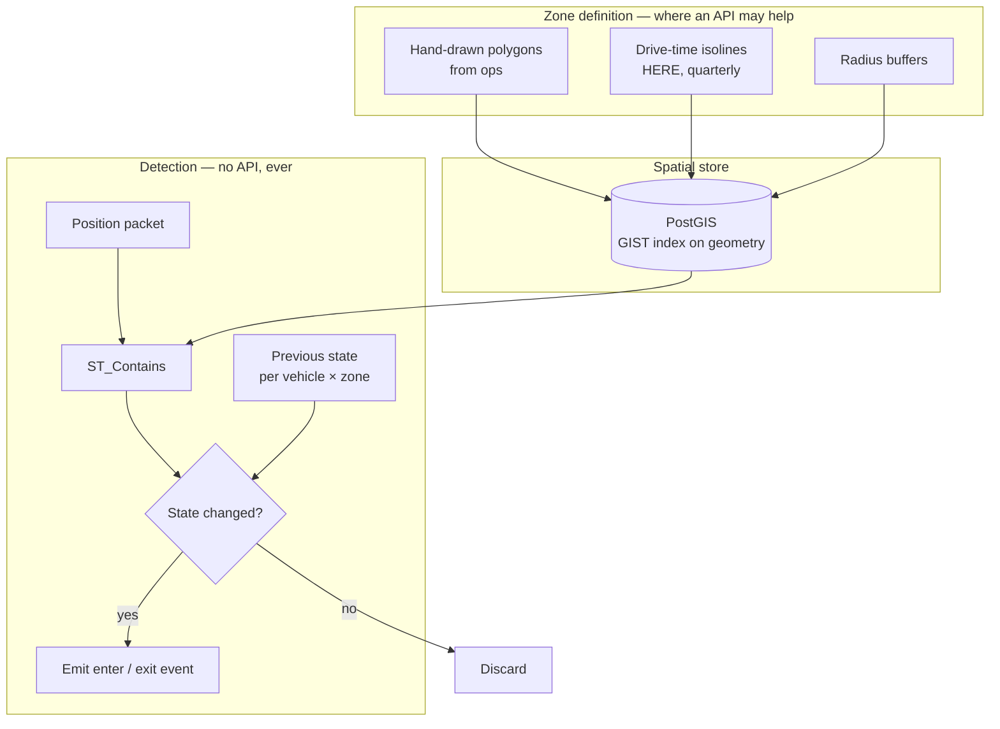

# Geofencing at Scale

Start with the conclusion, because it will save you a procurement cycle.

**Geofencing is a spatial index problem. You do not need a mapping API to solve it.** A PostGIS `ST_Contains` against an indexed polygon column, executed in your own database, answers the question in sub-milliseconds and costs nothing per call.

Placematic sells HERE. This page still says: do not buy an API for this.

## The problem

Ten thousand vehicles. Two thousand zones — depots, customer sites, restricted areas, delivery districts. Positions arriving every ten seconds.

You must know, reliably, when a vehicle enters or leaves each zone.

<Warning>
Calling a mapping API on every position, for every zone, to answer a containment question is not merely expensive. It is the wrong operation. Containment is a geometry test. It does not require a road network, traffic data, or a routing engine.
</Warning>

The naive version fires a network call per packet per zone. Ten thousand vehicles × 8,640 daily packets × 2,000 zones is a number nobody should compute twice.

## Who this is for

Fleet and telematics engineers. IoT platform teams. Logistics and delivery platforms. Anyone with a `zones` table and a `positions` stream.

## Recommended architecture

The only box that touches HERE is zone *definition*, and only when the zone is a drive-time polygon.

## Where HERE is genuinely relevant

Two cases. Both are about defining the zone, never about testing it.

**Drive-time zones.** "Everywhere within 20 minutes of this depot" is a reachability polygon, not a circle. A radius around a Chicago facility includes several miles of Lake Michigan. Compute the isoline once, store the polygon, test against it forever. See [Catchment Area](/guides/catchment-area).

**Labelling the event.** A vehicle entered a zone at a coordinate. If a human will read "arrived at 1400 Industrial Pkwy," you need [reverse geocoding](/guides/reverse-geocoding) — once, on the event, not on the packet.

Everything else is your database.

## Relevant HERE APIs, and why

**[Catchment Area](/guides/catchment-area)** — drive-time zone geometry. **Why:** road networks, rivers, and limited-access highways shape reachability. Circles do not know this. Computed quarterly, materialized, then never called again.

**[Reverse Geocoding](/guides/reverse-geocoding)** — labelling entry and exit events for humans. **Why:** dispatchers read addresses. One call per event, not per packet.

**Not for containment. Ever.**

<Tip>
If your architecture calls an external service to answer "is this point inside this polygon," you have built a spatial database with an API bill attached. Materialize the polygons.
</Tip>

## Implementation flow

1. **Define zones.** Hand-drawn by ops, radius buffers, or drive-time isolines — depending on what the zone means.
2. **Store as geometry in PostGIS**, with a `GIST` index. This is the entire performance story.
3. **Maintain per-vehicle-per-zone state.** Inside or outside. This is what makes it a transition detector rather than a containment checker.
4. **On each packet, test containment** against candidate zones only.
5. **Compare to previous state.** Emit an event only on change.
6. **Debounce transitions.** GPS jitter at a zone boundary produces enter/exit/enter/exit within seconds. Require N consecutive readings, or a minimum dwell.
7. **Label the event** with reverse geocoding, if a human reads it.

## Making it fast

**Bound the candidate set before testing.** Do not test 2,000 zones per packet. Use the spatial index: `ST_DWithin` against a bounding radius, or a coarse H3 cell lookup, to narrow to the handful of zones plausibly nearby. Then test those.

**Partition zones by region.** A vehicle in Illinois cannot be inside a Texas zone.

**Keep state in memory.** Per-vehicle-per-zone inside/outside flags belong in Redis or an in-process map, not in a table you query per packet.

**Simplify polygons.** A 40,000-vertex isoline is slower to test than a 400-vertex simplification, and it was an approximation with a resolution parameter to begin with.

**Debounce at the boundary.** This is a correctness fix as much as a performance one. Undebounced, a truck idling on a zone edge generates hundreds of spurious events.

<Warning>
Boundary jitter is the defect that gets geofencing systems distrusted. A driver parked at a depot gate triggers forty arrival notifications. Operations turns the feature off. Require dwell, or require consecutive readings, before emitting.
</Warning>

## Cost considerations

**The detection path should cost zero.** If it does not, the architecture is wrong.

**Zone definition cost is bounded by zone count.** A 400-site network with three drive-time bands is 1,200 isoline calls, quarterly. Not per vehicle. Not per day.

**Event labelling cost is bounded by events.** A truck making twelve stops generates twelve reverse-geocode calls, not 8,640.

**Do not use a geocoding API to test whether an address is in a zone.** Geocode the address once, store the point, run `ST_Contains`. This is the same principle as [Delivery Zones](/use-cases/delivery-zones).

**PostGIS containment against an indexed geometry column scales with your traffic for free.** That is the whole point.

## Common mistakes

**Calling any API for containment.** The mistake this page exists to prevent.

**Testing every zone against every packet.** Bound the candidate set first.

**No `GIST` index on the geometry column.** Sequential scan over polygons.

**No transition state.** You now have a containment checker that fires continuously while a vehicle sits inside a zone.

**No debouncing at boundaries.** Spurious events, distrusted feature.

**Radius buffers where drive time was meant.** Lakes, rivers, highways with no exit.

**Reverse-geocoding the packet rather than the event.**

**Storing zones as arrays of coordinates rather than as geometry.** You have opted out of spatial indexing.

**Running containment in application code.** The database has an index. Use it.

**Un-simplified isoline polygons.** Thousands of vertices, tested millions of times.

## Production checklist

- [ ] Zones stored as PostGIS geometry with a `GIST` index
- [ ] Candidate zone set bounded before containment testing
- [ ] Per-vehicle-per-zone state maintained in memory
- [ ] Events emitted on transition only, never on containment
- [ ] Boundary debouncing implemented — dwell time or consecutive readings
- [ ] Polygons simplified before storage
- [ ] Zero external API calls in the detection path
- [ ] Drive-time zones computed as isolines, materialized, refreshed on a schedule
- [ ] Event labelling — reverse geocoding — fires per event, not per packet
- [ ] Zones versioned and effective-dated, if disputes are possible

## Alternatives and trade-offs

**PostGIS is the answer for most teams.** Mature, free, indexed, and it runs where your data already lives. This page is largely an argument for it.

**Managed geofencing services** — AWS Location Service, HERE Tracking, Google's Geofencing API on Android — handle transition detection, debouncing, and event delivery. Worth evaluating if you have no spatial database and no appetite to run one. You are paying for the state machine and the plumbing, not for the geometry test. Read the pricing model carefully: some bill per position evaluated, which reintroduces the problem this page describes.

**On-device geofencing** — iOS and Android both support it natively, with radio-assisted transition detection that consumes less battery than continuous GPS. If your geofences are few, static, and known to the device, this is strictly better than server-side detection: lower latency, lower battery, zero backend cost. It does not scale to two thousand zones per device.

**H3 or S2 cell indexing** instead of polygon containment. Precompute the set of cells covering each zone. Detection becomes a hash lookup on the vehicle's current cell. Extremely fast, approximate at boundaries, and the approximation is tunable by resolution. A good fit when you have very many zones and tolerate boundary fuzziness.

**Do you need geofences at all?** Some teams build zone detection to answer questions that stop detection already answers. If the event you care about is "the vehicle arrived at a customer," stop detection plus a nearest-site lookup may be simpler and more robust than maintaining polygon geometry for every customer.

## Related guides

<CardGroup cols={2}>
  <Card title="Catchment Area" href="/guides/catchment-area">
    Drive-time polygons — the one place an API earns its place here.
  </Card>
  <Card title="Vehicle Tracking" href="/use-cases/vehicle-tracking">
    The ingest architecture this detection layer sits inside.
  </Card>
  <Card title="Delivery Zones" href="/use-cases/delivery-zones">
    The same materialization pattern, applied to serviceability.
  </Card>
  <Card title="Reverse Geocoding" href="/guides/reverse-geocoding">
    Labelling events, once, for the humans who read them.
  </Card>
</CardGroup>

Also: [Fleet Routing](/use-cases/fleet-routing) · [Reducing Google Maps Costs](/use-cases/reducing-google-maps-costs)

## HERE documentation

- [Routing API v8](https://www.here.com/docs/category/routing-api-v8) — isoline routing
- [Geocoding & Search v7](https://www.here.com/docs/category/geocoding-search-api-v7)

---

Need help designing or implementing a production HERE solution?

Placematic helps engineering teams select the right HERE APIs, estimate usage, migrate from Google Maps and build production-ready geospatial systems — including telling you when you do not need one. [Talk to us](https://placematic.com/contact/).