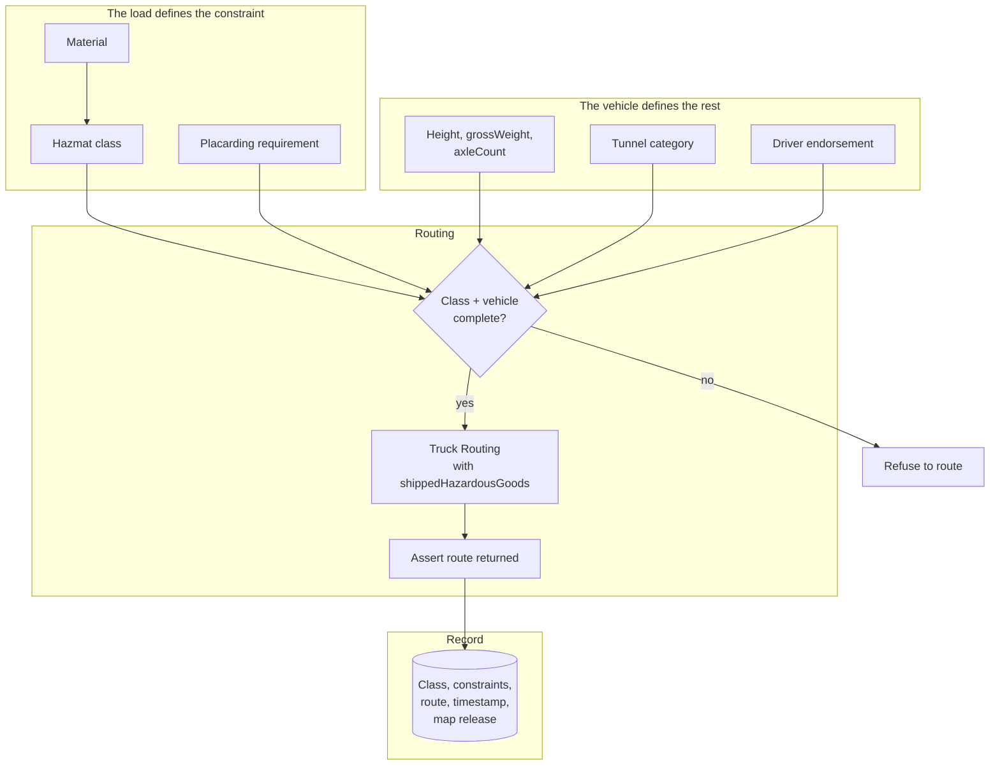

# Hazmat and Restricted Cargo Routing

A routing API will return a route for a hazmat load whether or not you told it the load is hazmat.

The response will be well-formed. It will contain a polyline. It may also route a tanker of flammable liquid through a tunnel where that is prohibited, past a school, or onto a bridge with a placarded-vehicle restriction.

**HERE will not warn you, because you did not tell it what you were carrying.**

## The problem

Hazardous materials routing is governed by regulation, not preference. In the United States, placarded vehicles are subject to federal and state routing designations. In Europe, ADR classes determine tunnel access. Local restrictions layer on top.

The consequences of a wrong route are not customer dissatisfaction. They are:

- Federal and state penalties
- Loss of hazmat endorsement
- Criminal liability in the event of an incident
- Insurance exclusion

This is one of a small number of use cases where a software defect is a regulatory event.

<Warning>
If your platform produces routes for placarded vehicles, the hazmat class is not an optional parameter. Omitting it does not produce an error. It produces a route computed for an unconstrained vehicle.
</Warning>

## Who this is for

Chemical and industrial logistics. Fuel and propane distribution. Waste and hazardous waste haulers. Explosives and munitions transport. Any TMS or ELD platform serving carriers with hazmat endorsements.

## Recommended architecture

**The system must be able to refuse.** A routing request for a hazmat load without a class is not a request to route with defaults. It is an invalid request.

## Relevant HERE APIs, and why

**[Truck Routing](/guides/truck-routing)** — the only relevant API. **Why:** HERE's Routing v8 exposes `shippedHazardousGoods` as a parameter with class values, alongside tunnel category and the physical vehicle constraints.

<Info>
`shippedHazardousGoods` is an **array** of cargo type values, not a boolean and not a single class. HERE's specification defines: `explosive`, `gas`, `flammable`, `combustible`, `organic`, `poison`, `radioactive`, `corrosive`, `poisonousInhalation`, `harmfulToWater`, `other`.
`tunnelCategory` is a **separate parameter**, taking the ADR tunnel restriction code `B`, `C`, `D` or `E`. It governs which tunnels the vehicle may enter. It is not a hazmat class.
A single shipment may carry several cargo types and one tunnel category. Do not map an internal `is_hazmat` boolean onto either. Read the definitions in the [Routing API v8 reference](https://www.here.com/docs/bundle/routing-api-v8-api-reference/page/index.html) and map your material classifications deliberately.
</Info>

**Physical constraints still apply.** Height in centimetres, `grossWeight` in kilograms, `axleCount` including trailers. A hazmat tanker is also a tall, heavy vehicle. Both constraint sets are required.

**`category=lightTruck` is a legal exemption, not a physical one.** It exempts a vehicle from many restrictions written for normal trucks. Physical dimension and cargo restrictions still apply. It does not exempt a hazmat load from hazmat restrictions.

**`weightLimit` is deprecated** in the current v8 specification in favour of `grossWeight`. The entire `truck` object is also deprecated in favour of `vehicle`. If you are reading an older tutorial, you are reading deprecated parameters.

## Implementation flow

1. **Classify the material** in your own system, against the regulatory scheme that applies in your jurisdiction.
2. **Map your classification to HERE's enum** deliberately, with a documented mapping table reviewed by someone who understands the regulation.
3. **Validate before routing.** A load flagged hazmat with no class must fail loudly. Never default.
4. **Route with the full constraint set** — hazmat class, tunnel category, and physical dimensions.
5. **Assert a route was returned.** HERE returns `200` with an empty `routes` array and a `notice` when no path exists. For hazmat, "no legal route" is a real and correct outcome.
6. **Record the constraint set, the route, the timestamp, and the map release version.**
7. **Verify the driver's endorsement** matches the load. This is not a routing API's job, and it is your job.

<Warning>
An empty `routes` array on a hazmat request is not a bug. It may be the correct answer: no permissible route exists between these points for this class. A system that retries with relaxed constraints, or falls back to car routing, has just produced an illegal route.
</Warning>

## Production considerations

**Constraints belong to the load, not the carrier.** The same tractor hauls dry van on Monday and hazmat class D on Tuesday. `shippedHazardousGoods` is a property of what is in the trailer, and it changes per shipment.

**Vehicle dimensions belong to the vehicle record.** Height, weight, and axle count are not request-time literals.

**Never hardcode either at a call site.** A developer adding a new endpoint who copies a routing call without the constraint set has introduced a defect invisible to code review.

**Record the map release version.** Restrictions change. A route computed in March against a March map may differ from the same route in September. If an incident occurs, you will be asked what the system knew and when.

**Regulatory data is not uniform globally.** Coverage and depth of hazmat restriction data vary by market. Do not assume the same fidelity in every country you operate.

**Verify against known restrictions in your operating area.** Build a test suite of routes that must be refused or diverted, and run it in CI.

<Tip>
Ask your local regulator or carrier compliance officer for a handful of known-prohibited segments in your operating region. Assert that a routed hazmat vehicle avoids each. This is the hazmat equivalent of trap-geometry testing for truck height, and it is worth more than any amount of documentation review.
</Tip>

## Cost considerations

Hazmat routing bills as a routing transaction. It is not more expensive than truck routing.

**This is not a cost-optimization page.** The economics are irrelevant next to the regulatory exposure. Cache route geometry between fixed points if you like. Do not cache across different hazmat classes, do not reuse a route computed for a different load, and do not let a caching layer serve a class-A route to a class-D shipment because the origin and destination matched.

<Warning>
Cache keys for hazmat routes must include the full constraint set. An origin-destination cache key is a defect.
</Warning>

For matrices of hazmat-constrained travel times, [Matrix Routing](/guides/matrix-routing) accepts truck mode and vehicle parameters.

## Common mistakes

**Setting `transportMode=truck` and omitting `shippedHazardousGoods`.** The engine is selected. The cargo is not declared.

**Mapping an internal `is_hazmat` boolean onto `shippedHazardousGoods`**. It is an array of cargo types. Read the definitions.

**Confusing `shippedHazardousGoods` with `tunnelCategory`**. Cargo type and tunnel restriction code are different parameters governing different things. Supplying one does not imply the other.

**Using the deprecated `weightLimit`** instead of `grossWeight`.

**Omitting tunnel category.** A separate parameter, and the one that governs tunnel access in Europe.

**Assuming `lightTruck` waives hazmat restrictions.** It waives certain legal truck restrictions. It does not make a flammable liquid non-flammable.

**Treating an empty `routes` array as an error to retry.** It may be the correct answer.

**Falling back to car routing when truck routing returns no path.** This is how illegal routes reach drivers.

**Caching on origin-destination without the constraint set.**

**Constraints attached to the carrier rather than the load.**

**Not recording the map release version** on a route a regulator may examine.

**Not verifying driver endorsement.** Not the API's job. Still your problem.

## Production checklist

- [ ] Material classification mapped to HERE's `shippedHazardousGoods` enum, with a documented mapping table
- [ ] Mapping table reviewed by someone qualified in the applicable regulation
- [ ] Routing request validated: hazmat load without a class fails loudly, never defaults
- [ ] Tunnel category supplied where applicable
- [ ] Physical vehicle constraints supplied alongside hazmat class
- [ ] `grossWeight` used, not the deprecated `weightLimit`
- [ ] Empty `routes` array handled as a legitimate outcome, not retried with relaxed constraints
- [ ] No fallback to car routing under any circumstance
- [ ] Cache keys include the full constraint set
- [ ] Constraint set stored on the load; vehicle dimensions on the vehicle
- [ ] Route, constraints, timestamp, and map release version persisted
- [ ] CI assertions against known-prohibited segments in your operating region
- [ ] Driver endorsement verified against load class before dispatch

## Alternatives and trade-offs

**Google Maps Platform** offers no hazmat routing capability. This is not a close comparison. If you route placarded vehicles, it is not a candidate.

**Mapbox** does not express hazmat constraints. Same conclusion.

**TomTom** supports ADR HazMat classes with a narrower constraint set than HERE and lower waypoint limits. Competitive in European automotive contexts. Verify current capability and pricing independently.

**Self-hosted OSRM** does not model hazmat restrictions. You would be curating restriction data yourself, for a domain where being wrong is a regulatory event. This is not a reasonable build.

**Manual route approval.** For low-volume, high-consequence hauls — explosives, radioactive materials, oversized chemical loads — a compliance officer reviewing every route is not a failure of automation. It is the correct control. Automate the routing; keep the human in the approval path.

**A specialist hazmat routing vendor** exists in some markets, with jurisdiction-specific designated-route data that exceeds any general mapping platform. If hazmat is your entire business, evaluate them. HERE gives you strong coverage as part of a general routing platform; a specialist gives you depth in one regulatory regime.

**Refuse to route.** The most underrated option. If your system cannot confidently express a load's constraints, it should decline rather than guess. A dispatcher calling a compliance officer is a better outcome than a driver following an illegal route.

## Related guides

<CardGroup cols={2}>
  <Card title="Truck Routing" href="/guides/truck-routing">
    Physical constraints, units, and trap-geometry validation.
  </Card>
  <Card title="ELD Platform" href="/use-cases/eld-platform">
    Compliance architecture, audit artifacts, and map release versioning.
  </Card>
  <Card title="Fleet Routing" href="/use-cases/fleet-routing">
    Where the constraint set has to reach the driver's device.
  </Card>
  <Card title="Logistics Platform" href="/use-cases/logistics-platform">
    Constraints belong to the load, not the carrier.
  </Card>
</CardGroup>

Also: [Routing](/guides/routing) · [Matrix Routing](/guides/matrix-routing) · [Cold Chain and Restricted Cargo](/use-cases/logistics-platform)

## HERE documentation

- [Routing API v8 reference](https://www.here.com/docs/bundle/routing-api-v8-api-reference/page/index.html) — `shippedHazardousGoods`, tunnel category, truck parameters
- [Transport modes](https://www.here.com/docs/bundle/routing-api-developer-guide-v8/page/topics/transport-modes.html)

## Placematic

- [Truck Routing](https://placematic.com/here-location-services/truck-routing/)

---

Need help designing or implementing a production HERE solution?

Placematic is an official HERE reseller and implementation partner. We help engineering teams select the right HERE APIs, estimate usage, migrate from Google Maps and build production-ready geospatial systems. [Talk to us](https://placematic.com/contact/).