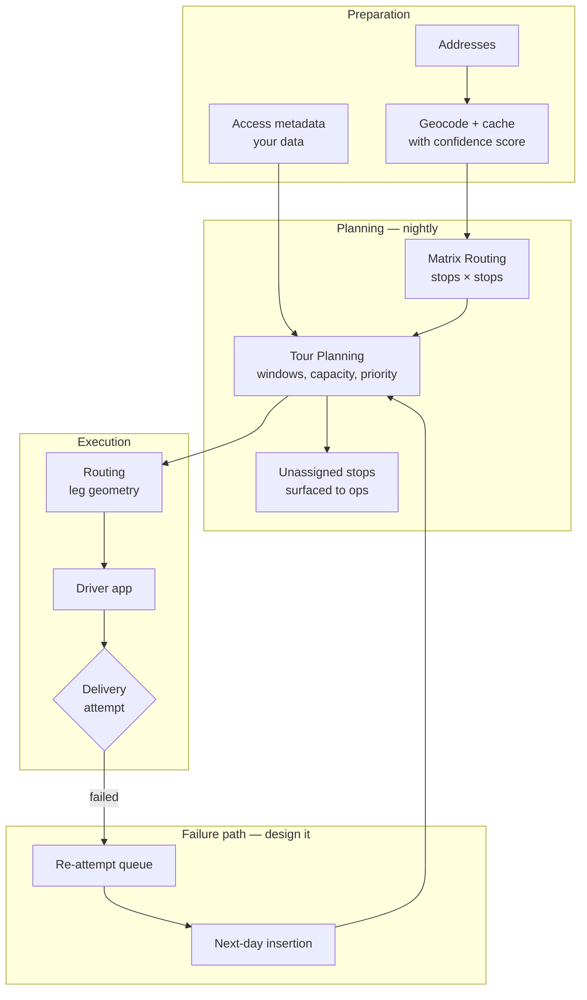

# Last-Mile Delivery Optimization

Last mile is the expensive mile, and the reason is not routing.

The van reaches the street in fifteen minutes. Then the driver spends eleven minutes finding parking, four minutes walking to the door, three minutes waiting, and leaves a card because nobody answered.

**Routing solved fifteen minutes of that. Eighteen minutes were somewhere else.**

## The problem

Multi-stop urban delivery has properties that general routing does not model:

- **Parking is not free and not modelled.** The van stops somewhere near the address, not at it.
- **The walking segment is real.** Apartment blocks, gated complexes, pedestrian-only streets, the fourth floor.
- **Service time varies enormously** and dominates travel time in dense routes.
- **Failed attempts are normal**, not exceptional. Re-delivery is a cost centre and a routing problem in its own right.
- **Time windows are constraints, not preferences.**
- **Vehicle access restrictions** apply — weight limits, height limits, delivery hour restrictions on certain streets.

A route that is optimal for a moving vehicle can be miserable for a person carrying parcels.

## Who this is for

Parcel and courier platforms. Grocery and meal delivery. Pharmacy and healthcare logistics. E-commerce fulfilment operations. Anyone whose driver leaves the vehicle.

## Recommended architecture

<Warning>
The failure path is not an edge case. In dense residential delivery, first-attempt failure is a routine outcome. A system that models it as an exception will accumulate re-deliveries in a spreadsheet.
</Warning>

## Relevant HERE APIs, and why

**[Tour Planning](/guides/tour-planning)** — the sequence. **Why:** last mile *is* the Vehicle Routing Problem with time windows and capacity. HERE's solver supports capacitated VRP, time windows, priorities, pickup-and-delivery, and reloads as first-class variants. It is included in the HERE Base Plan.

Service time is `duration` on the task. Time windows are `times`. Priorities protect high-value stops from being dropped. Model these properly and the solver does its job.

**[Matrix Routing](/guides/matrix-routing)** — the cost table underneath. **Why:** a 120-stop route requires travel times between all stops. That is one matrix, not thousands of routing calls.

**[Routing](/guides/routing)** — leg geometry for the driver. Choose the transport mode that matches the vehicle.

<Warning>
`bicycle` and `scooter` transport modes carry beta status with limited functionality in HERE Routing v8. Validate them for your market before building courier ETAs on them. See [HERE's transport modes reference](https://www.here.com/docs/bundle/routing-api-developer-guide-v8/page/topics/transport-modes.html).
</Warning>

**[Truck Routing](/guides/truck-routing)** — if the vehicle exceeds light-commercial class, or if urban weight and height restrictions apply. HERE exposes a `lightTruck` category that exempts a vehicle from many legal truck restrictions while still applying physical dimension limits. Check whether your fleet qualifies before paying the routing penalty.

**[Geocoding](/guides/geocoding)** — with confidence scores. **Why:** a low-confidence geocode in last mile is a failed delivery. See [Address Validation](/use-cases/address-validation).

## What the API cannot give you

This is the section that matters, and it is entirely your data:

**Access metadata.** Buzzer code, floor, gate, loading dock, "leave with concierge." Collect it, store it against the address, and feed it to the driver.

**Service time by address type.** A ground-floor house is not a fourteenth-floor apartment. Instrument actuals and estimate per type, not per stop.

**Parking difficulty.** No routing API models it. Your own dwell-time history does.

**Failure history.** An address that failed three times last month should be flagged before the fourth attempt.

<Tip>
Instrument actual service time per address, per attempt. Within a quarter you will have a better predictor than any generic model, and the schedules produced from it will be believable to drivers.
</Tip>

## Implementation flow

1. **Geocode and validate addresses**, storing the confidence score. Route low-confidence addresses to review before the van leaves.
2. **Attach access metadata** to the address record.
3. **Build the matrix** for the day's stop set.
4. **Solve with Tour Planning**, async. Set `configuration.termination.maxTime` to something appropriate for your problem size — the documentation example sets it to 2 seconds, which produces a legal solution a dispatcher will reject on a 120-stop route.
5. **Handle unassigned stops explicitly.** Capacity, windows, and shift time will make some stops unservable. Surface them before the day starts, not at 4pm.
6. **Compute leg geometry** for the assigned sequence.
7. **Push route, access metadata, and service-time expectations** to the driver app.
8. **Capture the attempt outcome.** Delivered, failed, refused — with a reason.
9. **Feed failures into the next day's problem.** With elevated priority if the SLA demands it.

## Cost considerations

**Solve nightly, not on every order.** Re-optimizing when each order arrives produces route churn drivers will not follow. A stable, near-optimal schedule outperforms a perfect one nobody trusts.

**Hash the problem.** If the stop set, fleet, and constraints are unchanged, reuse the solution.

**Matrix caches well.** Depot locations are fixed. Delivery addresses in a dense zone repeat across days.

**Cache geocoding permanently.** A repeat customer costs nothing. See [Address Validation](/use-cases/address-validation).

**Do not re-route on every GPS ping** to refresh the driver's ETA. Compute the remaining duration from route geometry. See [ETA Calculation](/use-cases/eta-calculation).

**Set `costs` deliberately in Tour Planning.** `fixed` cost per vehicle tells the solver whether adding a van is cheap or expensive. That is a business decision. Most teams leave it at the example value and wonder why the solution uses every vehicle.

Tour Planning is in the Base Plan. Your cost is dominated by geocoding volume, matrix calls, and solve frequency. See [HERE Pricing Explained](/getting-started/here-pricing-explained).

## Common mistakes

**Approximating Tour Planning with N routing calls.** Slower, more expensive, worse routes.

**Looping Routing to build the matrix.**

**Leaving `maxTime: 2` from HERE's documentation example.**

**Setting `profile` to a transport mode** rather than a name referencing `fleet.profiles`. This trips up nearly every first Tour Planning integration.

**Ignoring unassigned stops.** The solver told you it could not serve them.

**Modelling failed delivery as an exception.**

**Uniform service time across address types.** The largest error term in the schedule.

**Ignoring access metadata.** The driver stands outside a gate the system did not know about.

**Re-optimizing on every event.** Drivers route around a schedule they cannot trust.

**Low-confidence geocodes dispatched without review.** A failed delivery you paid to attempt.

**Car routing for a scooter or bicycle courier.** Forbidden turns, illegal segments. In dense markets this is a safety issue.

**Assuming beta transport modes are production-ready.**

## Production checklist

- [ ] Geocode confidence score stored; low-confidence addresses routed to review pre-dispatch
- [ ] Access metadata modelled and delivered to the driver app
- [ ] Service time instrumented per address type and refreshed from actuals
- [ ] Matrix used for the cost table; no routing loops
- [ ] Tour Planning submitted async; `statusId` persisted before polling
- [ ] `maxTime` and `stagnationTime` tuned against real problem size
- [ ] `costs.fixed` set to reflect actual vehicle economics
- [ ] Unassigned stops surfaced to operations before the shift begins
- [ ] Failed attempts captured with a reason, and fed into next-day planning
- [ ] Transport mode matches the actual vehicle; beta modes validated
- [ ] Vehicle constraints applied where urban restrictions exist
- [ ] Solve runs on a schedule; mid-day replanning treated as a new problem

## Alternatives and trade-offs

**Google Maps Platform** has no equivalent to Tour Planning. Its Distance Matrix can feed a solver you build. It cannot express commercial vehicle constraints, which matters in cities with weight and access restrictions.

**A dedicated last-mile platform** — Onfleet, Bringg, Shipsy — solves dispatch, driver app, proof of delivery, and the failure workflow. If last mile is your operation rather than your product, buy it. The routing is not the hard part; the workflow is.

**Your own solver** — OR-Tools, Jsprit — is legitimate when your objective function is genuinely custom: multi-day, driver-preference-weighted, or SLA-penalty-aware in ways Tour Planning's cost model does not express. Feed it a cached matrix; the matrix is the interface. It is not legitimate as cost avoidance, since Tour Planning is in the Base Plan.

**Manual sequencing** genuinely wins below roughly fifteen stops per driver, especially with an experienced driver who knows the territory. Introduce optimization when the dispatcher becomes the bottleneck.

**Do not optimize the wrong thing.** Before investing in a solver, instrument where the time actually goes. If travel is 30% of the day and service plus failed attempts are 70%, a 10% improvement in routing buys you 3%. Access metadata, parking data, and attempt-success prediction may be worth more than any optimizer.

## Related guides

<CardGroup cols={2}>
  <Card title="Tour Planning" href="/guides/tour-planning">
    Time windows, capacity, priorities, and unassigned jobs.
  </Card>
  <Card title="Matrix Routing" href="/guides/matrix-routing">
    The cost table, and the interface to any solver you bring.
  </Card>
  <Card title="Address Validation" href="/use-cases/address-validation">
    A low-confidence geocode is a failed delivery you paid for.
  </Card>
  <Card title="ETA Calculation" href="/use-cases/eta-calculation">
    Service time dominates. Model it separately from travel.
  </Card>
</CardGroup>

Also: [Restaurant Delivery](/use-cases/restaurant-delivery) · [Field Service](/use-cases/field-service) · [Truck Routing](/guides/truck-routing)

## HERE documentation

- [Tour Planning API](https://docs.here.com/tour-planning/docs/introduction-tour-planning)
- [Tour Planning quick start](https://docs.here.com/tour-planning/docs/quick-start)
- [Transport modes](https://www.here.com/docs/bundle/routing-api-developer-guide-v8/page/topics/transport-modes.html)

---

See the packaged solution for your industry: [Logistics & Delivery](https://placematic.com/solutions/logistics/)

Need help designing or implementing a production HERE solution?

Placematic helps engineering teams select the right HERE APIs, estimate usage, migrate from Google Maps and build production-ready geospatial systems. [Talk to us](https://placematic.com/contact/).