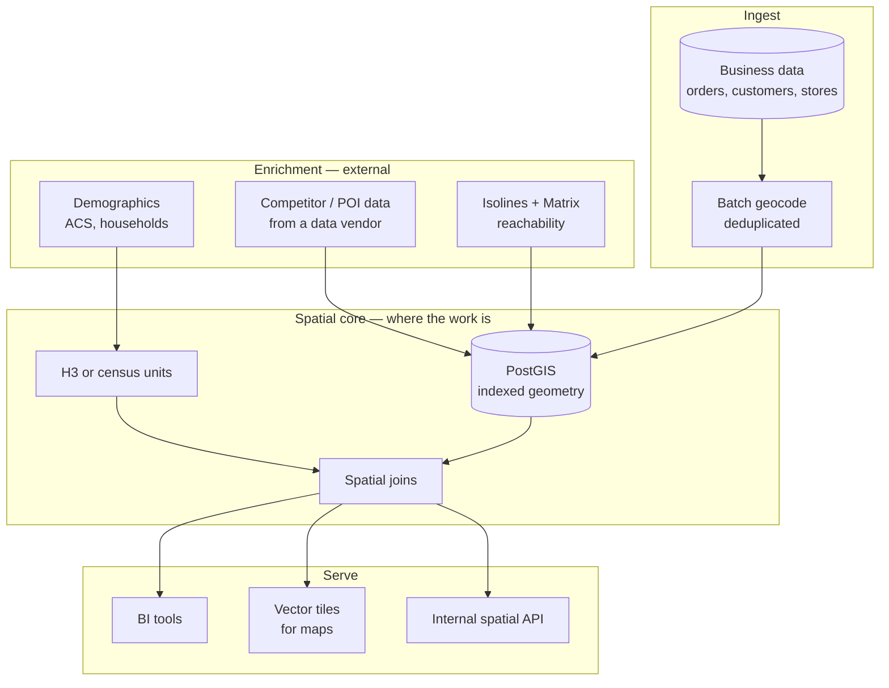

# Location Intelligence for Business Analytics

## The business problem

Most business data has a location attached and almost none of it is used spatially.

Every order has a delivery address. Every customer has a ZIP. Every store has a coordinate. Joining those to demographics, competitors, drive-time reachability, and each other produces answers that a BI tool cannot reach.

The engineering reality: **this is a data pipeline with a mapping API attached, and the API is the smallest part.**

## Typical users

Data and analytics teams. Business intelligence functions. Commercial strategy. Retail and CPG analytics. Real estate research. Anyone whose dashboard has a map on it and should have more.

## Recommended architecture

## Which HERE APIs, and why

**[Batch Geocoding](/guides/batch-geocoding)** — the entry point, and usually the largest single API cost. **Why:** your business data is addresses. Spatial analysis needs coordinates. Nothing is waiting; batch it, deduplicate first.

**[Catchment Area](/guides/catchment-area)** — reachability as an analytical dimension. **Why:** "revenue within a 15-minute drive of each store" is a question a radius cannot answer honestly.

**[Matrix Routing](/guides/matrix-routing)** — drive-time relationships at scale. **Why:** distance-decayed models, accessibility scoring, network analysis. Straight-line distance is a poor proxy and you already know it.

**[Maps](/guides/maps)** — rendering. Tiles into Leaflet, OpenLayers, or MapLibre GL.

<Warning>
**Do not use a mapping API's place index as your competitor or POI dataset.** Coverage, freshness, and categorization are not built for analytics. Buy POI data from a data vendor, or source it deliberately. This is the most common quiet failure in location intelligence programmes: an analysis whose conclusions rest on a place database that was never fit for the purpose.
</Warning>

**And frequently, no routing API at all.** See Alternatives.

## Implementation flow

1. **Deduplicate and normalize addresses.** A raw order export contains the same address hundreds of times.
2. **Batch geocode once.** Persist coordinates, normalized address, confidence score, and `geocoded_at`.
3. **Never geocode that address again.** New addresses arrive at a trickle and are geocoded in real time.
4. **Choose an aggregation grid.** H3 resolution 7–8, or census units if you need to join published demographics directly.
5. **Join business data to the grid.** This is a PostGIS problem.
6. **Enrich with demographics.** ACS at the tract or block-group level.
7. **Add reachability where it earns its place.** Isolines for coverage, matrix for distance decay.
8. **Serve.** Vector tiles for maps, aggregated tables for BI.

## Data flow

Geocoding is **once, forever, cached**. It is a property of an address, not of a query.

Reachability is **materialized**. Store polygons and matrices. A dashboard that computes drive time on filter change is a dashboard nobody uses twice.

The spatial join is **the workload**. Millions of points against thousands of polygons, indexed. This is database engineering, and it is where your effort actually goes.

<Tip>
Before you evaluate a mapping vendor, instrument how much of your intended analysis is answered by a spatial join over data you already have. For many teams the answer is most of it, and the routing API is a small addendum rather than the foundation.
</Tip>

## Production considerations

**Store the confidence score.** A low-confidence geocode persisted as truth silently corrupts every downstream aggregation. Surface it. Threshold it. Do not let a rooftop match and a city-centroid fallback carry equal weight in a revenue map.

**Geocoding quality is a data quality problem, not an API problem.** Bad input addresses produce bad coordinates on any platform. Normalize first.

**Demographic vintage matters.** ACS 5-year estimates carry margins of error that most dashboards silently discard. If you present a household count to three significant figures, you are overstating what you know.

**Grid choice constrains everything.** H3 gives you uniform cells and easy aggregation. Census units give you free demographic joins and irregular geometry. You will regret whichever you choose, differently.

**Rendering large geometries is its own problem.** Millions of points do not go into a browser. Vector tiles, server-side aggregation, or both.

**MapLibre GL `property/stops` expressions require integer values.** A `numeric` type from PostGIS causes silent rendering failure — no error, no styling. Cast it.

**Version your enrichment.** A revenue analysis run against 2024 demographics and re-run against 2026 will disagree, and someone will need to know why.

## Scaling

**Geocoding is bounded by distinct addresses**, not by records. A million orders from 80,000 customers is 80,000 geocodes, once.

**The spatial join scales with grid resolution.** H3 resolution 9 nationally is an enormous number of cells for marginal analytical gain. Coarsen aggressively; refine locally.

**Isoline and matrix costs are bounded by location count.** Stores, depots, and facilities. Business numbers you know.

**Tile generation is a batch job.** Pregenerate. Do not render on request.

**Query performance is an indexing problem.** `GIST` indexes on geometry, and think about whether your join is point-in-polygon or nearest-neighbour before you write it.

## Cost optimization

1. **Deduplicate before batch geocoding.** Order exports repeat addresses enormously.
2. **Geocode once, cache permanently**, keyed on normalized address.
3. **Materialize reachability.** No isolines in a dashboard.
4. **Coarsen the grid.** Resolution 7 answers most questions resolution 9 answers, at a fraction of the join cost.
5. **Pregenerate tiles.**
6. **Buy POI data.** Do not pay per-request for a place index that was never the right source.

The mapping API bill for a mature location intelligence programme should be **small and flat**: a one-time geocoding backfill, a trickle of new addresses, and a quarterly reachability refresh. If it is large and variable, something in the pipeline is calling an API where it should be reading a table.

See [HERE Pricing Explained](/start-here/here-pricing-explained).

## Common mistakes

**Geocoding in the analytics query.** Geocode at ingest.

**Not deduplicating before batch.**

**Discarding the confidence score.**

**Using a mapping place index as a competitor dataset.**

**Computing isolines interactively in a dashboard.**

**H3 resolution 9 when resolution 7 would answer the question.**

**Presenting ACS estimates without their margins of error.**

**Rendering raw points to the browser.**

**Silent MapLibre styling failure** from a `numeric` PostGIS column where an integer was required.

**Building a routing integration to answer a question a spatial join already answers.**

## Alternatives — honestly

<Warning>
**Many location intelligence programmes need no routing API.** If your questions are "revenue by ZIP," "customers within our footprint," or "which cells are underserved," those are spatial joins. PostGIS, a geocoder, and demographic data. Buy the routing API when drive time genuinely changes the answer — and be able to say when it does.
</Warning>

**Google Maps Platform** is competitive for geocoding and superior for place data. It does not expose isoline polygons in an equivalent form. For a programme dominated by geocoding and rendering, with no drive-time requirement, the platform choice is close to arbitrary — decide on cost and on whatever else you already license.

**Esri** owns this space at the high end. ArcGIS, Business Analyst, and their demographic products are more capable than what you will assemble. If location intelligence is a discipline in your firm rather than a project, evaluate Esri seriously before building.

**Open data plus DuckDB Spatial, Overture Maps, and OSM** is a genuinely viable modern stack. Free geocoding is worse; free everything else is often good enough. For an analytics team with SQL skills and no real-time requirement, this is a defensible build that costs engineering rather than licence fees.

**Placematic UpInsight** is a spatial analytics platform for business teams making location decisions — territory performance, trade area measurement, site scoring. It sits between "build it on PostGIS" and "buy Esri." Evaluate it as the middle option it is: less capable than Esri, faster to value than a build, and appropriate when the analytical questions are commercial rather than cartographic.

The honest framing: **the mapping vendor is rarely the decision that determines whether a location intelligence programme succeeds.** Data quality, grid choice, and whether anyone acts on the output determine that.

## Related guides

<CardGroup cols={2}>
  <Card title="Batch Geocoding" href="/guides/batch-geocoding">
    The entry point, and usually your largest API line item.
  </Card>
  <Card title="Site Selection" href="/use-cases/site-selection">
    The decision this analytical layer feeds.
  </Card>
  <Card title="Catchment Area" href="/guides/catchment-area">
    Reachability as an analytical dimension, materialized.
  </Card>
  <Card title="Territory Management" href="/use-cases/territory-management">
    Where spatial analysis meets organizational reality.
  </Card>
</CardGroup>

Also: [Geocoding and Search](/guides/geocoding) · [Matrix Routing](/guides/matrix-routing) · [Points of Interest](/guides/points-of-interest)

## HERE documentation

- [Batch API v7](https://www.here.com/docs/bundle/batch-api-v7-developer-guide/page/topics/batch-api-quick-start.html)
- [Geocoding & Search v7](https://www.here.com/docs/category/geocoding-search-api-v7)
- [Matrix Routing API v8](https://www.here.com/docs/category/matrix-routing-api-v8)

## Placematic

- [UpInsight — spatial analytics](https://placematic.com/spatial-data-analytics/)
- [UpGrid — territory management](https://placematic.com/territory-management/)

---

Need help designing or implementing a production HERE solution?

Placematic helps engineering teams select the right HERE APIs, estimate costs, migrate from Google Maps and build production-ready geospatial systems. [Talk to us](https://placematic.com/contact/).