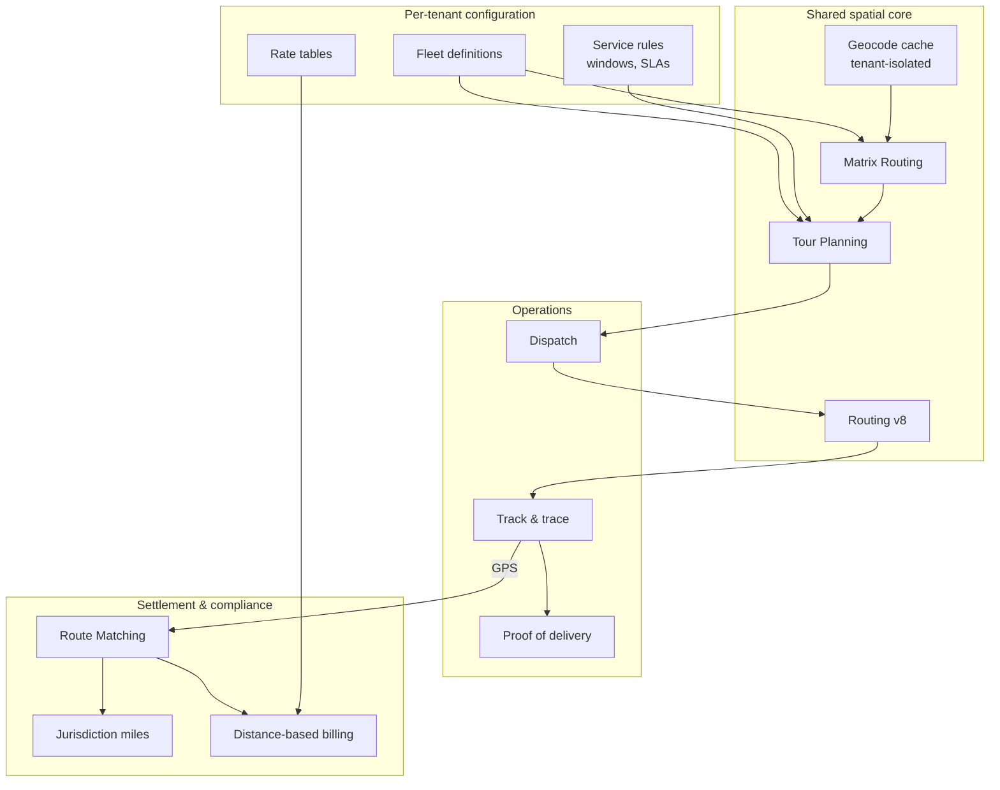

# Architecture for Logistics Platforms and TMS

## The business problem

A TMS does not route one fleet. It routes many, for many customers, each with different vehicles, different cargo classes, different service commitments, and different tolerance for being told a load cannot be delivered today.

The engineering difficulty is not routing. It is that **every constraint is per-tenant**, and the system must be correct for all of them simultaneously.

## Typical users

TMS vendors. Freight brokerages with software. 3PL platforms. Shipper-side transportation software. Multi-carrier logistics SaaS.

## Recommended architecture

## Which HERE APIs, and why

**[Matrix Routing](/guides/matrix-routing)** — lane cost tables. **Why:** a TMS answers "what would this lane cost across every carrier in the network." That is a matrix question asked at planning time, cached, and reused across quotes.

**[Tour Planning](/guides/tour-planning)** — consolidation and load building. **Why:** multi-stop, multi-vehicle, capacitated, with time windows. Pickup-and-delivery VRP is a first-class supported variant.

**[Truck Routing](/guides/truck-routing)** — the executed leg. **Why:** physical constraints vary per tenant and per load. A hazmat class D shipment routes differently from dry van, on the same lane, for the same carrier.

**[Route Matching](/guides/route-matching)** — settlement and compliance. **Why:** distance-based billing and IFTA jurisdiction miles both require the *driven* segments. Reverse geocoding cannot produce them and will not survive an audit. This is the API that turns telematics into money.

**[Batch Geocoding](/guides/batch-geocoding)** — onboarding. **Why:** a new tenant arrives with 40,000 shipper and consignee addresses. Nothing is waiting. Batch it.

**[Catchment Area](/guides/catchment-area)** — service coverage. **Why:** "which terminals can serve this ZIP within our SLA" is a reachability question, materialized once, queried locally.

## Implementation flow

1. **Isolate tenants at the data layer** before anything else. Vehicle profiles, geocode cache, and matrices are all tenant-scoped. A cross-tenant cache hit is a data breach.
2. **Onboard addresses via batch geocode**, deduplicated. A raw shipper export contains enormous repetition.
3. **Materialize terminal catchments.** Store polygons. Serviceability becomes `ST_Contains`, not an API call.
4. **Build lane matrices** for the tenant's active depot–destination sets. Cache aggressively; lanes are stable.
5. **Solve load building** with Tour Planning, per tenant, per dispatch window.
6. **Route executed legs** with the load's specific truck constraints — not the carrier's default profile.
7. **Ingest telematics.** Store. Nothing expensive on arrival.
8. **Match trips overnight.** Attribute segments to jurisdictions. Feed settlement.

## Data flow

The critical property: **spatial computation is shared infrastructure; constraints are tenant data.**

The geocode cache is shared *code*, isolated *data*. The matrix service is shared *code*, tenant-keyed *cache*. Tour Planning is called with tenant-specific fleet and rules.

<Warning>
The tempting optimization — one global geocode cache, because addresses are addresses — is where multi-tenant spatial systems leak. Tenant A's customer list is inferable from cache hit patterns. Isolate the cache. The savings were never worth it.
</Warning>

## Production considerations

**Quotes are not dispatch.** A rate quote needs a plausible distance in 200ms. A dispatch needs a constrained, drivable route. Different latency budgets, different APIs, different acceptable error. Do not serve quotes from the routing engine.

**Cache lane distances for quoting.** Chicago to Dallas for a 53' dry van does not change between Tuesday and Wednesday. Compute once, serve from a table.

**Constraints belong to the load, not the carrier.** The same tractor hauls dry van on Monday and hazmat on Tuesday. `shippedHazardousGoods` is a property of what is in the trailer.

**Settlement disputes are why you keep the raw trace.** Matched output is a derivation. When a carrier disputes billed miles, you need the observations and the map release version that produced the match.

**Rate limits are shared across your tenants.** One tenant's bulk operation can `429` another tenant's dispatch. Queue and prioritize at your layer. HERE sees one contract.

<Tip>
Give each tenant a call budget in your own system, enforced before the request leaves your infrastructure. Without it, your largest customer degrades service for everyone and you find out from a support ticket.
</Tip>

## Scaling

**Lane matrix cache is the highest-leverage store in the system.** Hit rates above 90% are achievable because freight lanes repeat.

**Solve per tenant, per depot region.** Global optimization across tenants is meaningless and expensive.

**Trip matching is the volume problem.** Every tracked vehicle across every tenant generates a trace. Segment, downsample, batch. Anything per-point multiplies by fleet size times ping rate times tenant count.

**Onboarding is bursty.** A large tenant arrives with millions of addresses. Batch API concurrency limits are per-contract. Queue onboarding jobs; do not let them starve nightly enrichment.

## Cost optimization

1. **Lane distance cache for quoting.** Quotes vastly outnumber dispatches.
2. **Materialized terminal catchments.** Serviceability checks are free in your own database.
3. **Batch geocode all onboarding**, deduplicated first.
4. **Matrix, never routing loops**, for lane cost tables.
5. **Trip segmentation before matching.** Drop idle time.
6. **Per-tenant call budgets.** Prevents one tenant's inefficiency from becoming your invoice.
7. **Deduplicate the input to everything.** Shipper address exports repeat constantly.

For a platform with a countable tracked-asset population, evaluate **asset-based pricing** against call-volume. A TMS billing per shipment but paying per API call has a margin structure that inverts under load. See [HERE Pricing Explained](/getting-started/here-pricing-explained).

## Common mistakes

**A shared geocode cache across tenants.** A leak, not an optimization.

**Serving rate quotes from the routing API.** Cache lane distances.

**Constraints attached to the carrier rather than the load.**

**No per-tenant rate budget.** One tenant `429`s everyone.

**Reverse geocoding to compute jurisdiction miles.** That is Route Matching.

**Discarding the raw trace after matching.** Settlement disputes need it.

**Not recording the map release version** on billed distances.

**Onboarding jobs competing with nightly enrichment** for batch concurrency.

**Assuming one carrier profile per tenant.** Fleets are heterogeneous.

## Alternatives — honestly

**Google Maps Platform** cannot express the physical and legal constraints a TMS must respect. It also has no equivalent to Route Matching, which means no defensible jurisdiction miles. For the routing and settlement core, it is not a candidate. It remains better for any consumer-facing address autocomplete you expose to shippers.

**Mapbox** is a reasonable choice for the *visualization* layer if your product's differentiator is its interface. The routing and compliance core stays on HERE.

**OSRM plus OSM** is used by TMS vendors with serious GIS teams. You inherit truck attribute curation, traffic, and map freshness as ongoing engineering. Realistic only if location is your core competency, not your infrastructure.

**A commercial optimization vendor** (rather than Tour Planning) makes sense if your objective function is genuinely custom — multi-day, cross-dock, or driver-preference-weighted. Feed it with [Matrix Routing](/guides/matrix-routing). The matrix is the interface.

## Related guides

<CardGroup cols={2}>
  <Card title="Route Matching" href="/guides/route-matching">
    The API that turns telematics into billable distance.
  </Card>
  <Card title="Tour Planning" href="/guides/tour-planning">
    Load building, pickup-and-delivery, and unassigned jobs.
  </Card>
  <Card title="Matrix Routing" href="/guides/matrix-routing">
    Lane cost tables and the cache that makes quoting cheap.
  </Card>
  <Card title="Batch Geocoding" href="/guides/batch-geocoding">
    Tenant onboarding at millions of addresses.
  </Card>
</CardGroup>

Also: [Fleet Routing](/use-cases/fleet-routing) · [Truck Routing](/guides/truck-routing) · [Catchment Area](/guides/catchment-area)

## HERE documentation

- [Matrix Routing API v8](https://www.here.com/docs/category/matrix-routing-api-v8)
- [Tour Planning API](https://docs.here.com/tour-planning/docs/introduction-tour-planning)
- [Batch API v7](https://www.here.com/docs/bundle/batch-api-v7-developer-guide/page/topics/batch-api-quick-start.html)

## Placematic

- [Maps for Transport and Logistics](https://placematic.com/here-location-services/maps-for-transport-and-logistics-here/)
- [HERE Location Services](https://placematic.com/here-location-services/)

---

See the packaged solution for your industry: [Logistics & Delivery](https://placematic.com/solutions/logistics/)

Need help designing or implementing a production HERE solution?

Placematic helps engineering teams select the right HERE APIs, estimate costs, migrate from Google Maps and build production-ready geospatial systems. [Talk to us](https://placematic.com/contact/).