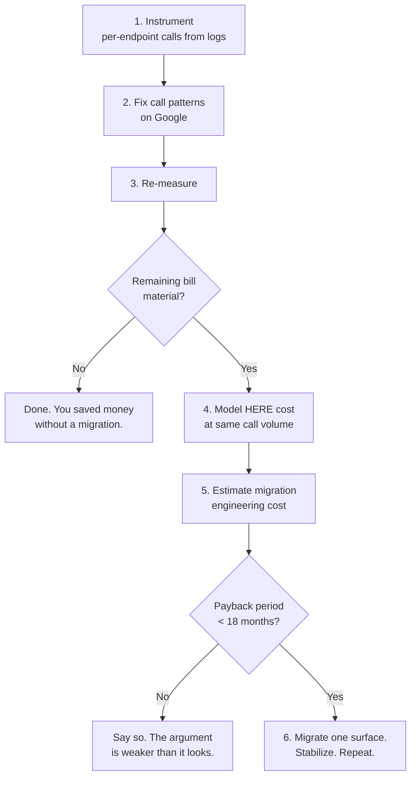

# Reducing Google Maps API Costs

Before you evaluate a vendor, evaluate your call pattern.

A meaningful share of teams who set out to migrate discover, after instrumenting, that the bill halves without changing platforms. What remains after that is your real migration case — and now you have a clean baseline to measure it against.

<Warning>
Migrating an uncached, undebounced implementation to a cheaper provider moves the waste to a cheaper meter. You will save money and still be wrong.
</Warning>

## The problem

The invoice arrived and someone in finance drew a line under it.

The reflex is to compare per-1,000 rates across vendors. They are close at entry level. That comparison teaches you nothing, because your bill is not determined by the rate card. It is determined by:

- Whether you cache geocoding results
- Whether you batch what tolerates latency
- Whether you debounce autocomplete
- Whether you loop routing calls to build distance tables
- Whether you reverse-geocode GPS pings on ingest
- Which volume tier you land in
- Which free bundles you consume, and whether you noticed

Six of those seven are yours to fix, today, on your current platform.

## Who this is for

CTOs and engineering managers who just received a cost escalation. Product engineers asked to "look into Maps spend." Anyone building a migration business case they will have to defend.

## Recommended approach

Steps 1 through 3 are free and nobody does them first.

## Step 1: Instrument

Not estimates. Logs.

Count calls per endpoint per month. Separate:

- Geocoding — real-time vs. what could be batch
- Reverse geocoding — user-facing vs. telematics ingest
- Routing — user-facing vs. calls that populate a distance table
- Autocomplete — sessions vs. keystrokes
- Tiles — with and without a CDN in front

The output of this step is a table. Without it, everything downstream is guessing, including the vendor comparison.

## Step 2: Fix the call pattern

Ranked by impact. These apply on any platform.

**Cache geocoding results permanently.**
Addresses do not move. Re-geocoding the same customer address on every order is the single largest avoidable cost in this domain. Store normalized address, coordinates, confidence score, and a timestamp against the customer record. Key the cache on the *normalized* address so `123 Main St` and `123 Main Street` hit the same entry.

**Stop reverse-geocoding GPS pings on ingest.**
A vehicle emitting a position every ten seconds over a nine-hour shift produces 3,240 pings. Across 200 vehicles that is 648,000 per day. The address is needed when a human looks at a screen or when a stop is detected. Not on packet arrival.

Instrument the ratio of reverse-geocoding calls to detected stops. Anything meaningfully above 1 means you are geocoding pings.

**Debounce autocomplete.**
It fires on keystrokes. Undebounced, you bill once per character typed, per session, forever. 200–300ms.

**Batch what tolerates latency.**
Nightly address normalization, historical backfill, bulk imports. If the result is written to a database rather than rendered to a screen, it should have been batched. Batch endpoints are cheaper per record.

**Deduplicate before batching.**
A raw export of order addresses contains enormous repetition. Geocoding 4 million rows that contain 900,000 distinct addresses bills for 4 million.

**Replace routing loops with matrix operations.**
If you call a point-to-point routing API in a loop to build a table of travel times, count those calls. A 200×3,000 problem is 600,000 routing calls, or one matrix request. See [Matrix Routing](/guides/matrix-routing).

**Put a CDN in front of tiles.**
Tiles are static per zoom, x, y, and style. This is available to you regardless of vendor.

**Set `return` fields explicitly.**
Requesting full turn-by-turn instructions and polylines when you needed a duration inflates payloads. Nothing consumes `instructions` server-side.

<Tip>
Do all of the above first. Re-measure. Present *that* number to finance. You will have already delivered a result, and the migration conversation becomes optional rather than defensive.
</Tip>

## Step 3: Model the migration honestly

<Warning>
**The meters do not map one to one.** Google bills per session where HERE bills per request, and the reverse. You cannot derive a HERE forecast from a Google invoice. This is why step 1 exists.
</Warning>

| Line | Source |
|---|---|
| Current spend, per endpoint | Logs |
| Savings from steps above, on Google | Measured, after |
| Remaining spend — the migration target | Derived |
| Projected HERE cost at same call volume | Modelled under both pricing models |
| Migration engineering cost | Estimated honestly |
| Payback period | Derived |

Teams migrating at production volume typically see meaningful savings, with geocoding-heavy workloads showing the largest gap. Those figures assume the call pattern is already sane.

**If the payback period exceeds eighteen months, say so before your CFO does.** It costs you one migration and buys you credibility for the ones that are worth doing.

## Where HERE genuinely changes the economics

Not everywhere. Three places:

**Matrix operations.** If you loop routing calls, the gap is not a rate difference. It is an architectural one.

**Batch geocoding at volume.** Cheaper per record, and the workload is usually enormous.

**Truck routing.** This is not a cost argument at all — Google offers no equivalent depth of physical vehicle constraints. If you route commercial vehicles, the argument is capability. See [Truck Routing](/guides/truck-routing).

**Contractual price stability** matters to teams who lived through vendor repricing. HERE pricing through a Gold Partner is contractual and does not reprice mid-term.

## Cost considerations

Two commercial models exist and choosing wrong is expensive:

**Call volume pricing** — per API call. Suits SaaS platforms whose call volume tracks customer count.

**Asset-based pricing** — per tracked asset per month. Suits fleet operators with a countable vehicle fleet and unpredictable call volume. A dispatcher who reroutes 200 trucks forty times a day is punished by call-volume pricing for operational diligence.

<Info>
Asset-based pricing availability depends on contract tier. Confirm it before it becomes load-bearing in a business case presented to your CFO.
</Info>

Free bundles are per-API and do not pool. Exhausting your routing bundle does not consume your geocoding bundle.

See [HERE Pricing Explained](/start-here/here-pricing-explained).

## Common mistakes

**Comparing list prices instead of workload cost.** Entry rates are close. Call mix, tier, batching, and bundles determine your bill.

**Migrating before optimizing.** You may be migrating waste.

**Presenting savings without migration cost.** Your CFO will ask.

**Assuming the meters map.** Session-based and request-based billing are not translatable.

**Optimizing the wrong endpoint.** Instrument first. The thing you assume is expensive usually isn't.

**Treating a free bundle as an architectural guarantee.** It is a marketing boundary.

**Migrating everything at once.** Two systems change, one incident occurs, root cause is ambiguous.

**Cutting a feature to save money.** Cheaper on a feature people stop using is not savings.

## Production checklist

- [ ] Per-endpoint call counts pulled from logs, not estimated
- [ ] Geocoding cache in place, keyed on normalized address, with hit rate instrumented
- [ ] Reverse-geocode-to-stop-detection ratio measured
- [ ] Autocomplete debounced at 200–300ms
- [ ] Batch pipeline for latency-tolerant geocoding, with input deduplicated
- [ ] Routing loops identified and counted
- [ ] CDN in front of tiles
- [ ] `return` fields explicit on every routing call
- [ ] Re-measured after all of the above
- [ ] Migration engineering cost estimated, payback period computed and stated

## Alternatives and trade-offs

**Stay on Google.** If your spend is under roughly $1,000/month after optimization, the payback period on migration engineering is measured in years. Do something else. If your product's core value is consumer place discovery — business hours, reviews, photos — Google's data is categorically better and you should keep it regardless of cost.

**Hybrid.** Keep Google for consumer place search and autocomplete. Move routing, matrix operations, and batch geocoding to HERE. This is a common and defensible endpoint. Document it as a decision before someone calls it a partial migration.

**Self-host OSRM.** Free, and yours to operate. Truck attributes, traffic, and map freshness become your engineering. Realistic for a team with GIS expertise where location is core competency, not infrastructure.

**Mapbox.** Strong on styling and developer experience. Weak on commercial vehicle depth. If your differentiator is the map's appearance rather than routing correctness, it deserves evaluation.

**Do nothing.** If the bill is 0.4% of revenue and growing linearly with a business that is growing faster, this is not the highest-value thing your engineers could be doing. Say that out loud.

## Related guides

<CardGroup cols={2}>
  <Card title="Migrating from Google Maps" href="/guides/google-migration">
    Sequencing, shadow-writing, and validating quality during cutover.
  </Card>
  <Card title="HERE Pricing Explained" href="/start-here/here-pricing-explained">
    Call volume versus asset-based, and modelling a bill you can defend.
  </Card>
  <Card title="Matrix Routing" href="/guides/matrix-routing">
    The routing loop that is costing you money right now.
  </Card>
  <Card title="Batch Geocoding" href="/guides/batch-geocoding">
    The first surface to migrate. Smallest risk, largest saving.
  </Card>
</CardGroup>

Also: [Geocoding and Search](/guides/geocoding) · [Vehicle Tracking](/use-cases/vehicle-tracking) · [HERE vs Google Maps](/comparisons/here-vs-google-maps)

## Placematic

- [HERE API pricing](https://placematic.com/here-location-services/here-pricing/)
- [Cost calculator](https://placematic.com/tools/calculator)

---

Need help designing or implementing a production HERE solution?

Placematic helps engineering teams select the right HERE APIs, estimate usage, migrate from Google Maps and build production-ready geospatial systems. [Talk to us](https://placematic.com/contact/).