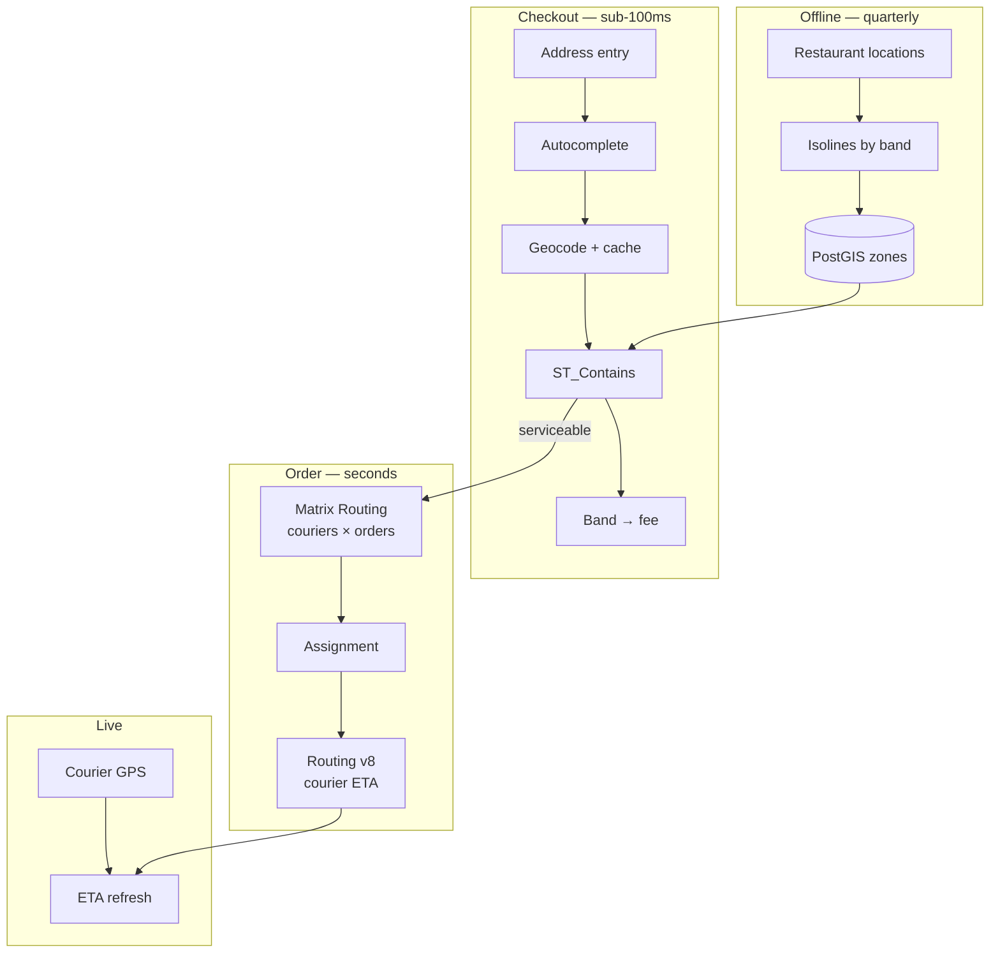

# Architecture for Restaurant Delivery Platforms

## The business problem

Three questions, three latency budgets, three different correct answers.

**"Do you deliver here?"** — at checkout, in milliseconds, on every session.
**"Which courier takes this order?"** — at dispatch, in seconds, on every order.
**"What does delivery cost?"** — at checkout, derived from the first answer.

Conflating them produces a platform whose checkout calls a routing API and whose margin evaporates at scale.

## Typical users

Restaurant delivery marketplaces. Ghost kitchen platforms. Multi-brand restaurant groups running their own delivery. POS vendors adding delivery.

## Recommended architecture

## Which HERE APIs, and why

**[Catchment Area](/guides/catchment-area)** — delivery zones, materialized. **Why:** serviceability is asked on every session. It must be a local spatial query. See [Delivery Zones](/use-cases/delivery-zones).

**[Geocoding](/guides/geocoding)** — address to point, cached permanently. **Why:** you need a coordinate for containment. You need it once per address, ever.

**[Matrix Routing](/guides/matrix-routing)** — courier assignment. **Why:** "which of 40 available couriers is nearest to this restaurant" is a 40×1 matrix, not 40 routing calls. At order volume, this is the difference between viable and not.

**[Routing](/guides/routing)** — courier ETA and navigation geometry. **Why:** once assigned, the courier needs a path. Use `transportMode=scooter` or `bicycle` where legally and physically appropriate — a car route for a scooter is wrong in both directions.

<Warning>
`bicycle` and `scooter` transport modes carry beta status with limited functionality in HERE Routing v8. Validate them against your market before building courier ETAs on them. See [HERE's transport modes reference](https://www.here.com/docs/bundle/routing-api-developer-guide-v8/page/topics/transport-modes.html).
</Warning>

**Autocomplete** — address entry. **Why:** `/autocomplete` completes *addresses*. `/autosuggest` handles misspellings and suggests *places*. For a delivery address field you want the former. See [Geocoding and Search](/guides/geocoding).

**Not for restaurant discovery.** See Alternatives.

## Implementation flow

1. **Materialize delivery zones** per restaurant, per band, at peak departure time.
2. **Checkout: autocomplete → geocode (cached) → `ST_Contains`.** Zero external calls on a cache hit.
3. **Return the band.** Delivery fee is a table lookup keyed on band.
4. **On order confirm**, build a small matrix of available couriers against the restaurant.
5. **Assign** by travel time plus your own business rules — courier rating, current load, shift end.
6. **Route the courier**, restaurant to customer, in the correct transport mode.
7. **Refresh ETA** from GPS position plus remaining route, not by re-routing on every ping.

## Data flow

Serviceability is a **read from your own database**.

Delivery fee is a **read from your own table**, keyed on the band that read returned.

The only per-order external calls are one small matrix and one route. That is the target, and it is achievable.

<Tip>
Dynamic delivery pricing lives naturally here: `deliveryConditions` per band, mapping order value to delivery price. That mapping is business data in your database, informed by the zone geometry. It is not something a routing API returns.
</Tip>

## Production considerations

**Debounce autocomplete.** It fires on keystrokes. Undebounced, you bill once per character typed, per session, forever. 200–300ms.

**Peak zones are the real zones.** Compute isolines at dinner rush. A midnight polygon promises delivery times you cannot meet at 7pm.

**Courier ETA and delivery promise are different numbers.** The promise includes food preparation time, which no routing API knows. Model it separately or your ETAs will be optimistic in a way customers remember.

**Reassignment is a new matrix.** A courier cancels. You are re-solving, not patching.

**Do not re-route on GPS ping.** Recompute ETA from remaining route geometry and current position. Re-routing on every ping at courier fleet scale is the reverse-geocoding-every-ping mistake wearing a different hat.

**Transport mode must match reality.** A scooter courier routed as a car takes forbidden turns and is given illegal highway segments. In dense markets this is a safety issue, not an accuracy issue.

## Scaling

**Checkout scales for free.** PostGIS containment against an indexed polygon set does not care about your traffic.

**Geocode cache hit rate approaches 1** as your customer base matures. New addresses are the only cost.

**Matrix size is bounded by courier availability**, not by order volume. 40 couriers × 1 restaurant is a trivial matrix, computed thousands of times a day, and it is still vastly cheaper than 40 routing calls.

**Zone count grows with restaurant count.** A 5,000-restaurant marketplace with three bands is 15,000 polygons. PostGIS handles that. The quarterly isoline cost is 15,000 calls — bounded, forecastable, and unrelated to order volume.

## Cost optimization

1. **Never call an API at checkout.** Materialized zones, cached geocodes.
2. **Debounce autocomplete.** The single largest unforced cost in consumer delivery apps.
3. **Matrix for assignment, never routing loops.**
4. **ETA refresh from geometry, not from re-routing.**
5. **Cache the restaurant's outbound geometry** to frequent delivery clusters.
6. **Deduplicate before batch geocoding** your historical order table. Order exports repeat addresses enormously.

The cost structure you want: **bounded by locations and couriers, not by sessions and pings.**

## Common mistakes

**Routing API at checkout for serviceability.** Works. Fatal at scale.

**Radius delivery zones.** See [Delivery Zones](/use-cases/delivery-zones).

**Undebounced autocomplete.**

**Car routing for scooter couriers.**

**Assuming beta transport modes are production-ready.**

**Re-routing on every courier GPS ping.**

**Assigning couriers by straight-line distance.** A courier 800m away across a river is not close.

**Treating courier ETA as the delivery promise.** Preparation time is not routing.

**Using HERE for restaurant discovery.** See below.

**Re-geocoding a repeat customer's address.**

## Alternatives — honestly

<Warning>
**For restaurant discovery — names, cuisines, hours, photos, ratings — Google's place data is categorically better than HERE's.** If your marketplace's value is helping users find a restaurant, that surface belongs on Google.
</Warning>

Placematic sells HERE. We would rather you know this now than after a migration.

The architecture that works: **HERE for zones, geocoding, courier routing, and assignment. Google for restaurant search, listings, and consumer autocomplete.** Two vendors, each doing what it is good at. Document that split as a decision before someone frames it as a failed migration.

**Mapbox** is a strong choice for the customer-facing tracking map if visual polish is a differentiator. The routing core stays on HERE.

**Straight-line distance** is genuinely adequate for courier assignment in a dense uniform grid over very short distances. Manhattan, sub-kilometre. Be honest about whether you are in that case; most markets are not.

**Your own zones, hand-drawn** by operations, need no isoline API at all. PostGIS and a polygon editor. If ops already knows the boundaries and defends them politically, do not buy an API to argue with them.

## Related guides

<CardGroup cols={2}>
  <Card title="Delivery Zones" href="/use-cases/delivery-zones">
    The materialization pattern this entire architecture depends on.
  </Card>
  <Card title="Matrix Routing" href="/guides/matrix-routing">
    Courier assignment without the routing loop.
  </Card>
  <Card title="Geocoding and Search" href="/guides/geocoding">
    Autocomplete versus autosuggest, debouncing, and caching.
  </Card>
  <Card title="HERE vs Google Maps" href="/comparisons/here-vs-google-maps">
    Where the place-data gap decides your architecture.
  </Card>
</CardGroup>

Also: [Catchment Area](/guides/catchment-area) · [Routing](/guides/routing) · [Store Locator](/use-cases/store-locator)

## HERE documentation

- [Transport modes](https://www.here.com/docs/bundle/routing-api-developer-guide-v8/page/topics/transport-modes.html)
- [Matrix Routing API v8](https://www.here.com/docs/category/matrix-routing-api-v8)
- [Geocoding & Search v7](https://www.here.com/docs/category/geocoding-search-api-v7)

## Placematic

- [Catchment Area](https://placematic.com/here-location-services/catchment-area/)
- [HERE Location Services](https://placematic.com/here-location-services/)

---

Need help designing or implementing a production HERE solution?

Placematic helps engineering teams select the right HERE APIs, estimate costs, migrate from Google Maps and build production-ready geospatial systems. [Talk to us](https://placematic.com/contact/).