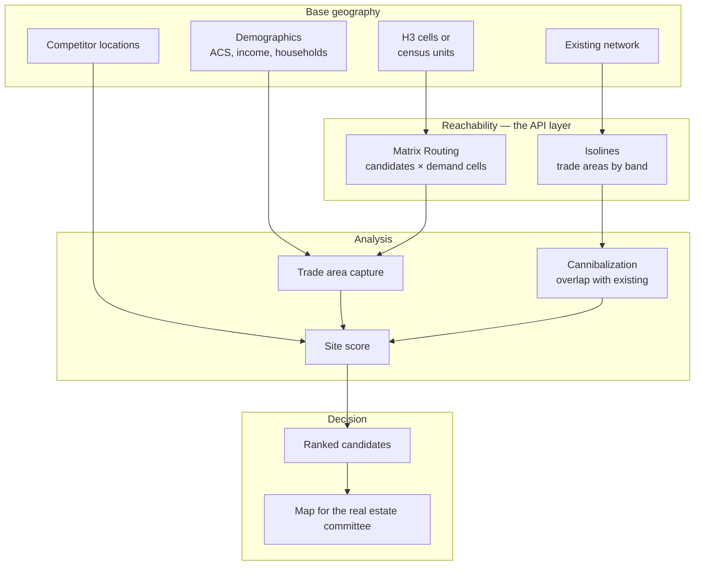

# Retail Expansion and Site Selection

## The business problem

Where should the next store go, and what will it do to the stores you already have?

The second half is the half that gets skipped. A site with excellent demographics that sits inside an existing store's trade area does not add revenue. It relocates it, and now you pay two leases.

## Typical users

Retail expansion teams. Restaurant franchise development. Real estate analytics platforms. Healthcare network planning. QSR and convenience chains.

## Recommended architecture

<Info>
The routing API occupies one box. The other five are your data, your model, and your judgement. Teams that lead with the mapping vendor build a beautiful map and a bad decision.
</Info>

## Which HERE APIs, and why

**[Catchment Area](/guides/catchment-area)** — trade areas. **Why:** a 10-minute drive-time polygon is what a trade area actually is. A radius includes the lake, the airport, and the far side of the interstate with no exit.

**[Matrix Routing](/guides/matrix-routing)** — demand capture. **Why:** "how long from each demand cell to each candidate site" is a matrix. It lets you model gravity-based capture rather than binary containment, which is more honest and produces better rankings.

**[Batch Geocoding](/guides/batch-geocoding)** — competitor and candidate addresses to points. Deduplicated, once.

**[Maps](/guides/maps)** — rendering, for the humans who sign the lease.

**Not [POI search](/guides/points-of-interest) for competitor data.**

<Warning>
Competitor location data sourced from a public place index will be stale, incomplete, and inconsistent in categorization. A store that closed six months ago still appears. Buy competitor data from a data vendor, or scrape it deliberately and own the freshness. Do not build an expansion strategy on a mapping API's place index.
</Warning>

## Implementation flow

1. **Choose a demand grid.** H3 at resolution 8 works well — roughly 0.7 km² cells, small enough to be meaningful, coarse enough to compute.
2. **Join demographics to cells.** US Census ACS, household counts, income, daytime population.
3. **Compute isolines** for every existing store, at your trade-area bands, in the transport mode your customers use.
4. **Compute isolines for each candidate site.**
5. **Overlap analysis.** Candidate trade area ∩ existing trade areas = cannibalization exposure.
6. **Matrix from demand cells to candidates** for gravity-weighted capture.
7. **Score.** Capture minus cannibalization, adjusted for competitor presence, cost, and whatever your business believes.
8. **Rank, map, and hand to the committee.**

## Data flow

Everything is **materialized and versioned**. This is an analytical system. Nothing runs in a request path.

Isolines are computed **once per site, per band**. Store the polygons. A 400-store network with three bands is 1,200 calls — quarterly, not daily.

The matrix is computed **once per candidate set**, cached, and reused across every scenario the committee asks for.

<Tip>
The committee will ask for twelve scenarios. If each scenario re-computes isolines, you have built a slow, expensive system that discourages the exploration it exists to enable. Materialize once. Explore for free.
</Tip>

## Production considerations

**Cannibalization is the whole point.** A site score that ignores overlap with your existing network optimizes for gross revenue, not incremental. Every expansion team has a story about the store that killed its neighbour.

**Binary containment overstates capture.** A customer 9 minutes from store A and 10 minutes from store B does not shop exclusively at A. Gravity models — capture decaying with drive time — are more honest, and the matrix gives you the inputs.

**Transport mode matters more than it seems.** Urban customers walk or take transit. Suburban customers drive. A 10-minute drive-time polygon in Manhattan describes a customer base that does not exist.

**Peak versus off-peak.** A trade area computed at 3am is larger than the one your customers actually experience at 6pm.

**Demographics have a vintage.** ACS 5-year estimates are exactly that. Do not present them with more precision than they carry.

**Version your analysis.** When the store underperforms in year two, someone will ask what the model predicted and on what data.

## Scaling

**Isoline cost is bounded by site count.** Existing stores plus candidates, times bands. Quarterly.

**Matrix cost is bounded by candidates × demand cells.** Restrict cells to those within the maximum band of any candidate — most of the country is irrelevant to any given site.

**H3 resolution is the scaling dial.** Resolution 8 nationally is a very large number of cells. Resolution 6 for screening, 8 for finalists.

**The join is the expensive part, and it is in PostGIS, not HERE.** Spatial joins over millions of cells are a database engineering problem.

**Scenario exploration must be free.** Materialize everything; let the analyst iterate.

## Cost optimization

1. **Screen coarsely, analyze finely.** Resolution 6 to shortlist, resolution 8 for the final five.
2. **Restrict demand cells** to the union of candidate trade areas before any matrix call.
3. **Cache existing-store isolines.** They change when you open or close a store.
4. **Simplify polygons** before the overlap join. They were approximations.
5. **Batch-geocode competitor and candidate addresses.**
6. **Never compute an isoline inside an interactive tool.** Precompute.

Cost is bounded by site count and candidate count — both business numbers you already know. This should be a four-figure annual line, not a variable one.

## Common mistakes

**Radius trade areas.** Lakes, airports, limited-access highways.

**Ignoring cannibalization.** Relocating revenue and calling it growth.

**Binary containment instead of distance-decayed capture.**

**Driving isolines for an urban walk-in customer base.**

**Sourcing competitor locations from a public place index.**

**Off-peak trade areas presented as customer reality.**

**Computing isolines interactively.** Slow, expensive, discourages exploration.

**H3 resolution 9 nationally.** Then wondering about the bill.

**Presenting ACS estimates without their vintage or margin of error.**

**No versioning.** Year two, no defence.

## Alternatives — honestly

**Google Maps Platform** does not expose isoline polygons in an equivalent form. For trade-area geometry, HERE is the more direct fit. Google's Places data is better for competitor intelligence than HERE's — though as stated above, neither is good enough for an expansion decision.

**Esri Business Analyst** is the incumbent in this space and it is genuinely good. If site selection is your firm's business, Esri's demographic data, drive-time capability, and analyst tooling are ahead of anything you will assemble from a routing API and PostGIS. It costs accordingly.

Be honest about which you are: a retailer doing three expansions a year, or a platform doing this at scale for clients. The first should probably buy Esri or a consultancy. The second should build.

**Commercial site-selection vendors** — Buxton, Placer.ai, SafeGraph — sell foot traffic and visitation data that no mapping API produces. Actual observed visits beat modelled capture. If the budget exists, this is a better input than any drive-time polygon.

**Pure demographics with no reachability** is a real methodology and it is common. It is also how retailers end up with stores separated by a river. Drive time earns its place.

**Placematic UpInsight** is spatial analytics for business teams making location decisions — trade-area measurement, site scoring, expansion without cannibalization. It is built on the architecture above. Evaluate it against building this yourself, and against Esri. The honest comparison is: Esri if site selection is your core discipline and budget is not the constraint; UpInsight if you want the workflow without owning the pipeline; build it if you have a spatial data team and specific requirements neither fits.

## Related guides

<CardGroup cols={2}>
  <Card title="Catchment Area" href="/guides/catchment-area">
    Trade areas as drive-time polygons, and the materialization pattern.
  </Card>
  <Card title="Matrix Routing" href="/guides/matrix-routing">
    Demand cells × candidates, for gravity-weighted capture.
  </Card>
  <Card title="Location Intelligence" href="/use-cases/location-intelligence">
    The analytical layer this feeds.
  </Card>
  <Card title="Territory Management" href="/use-cases/territory-management">
    Once the stores exist, someone has to cover them.
  </Card>
</CardGroup>

Also: [Batch Geocoding](/guides/batch-geocoding) · [Points of Interest](/guides/points-of-interest) · [Delivery Zones](/use-cases/delivery-zones)

## HERE documentation

- [Routing API v8](https://www.here.com/docs/category/routing-api-v8) — isoline routing
- [Matrix Routing API v8](https://www.here.com/docs/category/matrix-routing-api-v8)
- [Batch API v7](https://www.here.com/docs/bundle/batch-api-v7-developer-guide/page/topics/batch-api-quick-start.html)

## Placematic

- [UpInsight — spatial analytics](https://placematic.com/spatial-data-analytics/)
- [Catchment Area](https://placematic.com/here-location-services/catchment-area/)

---

See the packaged solution for your industry: [Network planning](https://placematic.com/solutions/network-planning/)

Need help designing or implementing a production HERE solution?

Placematic helps engineering teams select the right HERE APIs, estimate costs, migrate from Google Maps and build production-ready geospatial systems. [Talk to us](https://placematic.com/contact/).