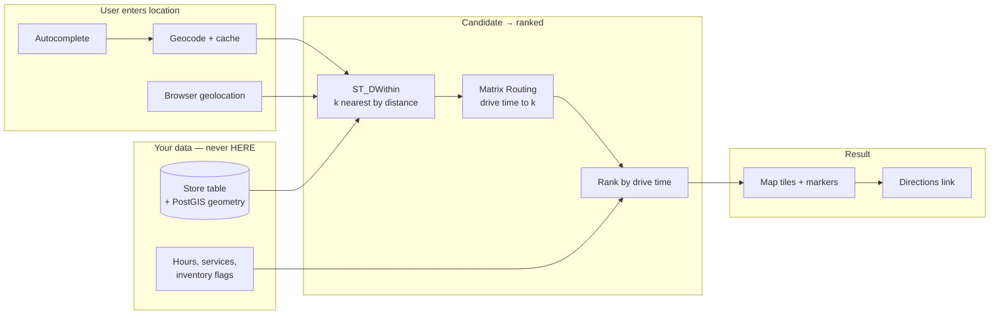

# Building a Modern Store Locator

## The business problem

"Where is your nearest location, and how do I get there?"

It is the most-visited page on most multi-location brand sites, and it is almost always built twice. Once badly, with a radius query over a database. Then again, after someone notices the "nearest" store is across a river.

## Typical users

Multi-location retail brands. Restaurant chains. Franchise networks. Dealership groups. Banks and credit unions. Healthcare networks.

## Recommended architecture

The two-stage ranking is the whole design. Straight-line distance narrows the field cheaply. Drive time orders it correctly.

## Which HERE APIs, and why

**Autocomplete** — address entry. **Why:** `/autocomplete` completes *addresses*. `/autosuggest` handles misspellings and suggests *places*. A store locator's input box wants the former. See [Geocoding and Search](/guides/geocoding).

**[Geocoding](/guides/geocoding)** — the user's input to a point. Cache it. The same three ZIP codes will be typed a million times.

**[Matrix Routing](/guides/matrix-routing)** — ranking the shortlist. **Why:** 1 origin × 8 candidate stores is one matrix call. Eight routing calls is eight. At store-locator traffic, that ratio is your entire cost structure.

**[Maps](/guides/maps)** — tiles. **Why:** you need a map. Tiles work with Leaflet, OpenLayers, and MapLibre GL. If you already render with one of those, integration is a tile URL swap.

**Not [POI search](/guides/points-of-interest).**

<Warning>
Your stores live in **your** database. Querying HERE's public place index to find your own locations is fragile, expensive, and will silently miss the store that opened last week. Map data ships on a release cadence. Your store table does not.
</Warning>

## Implementation flow

1. **Geocode your store network once.** [Batch](/guides/batch-geocoding) it. Store the geometry in PostGIS with a spatial index.
2. **User enters a location** — autocomplete, then geocode, then cache. Or take browser geolocation directly.
3. **Shortlist with `ST_DWithin`.** Take the k nearest by straight-line distance. k = 8 to 12. This is free.
4. **Rank the shortlist by drive time** with a single matrix call, origin × k.
5. **Filter by business rules** — open now, has pharmacy, in stock — from your own data.
6. **Render** the map and the ordered list.
7. **Directions** are a routing call, and only when the user asks.

<Info>
Step 3 exists to make step 4 cheap. Matrix over your *entire* 2,000-store network is wasteful; matrix over 10 candidates is trivial. Straight-line distance is a bad ranker and an excellent filter.
</Info>

## Data flow

Store data flows **out of your database, never into a mapping API**.

The user's coordinate is the only external geocoding call, and it hits cache constantly — the input space is small and repetitive.

The matrix call is bounded at origin × k, regardless of network size.

## Production considerations

**Straight-line nearest is not nearest.** A store 800m away across a river, a rail line, or a limited-access highway is not close. This is the defect that gets store locators rebuilt.

**Cache the ranking, not just the geocode.** For a given user coordinate rounded to ~3 decimal places, the drive-time ranking of nearby stores is stable for weeks. Cache the ordered result.

**Debounce autocomplete.** It fires on keystrokes. Undebounced, you bill once per character. 200–300ms.

**Handle "no stores nearby" deliberately.** Expanding the radius silently until something is found produces a locator that cheerfully sends people 200 miles.

**Hours, services, and inventory are your data.** They change hourly. No mapping API knows them. Do not attempt to source them externally.

**Directions on demand only.** Most visitors never click. Routing on page render bills for a feature nobody used.

**Restrict browser-exposed keys by domain.** Any key in frontend JavaScript is public. See [Authentication](/start-here/authentication).

## Scaling

**PostGIS `ST_DWithin` against an indexed geometry column is sub-millisecond** and indifferent to your traffic.

**Matrix cost is bounded by k, not by store count.** A 5,000-store network and a 50-store network cost the same per lookup.

**The ranking cache is the scaling lever.** Round the user coordinate. Dense urban areas produce enormous hit rates.

**Geocode cache hit rate approaches 1** on a store locator. Users type city names and ZIP codes, not distinct street addresses.

## Cost optimization

1. **Shortlist locally before any API call.** `ST_DWithin` first, always.
2. **Cache the ranked result**, keyed on rounded user coordinate.
3. **Debounce autocomplete.**
4. **Directions on click, never on render.**
5. **CDN in front of tiles.** They are static per zoom/x/y/style.
6. **Never query a public place index for your own stores.**
7. **Batch-geocode the store network once.** It changes when you open a store.

Target cost structure: **bounded per lookup, independent of network size, dominated by cache misses.**

## Common mistakes

**Ranking by straight-line distance.** Rivers.

**Matrix over the entire store network** instead of a shortlist.

**Routing calls to rank** instead of one matrix call.

**Querying HERE's POI index for your own stores.**

**Undebounced autocomplete.**

**Computing directions on page load.**

**Unrestricted API key in frontend JavaScript.**

**Silently expanding the search radius** until a result appears.

**No CDN on tiles.**

**Using `/discover` for the store list.** It ranks by relevance. `/browse` ranks by distance. Neither is right here — your stores are your data.

## Alternatives — honestly

**Google Maps Platform** is the better choice if your locator must also surface *other people's* businesses — reviews, photos, hours from a public index. It is not better for finding your own stores, which are in your database either way. The map's appearance is the real difference most brands are choosing between.

**Mapbox** is a strong choice when the map's visual identity is part of the brand. Styling depth exceeds HERE's. The ranking core is a matrix call either way, and you would still need a routing provider.

**No routing provider at all** is defensible for a small, sparse network — twelve stores across a state. Straight-line distance is correct when the nearest store is 40 miles away and the second nearest is 90. Buy the API when store density makes drive time diverge from distance.

**Placematic Pos-Eye** is an embeddable store locator over your own location data, with HERE-powered maps and real-time autocomplete. It exists because the architecture above is well understood, and most brands do not want to own it. The trade-off is the usual one: build it and control it, or embed it and ship this quarter. Evaluate it as a buy decision, not a technical one — everything on this page is what you would be building.

## Related guides

<CardGroup cols={2}>
  <Card title="Matrix Routing" href="/guides/matrix-routing">
    One origin, k candidates, one call.
  </Card>
  <Card title="Geocoding and Search" href="/guides/geocoding">
    Autocomplete versus autosuggest, debouncing, and caching.
  </Card>
  <Card title="Maps" href="/guides/maps">
    Tiles, CDN caching, and browser key restriction.
  </Card>
  <Card title="Points of Interest" href="/guides/points-of-interest">
    Why your stores are not a POI query — and where Google wins.
  </Card>
</CardGroup>

Also: [Delivery Zones](/use-cases/delivery-zones) · [Site Selection](/use-cases/site-selection) · [Batch Geocoding](/guides/batch-geocoding)

## HERE documentation

- [Geocoding & Search v7](https://www.here.com/docs/category/geocoding-search-api-v7)
- [Matrix Routing API v8](https://www.here.com/docs/category/matrix-routing-api-v8)
- [HERE Map Rendering](https://www.here.com/docs/category/here-map-rendering)

## Placematic

- [Pos-Eye — embeddable store locator](https://placematic.com/store-locator/)
- [HERE Location Services](https://placematic.com/here-location-services/)

---

Need help designing or implementing a production HERE solution?

Placematic helps engineering teams select the right HERE APIs, estimate costs, migrate from Google Maps and build production-ready geospatial systems. [Talk to us](https://placematic.com/contact/).