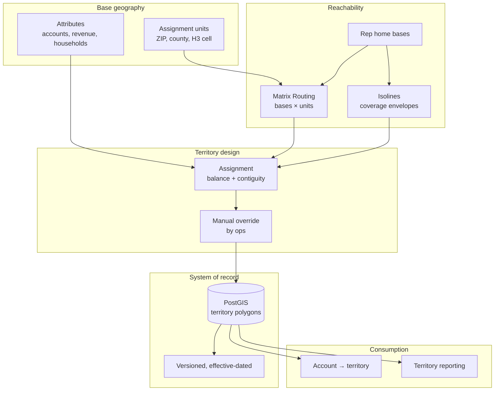

# Building Sales and Operational Territories

## The business problem

Divide a market among 40 sales reps, or 200 service technicians, such that each territory is workable, roughly balanced, contiguous, and politically defensible.

The politics are not a joke. A territory system that produces a mathematically optimal assignment nobody accepts has failed completely.

## Typical users

Sales operations. Field service management. Franchise development. Distribution and merchandising. Insurance and financial services field teams.

## Recommended architecture

<Info>
Notice what dominates this diagram: your database. Territory management is a data modelling problem with a routing API attached, not the reverse. Teams that lead with the API build the wrong system.
</Info>

## Which HERE APIs, and why

**[Matrix Routing](/guides/matrix-routing)** — the reachability substrate. **Why:** territory design needs drive time from each rep base to each assignment unit. That is exactly a matrix. 40 bases × 800 ZIP centroids is one problem, not 32,000 routing calls.

**[Catchment Area](/guides/catchment-area)** — coverage envelopes. **Why:** "everything within a 45-minute drive of this rep" is a reachability polygon, computed once, stored. Useful for visualizing coverage and gaps, not for assignment.

**[Batch Geocoding](/guides/batch-geocoding)** — accounts to points. **Why:** you have 200,000 accounts with addresses. Nothing is waiting. Batch, deduplicate, cache forever.

**[Maps](/guides/maps)** — rendering territory polygons for the humans who must approve them.

**Not [Routing](/guides/routing).** A territory system does not route. It assigns.

<Warning>
**Isolines define coverage. Matrix defines assignment.** Two reps' 45-minute polygons overlap heavily. Assigning accounts by polygon membership produces arbitrary results in exactly the overlap regions where your densest accounts live. Assign by travel time.
</Warning>

## Implementation flow

1. **Choose the assignment unit.** ZIP code, county, or an H3 cell at resolution 7–8. This decision constrains everything downstream and is hard to reverse.
2. **Attach attributes** to each unit — account count, revenue, households, workload proxy.
3. **Batch-geocode accounts** to points; aggregate them to units.
4. **Build the matrix**: rep bases × unit centroids.
5. **Assign** with balance and contiguity constraints. This is an optimization you own — see Alternatives.
6. **Give ops a manual override.** Non-negotiable.
7. **Store territories as versioned, effective-dated polygons** in PostGIS.
8. **Account lookup is `ST_Contains`.** It never calls an API.

## Data flow

The **unit** is the atom. Accounts roll up to units. Units roll up to territories. Nothing is assigned at the account level, because account-level assignment produces non-contiguous territories that look like confetti.

Territory membership is answered **locally, forever**. A CRM asking "whose account is this" must never make a network call to a mapping vendor.

## Production considerations

**Effective-date everything.** Territories change at quarter boundaries. Commission disputes reach back twelve months. A territory table without effective dates will be rebuilt within a year, under pressure, by someone angry.

**Contiguity is a hard requirement, not a nicety.** A rep whose territory is three disconnected islands drives more than they sell. Most naive assignment algorithms produce exactly that.

**Balance is multi-objective and contested.** Balance by account count, revenue, drive time, or workload? Different answers, all defensible. Pick one, state it explicitly, and expect to be argued with.

**Overlap is sometimes correct.** Overlay territories — a specialist covering three generalist territories — are a legitimate model. Do not force a partition where the business runs a hierarchy.

**The manual override is the feature.** Ops knows that the rep in Cleveland has a relationship with the account in Akron. Model the override, log who made it and why, and preserve it across re-runs.

<Tip>
Re-running the optimizer and silently discarding last quarter's manual overrides is how a territory system loses its users permanently. Treat overrides as constraints on the next solve, not as edits to be overwritten.
</Tip>

**Centroids lie.** A ZIP code's geometric centroid may sit in a lake, or on the wrong side of a highway. Use a population-weighted centroid, or the mean of geocoded accounts within the unit.

## Scaling

**The matrix is the only meaningful API cost, and it is bounded.** 40 reps × 800 units, recomputed quarterly. That is small.

**Cache it.** Rep home bases and ZIP centroids do not move.

**Unit count drives everything.** ZIP-level for a national US footprint is roughly 40,000 units. H3 resolution 8 across a state is far more. Choose the coarsest unit that produces acceptable territories.

**Account lookup scales for free.** Indexed PostGIS containment.

**Re-optimization is quarterly, not continuous.** There is no scaling problem here that a cron job does not solve.

## Cost optimization

1. **Aggregate accounts to units before any spatial computation.** Never matrix 200,000 accounts.
2. **Cache the rep-base × unit matrix.** It is stable for a quarter.
3. **Batch-geocode accounts once**, deduplicated. Address exports repeat heavily.
4. **Coarse isolines** for coverage visualization. The map renders identically.
5. **Never call an API for territory lookup.** `ST_Contains`.
6. **Choose the coarsest workable unit.**

Cost is bounded by rep count times unit count, recomputed quarterly. This is a forecastable line item measured in hundreds of calls, not millions.

## Common mistakes

**Assigning accounts individually.** Non-contiguous territories.

**Assigning by isoline membership.** Arbitrary in overlaps.

**Straight-line distance for reachability.** Rivers, mountains, limited-access highways.

**Geometric centroids.** Lakes, wrong side of the freeway.

**No effective dating.** Commission disputes.

**Silently overwriting manual overrides.** The system loses its users.

**Optimizing for a single objective** without stating which.

**Forcing a partition** where the business runs overlay territories.

**Calling a mapping API for territory lookup from a CRM.**

**Choosing H3 resolution 9 nationally** and then wondering why the matrix is enormous.

## Alternatives — honestly

**Administrative boundaries alone** — ZIP, county, state — require no routing API and are how most territory systems actually run. They are politically legible, stable, and align with reporting. Drive time matters when territories are large, rural, or bisected by geography. In dense metros, ZIP-based territories are often indistinguishable from optimal, and far easier to defend in a room.

Be honest about whether you have a routing problem or a spreadsheet problem.

**Google Maps Platform** offers a Distance Matrix that can substitute for HERE's in this workflow. HERE's advantage here is thin unless you also need truck reachability or you are already licensing it for routing.

**Commercial territory tools** — Salesforce Maps, eSpatial, Xactly — solve the balancing, contiguity, and override workflow you would otherwise build. If territory design is an annual ops exercise rather than a product feature, buy it. The optimization is not the hard part; the workflow is.

**Your own solver** with OR-Tools handles balance and contiguity well. Feed it a cached matrix. This is a reasonable build for a team that owns the domain.

**Placematic UpGrid** is browser-based territory management over your own location data — define service zones, assign locations, query territory data via API, without GIS expertise on staff. Evaluate it as a buy decision against the workflow above. What you are choosing is not an algorithm; it is who maintains the override log at quarter close.

## Related guides

<CardGroup cols={2}>
  <Card title="Matrix Routing" href="/guides/matrix-routing">
    The reachability substrate. Bases × units, once per quarter.
  </Card>
  <Card title="Catchment Area" href="/guides/catchment-area">
    Coverage envelopes — for visualization, not assignment.
  </Card>
  <Card title="Batch Geocoding" href="/guides/batch-geocoding">
    200,000 accounts, deduplicated, once.
  </Card>
  <Card title="Field Service" href="/use-cases/field-service">
    When dynamic assignment beats fixed territories.
  </Card>
</CardGroup>

Also: [Site Selection](/use-cases/site-selection) · [Location Intelligence](/use-cases/location-intelligence) · [Delivery Zones](/use-cases/delivery-zones)

## HERE documentation

- [Matrix Routing API v8](https://www.here.com/docs/category/matrix-routing-api-v8)
- [Routing API v8](https://www.here.com/docs/category/routing-api-v8) — isoline routing
- [Batch API v7](https://www.here.com/docs/bundle/batch-api-v7-developer-guide/page/topics/batch-api-quick-start.html)

## Placematic

- [UpGrid — territory management](https://placematic.com/territory-management/)
- [UpInsight — spatial analytics](https://placematic.com/spatial-data-analytics/)

---

See the packaged solution for your industry: [Retail & Franchise](https://placematic.com/solutions/retail/)

Need help designing or implementing a production HERE solution?

Placematic helps engineering teams select the right HERE APIs, estimate costs, migrate from Google Maps and build production-ready geospatial systems. [Talk to us](https://placematic.com/contact/).