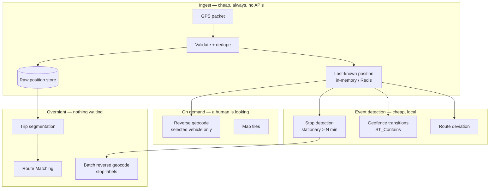

# Real-Time Vehicle Tracking Architecture

The defining constraint of vehicle tracking is that packets arrive whether or not anyone needs them.

A vehicle emits a position every ten seconds. Over a nine-hour shift that is 3,240 packets. Across 200 vehicles, 648,000 per day. Across a thousand vehicles on a five-second interval, over six million.

**Any API call attached to a packet multiplies by that number.** That single sentence determines whether your platform has a viable cost structure.

## The problem

The naive architecture is obvious and wrong:
packet arrives → reverse geocode → store address → update map

It works at ten vehicles. It works in staging. It produces a bill at 200 vehicles that nobody forecast, because nobody counted packets.

Worse, it produces no value. The address is needed when a human looks at a screen, when a stop is detected, or when a report is generated. It is not needed at 3:47:20am for a truck on I-80.

<Warning>
Reverse-geocoding GPS packets on ingest is the most expensive default in fleet software. It is also invisible in code review, because the code is correct and the volume is elsewhere.
</Warning>

## Who this is for

Telematics engineers. Fleet platform teams. ELD vendors. Anyone whose system has a `POST /positions` endpoint.

## Recommended architecture

Four tiers. Only two of them ever call an external API, and neither is in the packet path.

## Relevant HERE APIs, and why

**[Reverse Geocoding](/guides/reverse-geocoding)** — on stop detection and on view. **Why:** `POST /multi-revgeocode` resolves a *list* of coordinates in one request. If you are looping single-coordinate calls over a batch of detected stops, you have made the same mistake one layer up.

**[Route Matching](/guides/route-matching)** — overnight, on closed trips. **Why:** turning a noisy trace into the road segments actually travelled. Required for IFTA, speed compliance, and any question a regulator might ask. See [ELD Platform](/use-cases/eld-platform).

**[Maps](/guides/maps)** — tiles for the dispatcher's screen. Put a CDN in front of them.

**[Routing](/guides/routing)** — on deviation, not on ping. See [ETA Calculation](/use-cases/eta-calculation).

**Not [Positioning](/guides/positioning).** Outdoor road vehicles have GPS. It is more accurate, free, and already in the device. Hybrid positioning is for warehouses and urban canyons, and it improves exactly where GPS fails and degrades exactly where GPS works.

## Implementation flow

1. **Validate and store the packet.** That is all. No API calls.
2. **Maintain last-known position** in memory. This is what a live map reads.
3. **Detect stops locally.** Stationary beyond a threshold. This is arithmetic.
4. **Detect geofence transitions locally.** `ST_Contains` against your own polygons. See [Geofencing](/use-cases/geofencing).
5. **Reverse-geocode detected stops**, in a batch, with `multi-revgeocode`.
6. **Reverse-geocode on view**, for the one vehicle a dispatcher clicked.
7. **Segment, downsample, and match trips** overnight.

<Tip>
Instrument the ratio of reverse-geocoding calls to detected stops. Anything meaningfully above 1 means you are geocoding packets. This single metric tells you more about your bill than any invoice line item.
</Tip>

## Cost considerations

**Round coordinates before cache lookup.** GPS jitter defeats an exact-match cache. Round to roughly five decimal places — about one metre. A vehicle idling at a depot generates hundreds of packets within a metre of each other. One lookup.

**Cache depot and customer locations permanently.** They are known, fixed, and finite. Resolve them once at onboarding.

**Pass drive direction where telematics provides it.** On a divided highway, a coordinate 15 metres from the centreline resolves to either carriageway. Heading disambiguates. This is free accuracy and it reduces "the truck is on the wrong side of the interstate" support tickets.

**Batch the historical backfill.** Enriching six months of trip history is a job, not a stream of real-time calls.

**Segment trips before matching.** Dropping idle periods removes a substantial fraction of submitted points in real feeds. Do it in your pipeline.

**Do not re-route on every packet to refresh an ETA.** Recompute the remaining duration from route geometry and current position. That is arithmetic on data you already hold. See [ETA Calculation](/use-cases/eta-calculation).

**Evaluate asset-based pricing.** A countable vehicle population with unpredictable call volume is exactly the shape asset-based pricing exists for. See [HERE Pricing Explained](/getting-started/here-pricing-explained).

## Common mistakes

**Reverse-geocoding on packet ingest.** The dominant cost error.

**Looping `/revgeocode` over a list.** `multi-revgeocode` exists.

**No coordinate rounding before cache lookup.** Sub-metre jitter, zero hits.

**Re-routing on every position update** to refresh an ETA.

**Ignoring heading.** Wrong carriageway.

**Matching packets instead of trips.**

**Submitting the parked portion of a trace.**

**Using reverse geocoding to determine which road the vehicle drove.** That is [Route Matching](/guides/route-matching), and only Route Matching survives an audit.

**Using reverse geocoding for geofence containment.** That is a spatial query. See [Geofencing](/use-cases/geofencing).

**Storing the nearest address as the vehicle's true location.** It is a nearest match — in rural areas, potentially several hundred metres away on a different property. Store the coordinate too.

**Using hybrid positioning for outdoor road vehicles.** They have GPS.

## Production checklist

- [ ] Zero external API calls in the packet ingest path
- [ ] Last-known position served from memory, not from a geocoded record
- [ ] Stop detection implemented locally, on a stationary threshold
- [ ] Geofence transitions computed with `ST_Contains`, not an API call
- [ ] Reverse-geocode-call-to-detected-stop ratio measured and near 1
- [ ] `multi-revgeocode` used for lists; no loops of single calls
- [ ] Coordinates rounded to ~5 decimal places before cache lookup
- [ ] Depot and customer coordinates resolved once, permanently
- [ ] Drive direction passed when telematics supplies it
- [ ] Trip segmentation drops idle periods before matching
- [ ] Trip matching runs as an overnight batch job
- [ ] Raw coordinate persisted alongside any resolved address
- [ ] ETA refresh computed from geometry, not by re-routing

## Alternatives and trade-offs

**Google Maps Platform** reverse geocoding is comparable. The cost problem described on this page is architectural and survives any migration. Fix the architecture first; the platform decision is easier afterwards and may become unnecessary.

**Do the reverse geocoding yourself.** For a bounded operating area, a Nominatim instance over OSM extracts, or a PostGIS nearest-neighbour query against an address table, handles stop labelling adequately and costs nothing per call. This is a real option for platforms operating in a single metro. It does not replace [Route Matching](/guides/route-matching), which is the hard part.

**Store coordinates and never resolve them.** Many dispatcher UIs show a marker on a map. A marker does not need an address. Ask whether the address is genuinely read by a human, or whether it is stored because it seemed like the right thing to store.

**A telematics platform** — Samsara, Motive, Geotab — solves ingest, stop detection, and trip segmentation, and sells you the result. If tracking is infrastructure rather than your product, buy it. If you are building an ELD or TMS product, this is your product and you should own it.

**Increase your sampling interval.** Before optimizing the pipeline, ask whether ten seconds is required. For long-haul highway operation, thirty seconds loses little and cuts everything downstream by two thirds. For urban delivery with frequent stops, it does not. This is a device configuration decision that dominates every architectural one below it.

## Related guides

<CardGroup cols={2}>
  <Card title="Reverse Geocoding" href="/guides/reverse-geocoding">
    `multi-revgeocode`, coordinate rounding, and drive-direction snapping.
  </Card>
  <Card title="Route Matching" href="/guides/route-matching">
    Turning traces into road segments — the batch job that survives an audit.
  </Card>
  <Card title="Geofencing" href="/use-cases/geofencing">
    Why containment never calls an API.
  </Card>
  <Card title="ETA Calculation" href="/use-cases/eta-calculation">
    Refreshing arrival times without re-routing on every packet.
  </Card>
</CardGroup>

Also: [ELD Platform](/use-cases/eld-platform) · [Fleet Routing](/use-cases/fleet-routing) · [Positioning](/guides/positioning)

## HERE documentation

- [Geocoding & Search v7](https://www.here.com/docs/category/geocoding-search-api-v7)
- [Routing API v8](https://www.here.com/docs/category/routing-api-v8)

---

Need help designing or implementing a production HERE solution?

Placematic helps engineering teams select the right HERE APIs, estimate usage, migrate from Google Maps and build production-ready geospatial systems. [Talk to us](https://placematic.com/contact/).